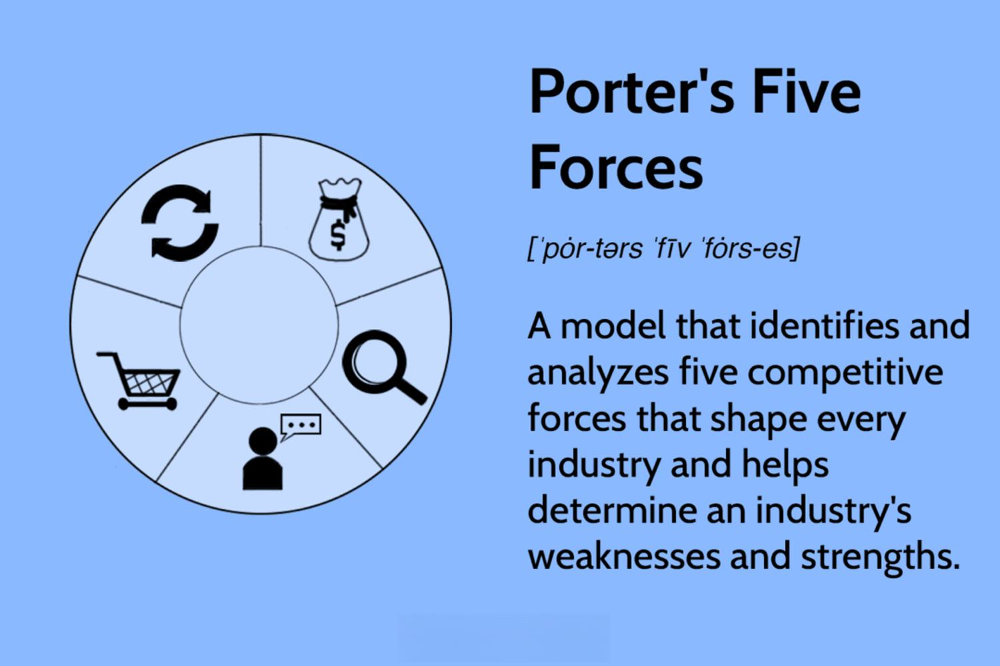

In today's competitive business environment, understanding strategic models is critical for any industry. Porter's Five Forces is a foundational framework that helps businesses assess their competitive environment and craft robust strategies. Since its introduction by Michael E. Porter in 1979, this model has been widely utilized across various sectors to evaluate the intensity of competition and identify areas that require strategic focus.

Algorithmic trading, a domain characterized by rapid technological advancements and sophisticated trading strategies, exemplifies an industry where understanding these competitive forces plays a vital role in business success. The algorithmic trading market is influenced by unique factors stemming from its reliance on technology, data quality, regulatory environments, and market accessibility. These elements collectively shape the competitive landscape, demanding continuous evaluation and nuanced strategic planning.



This article will explore how Porter's Five Forces model can be applied to algorithmic trading to gain strategic insights. By examining key competitive forces such as competitive rivalry, the threat of new entrants, supplier and buyer bargaining power, and the threat of substitutes, we aim to illuminate the complexities and challenges businesses face in this fast-evolving sector. Understanding these forces is integral to navigating the algorithmic trading landscape effectively, as it provides a comprehensive framework for identifying market opportunities and mitigating potential risks.

Through this analysis, trading firms can develop strategies to capitalize on their strengths and address areas of vulnerability, ensuring a robust approach to competition management in the algorithmic trading industry. As this article unfolds, it will provide a detailed assessment of each force, demonstrating the importance of strategic foresight in maintaining a competitive edge in algorithmic trading.

## Table of Contents

## Understanding Porter's Five Forces

Porter's Five Forces is a strategic model created by Michael E. Porter, designed to evaluate and analyze the key competitive forces shaping an industry. It breaks down the complexities of market competition into five distinct elements:

1. **Competitive Rivalry:** This force examines the intensity of competition within an industry. High levels of rivalry typically lead to pricing wars, increased marketing expenditures, and a need for continuous innovation to maintain market position. Key factors influencing competitive rivalry include the number of competitors, rate of industry growth, and product differentiation.

2. **Threat of New Entrants:** This force assesses how easily new firms can enter an industry. High barriers to entry such as significant capital requirements, economies of scale, brand loyalty, and regulatory constraints can protect established companies from new competitors. However, as barriers lower, the threat of new entrants increases, which can alter market dynamics.

3. **Bargaining Power of Suppliers:** This force considers the control suppliers have over the pricing and quality of goods or services. Suppliers wield more power when they are few in number, offer unique or differentiated products, or when switching suppliers is costly. Strong supplier power can affect a company’s cost structure and bottom line.

4. **Bargaining Power of Buyers:** Here, the focus is on the influence buyers have over a business. Buyers gain more power when they are few and large in number, possess the ability to negotiate prices, or can easily switch to competitors’ products or services. High buyer power can pressure firms to improve quality and lower prices.

5. **Threat of Substitute Products or Services:** This force evaluates the likelihood of customers finding different ways of fulfilling their needs, which might not involve the industry’s current offerings. The existence of substitutes poses a limit on the pricing power and profitability of the industry. A high threat of substitutes can compel companies to continuously innovate and enhance their value proposition.

Understanding these forces allows businesses to gauge the competitive landscape, informing strategic decisions and identifying opportunities for profitability. By analyzing how each force impacts an industry, firms can craft strategies that leverage their strengths, mitigate risks, and exploit market opportunities effectively. This comprehensive analysis supports improved decision-making processes, contributing to sustained competitive advantage.

## Competitive Rivalry in Algorithmic Trading

The [algorithmic trading](/wiki/algorithmic-trading) market is characterized by intense competitive rivalry, primarily driven by rapid technological advancements and the continual pursuit of faster and more efficient trading solutions. As firms strive to differentiate their offerings, the landscape becomes increasingly complex, where innovation is both a necessity and a challenge.

The number of competitors in the algorithmic trading market significantly influences the level of competitive rivalry. With numerous firms seeking to capture market share, the intensity of competition is heightened. These firms range from large financial institutions with extensive resources to smaller, nimble startups capable of quickly adapting to new technologies and market conditions.

Industry growth also plays a pivotal role in determining the competitiveness within algorithmic trading. As the industry expands, opportunities emerge for new entrants and existing players to capture a larger portion of the market. This growth incentivizes continuous development of more sophisticated algorithms that promise higher returns and enhanced trading efficiencies.

Differentiation of trading strategies is another key [factor](/wiki/factor-investing) influencing competitive rivalry. Firms employ a diverse array of strategies, including high-frequency trading, statistical [arbitrage](/wiki/arbitrage), and [market making](/wiki/market-making), among others. The ability to offer unique or superior trading algorithms can provide a competitive edge, reducing direct price competition and potentially increasing profit margins. However, the rapid pace of technological change means that innovations are quickly replicated, often leading to short-lived competitive advantages.

High competition in the algorithmic trading sector can result in several outcomes. On one hand, it can drive increased innovation as firms endeavor to outpace each other with cutting-edge solutions. This evolution can be beneficial for the industry, fostering advancements in technology and trading methodologies. On the other hand, intense competition can lead to price wars, where firms may be compelled to lower their fees to attract clients, potentially eroding profit margins. If not managed effectively, such competitive pressures can undermine the financial viability of firms in the sector.

In summary, competitive rivalry in algorithmic trading is a dynamic force shaped by technological progress, market growth, and strategic differentiation. Firms must navigate these forces carefully, balancing the drive for innovation with the need to maintain sustainable profit margins in a challenging competitive environment.

## Threat of New Entrants

Algorithmic trading, characterized by the use of computer algorithms to execute trading orders, is predominantly a field occupied by firms equipped with advanced technological expertise. The barriers to entry in this industry are significant, primarily due to several factors that necessitate substantial resources and capabilities.

Firstly, high capital investment is required to participate effectively in algorithmic trading. This encompasses the cost of developing or purchasing sophisticated trading systems and infrastructure capable of handling high-frequency trading volumes. The initial setup often demands state-of-the-art technology to ensure minimal latency and high transaction speed, which are critical for competitive performance in the market.

Secondly, the creation or acquisition of specialized trading algorithms is indispensable. Algorithms are the core of automated trading systems, designed to make rapid decisions based on complex mathematical models and market data analysis. Developing such algorithms demands a deep understanding of financial markets, programming expertise, and the ability to integrate various data inputs efficiently.

Thirdly, the regulatory landscape presents an additional barrier. Algorithmic trading firms must navigate a complex web of regulatory requirements that vary by jurisdiction, aiming to ensure market stability and prevent manipulative practices. Compliance with these regulations often requires dedicated resources and expertise to maintain systems and processes that adhere to evolving rules.

Despite these barriers, the rapid evolution of technology can gradually reduce these entry hurdles. Advancements in cloud computing, open-source software, and data accessibility can lower the costs associated with infrastructure and algorithm development. As these technologies become more affordable and user-friendly, the barrier to entry decreases, facilitating more firms to enter the algorithmic trading arena.

Moreover, the continuous improvement in [machine learning](/wiki/machine-learning) and [artificial intelligence](/wiki/ai-artificial-intelligence) has the potential to democratize access to powerful trading tools, enabling smaller firms and even individual traders to compete in a market historically dominated by larger players. Consequently, while significant barriers exist, the dynamic nature of technological progress offers pathways for new entrants to emerge and challenge established firms.

## Bargaining Power of Suppliers

In the context of algorithmic trading, suppliers play a pivotal role in ensuring the seamless development and execution of trading algorithms. These suppliers primarily consist of data providers and technology vendors, both of which are indispensable to trading firms aiming for operational excellence.

Data providers furnish the essential raw materials for algorithmic trading: qualitative and quantitative data sets. This data feed can include historical price data, real-time market data, and [alternative data](/wiki/best-alternative-data) sources such as social media sentiment and satellite imagery. The accuracy, granularity, and timeliness of this data can significantly influence the efficacy of trading algorithms. Consequently, firms that rely heavily on superior data analytics may find themselves at a disadvantage if their access to high-quality data is restricted or comes at a premium cost. The scarcity of premium data sources can strengthen the bargaining power of data providers, potentially leading to higher costs and influencing the firm's overall cost structure.

Technology vendors supplying trading software and hardware also hold substantial leverage. This includes algorithm development platforms, execution management systems, and high-frequency trading infrastructure like colocation services. The specialized nature of these technologies means there are limited providers capable of delivering products that meet the rigorous demands of milliseconds-level execution times. For instance, a trading firm may opt for high-speed network solutions to reduce latency, provided by a minimal number of suppliers. The lack of substitutes for such niche technologies can empower suppliers to exert greater influence over pricing and contract terms, impacting the firms' operational efficiency and decision-making agility.

Overall, the bargaining power of suppliers in algorithmic trading is determined by the availability of alternative high-quality data sources and technological solutions. Firms that diversify their supplier base or invest in in-house solutions may mitigate these pressures, balancing the supplier power dynamic and reducing potential cost vulnerabilities.

## Bargaining Power of Buyers

Buyers in the algorithmic trading industry primarily consist of institutional investors and individual traders who are in pursuit of efficient high-frequency trading solutions. The bargaining power of these buyers is significantly influenced by the abundance of alternative trading platforms. This availability allows clients to switch easily based on criteria such as costs, performance, and the specific features offered by different platforms. For instance, if a platform offers lower transaction fees or superior analytics capabilities, buyers might be inclined to transition to that platform, thereby exerting pressure on providers to maintain competitive pricing and continually enhance their service offerings.

Additionally, the presence of sophisticated buyers with an in-depth understanding of trading systems further intensifies this bargaining power. These knowledgeable buyers are often adept at evaluating the intricate technical and financial aspects of various trading platforms. As a result, they are well-positioned to negotiate for better terms, demanding innovative features that meet advanced trading needs. This includes capabilities such as enhanced order execution speed, improved data analytics tools, and customizable algorithmic parameters that align with specific investment strategies.

The leverage possessed by informed buyers forces trading platform providers to focus on continuous innovation and adoption of cutting-edge technology to cater to their clients' evolving demands. This dynamic can be modeled mathematically by considering the elasticity of demand in response to changes in platform features or costs. Providers must strategically balance investment in technology improvements against the potential increase in client acquisition and retention, optimizing their offerings to appeal to the sophisticated buyer segment while remaining competitively priced.

In summary, the bargaining power of buyers in the algorithmic trading sector is a critical factor that influences strategic decision-making for service providers. By recognizing and adapting to the heightened expectations and leverage of informed buyers, trading platforms can better position themselves to capture market share in this highly competitive industry.

## Threat of Substitutes

The threat of substitutes in algorithmic trading is a multifaceted challenge, primarily driven by the availability and potential superiority of alternative investment strategies and traditional trading methods. As financial markets evolve, investment technologies and methodologies offer diverse avenues for investors to achieve their financial goals, sometimes making traditional algorithmic systems less attractive.

Alternative investment strategies, which include various asset classes such as real estate, commodities, and hedge funds, often attract investors looking for diversified investment portfolios. These alternatives can draw capital away from algorithmic trading, especially during times when algorithmic systems underperform or fail to deliver anticipated returns.

Furthermore, the emergence and continual advancement of AI-driven trading tools pose a significant threat to existing algorithmic systems. These advanced tools, powered by machine learning and artificial intelligence, offer capabilities for more sophisticated data analysis and predictive modeling. They can recognize complex patterns and adapt to market changes more effectively than traditional algorithms, providing a competitive edge in terms of execution speed and decision-making accuracy. For algorithmic trading firms, this technological evolution necessitates continuous innovation and enhancement of their trading platforms to remain relevant and competitive. The effectiveness of AI-driven tools can be assessed using various metrics like Sharpe Ratio or Alpha, which quantify risk-adjusted returns and benchmark performance, respectively.

To strategically combat these threats, algorithmic trading firms must emphasize understanding the value propositions and performance metrics of available substitutes. This requires a deep analysis of both quantitative outcomes, like Return on Investment (ROI), and qualitative factors such as ease of integration, scalability, and user adaptability of substitute technologies.

Incorporating this understanding allows firms to benchmark their systems effectively, identifying areas for improvement and innovation. Firms might consider hybrid approaches, combining the strengths of traditional algorithms with cutting-edge AI technologies, to enhance adaptability and performance. Furthermore, staying abreast of market trends and technology developments can ensure that algorithmic trading firms continue to meet the shifting preferences and demands of their clients.

By effectively managing the threat of substitutes, algorithmic trading firms can safeguard their market position, optimize resource allocation, and sustain long-term profitability, even as the landscape of financial trading continues to evolve.

## Applying the Model to Algorithmic Trading

Applying Porter's Five Forces in algorithmic trading enables firms to identify strategic positions to capitalize on market opportunities. This model provides a structured approach to evaluate the dynamics within the trading sector, helping firms craft robust strategies for competitive advantage. 

First, analyzing the **Competitive Rivalry** in the algorithmic trading market is essential for identifying key competitors and their strategic moves. Advanced trading systems, proprietary algorithms, and high-speed trading infrastructures intensify rivalry. Firms can leverage this analysis to innovate and differentiate their offerings, creating unique value propositions that enhance market positioning.

Next, assessing the **Threat of New Entrants** helps firms understand potential disruptions. New players often enter with innovative technologies or novel trading strategies, impacting the market landscape. Monitoring technological advancements and regulatory changes positions established firms to anticipate and respond to emerging threats effectively.

The **Bargaining Power of Suppliers**, which includes data providers and technology vendors, influences operational costs and strategic dependencies. By assessing this force, trading firms can negotiate better terms, seek alternative suppliers, or invest in proprietary technologies to reduce dependence and enhance cost control.

Evaluating the **Bargaining Power of Buyers** reveals insights into customer preferences and demands. In a market with numerous trading platforms, offering superior performance, transparency, and competitive pricing becomes vital. Firms can tailor their strategies to build robust client relationships, enhance user experience, and foster brand loyalty.

Lastly, examining the **Threat of Substitutes** informs firms about alternative strategies that customers might consider. Identifying these alternatives and understanding their value propositions can guide firms to innovate and enhance their offerings, thereby maintaining a competitive edge.

Tailoring strategies based on these forces involves data-driven decision-making and continuous market monitoring. For example, employing machine learning models can optimize algorithmic strategies to achieve superior performance in diverse market conditions. Moreover, engaging in partnerships or mergers can consolidate resources, mitigate threats, and capture new market segments.

By strategically applying these insights, firms in the algorithmic trading sector can drive profitability and secure a sustainable competitive advantage in this highly dynamic industry.

## Critiques and Considerations

While Porter's Five Forces provides a valuable framework for analyzing competitive dynamics, its application in fast-paced fields like algorithmic trading often necessitates a more flexible approach. This is primarily due to the rapid technological advancements and regulatory changes that characterize the algorithmic trading environment. Traditional applications of the model may struggle to encompass the speed and complexity inherent to tech-driven markets.

One critique of Porter's Five Forces is its groundwork in a pre-digital economy, which may not fully encapsulate the nuances of today's algorithmic trading landscape. For instance, technological disruptions can swiftly alter the competitive environment, rendering a static analysis outdated. As a result, firms relying on this framework must continuously reassess and update their strategic insights to remain pertinent.

Moreover, the model's emphasis on defined industry boundaries does not resonate well with digital markets. Algorithmic trading operates across a fluid landscape where the introduction of new technologies like AI and machine learning can rapidly shift paradigms. This rapid evolution challenges the distinct categorizations of competition, suppliers, and substitutes assumed by the traditional model.

Despite these limitations, Porter's Five Forces remains instrumental for strategic planning in algorithmic trading by encouraging firms to evaluate competitive pressures. However, for these analyses to remain effective, they should be supplemented by real-time data analytics and adaptive strategies that cater to unexpected shifts in market dynamics. Techniques such as machine learning can provide a predictive edge, helping to forecast potential industry changes and adjust strategies accordingly. For example, incorporating Python libraries like `pandas` for data analysis or `scikit-learn` for machine learning can offer firms insights that extend beyond the static five forces analysis:

```python
import pandas as pd
from sklearn.model_selection import train_test_split
from sklearn.ensemble import RandomForestClassifier

# Load dataset
data = pd.read_csv('market_data.csv')

# Prepare data for analysis
X = data.drop('target', axis=1)
y = data['target']

# Split data into training and test sets
X_train, X_test, y_train, y_test = train_test_split(X, y, test_size=0.3, random_state=42)

# Fit a Random Forest model
model = RandomForestClassifier(n_estimators=100)
model.fit(X_train, y_train)

# Predict and assess model performance
predictions = model.predict(X_test)
print(f'Model accuracy: {model.score(X_test, y_test):.2f}')
```

Ultimately, while Porter's Five Forces offers a sturdy foundation for understanding industry competition, its effectiveness in algorithmic trading demands continuous adaptation, a keen eye on emerging technologies, and an agile strategic outlook.

## Conclusion

Porter's Five Forces remains a vital tool for understanding the competitive landscape of algorithmic trading. By systematically analyzing the five distinct forces—competitive rivalry, threat of new entrants, bargaining power of suppliers, bargaining power of buyers, and the threat of substitutes—trading firms can identify strategic positions that allow them to capitalize on market opportunities. This systematic approach enables firms to navigate the complexities of the algorithmic trading market more effectively, positioning themselves for heightened success and profitability.

While criticisms of the model acknowledge its limitations in rapidly evolving, tech-driven markets like algorithmic trading, the foundational principles of Porter's framework still provide significant value. Critics argue that it may not fully account for the rapid pace of technological change and the dynamic nature of digital markets. However, its structured assessment of industry forces offers a comprehensive baseline from which to undertake strategic analysis. Applying the model with a degree of flexibility and frequent reassessment can ensure that firms remain vigilant and adaptable to changes, maintaining a competitive edge in this fast-paced industry. 

Ultimately, despite its critiques, Porter's Five Forces continues to serve as a solid foundation for strategic decision-making, guiding trading firms through the intricacies and challenges inherent in maintaining competitiveness and driving innovation in algorithmic trading.

## References & Further Reading

[1]: Bergstra, J., Bardenet, R., Bengio, Y., & Kégl, B. (2011). ["Algorithms for Hyper-Parameter Optimization."](https://proceedings.neurips.cc/paper/2011/file/86e8f7ab32cfd12577bc2619bc635690-Paper.pdf) Advances in Neural Information Processing Systems 24.

[2]: ["Advances in Financial Machine Learning"](https://www.amazon.com/Advances-Financial-Machine-Learning-Marcos/dp/1119482089) by Marcos Lopez de Prado

[3]: ["Evidence-Based Technical Analysis: Applying the Scientific Method and Statistical Inference to Trading Signals"](https://www.amazon.com/Evidence-Based-Technical-Analysis-Scientific-Statistical/dp/0470008741) by David Aronson

[4]: ["Machine Learning for Algorithmic Trading"](https://github.com/stefan-jansen/machine-learning-for-trading) by Stefan Jansen

[5]: ["Quantitative Trading: How to Build Your Own Algorithmic Trading Business"](https://www.amazon.com/Quantitative-Trading-Build-Algorithmic-Business/dp/1119800064) by Ernest P. Chan