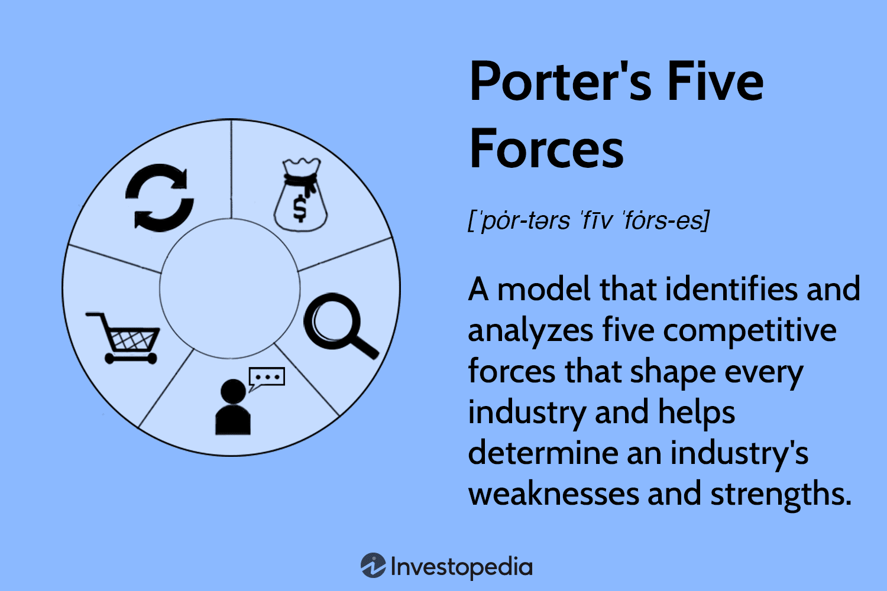

In a rapidly evolving financial landscape, characterized by technological advancements and globalization, understanding competitive forces and macro-environmental factors is crucial for businesses striving for success. Porter's Five Forces framework offers a strategic blueprint for analyzing competitive dynamics across diverse industries, providing businesses with insights into their competitive positions and potential risks. These forces—threat of substitutes, competitive rivalry, new entrants, supplier power, and buyer power—serve as a lens through which companies can assess market conditions and develop strategies for long-term profitability.

Algorithmic trading, a domain marked by speed, precision, and adaptability, presents unique challenges that Porter's model can effectively address. This form of trading utilizes complex algorithms to make decisions and execute trades at speeds far beyond human capability. The rapid pace and intricate nature of algorithmic trading require traders to consider both competitive pressures and macroeconomic factors in real-time, necessitating a robust strategic framework.

This article explores the integration of Porter's Five Forces with algorithmic trading, aiming to enhance competitiveness and strategic insight. By leveraging Porter's framework, traders can better understand the market dynamics that influence their trading strategies, allowing for optimized decision-making in a fast-paced environment. This strategic integration not only aids in navigating the complexities of the financial markets but also positions algorithmic traders to respond adeptly to shifts in competitive and economic conditions.

## Table of Contents

## Understanding Porter's Five Forces

Porter's Five Forces framework, introduced by Michael E. Porter, is a strategic tool used to analyze the competitive dynamics within an industry. The framework comprises five distinct forces that collectively determine the intensity of competition and the profitability potential of an industry. These forces are:

1. **Threat of Substitutes**: This force assesses the likelihood of consumers opting for alternative products or services. A high threat of substitutes can limit the pricing power of an industry, as customers have more options and can easily switch to similar offerings if prices rise or quality declines. For example, in the beverage industry, the availability of alternatives to sugary drinks, such as flavored water or natural juices, represents a significant threat to traditional soft drink manufacturers.

2. **Competitive Rivalry**: This force evaluates the degree of competition among existing firms. Intense rivalry often leads to aggressive price wars, advertising battles, and product innovations. Such competition can erode profit margins and make the industry less attractive. Factors influencing competitive rivalry include the number of competitors, rate of industry growth, and product differentiation. For instance, the airline industry is characterized by fierce competitive rivalry due to the large number of carriers operating similar routes.

3. **Threat of New Entrants**: This force considers the potential for new companies to enter the industry and increase competition. Barriers to entry, such as high capital requirements, economies of scale, and regulatory constraints, can protect existing firms by reducing the threat of new entrants. In industries where these barriers are low, such as the tech sector with software development, new companies can more easily challenge incumbents.

4. **Supplier Power**: This force analyzes the ability of suppliers to drive up prices or reduce the quality of goods and services. When suppliers are concentrated, or when no substitutes are available, they can exert significant power over companies in an industry. Conversely, if an industry has numerous suppliers or the supplies are commoditized, the bargaining power of a single supplier diminishes. An example of strong supplier power is seen in the diamond industry, where a few key suppliers control the majority of the world's diamond supply.

5. **Buyer Power**: This force measures the influence that customers have over an industry. Strong buyer power allows customers to demand lower prices or higher product quality. Buyer power is amplified when there are few buyers, products are undifferentiated, or switching costs are low. In the automobile industry, for instance, large fleet purchasers can exert significant pressure on manufacturers for discounts.

Understanding these five forces helps businesses assess their strategic position within an industry and recognize potential risks. By examining the relative strength of each force, companies can develop strategies to enhance their competitive advantage and achieve long-term profitability. For example, they might focus on differentiating their products, establishing stronger relationships with suppliers, or increasing customer loyalty to mitigate the impacts of these forces.

## Porter's Five Forces in Stock Market Analysis

In stock market analysis, Porter's Five Forces framework is employed as a strategic tool to evaluate the competitive dynamics that can influence financial markets. By examining these forces, investors and analysts gain insights into the market's stability, potential risks, and investment opportunities.

1. **Threat of Substitutes and New Entrants**: The presence of substitute products or services can erode market share and profitability of companies within an industry, thus affecting stock valuations. In the stock market, the threat from substitutes can emerge from products that consumers perceive as alternatives offering similar benefits, albeit at lower costs. This force compels companies to innovate and differentiate their products to maintain competitiveness. Similarly, the threat of new entrants can pose significant risks as new players may bring fresh capital, innovative technologies, and aggressive market strategies. This may lead to changes in industry growth rates and competitiveness, impacting investor returns.

2. **Bargaining Power of Buyers and Suppliers**: In the stock market context, buyers and suppliers are often interpreted as investors and companies, respectively. The bargaining power of buyers is evident in their ability to influence prices and demand more value, which can impact stock prices. A high bargaining power of buyers often results in competitive pricing strategies and improved product offerings to retain market interest. On the supplier side, companies heavily dependent on specific suppliers face risks associated with changes in supply costs, reliability, and quality. An increase in supplier power can lead to higher input costs, reducing margins and profitability, affecting stock performance. Analytical tools assess these dynamics, guiding investment decisions by highlighting potential cost pressures or pricing power in market segments.

3. **Competitive Rivalry**: The intensity of competitive rivalry within an industry plays a critical role in determining market stability and company performance. High competitive rivalry can lead to aggressive price wars, increased marketing efforts, and continuous innovation, which can stress profit margins and influence stock valuation. Investors look at competitive rivalry to assess the potential for stable growth or volatility in an industry. Key metrics that are often evaluated include market share, growth rate, and competitive advantage. Understanding these elements helps investors predict stock performance risks and make informed decisions about portfolio allocation.

In summary, Porter's Five Forces offer a comprehensive lens through which to assess the myriad factors influencing stock market dynamics. By examining potential substitutes, new entrants, buyer and supplier power, and competitive rivalry, stakeholders can better navigate investment landscapes, identifying sectors with strong growth prospects and avoiding those fraught with inherent risks. This strategic analysis is crucial for optimizing investment portfolios and achieving long-term financial goals in an ever-changing market environment.

## Integrating Porter's Five Forces with Algorithmic Trading

Algorithmic trading requires a strategic response to competitive and macroeconomic factors. Porter's Five Forces framework, traditionally used to evaluate industry competition, can be integrated into [algorithmic trading](/wiki/algorithmic-trading) to enhance decision-making and strategic insight. The model's systematic approach allows for a nuanced understanding of the market, which can be translated into actionable algorithmic strategies.

Firstly, incorporating Porter's model helps algorithmic trading systems account for threats posed by substitute products and services. For instance, in a highly volatile market, if an equivalent financial instrument emerges, an algorithm can be adjusted to mitigate the associated risk by rebalancing the investment portfolio. By coding algorithms that automatically assess the potential impact of substitutes, trading strategies can be more robustly formulated.

Additionally, understanding the threat of new entrants is crucial in algorithmic trading. An influx of new players in the market could signal increased competition, thereby affecting market [liquidity](/wiki/liquidity-risk-premium) and [volatility](/wiki/volatility-trading-strategies). Algorithms can be designed to detect metrics indicating new market entries, such as changes in trading volumes or shifts in liquidity, and adjust their operations accordingly to protect profit margins.

The bargaining power of suppliers and buyers significantly influences algorithmic trading strategies. High supplier power might mean increased costs for data feeds essential for trading algorithms, while powerful buyers can exert pressure on price and margins. Integrating Porter's analysis can guide algorithms to consider supply chain risks and customer preferences, optimizing cost-efficiency and pricing strategies within trading frameworks.

Competitive rivalry, a central aspect of Porter's analysis, directly impacts algorithmic trading by affecting market dynamics and stock price fluctuations. By continuously analyzing competitor behavior and market sentiment, algorithms can generate trading signals that preemptively adapt to shifts in competitive pressure. For example, Python-based [machine learning](/wiki/machine-learning) models can be employed to predict competitor activity based on historical data, thus enabling real-time strategic adjustments.

Implementing Porter's Five Forces model in algorithmic trading not only optimizes trading strategies but also enhances risk management. By systematically assessing the macroeconomic factors that influence market behavior, algorithms can be tuned to improve their predictive accuracy and responsiveness to market changes. This strategic integration empowers trading firms to maintain a competitive edge, adapt to market exigencies, and safeguard profitability.

## Case Study: Application in Algorithmic Trading

A trading firm specializing in algorithmic strategies employs Porter's Five Forces framework to address the competitive challenges within the dynamic tech sector. By systematically evaluating each force, the firm gains a comprehensive understanding of the competitive landscape, ultimately guiding strategic adjustments in their trading algorithms.

First, the threat of new entrants is assessed. The tech sector, characterized by rapid innovation and shifting technological paradigms, is susceptible to frequent market entries. This threat is evaluated by analyzing factors such as the ease of market entry, the capital required, and regulatory barriers. Understanding these elements allows the firm to anticipate potential disruptors and adjust its algorithms to mitigate associated risks.

Next, the firm considers the bargaining power of suppliers, which in the tech industry, can be substantial due to the critical components like semiconductors and software licenses. An analysis of supplier power involves examining the concentration of suppliers, the availability of substitute inputs, and the importance of [volume](/wiki/volume-trading-strategy) to suppliers. These insights direct the firm's strategic sourcing decisions, enabling the development of contingency plans to maintain algorithmic stability despite supply chain fluctuations.

To complement Porter's framework, the firm incorporates PESTLE analysis—Political, Economic, Social, Technological, Legal, and Environmental factors—offering a macro-environmental perspective. For instance, economic indicators might reveal trends influencing consumer purchasing power, while technological advancements could indicate the obsolescence of certain market players. 

Utilizing both analyses, the trading firm refines its algorithmic strategies to align with these insights. This refinement includes adjusting the weightings of tech stocks within its portfolio based on anticipated regulatory changes or improvements in semiconductor technology. Furthermore, the algorithm adapts in real-time to shifts in competitive dynamics, ensuring optimized trading outcomes. By integrating Porter's Five Forces and PESTLE analysis, the firm enhances its strategic responsiveness, safeguarding its competitive advantage in a volatile market.

## Conclusion

Porter's Five Forces offers a robust framework for understanding the intricate web of market dynamics, providing crucial insights into competitive pressures. In the context of algorithmic trading, this model proves invaluable by enabling traders to navigate these pressures with precision and efficiency. By integrating Porter's insights, algorithmic traders can enhance their strategic agility and positioning in response to market shifts, ensuring they remain competitive and responsive.

Algorithmic trading, characterized by its reliance on sophisticated computerized models and algorithms, requires agility and adaptability to respond to fluctuating market conditions. By applying Porter's Five Forces, traders can gain a comprehensive assessment of factors such as competitive rivalry, threats of new entrants, and the bargaining power of suppliers and buyers. These insights allow for real-time adjustments in algorithmic strategies, optimizing performance and managing risks effectively.

Moreover, the strategic application of Porter's framework equips traders with the tools needed for sustained success. By systematically analyzing and understanding these forces, algorithmic trading firms can position themselves advantageously against market shifts, ensuring they are not only reactive but also proactive. For long-term profitability and strategic resilience, employing Porter's model is imperative, offering a structured approach to maintaining competitiveness in ever-evolving financial landscapes.

## References & Further Reading

Porter, M. E. (1979). "How Competitive Forces Shape Strategy." Harvard Business Review. This seminal work by Michael E. Porter lays the foundation for the Five Forces framework, which analyzes competitive dynamics within industries. It provides readers with a comprehensive understanding of how different market forces influence strategic decision-making and organizational success.

Arthur Pinkasovitch's analysis of Porter's model in investment contexts examines how the Five Forces framework can be applied to stock market analysis. Pinkasovitch explores how investment opportunities and risks can be assessed by examining competitive pressures, thereby helping investors make informed decisions.

Oxford Analytica's exploration of PESTLE analysis in market strategy provides insight into the broader macro-environmental factors that affect business strategies. The PESTLE framework evaluates Political, Economic, Social, Technological, Legal, and Environmental factors, offering a complementary approach to Porter's Five Forces when analyzing industry dynamics and strategic positioning.

Turner, S. "Algorithmic Trading and DMA: An Introduction to Strategies." This text investigates into the intricacies of algorithmic trading and Direct Market Access (DMA), offering a detailed guide to various trading strategies. The book discusses how strategic frameworks, like Porter's Five Forces, can enhance trading models by factoring in industry competition and market conditions, thereby optimizing algorithmic trading performance.

