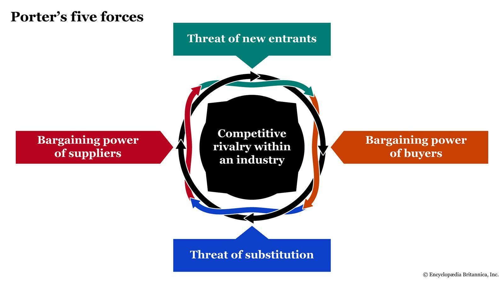

## Table of Contents

## What are Porter's Five Forces?

Porter's Five Forces is a model that helps businesses understand the competitive environment they are in. It was created by Michael E. Porter, a professor at Harvard Business School. The model looks at five different factors that can affect how profitable a business can be. These factors are: the threat of new entrants, the bargaining power of suppliers, the bargaining power of buyers, the threat of substitute products or services, and the intensity of competitive rivalry.

Each of these forces can impact a company's ability to make money. For example, if it's easy for new companies to enter the market, it can be harder for existing companies to keep their profits high. Similarly, if suppliers have a lot of power, they can demand higher prices for their goods, which can squeeze the profits of the companies that buy from them. On the other hand, if buyers have a lot of power, they can demand lower prices, which can also reduce profits. The threat of substitutes means that if there are other products or services that can do the same job, customers might switch, which can hurt a company's sales. Finally, if there is a lot of competition, companies might have to lower their prices or spend more on marketing, which can also affect their profits.

## How do Porter's Five Forces apply to the stock market?

Porter's Five Forces can help us understand the stock market by looking at how companies within it compete and make money. The stock market is full of companies from different industries, and each company's stock price can be affected by how well it handles the five forces. For example, if a company in the stock market faces a lot of competition (one of the five forces), it might have to lower its prices or spend more on marketing, which can make its profits go down. If profits go down, the company's stock price might go down too. So, by using Porter's Five Forces, investors can get a better idea of which companies might do well in the stock market.

Another way Porter's Five Forces apply to the stock market is through the threat of new entrants. If it's easy for new companies to start up and compete in an industry, it can make things harder for the companies already in the stock market. This is because new companies can take away customers and profits from the older companies, which can make their stock prices go down. On the other hand, if it's hard for new companies to enter an industry, the companies already in the stock market might have an easier time keeping their profits high, which can help their stock prices stay up. So, understanding how easy or hard it is for new companies to enter an industry can help investors pick the right stocks to buy.

## What is the significance of the threat of new entrants in stock market analysis?

The threat of new entrants is a big deal when looking at the stock market. It means how easy or hard it is for new companies to start up and compete in an industry. If it's easy for new companies to come in, it can be bad news for the companies already in the stock market. This is because new companies can take away customers and profits from the older companies. When profits go down, the stock prices of these companies can go down too. So, if you're thinking about buying stocks, you want to know if the industry has a high or low threat of new entrants.

On the other hand, if it's hard for new companies to enter an industry, it can be good news for the companies already in the stock market. When it's tough for new companies to start up, the companies that are already there can keep their profits high. This is because they don't have to worry as much about new competition taking away their customers. When profits stay high, the stock prices of these companies can stay up too. So, understanding the threat of new entrants can help you pick the right stocks to buy and make smarter choices in the stock market.

## How does the bargaining power of suppliers affect stock market performance?

The bargaining power of suppliers can have a big impact on how well a company does in the stock market. If suppliers have a lot of power, they can charge higher prices for the things they sell to companies. When companies have to pay more for what they need, it can make their profits go down. If profits go down, the stock price of the company can go down too. So, if you're thinking about buying stocks, you want to know if the companies you're looking at have suppliers that can make their costs go up.

On the other hand, if suppliers don't have much power, it can be good for the companies in the stock market. When suppliers can't charge high prices, companies can keep their costs low. When costs are low, companies can keep their profits high. High profits can help keep the stock prices of these companies up. So, understanding how much power suppliers have can help you pick the right stocks to buy and make smarter choices in the stock market.

## What role does the bargaining power of buyers play in stock market analysis?

The bargaining power of buyers is important when looking at the stock market. It means how much control customers have over the prices they pay for things. If buyers have a lot of power, they can make companies lower their prices. When companies have to lower their prices, their profits can go down. If profits go down, the stock price of the company can go down too. So, if you're thinking about buying stocks, you want to know if the companies you're looking at have customers who can make them lower their prices.

On the other hand, if buyers don't have much power, it can be good for the companies in the stock market. When customers can't make companies lower their prices, companies can keep their prices high. High prices can help companies keep their profits up. When profits are high, the stock prices of these companies can stay up too. So, understanding how much power buyers have can help you pick the right stocks to buy and make smarter choices in the stock market.

## How can the threat of substitute products or services impact stock market investments?

The threat of substitute products or services can really affect how well a company does in the stock market. If there are a lot of other things that can do the same job as what a company sells, customers might switch to those other things. When customers switch, the company can lose sales and profits. If profits go down, the stock price of the company can go down too. So, if you're thinking about buying stocks, you want to know if the companies you're looking at have a lot of substitutes that can take away their customers.

On the other hand, if there aren't many substitutes for what a company sells, it can be good for the company in the stock market. When there aren't many other choices, customers are more likely to keep buying from the company. This can help the company keep its sales and profits high. When profits are high, the stock prices of these companies can stay up too. So, understanding how many substitutes there are can help you pick the right stocks to buy and make smarter choices in the stock market.

## What is the effect of industry rivalry on stock market trends?

Industry rivalry can have a big impact on how well companies do in the stock market. When there's a lot of competition in an industry, companies might have to lower their prices or spend more money on things like advertising to keep their customers. This can make their profits go down. If profits go down, the stock prices of these companies can go down too. So, if you're thinking about buying stocks, you want to know if the companies you're looking at are in an industry with a lot of competition.

On the other hand, if there isn't much competition in an industry, it can be good for the companies in the stock market. When there aren't many other companies to compete with, the companies that are already there can keep their prices high and don't have to spend as much on things like advertising. This can help them keep their profits high. When profits are high, the stock prices of these companies can stay up too. So, understanding how much competition there is in an industry can help you pick the right stocks to buy and make smarter choices in the stock market.

## How can an investor use Porter's Five Forces to evaluate a company's stock?

An investor can use Porter's Five Forces to understand how well a company might do in the stock market. The first thing to look at is the threat of new entrants. If it's easy for new companies to start up and compete, it can be bad for the company's stock price because new companies might take away customers and profits. The bargaining power of suppliers is also important. If suppliers can charge high prices, it can make the company's costs go up and profits go down, which can hurt the stock price. The bargaining power of buyers matters too. If customers can make the company lower its prices, it can also make profits go down and affect the stock price.

Another thing to consider is the threat of substitute products or services. If there are a lot of other things that can do the same job as what the company sells, customers might switch, which can hurt the company's sales and profits, and in turn, its stock price. Lastly, the intensity of industry rivalry is key. If there's a lot of competition, the company might have to lower prices or spend more on marketing, which can make profits go down and affect the stock price. By looking at all these forces, an investor can get a good idea of how the company might do in the stock market and make smarter choices about which stocks to buy.

## What are some real-world examples of Porter's Five Forces affecting stock prices?

One real-world example of Porter's Five Forces affecting stock prices is in the airline industry. Airlines face a high threat of new entrants because it's relatively easy for new airlines to start up, especially with low-cost carriers. This can lead to more competition, which can make airlines lower their prices to keep customers. When airlines have to lower their prices, their profits can go down, which can make their stock prices go down too. For example, when new low-cost airlines like Spirit or Frontier enter the market, established airlines like Delta or American might see their stock prices drop because of the increased competition.

Another example is in the smartphone industry, where the bargaining power of suppliers can affect stock prices. Companies like Apple and Samsung rely on suppliers like Qualcomm for chips. If Qualcomm has a lot of power and can charge high prices for their chips, it can make the costs go up for Apple and Samsung. Higher costs can lead to lower profits, which can make their stock prices go down. For instance, when Qualcomm raised its prices, it put pressure on smartphone makers' profits, which led to a drop in their stock prices.

Lastly, the threat of substitute products can impact stock prices in the beverage industry. Companies like Coca-Cola and PepsiCo face competition from substitutes like water, tea, and coffee. If more people start drinking these substitutes, it can hurt the sales and profits of Coca-Cola and PepsiCo. When their profits go down, their stock prices can go down too. For example, when there was a big push for healthier drink options, Coca-Cola's stock price took a hit because people were switching to other beverages.

## How do changes in Porter's Five Forces over time influence long-term investment strategies?

Changes in Porter's Five Forces over time can really affect how investors plan for the long term. If the threat of new entrants in an industry goes up, it might mean more competition in the future. This could make it harder for companies to keep their profits high, which can make their stock prices go down. So, investors might want to be careful about putting their money into companies in industries where it's getting easier for new companies to start up. On the other hand, if the bargaining power of suppliers goes down over time, it can be good for companies because they might be able to keep their costs low and their profits high. This can make their stock prices go up, so investors might want to look for companies in industries where suppliers are losing power.

The bargaining power of buyers and the threat of substitutes can also change over time, and these changes can affect long-term investment strategies. If buyers start to have more power, they might be able to make companies lower their prices, which can hurt profits and stock prices. So, investors might want to avoid companies in industries where buyers are getting more power. If the threat of substitutes goes up, it can mean more choices for customers, which can make them switch away from a company's products. This can hurt sales and profits, which can make stock prices go down. So, investors might want to be careful about investing in companies where the threat of substitutes is growing. By keeping an eye on how these forces are changing, investors can make smarter choices about where to put their money for the long term.

## What are the limitations of using Porter's Five Forces in stock market analysis?

Using Porter's Five Forces to look at the stock market can be helpful, but it has some problems. One big problem is that it doesn't look at things that can change quickly, like new technology or what's happening in the world. For example, if a new technology comes out that changes how a whole industry works, Porter's Five Forces might not see it coming. Also, it doesn't think about things like how the economy is doing or what the government is doing, which can really affect stock prices.

Another problem is that Porter's Five Forces can be hard to use for the whole stock market because it's made to look at one industry at a time. The stock market has lots of different industries, and what's happening in one industry might not be the same as what's happening in another. So, it can be tough to use this model to understand the big picture of the stock market. Plus, it doesn't look at things like how good a company's leaders are or how well they can change with the times, which can be really important for how well a company does in the stock market.

## How can Porter's Five Forces be integrated with other analytical tools for a comprehensive stock market analysis?

To get a full picture of the stock market, you can use Porter's Five Forces along with other tools like SWOT analysis and financial ratios. SWOT analysis looks at a company's strengths, weaknesses, opportunities, and threats. It can help you see things that Porter's Five Forces might miss, like how good a company's leaders are or how well they can change with the times. Financial ratios, like the price-to-earnings ratio or debt-to-equity ratio, can tell you about a company's money situation. By using these tools together, you can understand both the big picture of the industry and the specific details of a company's performance.

For example, you might use Porter's Five Forces to see how much competition a company faces in its industry. Then, you can use SWOT analysis to see if the company has any special strengths that can help it do well even with a lot of competition. Finally, you can look at financial ratios to see if the company is making enough money to keep its stock price up. By putting all these pieces together, you can make smarter choices about which stocks to buy and how to plan for the long term.

## References & Further Reading

Porter, M. E. (1979). "How Competitive Forces Shape Strategy." Harvard Business Review. This seminal work by Michael E. Porter lays the foundation for the Five Forces framework, which analyzes competitive dynamics within industries. It provides readers with a comprehensive understanding of how different market forces influence strategic decision-making and organizational success.

Arthur Pinkasovitch's analysis of Porter's model in investment contexts examines how the Five Forces framework can be applied to stock market analysis. Pinkasovitch explores how investment opportunities and risks can be assessed by examining competitive pressures, thereby helping investors make informed decisions.

Oxford Analytica's exploration of PESTLE analysis in market strategy provides insight into the broader macro-environmental factors that affect business strategies. The PESTLE framework evaluates Political, Economic, Social, Technological, Legal, and Environmental factors, offering a complementary approach to Porter's Five Forces when analyzing industry dynamics and strategic positioning.

Turner, S. "Algorithmic Trading and DMA: An Introduction to Strategies." This text investigates into the intricacies of algorithmic trading and Direct Market Access (DMA), offering a detailed guide to various trading strategies. The book discusses how strategic frameworks, like Porter's Five Forces, can enhance trading models by factoring in industry competition and market conditions, thereby optimizing algorithmic trading performance.

