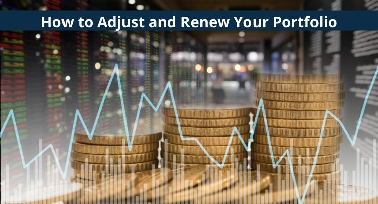

## Table of Contents

## What is portfolio adjustment and why is it important?

Portfolio adjustment means changing the investments in your portfolio. This can involve buying new investments, selling old ones, or changing how much money you have in different types of investments. You might do this to match your goals, to respond to changes in the market, or because your life situation has changed.

It's important to adjust your portfolio because it helps keep your investments in line with your goals and the amount of risk you're willing to take. If you don't adjust your portfolio, you might end up with investments that don't match what you want or need. For example, if the market changes and your investments are not doing well, adjusting your portfolio can help you avoid big losses and maybe even make more money.

## How often should a beginner adjust their investment portfolio?

For a beginner, it's good to adjust your investment portfolio about once a year. This gives you time to see how your investments are doing without making changes too often. When you're new to investing, it can be helpful to stick to a simple plan and not change things too much. Checking your portfolio once a year lets you make sure your investments still match your goals and the amount of risk you want to take.

However, if something big happens, like a major change in the market or in your life, you might need to adjust your portfolio sooner. For example, if you lose your job or if there's a big drop in the stock market, you might want to look at your investments and make changes to protect your money. But for most beginners, sticking to yearly adjustments is a good rule of thumb to keep things simple and on track.

## What are the key factors to consider when renewing a portfolio?

When you renew your portfolio, the first thing to think about is your goals. Have your goals changed since you last looked at your investments? Maybe you want to save for a house now, or maybe you're getting closer to retirement. Your goals will help you decide what kind of investments you should have. Another important thing is how much risk you're okay with. If you're more worried about losing money, you might want to move some of your money into safer investments. But if you're okay with taking more risk, you might keep more in stocks or other things that could grow a lot.

The second thing to consider is how your investments are doing. Look at how each part of your portfolio has been doing over the last year. Are some investments doing really well, while others are not? You might want to sell some of the ones that aren't doing well and buy more of the ones that are. Also, think about the economy and the market. If things have changed a lot, you might need to adjust your investments to match the new situation. For example, if interest rates go up, bonds might be a better choice than they were before.

Lastly, think about any changes in your life. Did you get a new job, have a baby, or move to a new place? These changes can affect how much money you need to save and how much risk you can take. Also, make sure your portfolio is spread out enough. You don't want all your money in one type of investment because that can be risky. By looking at these things, you can make smart choices about how to renew your portfolio and keep it working well for you.

## Can you explain the difference between rebalancing and portfolio adjustment?

Rebalancing and portfolio adjustment are two ways to keep your investments in good shape, but they are a bit different. Rebalancing means bringing your portfolio back to the original mix of investments you started with. For example, if you wanted to have 60% in stocks and 40% in bonds, but now you have 70% in stocks because they went up a lot, you would sell some stocks and buy more bonds to get back to 60/40. Rebalancing helps keep your risk level the same as when you started, and it's usually done on a set schedule, like once a year.

Portfolio adjustment, on the other hand, is more about making changes to your investments based on new goals, changes in your life, or big shifts in the market. It's not just about getting back to your original plan, but about making a new plan that fits your current situation. For example, if you're getting closer to retirement, you might want to move more money into safer investments like bonds. Or if the market has changed a lot, you might want to buy different types of stocks or other investments. Portfolio adjustment is more flexible and can happen whenever you need to make a change, not just on a set schedule.

## What are some common strategies for portfolio adjustment?

One common strategy for portfolio adjustment is to shift your investments based on your life changes. For example, if you're getting closer to retirement, you might want to move more of your money into safer investments like bonds. This helps protect your money when you'll need it soon. Another strategy is to adjust your portfolio when the market changes a lot. If stocks are doing really well, you might want to sell some and buy other types of investments to keep your risk level balanced. If the market goes down a lot, you might want to buy more stocks while they're cheaper, hoping they'll go back up.

Another strategy is to look at how each part of your portfolio is doing and make changes based on that. If some of your investments are doing much better than others, you might want to sell some of the winners and buy more of the ones that aren't doing as well. This can help you keep your portfolio balanced and maybe even make more money. Also, you might want to think about spreading your money out more. If you have too much in one type of investment, you could be taking on too much risk. By moving some money into different types of investments, you can make your portfolio safer.

## How does risk tolerance affect portfolio renewal decisions?

Risk tolerance is how much risk you're okay with when you invest your money. It's really important when you're thinking about renewing your portfolio. If your risk tolerance changes, you might need to change your investments too. For example, if you used to be okay with a lot of risk but now you're not, you might want to move some of your money from stocks to safer things like bonds. This helps make sure your portfolio matches how you feel about risk now.

Your risk tolerance can change because of things like getting older, having a baby, or losing your job. If you're getting closer to when you'll need your money, you might want to take less risk so you don't lose it. When you renew your portfolio, you should think about your risk tolerance and make sure your investments still fit with it. If they don't, you might need to sell some things and buy others to make your portfolio safer or more risky, depending on what you need.

## What role do market conditions play in portfolio adjustment?

Market conditions are really important when you're thinking about adjusting your portfolio. If the market is doing well, like if stocks are going up a lot, you might want to sell some of your stocks and buy other types of investments. This helps keep your portfolio balanced and not too risky. On the other hand, if the market goes down a lot, you might want to buy more stocks while they're cheaper. This can be a good chance to get more investments that might go back up in value later.

Also, big changes in the market can make you think about your risk level. If the market is really up and down, you might want to move some of your money into safer investments like bonds. This can help protect your money if things get worse. By paying attention to what's happening in the market, you can make smart choices about when to buy, sell, or change your investments to keep your portfolio working well for you.

## How can one assess the performance of their portfolio to decide on adjustments?

To assess the performance of your portfolio, start by looking at how each part of it is doing. Check if your stocks, bonds, or other investments have gone up or down in value over the last year. You can compare their performance to a benchmark, like the S&P 500 for stocks, to see if they're doing better or worse than the market. Also, think about how much money you've made or lost, not just in dollars but as a percentage of your total investment. This helps you see if your portfolio is growing at the rate you want.

Next, consider if your portfolio is still balanced the way you want it to be. If one type of investment has grown a lot more than the others, it might be taking up too much of your portfolio and making it riskier than you planned. You might need to sell some of that investment and buy more of the others to get back to your original plan. Also, think about your goals and if they've changed. If you're closer to needing your money, you might want to move some into safer investments. By looking at these things, you can decide if it's time to make adjustments to keep your portfolio working well for you.

## What advanced tools or software can be used for portfolio analysis and adjustment?

One popular tool for portfolio analysis and adjustment is Morningstar Direct. This software helps you look at how your investments are doing compared to the market. It gives you detailed reports and charts that show you which parts of your portfolio are doing well and which ones are not. You can also use it to see how different investments might do in the future, which can help you decide if you should buy or sell them. Morningstar Direct is great for people who want to dive deep into their portfolio and make smart choices based on a lot of data.

Another useful tool is Bloomberg Terminal. This is a powerful platform that gives you real-time data and news about the market. It can help you see how your investments are doing right now and how they might be affected by what's happening in the world. Bloomberg Terminal also has tools that let you test different scenarios to see how your portfolio might do if the market changes. While it's more expensive and complex than other tools, it's very helpful for people who want to make quick and informed decisions about their investments.

Lastly, there's software like Quicken or Personal Capital, which are easier to use and good for beginners. These tools help you keep track of your investments and see how they're doing over time. They can show you charts and graphs that make it easy to understand your portfolio's performance. They also have features that can suggest adjustments based on your goals and risk level. These tools are great if you want something simple but still effective for managing your portfolio.

## How do tax implications influence portfolio renewal strategies?

When you renew your portfolio, you need to think about taxes. If you sell investments that have gone up in value, you might have to pay capital gains tax. This can make a big difference in how much money you keep. So, you might want to hold onto investments for more than a year to get a lower tax rate on long-term gains. Also, if you have losses, you can use them to lower your taxes by offsetting gains. This is called tax-loss harvesting, and it can help you save money when you adjust your portfolio.

Taxes can also affect what kinds of investments you choose. For example, if you're in a high tax bracket, you might want to put more money into tax-free investments like municipal bonds. Or you might use retirement accounts like IRAs or 401(k)s, which can help you save on taxes now or later. By thinking about taxes when you renew your portfolio, you can make choices that help you keep more of your money and reach your goals faster.

## What are the best practices for integrating new asset classes into an existing portfolio?

When you want to add new types of investments to your portfolio, start by thinking about why you want to add them. Maybe you want to spread your money out more to lower your risk, or maybe you think the new investments will help you make more money. Whatever your reason, make sure the new investments fit with your goals and how much risk you're okay with. For example, if you're adding real estate, think about how it might help balance out your stocks and bonds. Also, look at how much it costs to buy and sell the new investments, and how easy it is to turn them into cash if you need to.

Once you've decided on the new investments, think about how much of your portfolio you want to put into them. A good rule is to start small and see how they do before you put in more money. This way, you can learn about the new investments without risking too much. Also, make sure to keep your portfolio balanced. If the new investments do really well, they might take up too much of your portfolio and make it riskier than you want. So, you might need to sell some of them and buy more of your other investments to keep things balanced. By taking these steps, you can add new types of investments to your portfolio in a smart way that helps you reach your goals.

## How can an expert use macroeconomic indicators to guide portfolio adjustments?

An expert can use macroeconomic indicators to guide portfolio adjustments by keeping an eye on things like inflation rates, unemployment numbers, and GDP growth. These indicators give clues about how the economy is doing. For example, if inflation is going up a lot, an expert might move money into investments that do well when prices rise, like commodities or inflation-protected bonds. If unemployment is high, it might mean the economy is slowing down, so the expert might want to be more careful and put more money into safer investments like government bonds.

By watching these indicators, an expert can also see trends that might affect different parts of the market. For instance, if GDP growth is strong, it could mean that companies will do well, so the expert might want to buy more stocks. On the other hand, if there are signs that the economy might go into a recession, the expert might sell some stocks and buy things that are less risky. Using macroeconomic indicators helps the expert make smart choices about when to buy, sell, or change investments to keep the portfolio working well in different economic conditions.

## References & Further Reading

[1]: Bergstra, J., Bardenet, R., Bengio, Y., & Kégl, B. (2011). ["Algorithms for Hyper-Parameter Optimization."](https://papers.nips.cc/paper/4443-algorithms-for-hyper-parameter-optimization) Advances in Neural Information Processing Systems 24.

[2]: ["Advances in Financial Machine Learning"](https://www.amazon.com/Advances-Financial-Machine-Learning-Marcos/dp/1119482089) by Marcos Lopez de Prado

[3]: ["Evidence-Based Technical Analysis: Applying the Scientific Method and Statistical Inference to Trading Signals"](https://www.amazon.com/Evidence-Based-Technical-Analysis-Scientific-Statistical/dp/0470008741) by David Aronson

[4]: ["Machine Learning for Algorithmic Trading"](https://github.com/stefan-jansen/machine-learning-for-trading) by Stefan Jansen

[5]: ["Quantitative Trading: How to Build Your Own Algorithmic Trading Business"](https://www.amazon.com/Quantitative-Trading-Build-Algorithmic-Business/dp/1119800064) by Ernest P. Chan