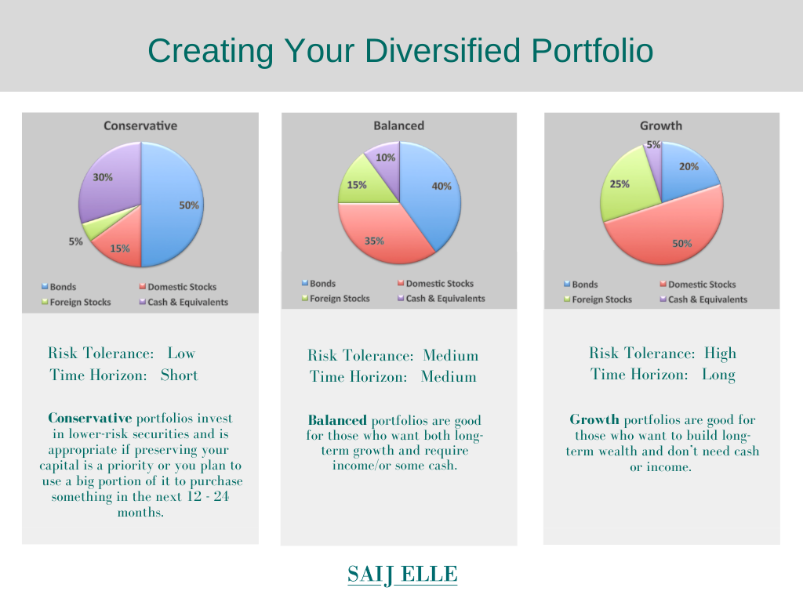

In the dynamic world of finance, portfolio allocation plays a critical role in achieving financial goals and managing risk. It encompasses the strategic distribution of an individual’s or institution’s investments across various asset classes, such as equities, bonds, and real estate, to optimize the balance between risk and return. Traditionally, this process required manual analysis and decision-making, often relying on subjective judgment and historical data. However, the advent of algorithmic trading, commonly known as algo trading, has revolutionized portfolio management by introducing automation and enhancing efficiency.

Algo trading employs sophisticated computer programs and algorithms to execute trades based on pre-defined criteria and patterns. This approach offers numerous benefits, including heightened speed, precision, and the ability to process vast arrays of data. Consequently, it mitigates the influence of human emotions and biases, which can skew investment decisions. Furthermore, algorithmic strategies can dynamically adjust portfolio allocations in response to real-time market conditions, thus optimizing investment performance and risk management.

This article explores how portfolio allocation is enhanced through algorithmic trading. By leveraging data-driven methodologies, investors can benefit from improved diversification, minimized risk exposure, and maximized returns. Whether novice or seasoned, understanding algorithmic strategies is crucial for effectively navigating today’s financial markets. Readers will gain insights into optimizing portfolio allocation using algorithmic techniques, equipping them with the knowledge needed to prosper in the modern investment landscape.

## Table of Contents

## Understanding Portfolio Allocation

Portfolio allocation is a fundamental strategy in investment management, involving the distribution of investments across various asset classes such as stocks, bonds, and real estate. The primary objective of portfolio allocation is to balance risk and return in alignment with an investor's financial goals, risk tolerance, and investment horizon. This approach seeks to optimize returns while minimizing potential risks, ensuring that investments are appropriately diversified to withstand market volatility.

Effective portfolio allocation requires a detailed understanding of both immediate market conditions and broader, long-term investment strategies. This involves assessing macroeconomic factors, industry trends, and individual security prospects. Traditionally, portfolio allocation has been a largely manual process, relying on the analytical skills of financial advisors and investors to make strategic decisions about asset distribution.

The advent of algorithmic trading has introduced automation into the decision-making processes traditionally associated with portfolio allocation. These technological advancements enable investors to process large volumes of data efficiently, make informed decisions swiftly, and adjust portfolios dynamically in response to market changes. By incorporating algorithmic strategies, investors can enhance the precision and effectiveness of their portfolio management efforts.

Algorithmic trading systems employ sophisticated algorithms to analyze market patterns and execute trades based on predefined criteria. This automation reduces human errors and emotional biases, which can negatively impact investment decisions. By integrating [algorithmic trading](/wiki/algorithmic-trading) into portfolio allocation, investors gain the ability to simulate various market scenarios, backtest strategies, and implement systematic rebalancing of their portfolios.

In conclusion, portfolio allocation serves as a cornerstone of sound investment strategy, designed to balance risk and return effectively. While traditional methods rely on manual decision-making and analysis, technological advancements in algorithmic trading have enabled automated methods that enhance these processes, offering significant benefits in today's fast-paced financial markets.

## The Rise of Algorithmic Trading

Algorithmic trading is characterized by the use of computer programs to execute trades automatically based on pre-defined criteria and patterns. This method offers multiple advantages, significantly transforming the landscape of financial trading. One of the primary benefits of algorithmic trading is its ability to process vast amounts of data with remarkable speed and precision, allowing traders to react swiftly to market opportunities. Automated systems analyze various market indicators in real-time, enabling more informed decision-making.

Additionally, algorithmic trading has gained popularity by effectively addressing market inefficiencies. By identifying [arbitrage](/wiki/arbitrage) opportunities and optimal entry and [exit](/wiki/exit-strategy) points, these systems can achieve superior execution compared to manual trading methods. The use of algorithms also helps mitigate emotional biases, which often lead to suboptimal trading decisions. By relying on systematic rules rather than human intuition, traders can make more rational and consistent choices.

Algorithms play a crucial role in portfolio management by automatically adjusting asset allocations in response to market conditions. For instance, if a particular asset class becomes too volatile or experiences a sharp decline, an algorithm can reallocate funds to more stable investments, ensuring the portfolio remains balanced. This dynamic reallocation enhances portfolio performance while minimizing risk exposure.

The widespread adoption of algorithmic trading has revolutionized approaches to portfolio diversification and risk management. By enabling precise, data-driven decisions, algorithms empower investors to construct well-diversified portfolios tailored to their specific risk appetites and financial goals. As technology evolves, algorithmic trading continues to offer sophisticated solutions for enhancing investment strategies, underscoring its vital role in modern financial markets.

## Portfolio Allocation Strategies in Algo Trading

Algorithmic trading systems offer a range of strategies designed to optimize portfolio allocation by leveraging advanced computational power and data analysis. Prominent among these strategies is [statistical arbitrage](/wiki/statistical-arbitrage), which involves identifying and exploiting price disparities among correlated securities. This approach relies on statistical models to detect discrepancies in pricing that deviate from historical norms, enabling traders to execute simultaneous buy and sell orders to capitalize on these inefficiencies. The goal is to profit from the natural correction of these price deviations.

Global macro strategies, another pillar of algorithmic trading, evaluate broad economic indicators and geopolitical events to guide investment decisions across various asset classes and markets. These strategies incorporate complex models that [factor](/wiki/factor-investing) in interest rates, currency fluctuations, and global economic policies. By assessing macroeconomic trends, algorithmic systems can dynamically adjust portfolio allocations to anticipate and respond to changes in the global economic landscape.

Sector rotation is a dynamic strategy that reallocates investments based on economic indicators and business cycles. This approach involves shifting assets between sectors that are expected to outperform during different phases of the economic cycle. For example, during economic expansion, technology and consumer discretionary sectors may be favored, while defensive sectors such as utilities and consumer staples may be prioritized during economic downturns. Algorithmic models analyze a multitude of indicators, such as GDP growth, unemployment rates, and consumer confidence, to time these rotations effectively.

Each of these algorithmic strategies is centered on maximizing returns while managing risks intrinsic to overexposure in specific assets. The use of algorithms allows for real-time analysis and rapid execution in response to market conditions, thereby enhancing portfolio resilience and performance. These strategies are continuously refined using [backtesting](/wiki/backtesting) and historical data analysis to ensure optimal alignment with current market trends. 

Through the application of these sophisticated trading strategies, algos are equipped to deliver superior risk-adjusted returns, offering investors a robust framework for portfolio allocation in the ever-evolving financial markets.

## Challenges and Considerations in Algo Trading Portfolio Allocation

Implementing algorithmic trading strategies for portfolio allocation demands a high level of technical expertise and infrastructure. The development and deployment of effective algorithms often necessitate proficiency in programming languages such as Python or C++, an understanding of financial markets, and access to high-speed computing resources. These elements are crucial for designing algorithms capable of executing trades accurately and efficiently in real time.

A significant challenge in algorithmic trading is the potential for overfitting or excessive reliance on backtested results. Overfitting occurs when an algorithm is too finely tuned to historical data, capturing noise rather than underlying market patterns. This can lead to suboptimal performance when the algorithm is applied to live market conditions. To mitigate overfitting, it is advisable to use robust validation techniques such as cross-validation and to test algorithms on out-of-sample data.

Market conditions and technological advancements can unpredictably affect the effectiveness of algorithmic strategies. Market [volatility](/wiki/volatility-trading-strategies), regulatory changes, and technological disruptions can alter trading dynamics, rendering previously successful strategies less effective. For this reason, it is essential to maintain a flexible approach and adapt strategies in response to changing conditions.

Effective risk management is another critical consideration. The use of stop-loss orders can help limit potential losses by automatically selling a position when it reaches a predefined price threshold. Implementing a statistical risk management approach, such as Value at Risk (VaR) or Conditional Value at Risk (CVaR), can provide additional insights into potential losses, contributing to more informed decision-making.

Continuous monitoring and adjustment of algorithms are crucial to maintain alignment with current market trends. This ongoing process involves analyzing performance metrics, assessing the impact of market changes, and making necessary adjustments to optimize strategy execution. Automation tools and alert systems can assist in tracking algorithm performance and identifying areas requiring attention.

The dynamic nature of financial markets necessitates a commitment to staying informed about both market trends and technological advancements. By prioritizing ongoing learning and strategy refinement, investors can leverage algorithmic trading to achieve more effective portfolio allocation and enhance overall investment performance.

## Conclusion

Portfolio allocation remains a pivotal aspect of investment strategies, and the integration of algorithmic trading techniques has brought forth numerous opportunities to enhance this process. Algorithmic trading provides innovative methodologies that elevate portfolio diversification, effectively manage risk, and optimize returns. By leveraging the speed and precision of algorithms, investors can automate complex trading strategies and adapt swiftly to market changes, allowing for more informed and timely decision-making.

The inclusion of algorithmic strategies facilitates improved diversification by enabling investors to analyze larger datasets and identify opportunities across multiple asset classes with greater efficiency. This advanced capability reduces the risks associated with overexposure to specific sectors or geographies, thereby fortifying the robustness of the portfolio. Furthermore, algorithms can dynamically rebalance portfolios in response to market conditions, ensuring that risk levels remain within the desired parameters.

Despite the clear advantages, algorithmic trading also introduces specific challenges. The need for technical expertise and comprehensive infrastructure cannot be understated, as these are foundational to the successful deployment and maintenance of algorithmic systems. Moreover, there's a risk of overfitting strategies to historical data, potentially leading to unforeseen losses when faced with new market conditions. As such, rigorous backtesting and continuous strategy refinement are essential to mitigate these risks.

For investors seeking to capitalize on the benefits of algo trading, staying informed and flexible is crucial. The financial landscape is ever-changing, and maintaining an adaptable approach allows investors to respond effectively to these shifts, securing sustainable growth and financial success. Ultimately, a well-balanced strategy that combines traditional methods with algorithmic innovations can lead to superior investment outcomes, offering a robust framework for navigating the complexities of modern financial markets. By balancing the strengths of both traditional and algorithmic approaches, investors are better equipped to achieve their financial objectives, ensuring a resilient and profitable investment strategy.

## References & Further Reading

[1]: ["Advances in Financial Machine Learning"](https://www.amazon.com/Advances-Financial-Machine-Learning-Marcos/dp/1119482089) by Marcos Lopez de Prado

[2]: ["Algorithmic Trading: Winning Strategies and Their Rationale"](https://www.amazon.com/Algorithmic-Trading-Winning-Strategies-Rationale/dp/1118460146) by Ernest P. Chan

[3]: ["Quantitative Trading: How to Build Your Own Algorithmic Trading Business"](https://www.amazon.com/Quantitative-Trading-Build-Algorithmic-Business/dp/1119800064) by Ernest P. Chan

[4]: Hendershott, T., Jones, C. M., & Menkveld, A. J. (2011). ["Does Algorithmic Trading Improve Liquidity?"](https://onlinelibrary.wiley.com/doi/full/10.1111/j.1540-6261.2010.01624.x) The Review of Financial Studies, 24(3), 795-829.

[5]: ["Machine Learning for Algorithmic Trading"](https://github.com/stefan-jansen/machine-learning-for-trading) by Stefan Jansen

[6]: Kissell, R. (2013). ["The Science of Algorithmic Trading and Portfolio Management"](https://www.sciencedirect.com/book/9780124016897/the-science-of-algorithmic-trading-and-portfolio-management) Academic Press.