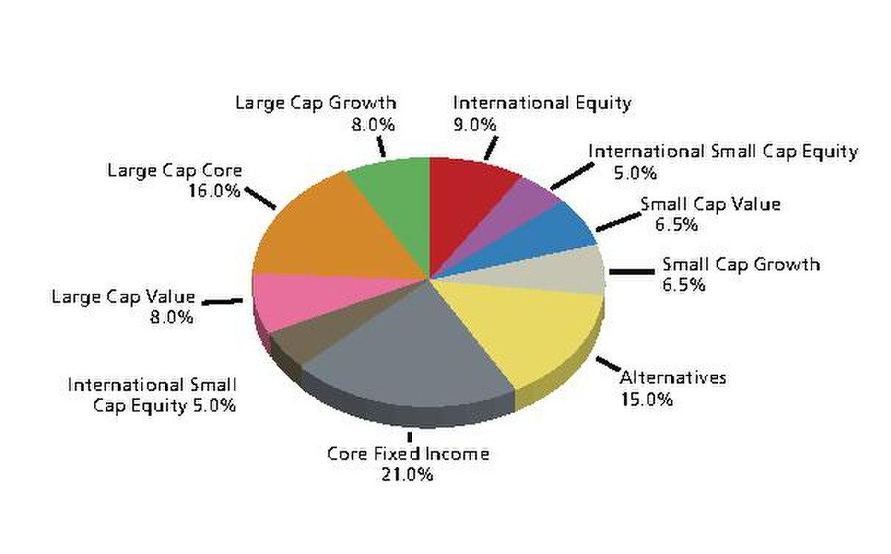

## Table of Contents

## What is portfolio allocation?

Portfolio allocation is about deciding how to spread your money across different types of investments. It's like choosing how much of your savings to put into stocks, bonds, real estate, or other things. The goal is to balance risk and reward based on your goals, how long you plan to invest, and how much risk you're okay with. If you're young and can handle more risk, you might put more money into stocks. If you're closer to retirement, you might choose safer investments like bonds.

Getting the right mix is important because it can affect how much money you make and how safe your investments are. If you put all your money in one type of investment, you could lose a lot if that investment does badly. But if you spread your money out, you might not lose as much if one investment goes down. This is called diversification. A good portfolio allocation helps you grow your money while keeping it as safe as possible.

## Why is portfolio allocation important for investors?

Portfolio allocation is important for investors because it helps them manage risk and potentially increase their returns. By spreading their money across different types of investments, like stocks, bonds, and real estate, investors can protect themselves from losing too much if one investment does poorly. This is called diversification. If all your money is in one place and that investment fails, you could lose a lot. But if your money is spread out, a loss in one area might be balanced by gains in another.

Another reason portfolio allocation matters is that it can be tailored to match an investor's goals and how long they plan to invest. For example, if you're young and saving for retirement far in the future, you might choose to have more money in stocks, which can be riskier but offer higher potential returns over time. On the other hand, if you're closer to retirement, you might want to shift more of your money into safer investments like bonds to protect what you've saved. This way, portfolio allocation helps investors align their investments with their personal financial situation and comfort with risk.

## What are the basic principles of portfolio allocation?

Portfolio allocation is about deciding how to divide your money among different kinds of investments. The main idea is to spread your money in a way that matches your goals, how long you want to invest, and how much risk you can handle. If you're young and can wait a long time for your money to grow, you might choose to put more money into stocks, which can go up and down a lot but can also give you bigger returns over time. If you're older and closer to needing your money, you might want to put more into safer things like bonds, which don't change as much but also don't grow as fast.

Another important principle is diversification. This means not putting all your money into one type of investment. If you do that and that investment does badly, you could lose a lot. But if you spread your money out, a loss in one place might be made up for by gains somewhere else. It's like not putting all your eggs in one basket. By having a mix of stocks, bonds, real estate, and maybe other things, you can balance the risk and reward in your portfolio.

Lastly, portfolio allocation isn't something you set and forget. It needs to be checked and maybe changed over time. As you get older, your goals might change, or the economy might shift, and you might need to adjust your investments to stay on track. Regularly looking at your portfolio and making changes if needed helps keep it working well for you.

## How does risk tolerance affect portfolio allocation?

Risk tolerance is how much risk you're okay with when you invest your money. It's really important because it helps decide how you should split your money between different types of investments. If you're okay with taking more risks, you might put more of your money into stocks. Stocks can go up and down a lot, but they can also give you bigger returns over time. If you don't like taking risks, you might choose to put more money into safer things like bonds. Bonds don't change as much, so they're less risky, but they also don't grow as fast.

Your risk tolerance can change over time, and that means your portfolio allocation might need to change too. When you're young and have a long time before you need your money, you might be more willing to take risks because you have time to recover if things go badly. But as you get older and closer to needing your money, you might want to be safer and shift more of your money into bonds or other less risky investments. This way, your portfolio stays in line with how much risk you're comfortable with at different stages of your life.

## What are the common asset classes included in a portfolio?

The main types of things people put money into in a portfolio are stocks, bonds, and cash. Stocks are like owning a tiny piece of a company. They can go up or down a lot, but over time, they might give you bigger returns. Bonds are like loans you give to a company or the government. They pay you back with interest and are usually safer than stocks but don't grow as fast. Cash is just money in the bank. It's very safe but doesn't grow much because it doesn't earn much interest.

Some people also include real estate in their portfolios. Real estate means owning property like houses or buildings. It can give you money from rent and might go up in value over time. Another type of investment is commodities, which are things like gold, oil, or food. They can help protect your money from inflation, which is when prices go up. Lastly, some people invest in things like mutual funds or ETFs, which are collections of different investments. They help spread out the risk because they include many different stocks, bonds, or other assets.

## How can diversification be achieved through portfolio allocation?

Diversification means spreading your money across different types of investments so you don't lose too much if one of them does badly. It's like not putting all your eggs in one basket. You can do this by putting your money into different asset classes, like stocks, bonds, and real estate. If stocks go down, maybe bonds or real estate will go up, and that can help balance out your losses. You can also diversify within each asset class. For example, instead of buying stock in just one company, you can buy stocks in many different companies from different industries. This way, if one industry has a bad year, the others might do better and help keep your portfolio stable.

Another way to diversify is by investing in different countries or regions. This can protect your money from problems in just one part of the world. If the economy in one country is doing badly, another country might be doing well, and that can help your overall portfolio. You can also use mutual funds or ETFs, which are collections of many different investments. These funds automatically spread your money across lots of different stocks, bonds, or other assets, making it easier to diversify without having to pick each investment yourself. By spreading your money out in these ways, you can lower the risk of losing a lot of money all at once.

## What is the difference between strategic and tactical asset allocation?

Strategic asset allocation is like setting a long-term plan for your investments. It's about deciding how much of your money you want to put into different types of investments, like stocks, bonds, and cash, based on your goals, how long you plan to invest, and how much risk you're okay with. Once you set this plan, you usually stick with it for a long time. You might check it now and then to make sure it's still working for you, but you don't change it much. It's like setting a [course](/wiki/best-algorithmic-trading-courses) and then following it steadily.

Tactical asset allocation is different because it's more about making short-term changes to your investments. It's like trying to take advantage of what's happening in the market right now. If you think stocks are going to do well in the next few months, you might put more money into stocks. If you think bonds are a better bet, you might shift more money into bonds. This kind of allocation needs you to keep a close eye on the market and be ready to make changes often. It's more active and can be riskier, but it can also give you a chance to make more money if you guess right about what's going to happen next.

## How do you rebalance a portfolio and why is it necessary?

Rebalancing a portfolio means adjusting your investments to get back to your original plan. Over time, some of your investments might grow faster than others. For example, if you started with half your money in stocks and half in bonds, but the stocks did really well, you might end up with more money in stocks than you wanted. To fix this, you sell some of the stocks and buy more bonds until you're back to your original mix. This can be done by setting a certain time, like once a year, or when your investments get too far away from your plan.

Rebalancing is important because it helps keep your risk level where you want it. If you don't rebalance, you might end up with too much money in risky investments, like stocks, and not enough in safer ones, like bonds. This could make your portfolio riskier than you're comfortable with. Also, rebalancing can help you stick to your long-term plan and not get too caught up in what's happening in the market right now. By keeping your investments in line with your goals, you can feel more confident that you're on the right track.

## What role do economic cycles play in adjusting portfolio allocation?

Economic cycles are the ups and downs that happen in the economy over time. They can affect how well different types of investments do. When the economy is doing well, stocks might go up a lot because companies are making more money. But when the economy is doing badly, stocks might go down because people are buying less. Knowing where we are in the economic cycle can help you decide how to adjust your portfolio. If you think the economy is going to get better, you might want to put more money into stocks to take advantage of the growth. If you think it's going to get worse, you might want to move some money into safer investments like bonds to protect what you have.

Adjusting your portfolio based on economic cycles can be tricky because it's hard to predict what will happen next. But if you pay attention to things like unemployment rates, interest rates, and how much people are spending, you can make better guesses. For example, if interest rates are going up, it might be a good time to put more money into bonds because they'll pay you more. If unemployment is going down, it might be a sign that the economy is getting better, and you might want to put more money into stocks. By keeping an eye on these signs and adjusting your investments, you can try to do better in different parts of the economic cycle.

## How can modern portfolio theory be applied to optimize allocation?

Modern Portfolio Theory (MPT) is a way to figure out the best way to spread your money across different investments. It was created by Harry Markowitz and it says that you can lower risk without giving up too much return by choosing a good mix of investments. MPT uses math to look at how different investments move together. If some go up when others go down, putting them together can make your whole portfolio safer. The goal is to find the mix that gives you the most return for the least amount of risk. This mix is called the efficient frontier, and it helps you see which combinations of investments are the best for your goals.

To use MPT to optimize your portfolio allocation, you first need to know how much risk you're okay with and what returns you want. Then, you can use tools like a computer program or a financial advisor to figure out the best mix of stocks, bonds, and other investments for you. MPT helps you understand that you don't just need to pick the investments that have done well in the past. Instead, you should look at how they work together to balance risk and reward. By doing this, you can create a portfolio that's more likely to meet your goals while keeping your risk as low as possible.

## What advanced tools and metrics are used to assess portfolio performance?

To check how well a portfolio is doing, people use different tools and numbers. One common tool is the Sharpe Ratio, which looks at how much return you get for the risk you take. A higher Sharpe Ratio means you're getting more return for the risk you're taking, which is good. Another tool is the Sortino Ratio, which is similar but only looks at the bad risk, or the risk of losing money. This can be helpful if you're more worried about losing money than about the ups and downs of your investments. There's also the Alpha, which shows if your portfolio is doing better or worse than a benchmark, like the stock market. A positive Alpha means you're beating the market, which is what most investors want.

Another important metric is the Beta, which tells you how much your portfolio moves with the market. A Beta of 1 means your portfolio moves just like the market, while a Beta higher than 1 means it moves more than the market, and a Beta less than 1 means it moves less. This can help you understand how risky your portfolio is compared to the market. Lastly, the Standard Deviation is used to measure how much your portfolio's returns change over time. A higher Standard Deviation means your returns are more spread out, which means more risk. By using these tools and metrics, investors can get a better idea of how their portfolio is doing and if they need to make any changes.

## How do global market trends influence portfolio allocation strategies?

Global market trends can really change how people decide to put their money into different investments. If a trend shows that one country's economy is doing really well, investors might want to put more money into that country's stocks or bonds. For example, if technology companies in the U.S. are growing fast, people might move more of their money into tech stocks. On the other hand, if there's a trend showing that another country is having problems, like high inflation or political issues, investors might take their money out of that country's investments to avoid losing money. By keeping an eye on these trends, investors can try to make their portfolios grow more and be safer.

Another way global market trends affect portfolio allocation is through changes in interest rates and currency values. If interest rates in one country go up, it might be a good time to put more money into that country's bonds because they'll pay more. But if a country's currency is getting weaker, it might not be a good time to invest there because your money could lose value. These trends can also make investors think about putting their money into different types of investments, like commodities or real estate, to protect against things like inflation. By understanding and reacting to these global trends, investors can adjust their portfolios to do better in the long run.

## References & Further Reading

[1]: ["Advances in Financial Machine Learning"](https://www.amazon.com/Advances-Financial-Machine-Learning-Marcos/dp/1119482089) by Marcos Lopez de Prado

[2]: ["Algorithmic Trading: Winning Strategies and Their Rationale"](https://www.amazon.com/Algorithmic-Trading-Winning-Strategies-Rationale/dp/1118460146) by Ernest P. Chan

[3]: ["Quantitative Trading: How to Build Your Own Algorithmic Trading Business"](https://www.amazon.com/Quantitative-Trading-Build-Algorithmic-Business/dp/1119800064) by Ernest P. Chan

[4]: Hendershott, T., Jones, C. M., & Menkveld, A. J. (2011). ["Does Algorithmic Trading Improve Liquidity?"](https://onlinelibrary.wiley.com/doi/full/10.1111/j.1540-6261.2010.01624.x) The Review of Financial Studies, 24(3), 795-829.

[5]: ["Machine Learning for Algorithmic Trading"](https://github.com/stefan-jansen/machine-learning-for-trading) by Stefan Jansen

[6]: Kissell, R. (2013). ["The Science of Algorithmic Trading and Portfolio Management"](https://www.sciencedirect.com/book/9780124016897/the-science-of-algorithmic-trading-and-portfolio-management) Academic Press.