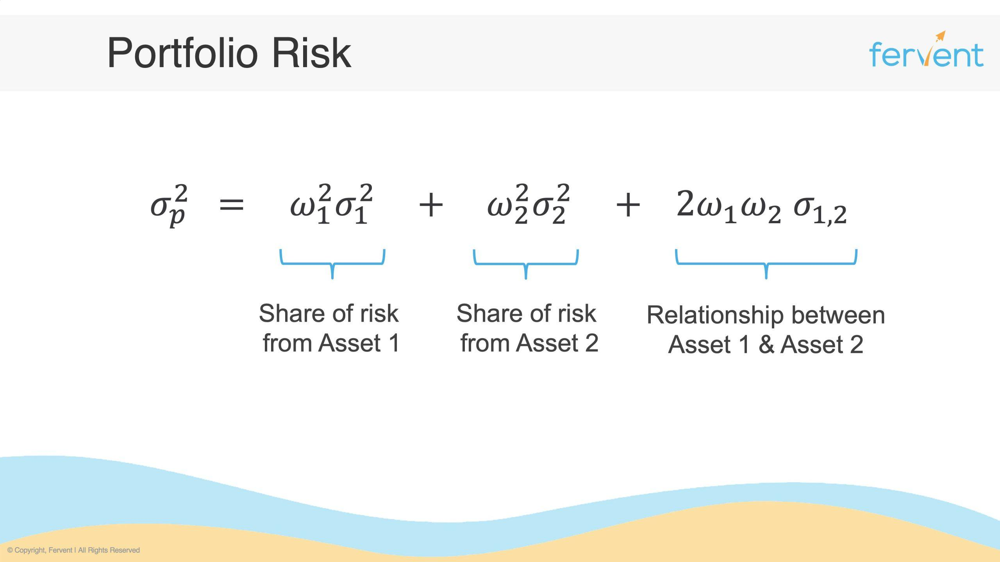

Algorithmic trading represents a significant evolution in financial markets, leveraging sophisticated algorithms and computational power to execute trades at speeds and efficiencies unmatched by human traders. The essence of algorithmic trading lies in its ability to process large datasets quickly, identify trading opportunities, and execute orders with precision. However, the success of algorithmic trading strategically hinges on the effective management of risk and return, ensuring that portfolios are not only profitable but also resilient against market adversities. 

The concept of the risk-return tradeoff is central to financial markets, asserting that the potential return on an investment increases with an increase in risk. This tradeoff is fundamental for any trading activity. In algorithmic trading, risk-return dynamics become increasingly complex as trades are executed at high speeds and frequently, often under volatile market conditions. Traders and algorithms must navigate these waters, balancing the likelihood of gaining returns against the inherent risks of the markets.



Portfolios play a pivotal role in managing risk and enhancing returns in the context of algorithmic trading. By their design, portfolios aggregate different assets, intending to achieve a desired risk-return profile. The diversification of assets within a portfolio can buffer against the volatility and unpredictability of individual asset performance, thus reducing overall risk. This strategic combination of assets forms a foundation for risk management, allowing for greater stability and return optimization over time.

In algorithmic trading, portfolio management becomes an integral component, not only evaluating the contributions of individual assets to the portfolio but also aligning them with broader risk management objectives. This includes configuring portfolios to adjust for market conditions, deploying hedging strategies, and analyzing past performances to inform future trading strategies. Effective portfolio management in algorithmic trading is about deploying systematic and quantitative strategies that align with the trader's risk tolerance and return objectives.

In conclusion, algorithmic trading participants must prioritize risk and return management. This involves recognizing the inherent risk-return tradeoff, strategically constructing portfolios to manage these dynamics effectively, and leveraging the power of algorithms to optimize portfolio outcomes. In doing so, traders can aim to secure robust trading portfolios capable of thriving in diverse market conditions.

## Table of Contents

## Understanding Portfolio Concepts

A trading portfolio is a collection of financial instruments held by an investor or financial institution. It typically includes a diverse range of assets such as stocks, bonds, commodities, currencies, or other securities. The primary objective of constructing a trading portfolio is to optimize the risk-return profile, balancing the potential for returns against the associated risks.

The components of a trading portfolio can vary significantly depending on the investor's goals, risk tolerance, and market outlook. Key components often include:

1. **Asset Allocation**: This involves deciding the proportion of different asset classes within the portfolio. Asset allocation is fundamental as it dictates the overall risk and return characteristics of the portfolio.

2. **Diversification**: This refers to the strategy of spreading investments across various assets to reduce exposure to risk. A diversified portfolio helps mitigate the risk of significant losses by ensuring that the poor performance of one or more assets does not disproportionately impact the entire portfolio.

3. **Security Selection**: This involves choosing specific securities or assets within an asset class. Effective security selection aims to maximize returns by identifying undervalued assets or those with strong growth potential.

4. **Rebalancing**: This is the process of realigning the weightings of a portfolio's assets to maintain the desired level of asset allocation and risk.

The benefits of diversified portfolios are well-documented. Diversification can significantly reduce the unsystematic risk associated with individual assets or sectors. By holding a variety of non-correlated assets, investors can lower their overall risk exposure while maintaining potential returns.

Portfolio analysis is crucial in the context of [algorithmic trading](/wiki/algorithmic-trading), where decisions are driven by advanced computational methods and data analysis. It involves the use of various quantitative techniques and models to assess the performance, risk, and return characteristics of a trading portfolio. Algorithmic trading systems leverage these analyses to make informed decisions about buying or selling assets, optimizing the construction and management of portfolios for better performance.

Key tools in portfolio analysis include mean-variance optimization, which involves balancing expected return against variance (risk). This can often be expressed mathematically using the formula for the expected return of a portfolio:

$$
E(R_p) = \sum_{i=1}^{n} w_i E(R_i)
$$

Where $E(R_p)$ is the expected return of the portfolio, $w_i$ are the weights of each asset in the portfolio, and $E(R_i)$ are the expected returns of the assets.

In algorithmic trading, portfolio analysis is also used to backtest trading strategies and assess their effectiveness over historical data, allowing for refinement and optimization of trading approaches.

## Components of Portfolio Analysis

Portfolio analysis is fundamental in evaluating and optimizing the performance of financial portfolios in algorithmic trading. The analysis relies on several key metrics and tools to assess portfolio risk and potential returns. Understanding these components is essential for traders looking to make data-driven decisions.

### Key Metrics and Tools

#### Sharpe Ratio
The Sharpe Ratio is a popular measure used to assess the risk-adjusted return of a portfolio. It is calculated as the difference between the portfolio's return and the risk-free rate, divided by the portfolio's standard deviation. Mathematically, the Sharpe Ratio $S$ is expressed as:

$$

S = \frac{R_p - R_f}{\sigma_p}
$$

where $R_p$ is the expected portfolio return, $R_f$ is the risk-free rate, and $\sigma_p$ is the standard deviation of the portfolio's excess return. A higher Sharpe Ratio indicates a more attractive risk-adjusted return.

#### Alpha
Alpha represents the excess return of a portfolio over its benchmark. It is a measure of the portfolio manager’s value-added performance. A positive alpha indicates that the portfolio has outperformed the benchmark, while a negative alpha suggests underperformance.

#### Beta
Beta measures a portfolio's [volatility](/wiki/volatility-trading-strategies) relative to the overall market. A beta of more than one indicates that the portfolio is more volatile than the market, whereas a beta of less than one means it is less volatile. Beta is useful for assessing the systemic risk of a portfolio.

### Significance of Variance and Standard Deviation

Variance and standard deviation are statistical measures used to evaluate the [dispersion](/wiki/dispersion-trading) of portfolio returns. Variance quantifies the degree of variation from the average, and standard deviation is its square root, providing a more interpretable measure of risk. Lower values imply that the portfolio returns are clustered closely around the mean, indicating less risk, while higher values suggest more uncertainty and variability in returns.

### Techniques for Calculating Expected Returns and Tracking Errors

#### Expected Returns
The expected return of a portfolio is the weighted average of the expected returns of its individual assets. The formula for calculating expected portfolio return $E(R_p)$ is:

$$

E(R_p) = \sum_{i=1}^{n} w_i \cdot E(R_i)
$$

where $w_i$ is the proportion of the portfolio invested in asset $i$, and $E(R_i)$ is the expected return of asset $i$.

#### Tracking Error
Tracking error measures the deviation of a portfolio's returns from that of its benchmark index. It is calculated as the standard deviation of the differences between the portfolio returns and the benchmark returns over a period. A lower tracking error indicates that the portfolio is closely following its benchmark, which is desirable for passive investment strategies.

```python
# Python example for calculating Sharpe Ratio

# Sample portfolio returns and risk-free rate
portfolio_returns = [0.02, 0.03, 0.015, 0.04, 0.01]
risk_free_rate = 0.01

# Calculate average return of portfolio
average_return = sum(portfolio_returns) / len(portfolio_returns)

# Calculate standard deviation of portfolio returns
import numpy as np
std_deviation = np.std(portfolio_returns, ddof=1)

# Calculate Sharpe Ratio
sharpe_ratio = (average_return - risk_free_rate) / std_deviation
print("Sharpe Ratio:", sharpe_ratio)
```

In summary, portfolio analysis leverages statistical metrics such as the Sharpe Ratio, alpha, beta, variance, and standard deviation to provide insight into the risk-return profile of a portfolio. Calculating expected returns and tracking errors further aids traders in optimizing their strategies for maximum performance.

## Risk Management in Algorithmic Trading

Risk management in algorithmic trading is a critical practice that involves identifying, assessing, and prioritizing risks associated with trading activities. It is essential for preserving capital, maintaining stable returns, and mitigating potential losses. Effective risk management ensures that a trading strategy is not only profitable in the short term but sustainable in the long term. 

One fundamental concept in risk management is diversification, which involves spreading investments across a variety of financial instruments to reduce exposure to any single asset or risk. By holding a diversified portfolio, traders can mitigate the impact of adverse price movements in any one security. Diversification can be mathematically expressed through the correlation coefficient, where a portfolio with perfectly uncorrelated assets ($\rho = 0$) typically has reduced overall risk.

Hedging is another common strategy. It involves taking positions that offset potential losses in a portfolio. For example, a trader holding a long position in a stock can hedge by purchasing put options, which rise in value as the stock's price falls, thus limiting downside risk. This approach can be implemented using derivatives such as options and futures contracts to limit the potential downside of price movements.

The use of stop-loss orders is also a prevalent risk management tool. Stop-loss orders automatically execute a trade when an asset's price reaches a certain level, thereby capping losses. This strategy is particularly useful in volatile markets where quick and decisive action is necessary to protect a portfolio's value.

Technology plays an indispensable role in monitoring and managing risk in algorithmic trading. Advanced software and systems can perform real-time monitoring of market conditions and trading positions, allowing for swift adjustments to a trading strategy. Automated systems can be programmed with risk management rules that trigger alerts or execute trades when pre-defined risk thresholds are breached. This automation minimizes human error and ensures that risk management protocols are consistently applied.

In Python, for example, portfolio risk management can be implemented using libraries like NumPy and pandas for data manipulation, along with more specialized libraries like PyPortfolioOpt for advanced portfolio optimization and risk assessment.

```python
import numpy as np
import pandas as pd
from pypfopt import risk_models, expected_returns, EfficientFrontier

# Assuming 'data' is a DataFrame containing historical price data for assets
returns = expected_returns.mean_historical_return(data)
cov_matrix = risk_models.CovarianceShrinkage(data).ledoit_wolf()

# Construct and optimize a portfolio
ef = EfficientFrontier(returns, cov_matrix)
weights = ef.max_sharpe()  # Maximize the Sharpe ratio
ef_portfolio_performance = ef.portfolio_performance(verbose=True)

# Example output: Portfolio performance metrics
print(weights)  # Portfolio weights
print(ef_portfolio_performance)  # (Expected return, volatility, Sharpe ratio)
```

In summary, risk management in algorithmic trading encompasses various strategies and tools designed to safeguard investments and enhance profitability. Diversification, hedging, and stop-loss orders are essential components, while technology facilitates continuous and automated risk monitoring. By integrating these practices, traders can navigate the complexities of financial markets with greater confidence and stability.

## The Risk-Return Tradeoff in Algorithmic Trading

The risk-return tradeoff is a fundamental principle in finance, reflecting the notion that potential returns rise with an increase in risk. In the context of algorithmic trading, this tradeoff plays a critical role. Algorithmic traders seek to exploit inefficiencies in the market using sophisticated mathematical models to optimize their portfolios. However, these opportunities are not without risks. An appropriate balance between risk and return is necessary to maximize the profitability of trading strategies while minimizing potential losses.

### Explanation of the Risk-Return Tradeoff

The risk-return tradeoff in algorithmic trading implies that to earn higher returns, traders must engage with higher levels of risk. Risk is often quantified using metrics such as standard deviation or variance of returns, which measure the degree of dispersion around expected returns. High-risk portfolios are typically more volatile, offering significant returns but also potentially large losses. Conversely, low-risk portfolios provide more stabilized returns with reduced potential for loss.

The Capital Asset Pricing Model (CAPM) is a widely used tool that illustrates the risk-return tradeoff. It expresses the expected return of an asset as a function of the risk-free rate, the asset's beta (which measures the asset's risk relative to the overall market), and the market risk premium. The formula is given by:

$$

E(R_i) = R_f + \beta_i (E(R_m) - R_f) 
$$

where $E(R_i)$ is the expected return of the investment, $R_f$ is the risk-free rate, $\beta_i$ is the beta of the investment, and $E(R_m)$ is the expected market return.

### Strategies for Balancing Risk and Return

Balancing risk and return involves optimizing the portfolio to achieve the highest possible return for a given level of risk. Several strategies can be employed:

1. **Diversification**: Spreading investments across different asset classes, sectors, or geographies can reduce unsystematic risk and lead to a more stable return profile. The idea is that negative performance in one area can be offset by positive performance in another.

2. **Risk-adjusted Return Metrics**: Utilizing metrics such as the Sharpe Ratio or Sortino Ratio can help evaluate the return of a portfolio adjusted for its risk. The Sharpe Ratio, for instance, measures the excess return per unit of deviation in an investment, aiding in comparing different portfolios or assets.

3. **Dynamic Risk Management**: Techniques such as stop-loss orders, options, or futures contracts can be utilized to protect against downside risk while allowing for profit participation. Dynamic hedging can also ensure that the risk levels remain consistent with the trader's risk tolerance.

### Case Studies of Effective Risk-Return Portfolio Management

Consider the case study of Renaissance Technologies, a pioneer in algorithmic trading. The firm employs sophisticated algorithms to manage a diversified portfolio across multiple assets. By using quantitative models and big data analytics, Renaissance Technologies effectively balance risk and return, ensuring sustainable gains over time.

Another example is Two Sigma Investments, which uses [machine learning](/wiki/machine-learning) and distributed computing to manage risk and optimize return. By analyzing vast datasets, Two Sigma adjusts its strategies in real-time, fine-tuning its portfolio in response to market conditions, thereby maintaining an optimal risk-return balance.

Both Renaissance Technologies and Two Sigma illustrate the power of leveraging technology to manage the risk-return tradeoff effectively. Their successes underscore the importance of systematic and data-driven approaches in navigating the complexities of algorithmic trading.

## Tools and Techniques for Portfolio Optimization

Portfolio optimization is a crucial aspect of financial strategy, aiming to enhance returns while controlling risk. This can be achieved through various quantitative models and algorithms that have been developed to aid in creating an efficient portfolio.

One fundamental method in portfolio optimization is the mean-variance optimization, introduced by Harry Markowitz in 1952. This approach focuses on constructing a portfolio that offers the maximum possible return for a given level of risk, or equivalently, the minimum risk for a given level of expected return. The efficient frontier, a concept derived from the mean-variance analysis, represents a set of portfolios that optimally balance risk and return.

Mathematically, this can be expressed by the optimization problem:

$$
\text{Minimize: } \sigma_p^2 = \mathbf{w}^T \mathbf{\Sigma} \mathbf{w}
$$

$$
\text{Subject to: } \mathbf{w}^T \mathbf{\mu} = \mu_p, \quad \mathbf{w}^T \mathbf{1} = 1
$$

where $\mathbf{w}$ is the vector of portfolio weights, $\mathbf{\Sigma}$ is the covariance matrix of asset returns, $\mathbf{\mu}$ is the vector of expected asset returns, and $\mu_p$ is the expected return of the portfolio.

Advanced quantitative models incorporate various factors beyond mean and variance. The Black-Litterman model, for example, integrates subjective views with market equilibrium, allowing for more adaptable and personalized portfolio optimization.

In recent years, machine learning and [artificial intelligence](/wiki/ai-artificial-intelligence) have increasingly been applied to portfolio management. These technologies analyze vast datasets, uncovering patterns that traditional models might miss, thereby refining investment strategies. Machine learning algorithms can assess non-linear relationships and adapt to new data, making them powerful tools for portfolio optimization.

Python's libraries, such as NumPy, Pandas, and Scikit-learn, facilitate implementing these advanced techniques. Below is a simplified example demonstrating how a machine learning model could be used in Python for portfolio optimization:

```python
import numpy as np
from sklearn.linear_model import LinearRegression

# Simulated data
returns = np.random.rand(100, 5)  # 100 samples, 5 assets
market_index = np.random.rand(100, 1)

# Machine learning model
model = LinearRegression()
model.fit(returns, market_index)

# Coefficients represent asset weightings
weights = model.coef_

# Normalize weights so that they sum to 1
optimized_weights = weights / np.sum(weights)

print("Optimized Portfolio Weights:", optimized_weights)
```

In this example, a linear regression model fits asset returns against a market index, providing an initial understanding of asset weightings in a portfolio. While this is a simplified scenario, more sophisticated approaches can include neural networks and [deep learning](/wiki/deep-learning) models, which are capable of processing complex datasets with high-dimensional features.

Portfolio optimization is further enhanced by integrating AI-driven forecasts, sentiment analysis, and real-time market data, enabling dynamic adjustment in asset allocation. These techniques greatly contribute to a more informed, adaptable, and potentially profitable trading strategy.

## Common Mistakes and How to Avoid Them

In portfolio management, certain common mistakes often hinder the effectiveness of trading strategies. One prevalent pitfall is the tendency to overreact to market fluctuations. This behavior can lead to impulsive decisions, such as buying high during market euphoria and selling low during panic. To avoid this, traders must adhere to a well-defined strategy and maintain discipline. They should focus on long-term trends and base decisions on data-driven insights rather than emotional responses to market volatility.

Another significant mistake is the lack of diversification. A concentrated portfolio can expose traders to unsystematic risk, where adverse movements in individual assets can disproportionately impact the portfolio's performance. Diversification across different asset classes, sectors, and geographies can help mitigate this risk. By spreading investments, traders can achieve more stable returns and reduce the impact of a single asset's poor performance.

Rebalancing portfolios is a critical process that ensures the alignment of asset allocations with the investor's risk tolerance and investment goals. Market conditions change, and asset values fluctuate over time, leading to deviation from the desired portfolio weights. Regular rebalancing helps maintain the intended risk-return profile. Traders should establish clear guidelines for when and how to rebalance, such as setting periodic intervals or using threshold-based triggers for adjustments.

In adapting to changing market conditions, traders should remain informed about macroeconomic indicators, industry trends, and regulatory changes. This information can inform strategic adjustments to the portfolio, ensuring it remains optimized for current and anticipated market environments. Employing technology to automate data analysis and rebalance processes can enhance responsiveness and accuracy, reducing manual errors and emotional biases.

Overall, successful portfolio management in algorithmic trading requires avoiding common pitfalls through disciplined adherence to strategy, diversification, regular rebalancing, and informed adaptability to market dynamics.

## Conclusion

In conclusion, algorithmic trading necessitates a sophisticated understanding of both risk and return management to develop a durable trading portfolio. Through this exploration, it becomes clear that effectively managing the balance between risk and return is crucial for the success of algorithmic trading strategies. The integration of risk management practices, such as diversification and the use of technology for real-time monitoring, aids in mitigating potential losses and enhancing the likelihood of stable returns. Advanced quantitative models, including those powered by machine learning and artificial intelligence, play a pivotal role in optimizing portfolios, allowing traders to make data-driven decisions that balance risk and reward effectively.

The risk-return tradeoff is a foundational concept in finance, shaping how portfolios are constructed and managed. In algorithmic trading, where decisions are executed at high speed and frequency, understanding this tradeoff is even more critical. By systematically applying risk management strategies and continuously optimizing portfolios, traders can navigate the complexities of financial markets more effectively.

To maintain long-term success, traders are encouraged to adopt a systematic approach to portfolio management that incorporates thorough risk assessments and regular portfolio rebalancing based on market conditions. This disciplined methodology ensures traders can adapt to emerging trends and challenges within the market, ultimately leading to more resilient trading strategies.

In summary, effective risk and return management is indispensable for the advancement and success of algorithmic trading. Emphasizing a structured approach to portfolio management will empower traders to harness the potential of algorithmic strategies while safeguarding against adverse market shifts.

## References & Further Reading

[1]: Sharpe, W. F. (1966). ["Mutual Fund Performance."](https://www.jstor.org/stable/pdf/2351448.pdf) Journal of Business, 39(1), 119-138.

[2]: Treynor, J. L. (1965). "How to Rate Management of Investment Funds." Harvard Business Review, 43(1), 63-75.

[3]: Markowitz, H. M. (1952). ["Portfolio Selection."](https://www.jstor.org/stable/2975974) The Journal of Finance, 7(1), 77-91.

[4]: ["The Black-Litterman Model: A Detailed Exploration"](https://papers.ssrn.com/sol3/papers.cfm?abstract_id=1314585) by Fischer Black and Robert Litterman.

[5]: Bodie, Z., Kane, A., & Marcus, A. J. (2014). ["Investments."](https://www.mheducation.com/highered/product/investments-bodie-kane/M9781264412662.html) McGraw-Hill Education. 

[6]: Grinold, R. C., & Kahn, R. N. (2000). ["Active Portfolio Management: A Quantitative Approach for Producing Superior Returns and Controlling Risk."](https://www.amazon.com/Active-Portfolio-Management-Quantitative-Controlling/dp/0070248826) McGraw-Hill Education.

[7]: ["Algorithmic Trading: Winning Strategies and Their Rationale"](https://www.wiley.com/en-us/Algorithmic+Trading%3A+Winning+Strategies+and+Their+Rationale-p-9781118460146) by Ernest P. Chan

[8]: Ledoit, O., & Wolf, M. (2004). ["Honey, I Shrunk the Sample Covariance Matrix."](http://www.ledoit.net/honey.pdf) Journal of Portfolio Management, 30(4), 110-119.