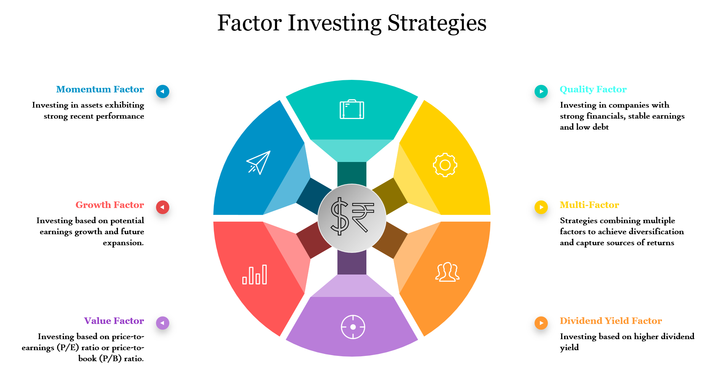

## Table of Contents

## What is style investing and how does it relate to portfolio construction?

Style investing is a way of picking stocks based on certain characteristics, like if a company is big or small, or if it's growing fast or paying good dividends. There are two main styles: value investing, where you buy stocks that seem cheap and might be undervalued, and growth investing, where you buy stocks of companies that are expected to grow a lot in the future. People use these styles to try to beat the market by focusing on the types of stocks they think will do well.

When it comes to building a portfolio, style investing can help you decide what kinds of stocks to include. If you believe that value stocks will do better in the future, you might put more of your money into those. Or, if you think growth stocks are the way to go, you might choose more of those. By choosing a style, you can create a portfolio that matches your beliefs about the market and your goals for investing. This can help you manage risk and possibly get better returns, but it's important to keep an eye on how your chosen style is doing and adjust your portfolio if needed.

## What are the main investment styles used in portfolio construction?

The main investment styles used in portfolio construction are value investing and growth investing. Value investing is when you look for companies that seem to be priced lower than they should be. These companies might be out of favor with other investors, but you think they have good potential and are a bargain. You buy these stocks hoping that other investors will eventually see their true worth, and the stock price will go up.

Growth investing is different. With growth investing, you focus on companies that are growing fast and are expected to keep growing. These companies might not pay big dividends, but you expect their stock prices to increase a lot over time. You're willing to pay more for these stocks because you believe in their future earnings and expansion.

Both styles can be used to build a portfolio. Some investors might choose to focus on one style, while others might mix both. The key is to match your investment style with your goals and how much risk you're willing to take. Over time, you might need to adjust your portfolio as the market changes or as your own situation changes.

## How can a beginner start building a portfolio using style investing?

If you're a beginner looking to build a portfolio using style investing, the first step is to decide if you want to focus on value investing, growth investing, or a mix of both. Value investing means looking for companies that seem cheap and might be undervalued. You can find these by looking at things like the price-to-earnings ratio or other financial metrics that show a company might be a good deal. Growth investing, on the other hand, means finding companies that are growing fast and are expected to keep growing. These companies might not pay big dividends, but you expect their stock prices to go up a lot over time. Think about what you believe will do well in the future and what matches your goals and how much risk you're okay with taking.

Once you've chosen your style, start by [picking](/wiki/asset-class-picking) a few stocks that fit that style. If you're going for value, look for companies with low price-to-earnings ratios or other signs that they might be undervalued. If you're going for growth, look for companies with strong earnings growth and a good future outlook. You don't need to pick a lot of stocks at first; starting with a small, focused portfolio can help you learn and adjust as you go. As you build your portfolio, keep an eye on how your stocks are doing and be ready to make changes if needed. Remember, investing is a long-term game, so be patient and keep learning as you go.

## What are the differences between growth and value investing styles?

Growth investing and value investing are two different ways to pick stocks. Growth investing means you look for companies that are growing fast and are expected to keep growing. These companies might not pay big dividends, but you expect their stock prices to go up a lot over time. You're willing to pay more for these stocks because you believe in their future earnings and expansion. Think of growth investing like betting on a young, fast-growing business that could become a big success in the future.

Value investing is different. It's about finding companies that seem to be priced lower than they should be. These companies might be out of favor with other investors, but you think they have good potential and are a bargain. You look at things like the price-to-earnings ratio or other financial metrics that show a company might be a good deal. Value investing is like buying a quality item on sale, hoping that other investors will eventually see its true worth, and the stock price will go up.

Both styles can help you build a portfolio, but they come with different risks and rewards. Growth stocks can be more exciting because of their potential for big gains, but they can also be riskier if the company doesn't grow as expected. Value stocks might be less exciting, but they can offer more stability and the chance to buy good companies at a lower price. Deciding which style to use depends on what you believe will do well in the future and how much risk you're okay with taking.

## How do market conditions affect the performance of different investment styles?

Market conditions can really change how well different investment styles do. When the economy is doing great and growing fast, [growth stocks](/wiki/growth-stocks) usually do better. People are more willing to take risks and invest in companies that are growing quickly, even if they have to pay more for them. But when the economy slows down or there's a lot of uncertainty, people might get scared and start looking for safer places to put their money. That's when value stocks can do better because they're often seen as more stable and less risky.

Sometimes, the market can swing from favoring one style to another. For example, if everyone has been buying growth stocks for a while and their prices get really high, the market might start to think they're too expensive. Then, investors might start looking for value stocks that seem like a better deal. This can make value stocks go up in price while growth stocks might go down. It's important to keep an eye on what's happening in the market and be ready to change your investment style if things shift.

## What role does diversification play in style investing?

Diversification is really important in style investing because it helps spread out your risk. If you only pick stocks from one style, like all growth or all value, your whole portfolio could get hurt if that style doesn't do well. But if you mix both growth and value stocks, you're less likely to lose a lot of money all at once. It's like not putting all your eggs in one basket. By having a mix of different styles, you can protect your money better and maybe even get better returns over time.

Also, diversification can help you take advantage of different market conditions. Sometimes the market might favor growth stocks, and other times it might favor value stocks. If you have both in your portfolio, you can do well no matter which way the market goes. This way, you don't have to guess which style will be the best; you can just let the market decide and still come out okay. So, by spreading your investments across different styles, you make your portfolio stronger and more flexible.

## How can one measure the performance of a style-based portfolio?

To measure the performance of a style-based portfolio, you need to look at how well your investments are doing over time. One way to do this is by comparing your portfolio's returns to a benchmark, like an index that follows the same investment style. For example, if you have a growth portfolio, you might compare it to the Nasdaq, which is known for having a lot of growth stocks. If your portfolio is doing better than the benchmark, that's a good sign. You can also look at the overall return of your portfolio, which is how much money you've made or lost, and the risk you've taken to get those returns. A good way to measure risk is by looking at something called the standard deviation, which shows how much your portfolio's returns go up and down.

Another important thing to consider is how your style-based portfolio is doing compared to other styles. If you're focused on value investing, you might want to see how your portfolio is doing compared to a growth portfolio during the same time. This can help you understand if your chosen style is working well or if you might want to adjust your strategy. You can also look at specific metrics like the Sharpe ratio, which tells you how much return you're getting for the risk you're taking. By keeping an eye on these different measures, you can get a good idea of how your style-based portfolio is performing and make smart decisions about your investments.

## What are some common pitfalls to avoid when constructing a portfolio through style investing?

One common pitfall to avoid when constructing a portfolio through style investing is over-concentration in one style. If you put all your money into growth stocks or all into value stocks, you might do really well for a while, but if the market changes and that style doesn't do well anymore, you could lose a lot of money. It's better to mix both styles in your portfolio so you're not too dependent on one type of stock doing well.

Another pitfall is not paying attention to market conditions. The market can change, and what worked well last year might not work this year. If you're not watching what's happening and adjusting your portfolio, you might miss out on opportunities or keep losing money. It's important to stay informed and be ready to shift your investments if needed.

Lastly, don't forget about diversification within each style. Even if you're focusing on growth or value, you should still spread your money across different industries and companies. This way, if one company or industry has problems, it won't hurt your whole portfolio. By diversifying, you can lower your risk and have a better chance of doing well over time.

## How can advanced investors use style rotation to enhance portfolio returns?

Advanced investors can use style rotation to improve their portfolio returns by switching between growth and value stocks based on what's happening in the market. They watch for signs that one style might start doing better than the other. For example, if the economy is growing fast and people are feeling confident, they might put more money into growth stocks because these tend to do well in good times. But if things start to slow down or get uncertain, they might move their money into value stocks, which can be safer and often do better when the market is worried.

To do this well, investors need to keep a close eye on economic indicators, like interest rates, inflation, and how the stock market is doing overall. They also need to be ready to make changes quickly. Style rotation isn't about guessing what will happen next; it's about reacting to what's already happening and adjusting the portfolio to take advantage of the current market conditions. By doing this, advanced investors can try to get better returns and manage their risk better over time.

## What are the quantitative models used in style investing and how are they applied?

Quantitative models in style investing are tools that use numbers and math to help investors pick stocks. They look at things like how much a company's earnings are growing, how cheap or expensive a stock is compared to its earnings, and other financial measures. For example, a model for growth investing might focus on a company's past and expected earnings growth, while a model for value investing might look at the price-to-earnings ratio to find stocks that seem like a good deal. These models help investors make decisions based on data instead of just guessing.

To use these models, investors put the data into the model and it gives them a score or a ranking for each stock. If they're using a growth model, they might pick the stocks with the highest growth scores. If they're using a value model, they might choose the stocks that the model says are the cheapest. By following what the model suggests, investors can build a portfolio that matches their chosen style. But it's important to remember that these models aren't perfect and the market can change, so investors need to keep checking and updating their models to make sure they're still working well.

## How does style investing integrate with other investment strategies like factor investing?

Style investing can work together with [factor](/wiki/factor-investing) investing to help investors build a better portfolio. Factor investing is about picking stocks based on certain characteristics, like how big a company is or how much it moves with the market. These characteristics are called factors. Style investing, on the other hand, focuses on whether a stock is a growth stock or a value stock. By using both strategies, investors can pick stocks that not only fit their style but also have the factors they want. For example, an investor might choose growth stocks that are also small companies because they believe small growth companies will do well.

When you mix style investing with factor investing, you can create a more detailed and thoughtful investment plan. You might decide to focus on value stocks that also have a low [volatility](/wiki/volatility-trading-strategies) factor, meaning they don't go up and down as much as other stocks. This can help you find stocks that are not only cheap but also less risky. By combining these strategies, you can spread your investments across different styles and factors, which can help you manage risk and possibly get better returns. It's like using different tools to build a stronger and more balanced portfolio.

## What are the latest research findings on the effectiveness of style investing in portfolio construction?

Recent research on style investing shows that it can still be a good way to build a portfolio, but it depends a lot on the market conditions. Studies have found that growth investing often does better when the economy is growing and people feel confident about the future. On the other hand, value investing tends to do better when the economy is slowing down or when there's a lot of uncertainty. Researchers have also noticed that sometimes the market can swing from favoring one style to the other, so it's important for investors to keep an eye on what's happening and be ready to change their strategy if needed.

Another finding from recent research is that combining style investing with other strategies, like factor investing, can help improve portfolio performance. By looking at both the style of a stock (growth or value) and other factors like how big the company is or how much it moves with the market, investors can create a more balanced and possibly more successful portfolio. This approach can help manage risk better and take advantage of different market conditions, making it a smart way to invest for those who are willing to put in the time to understand and adjust their investments.

## References & Further Reading

[1]: Bergstra, J., Bardenet, R., Bengio, Y., & Kégl, B. (2011). ["Algorithms for Hyper-Parameter Optimization."](https://dl.acm.org/doi/10.5555/2986459.2986743) Advances in Neural Information Processing Systems 24.

[2]: ["Advances in Financial Machine Learning"](https://www.amazon.com/Advances-Financial-Machine-Learning-Marcos/dp/1119482089) by Marcos Lopez de Prado

[3]: ["Evidence-Based Technical Analysis: Applying the Scientific Method and Statistical Inference to Trading Signals"](https://www.amazon.com/Evidence-Based-Technical-Analysis-Scientific-Statistical/dp/0470008741) by David Aronson

[4]: ["Machine Learning for Algorithmic Trading"](https://github.com/stefan-jansen/machine-learning-for-trading) by Stefan Jansen

[5]: ["Quantitative Trading: How to Build Your Own Algorithmic Trading Business"](https://github.com/LucindaYa/quant-resources/blob/master/Quantitative%20Trading%20How%20to%20Build%20Your%20Own%20Algorithmic%20Trading%20Business.pdf) by Ernest P. Chan