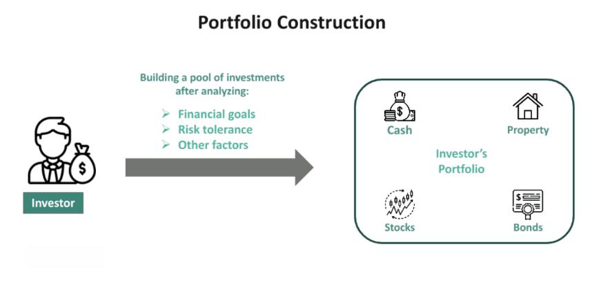

## Table of Contents

## What is portfolio construction?

Portfolio construction is the process of putting together a collection of investments, like stocks, bonds, and other assets, to meet your financial goals. It's like building a puzzle where each piece represents a different investment. The goal is to create a mix that balances risk and reward based on your personal needs, such as saving for retirement, buying a house, or funding education.

When constructing a portfolio, you need to think about how much risk you are willing to take and how long you plan to invest. For example, if you are young and saving for retirement, you might choose to invest more in stocks, which can be riskier but offer higher potential returns over time. On the other hand, if you are closer to retirement, you might prefer safer investments like bonds to protect your savings. The key is to diversify your investments to spread out the risk, so if one investment does poorly, others might do well and balance it out.

## Why is portfolio construction important for investors?

Portfolio construction is important for investors because it helps them reach their financial goals in a smart way. By carefully choosing a mix of investments, investors can balance the risk they are taking with the rewards they hope to get. For example, if someone wants to save for a new home in 5 years, they might choose investments that are less risky to make sure they have the money when they need it. This process helps investors avoid putting all their money in one place, which can be dangerous if that investment does poorly.

Another reason portfolio construction is important is that it allows investors to match their investments with their personal situation. Everyone has different needs and comfort levels with risk. A young person saving for retirement might be okay with more risk because they have time to recover from any losses. An older person close to retirement might want to be safer to protect what they have saved. By building a portfolio that fits their own life, investors can feel more confident and in control of their financial future.

## What are the basic principles of portfolio construction?

The first principle of portfolio construction is diversification. This means spreading your investments across different types of assets, like stocks, bonds, and real estate. By doing this, you reduce the risk of losing all your money if one investment does badly. For example, if the stock market goes down, your bonds might still do well, and that can help balance things out. Diversification is like not putting all your eggs in one basket.

Another important principle is understanding your risk tolerance. This is about figuring out how much risk you are comfortable taking. If you are scared of losing money, you might choose safer investments, even if they might not grow as much. On the other hand, if you are okay with taking more risk, you might invest more in stocks, which can go up and down a lot but might give you bigger rewards over time. Knowing your risk tolerance helps you build a portfolio that you can stick with, even when the market gets bumpy.

The third principle is having a clear investment goal. Whether you are saving for retirement, a house, or your kids' education, your goal will shape what kind of investments you choose. If your goal is far away, you might be able to take more risk because you have time to recover from any losses. But if your goal is coming up soon, you might want to play it safe. Keeping your goals in mind helps you stay focused and make smart choices about your portfolio.

## How does risk tolerance influence portfolio construction?

Risk tolerance is all about how much risk you are okay with when you invest. It really matters when you are putting together your portfolio because it decides what kind of investments you pick. If you are someone who gets nervous about losing money, you will probably choose safer investments like bonds or savings accounts. These don't grow as fast, but they are less likely to lose value. On the other hand, if you are okay with taking more risk, you might put more money into stocks or other things that can go up and down a lot but might give you bigger rewards in the long run.

Your risk tolerance shapes your whole investment plan. For example, if you are young and saving for retirement, you might be fine with taking more risk because you have a long time to recover if things go wrong. You might choose to have a bigger part of your portfolio in stocks. But if you are older and close to retiring, you might want to be safer to protect the money you have saved. You might move more of your money into bonds or other safe investments. By matching your portfolio to your risk tolerance, you can feel more comfortable with your investments and stick to your plan, even when the market gets a bit scary.

## What are the different types of assets included in a portfolio?

A portfolio can include many different types of assets. The main ones are stocks, which are shares in a company. When you buy stocks, you own a little piece of that company and can make money if the company does well. Another type of asset is bonds, which are like loans you give to a company or the government. They usually pay you back with interest over time and are considered safer than stocks. You can also have cash or cash equivalents, like savings accounts or money market funds, which are very safe but don't grow as much.

Other assets that can be part of a portfolio include real estate, which means owning property like houses or land. Real estate can grow in value and can also provide rental income. There are also mutual funds and exchange-traded funds (ETFs), which are collections of different investments like stocks and bonds. They help you diversify your portfolio without having to pick each investment yourself. Finally, some people include alternative investments like commodities (like gold or oil) or even art and collectibles. These can be riskier but might offer big rewards if they do well.

## How do you determine the right asset allocation for a portfolio?

Figuring out the right asset allocation for a portfolio means deciding how much of your money to put into different types of investments, like stocks, bonds, and other things. The main things to think about are your goals, how long you plan to invest, and how much risk you're okay with. If you're saving for something far away, like retirement, you might put more money into stocks because they can grow a lot over time. But if you need the money soon, you might choose safer investments like bonds to make sure you don't lose money.

Your age and how comfortable you are with risk also matter a lot. If you're young, you might be okay with taking more risk because you have time to recover if things go wrong. As you get older, you might want to be safer to protect what you've saved. Talking to a financial advisor can help you figure out the right mix for you. They can look at your whole situation and help you make a plan that fits your needs and helps you reach your goals.

## What role does diversification play in portfolio construction?

Diversification is a key part of building a good portfolio. It means spreading your money across different types of investments, like stocks, bonds, and real estate. When you diversify, you're not putting all your money in one place. This helps lower the risk because if one investment does badly, the others might do well and balance it out. For example, if the stock market goes down, your bonds might still be doing okay, so you don't lose all your money.

Diversification helps you feel more secure with your investments. It's like not putting all your eggs in one basket. By having a mix of different investments, you can handle ups and downs in the market better. This way, you can work towards your financial goals without worrying too much about losing everything if one part of your portfolio has a bad year.

## How can rebalancing enhance a portfolio's performance?

Rebalancing is like giving your portfolio a check-up and making adjustments to keep it on track. Over time, some of your investments might grow faster than others. This can change the mix of your portfolio, making it different from what you planned. For example, if your stocks do really well, they might become a bigger part of your portfolio than you wanted. Rebalancing means selling some of those stocks and buying more of the other investments to get back to your original plan. This helps you stick to your goals and the level of risk you're okay with.

By rebalancing, you can actually make your portfolio perform better in the long run. It's because you're selling investments that have gone up a lot and might be too expensive, and buying more of the ones that haven't grown as much but could be a good deal. This can help you buy low and sell high, which is a smart way to invest. Plus, rebalancing keeps your portfolio in line with your risk tolerance, so you don't end up taking more risk than you planned. This way, you can feel more confident about reaching your financial goals.

## What advanced strategies can be used in portfolio construction for experienced investors?

Experienced investors can use advanced strategies like tactical asset allocation to try to beat the market. This means changing the mix of their portfolio based on what they think will happen in the market. For example, if they think stocks will do well, they might put more money into stocks for a while. This is different from just sticking to a set plan. It needs a lot of research and understanding of the market, but it can help them take advantage of short-term opportunities.

Another strategy is using alternative investments, like hedge funds, private equity, or commodities. These can add more variety to a portfolio and might help reduce risk or increase returns. But they can be riskier and harder to understand than regular investments like stocks and bonds. Experienced investors need to do a lot of research and maybe even talk to experts to use these investments the right way.

Some investors also use options and futures to manage risk or try to make more money. Options give them the right to buy or sell an investment at a set price in the future. Futures are agreements to buy or sell something at a future date. These can be tricky and risky, but they can help experienced investors protect their portfolio or take advantage of market movements. It's important for them to really know what they're doing and maybe get advice from a financial expert.

## How do market conditions affect portfolio construction decisions?

Market conditions are really important when you're deciding how to build your portfolio. If the economy is doing well and the stock market is going up, you might want to put more money into stocks because they could keep growing. But if things are shaky and there's a lot of uncertainty, you might choose to be safer and put more money into bonds or cash. It's all about looking at what's happening around you and guessing what might happen next. For example, if interest rates are going up, bonds might not be as good of a deal, so you might want to think about other investments.

Even the type of market you're in can change your choices. If the market has been going up for a long time, it might be time to sell some stocks and buy other things to keep your portfolio balanced. On the other hand, if the market has been going down, you might see it as a chance to buy stocks at a lower price. Keeping an eye on market conditions helps you make smart choices and adjust your portfolio so it fits with what's happening in the world.

## What are the common metrics used to evaluate portfolio performance?

When you want to see how well your portfolio is doing, you look at some common numbers called metrics. One important one is the rate of return, which tells you how much money you've made or lost over time. This can be broken down into different time periods like yearly or monthly. Another metric is the risk-adjusted return, which looks at how much risk you took to get your returns. A popular way to measure this is with the Sharpe ratio, which compares your returns to how much they went up and down.

Another thing to check is how your portfolio is doing compared to a benchmark, like the S&P 500 if you have a lot of stocks. This helps you see if you're doing better or worse than the market. You also want to look at the volatility, which is how much your portfolio's value goes up and down. Lower volatility usually means less risk, which can be good if you don't like surprises. Finally, the alpha and beta of your portfolio can tell you how it's doing compared to the market and how sensitive it is to market changes. These metrics help you understand if your portfolio is meeting your goals and if you need to make any changes.

## How can one incorporate ESG (Environmental, Social, and Governance) factors into portfolio construction?

Incorporating ESG factors into portfolio construction means choosing investments that are good for the environment, treat people well, and have strong leadership. You can do this by looking for companies that have high ESG scores or are part of ESG-focused funds. These companies might be working on things like reducing pollution, treating their workers fairly, and having clear and honest management. By picking these kinds of investments, you're not just trying to make money but also wanting to make a positive impact on the world.

To start, you might want to use ESG ratings from organizations that check how well companies are doing in these areas. You can also talk to a financial advisor who knows about ESG investing. They can help you find the right investments and build a portfolio that matches your values. Remember, ESG investing can sometimes mean giving up some potential returns, but many people find it worth it to support companies that are trying to make the world a better place.

## What is Understanding Portfolio Construction?

Portfolio construction is a critical component in trading, entailing the selection of a combination of assets to achieve optimal financial performance while managing risk. In the context of [algorithmic trading](/wiki/algorithmic-trading), portfolio construction relies extensively on a data-driven approach and quantitative analysis. Algorithmic strategies leverage large datasets and advanced computational techniques to systematically identify asset combinations that can potentially reduce risk and maximize returns.

The foundation of effective portfolio construction lies in diversification, a principle aimed at spreading investments across various asset classes to mitigate risk. The objective is to offset the negative performance of some assets with the positive performance of others. In quantitative terms, diversification can be expressed through covariance analysis. By calculating the covariance between asset returns, traders can quantify how assets interact with each other, aiding in the creation of a more balanced portfolio. For example, if the returns of two assets $A$ and $B$ are denoted as $R_A$ and $R_B$, the covariance $\text{Cov}(R_A, R_B)$ determines if they move together or in opposition.

A diversified portfolio minimizes unsystematic risk, which pertains to individual assets, while systematic risk, associated with market factors, remains unavoidable. The Capital Asset Pricing Model (CAPM) is frequently employed to assess the expected return of an asset based on its systematic risk, expressed as:

$$
\text{Expected Return} = R_f + \beta (R_m - R_f)
$$

where $R_f$ is the risk-free rate, $\beta$ represents the asset's sensitivity to market movements, and $R_m$ is the expected market return.

Quantitative analysis in algorithmic trading involves employing sophisticated statistical models and [machine learning](/wiki/machine-learning) algorithms to forecast asset price movements and portfolio performance. These models analyze historical price data, trading volumes, and other relevant metrics to identify patterns and potential opportunities for portfolio enhancement.

Python, a popular programming language in algorithmic trading, provides several libraries, such as NumPy for numerical computations and Pandas for data manipulation, which are integral in portfolio analysis. An example using Python to calculate expected returns and [volatility](/wiki/volatility-trading-strategies) might look as follows:

```python
import numpy as np

# Historical return data for assets
returns = np.array([
    [0.01, 0.02, -0.01],
    [0.03, 0.01, 0.00],
    [0.02, 0.04, 0.02]
])

# Mean returns and covariance matrix
mean_returns = np.mean(returns, axis=0)
cov_matrix = np.cov(returns.T)

# Calculate portfolio return and volatility
weights = np.array([0.4, 0.4, 0.2]) # Example allocation
portfolio_return = np.dot(weights, mean_returns)
portfolio_volatility = np.sqrt(np.dot(weights.T, np.dot(cov_matrix, weights)))

print('Expected Portfolio Return:', portfolio_return)
print('Portfolio Volatility:', portfolio_volatility)
```

An effectively constructed algorithmic trading portfolio not only aims for higher returns but also ensures these returns are achieved with a balanced level of risk. The integration of data analysis, risk assessment models like CAPM, and computational tools like Python underpins the strategic construction of robust portfolios in this digitally-driven era of trading.

## How can risk be managed in algorithmic portfolios?

Risk management plays a fundamental role in algorithmic trading portfolios, ensuring the long-term stability and profitability of trading activities. The utilization of various techniques such as stop-loss orders, position sizing, and diversification is instrumental in mitigating exposure to the inherent volatility of financial markets.

### Stop-loss Orders

Stop-loss orders are predetermined price levels at which a position is automatically liquidated to limit potential losses. For instance, if a trader places a stop-loss order at 5% below the purchase price for a stock, the position will be sold when its price drops by 5%, thus capping the loss.

Mathematically, setting a stop-loss can be expressed as:

$$
\text{Stop-Loss Price} = \text{Purchase Price} \times (1 - \text{Stop-Loss Percentage})
$$

Stop-loss orders are critical as they provide a disciplined approach to exiting losing trades, protecting the portfolio from significant drawdowns.

### Position Sizing

Position sizing refers to the process of determining the appropriate amount to invest in each trade relative to the overall portfolio size. This technique balances the trade-off between risk and potential return. A common method involves using the Kelly Criterion formula, which maximizes expected utility:

$$
f^* = \frac{bp - q}{b}
$$

where $f^*$ is the fraction of the portfolio to bet, $b$ is the odds received on the wager, $p$ is the probability of winning, and $q$ is the probability of losing, such that $q = 1 - p$.

Implementing effective position sizing can significantly enhance return potential while maintaining acceptable risk levels.

### Diversification

Diversification reduces risk by allocating investments across various financial instruments, industries, and other categories. The core idea is to mitigate unsystematic risk, which is specific to individual assets. The Markowitz model, or Modern Portfolio Theory (MPT), is often employed to optimize diversification:

$$
E(R_p) = \sum w_i E(R_i)
$$

$$
\sigma_p^2 = \sum w_i^2 \sigma_i^2 + \sum \sum w_i w_j \sigma_{ij}
$$

where $E(R_p)$ is the expected return of the portfolio, $w_i$ is the weight of asset $i$, $E(R_i)$ is the expected return of asset $i$, $\sigma_p^2$ is the variance of the portfolio's return, $\sigma_i^2$ is the variance of asset $i$, and $\sigma_{ij}$ is the covariance between assets $i$ and $j$.

### Regular Backtesting and Scenario Analysis

Backtesting involves simulating a trading strategy using historical data to evaluate its viability. It provides insights into the strategy's performance, helping traders identify potential weaknesses. Python libraries such as Backtrader or PyAlgoTrade can facilitate backtesting processes. Here's a simple Python snippet for backtesting using Backtrader:

```python
import backtrader as bt

class MyStrategy(bt.Strategy):
    # Define strategy logic
    def next(self):
        # Trading logic

cerebro = bt.Cerebro()
cerebro.addstrategy(MyStrategy)
data = bt.feeds.YahooFinanceData(dataname='AAPL', fromdate=datetime(2020, 1, 1), todate=datetime(2021, 1, 1))
cerebro.adddata(data)
cerebro.run()
```

Scenario analysis complements backtesting by evaluating the impact of hypothetical events on portfolio performance. By simulating market conditions such as economic recessions or regulatory changes, traders can stress test their portfolios to assess resilience under adverse circumstances.

In conclusion, effective risk management within algorithmic portfolios requires a robust framework incorporating stop-loss orders, strategic position sizing, diversification, and thorough testing methodologies. These elements collectively protect against volatility and ensure the sustainability of trading operations.

## What is the conclusion?

Effective portfolio construction in algorithmic trading integrates strategic asset selection with robust risk management. In this context, it is crucial to strike a balance between diversifying assets and carefully calibrating exposure to different market factors. The objective is not only to maximize returns but also to manage potential risks. This involves using quantitative techniques to measure the risk-adjusted performance of a portfolio, often expressed through metrics such as the Sharpe Ratio, which is calculated as:

$$
\text{Sharpe Ratio} = \frac{E[R_p] - R_f}{\sigma_p}
$$

Where $E[R_p]$ is the expected return on the portfolio, $R_f$ is the risk-free rate, and $\sigma_p$ is the standard deviation of the portfolio's excess return.

Continuous optimization and adaptation of strategies are necessary due to their dependence on evolving market conditions. This requires ongoing evaluation and refinement of algorithms to ensure they remain effective as market dynamics shift. Implementing machine learning techniques can aid in recognizing patterns and predicting market movements, thus providing a competitive advantage.

Furthermore, utilizing the right tools, data, and methodologies is paramount to enhancing a trader's success in algorithmic trading. Advanced analytical software platforms and data feeds provide the raw materials for constructing and testing algorithms, while robust computational tools enable the processing of large datasets to identify profitable trading signals. As a result, traders who leverage these resources can better navigate the complexities of financial markets, paving the way for consistent portfolio performance.

## References & Further Reading

[1]: Bergstra, J., Bardenet, R., Bengio, Y., & Kégl, B. (2011). ["Algorithms for Hyper-Parameter Optimization."](https://papers.nips.cc/paper/4443-algorithms-for-hyper-parameter-optimization) Advances in Neural Information Processing Systems 24.

[2]: ["Advances in Financial Machine Learning"](https://www.amazon.com/Advances-Financial-Machine-Learning-Marcos/dp/1119482089) by Marcos Lopez de Prado

[3]: ["Evidence-Based Technical Analysis: Applying the Scientific Method and Statistical Inference to Trading Signals"](https://www.amazon.com/Evidence-Based-Technical-Analysis-Scientific-Statistical/dp/0470008741) by David Aronson

[4]: ["Machine Learning for Algorithmic Trading"](https://github.com/stefan-jansen/machine-learning-for-trading) by Stefan Jansen

[5]: ["Quantitative Trading: How to Build Your Own Algorithmic Trading Business"](https://books.google.com/books/about/Quantitative_Trading.html?id=j70yEAAAQBAJ) by Ernest P. Chan