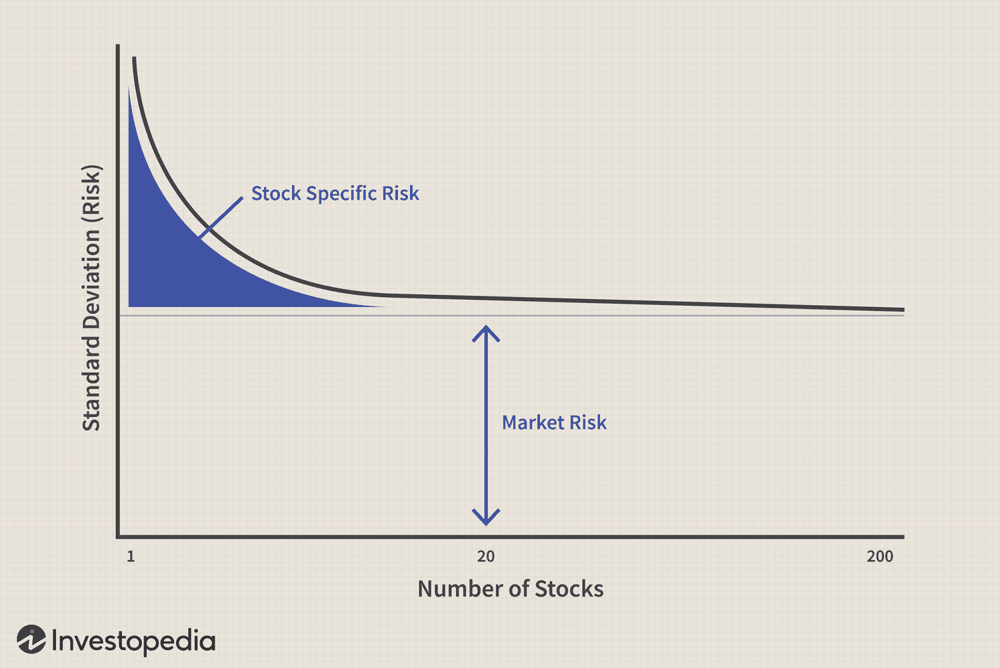

## Table of Contents

## What is portfolio diversification and why is it important?

Portfolio diversification means spreading your investments across different types of assets, like stocks, bonds, and real estate. It's like not putting all your eggs in one basket. When you diversify, you reduce the risk of losing a lot of money if one investment does poorly. For example, if you only invest in one company's stock and that company goes bankrupt, you could lose everything. But if you have investments in many different companies and industries, a loss in one won't hurt as much.

Diversification is important because it helps protect your money. No one can predict the future of the market, so having a mix of investments can help balance out the ups and downs. If one part of your portfolio goes down, another part might go up, keeping your overall investment more stable. This way, you're more likely to meet your financial goals without taking big risks. It's a smart way to invest for the long term.

## How can bonds be used to diversify a portfolio?

Bonds can be a great way to diversify a portfolio because they often act differently than stocks. When you buy a bond, you're lending money to a government or a company, and they promise to pay you back with interest over time. This means bonds can provide a steady income, which is different from stocks that might go up and down a lot. If the stock market is doing poorly, bonds might still be doing well, helping to balance out your losses.

Adding bonds to your portfolio can also lower the overall risk. Since bonds are generally safer than stocks, they can protect your money if the stock market crashes. For example, if you have all your money in stocks and the market drops, you could lose a lot. But if you also have some money in bonds, those bonds might not lose as much value, or might even gain value, helping to cushion the blow. This way, your portfolio is more stable and less likely to suffer big losses all at once.

## What are real estate investment trusts (REITs) and how do they fit into a diversified portfolio?

Real Estate Investment Trusts, or REITs, are companies that own, operate, or finance income-generating real estate. They're like a way to invest in real estate without having to buy a house or a building yourself. When you buy shares in a REIT, you're buying a piece of a big real estate portfolio. REITs have to pay out most of their income as dividends to shareholders, which can be a nice steady income for investors.

REITs can be a good addition to a diversified portfolio because they often behave differently than stocks and bonds. While stocks and bonds might go up and down based on the economy, real estate can be more stable. Adding REITs to your portfolio can help spread out your risk. If the stock market is doing badly, your REITs might still be doing well, giving you some balance. Plus, the regular dividends from REITs can provide a steady income, which can be helpful if you're looking for income in your investments.

## How can commodities like gold and oil contribute to portfolio diversification?

Commodities like gold and oil can help diversify your investment portfolio because they often move differently than stocks and bonds. When the stock market goes down, commodities like gold might go up. This is because people often buy gold when they're worried about the economy. It's like a safe place to put their money. Oil, on the other hand, can be affected by different things, like what's happening around the world or how much people are driving. So, having some of your money in commodities can help balance out the ups and downs of your other investments.

Adding commodities to your portfolio can also protect your money from inflation. Inflation means prices go up over time, which can make your money worth less. But commodities like gold and oil often keep their value or even go up when inflation happens. This can help keep your overall portfolio strong. By including a mix of investments, like stocks, bonds, and commodities, you're spreading out your risk and making your portfolio more stable.

## What role do alternative investments like hedge funds and private equity play in diversification?

Alternative investments like hedge funds and private equity can add another layer of diversification to your portfolio. They often do things differently than regular stocks and bonds. Hedge funds can use strategies like betting against the market or using borrowed money to try and make bigger returns. Private equity involves buying parts of companies that aren't on the stock market. Because these investments don't always move the same way as the stock market, they can help balance out your other investments. If the stock market goes down, your hedge funds or private equity might not go down as much, or might even go up.

These alternative investments can also offer the chance for higher returns, but they come with more risk. Hedge funds and private equity can be more complicated and harder to get out of quickly if you need your money back. But if you're okay with that risk and you're looking for a way to spread your investments even more, they can be a good choice. By including a small part of your portfolio in these alternatives, you're not putting all your eggs in one basket. This can help protect your money and maybe even grow it more over time.

## How can international investments help in diversifying a portfolio?

International investments can help diversify a portfolio by spreading your money across different countries and economies. If you only invest in your own country, you might miss out on opportunities in other places. For example, if the economy in your country is doing badly, another country's economy might be doing well. By investing in different countries, you can balance out the ups and downs of your investments. This way, if one part of the world is having a tough time, the other parts might help keep your portfolio strong.

Also, international investments can help protect your money from problems in your own country. Things like political changes, economic downturns, or even currency changes can hurt your investments if they're all in one place. But if you have some of your money in other countries, those problems might not affect you as much. For example, if your country's currency loses value, your investments in other countries might still be worth a lot in their local currency. This can help keep your overall portfolio more stable and safe.

## What are the benefits and risks of investing in cryptocurrencies for portfolio diversification?

Investing in cryptocurrencies like Bitcoin and Ethereum can add a new kind of investment to your portfolio. They can help diversify because they often move differently than stocks, bonds, or even commodities. When other parts of your portfolio go down, cryptocurrencies might go up. This can help balance out your overall investments. Also, cryptocurrencies can offer big returns. Some people have made a lot of money from them, especially in the early days. So, if you're looking for a way to possibly grow your money a lot, cryptocurrencies might be an option.

But, there are also big risks with cryptocurrencies. They can be very up and down, sometimes losing a lot of value very quickly. This can be scary if you're not ready for it. Also, the rules about cryptocurrencies are still changing, and they can be different in different countries. This can make it hard to know what's okay to do. Plus, there's a risk of losing your money to hackers or scams. If you're thinking about adding cryptocurrencies to your portfolio, it's important to only use money you can afford to lose and to learn as much as you can about them first.

## How does diversification across different asset classes affect portfolio risk and return?

Diversification across different asset classes like stocks, bonds, real estate, commodities, and even cryptocurrencies can help lower the risk in your portfolio. When you spread your money across different types of investments, you're not putting all your eggs in one basket. If one type of investment goes down, another might go up or stay the same. This can help balance out the ups and downs in your portfolio. For example, if the stock market crashes, your bonds or gold might not lose as much value, which can protect your overall investment.

Diversification can also affect the return on your portfolio. While it might lower the risk, it can also mean you might not make as much money as if you had put all your money into one thing that did really well. But, over time, a diversified portfolio can help you get a more steady return. It's like a smoother ride. Instead of big ups and downs, you might see smaller, more consistent growth. This can help you reach your financial goals without taking big risks.

## What advanced strategies can be used to optimize portfolio diversification?

One advanced strategy to optimize portfolio diversification is to use asset allocation models. This means deciding how much of your money to put into different types of investments based on your goals, how much risk you're okay with, and how long you plan to invest. You can use computer programs to help figure this out. These programs look at a lot of data and can suggest the best mix of investments for you. This can help you make sure your portfolio is spread out in a way that matches what you want to achieve and how much risk you're willing to take.

Another strategy is to use rebalancing. This means checking your portfolio from time to time and making changes to keep it balanced. Over time, some of your investments might grow more than others, which can throw off your original plan. Rebalancing helps you sell some of the investments that have grown a lot and buy more of the ones that haven't. This keeps your portfolio in line with your goals and helps you stay diversified. It's like making sure all parts of your portfolio are working together to help you reach your financial goals.

Lastly, you can use risk parity strategies. This means you try to spread out the risk evenly across all your investments. Instead of just looking at how much money you have in each investment, you look at how risky each one is. This can help make sure that no single investment is making your portfolio too risky. By focusing on risk, you can make your portfolio more stable and better able to handle the ups and downs of the market.

## How can one measure the effectiveness of diversification in a portfolio?

To measure how well you've diversified your portfolio, you can look at something called the correlation between your investments. Correlation tells you how much different parts of your portfolio move together. If all your investments go up and down at the same time, they have a high correlation. A good diversified portfolio has investments that don't all move the same way. So, you want to see a low correlation between different parts of your portfolio. This means when one investment goes down, another might go up, helping to balance things out.

Another way to check if your diversification is working is by looking at the volatility of your portfolio. Volatility means how much your portfolio goes up and down over time. A well-diversified portfolio should have less volatility because the different types of investments help smooth out the ups and downs. If your portfolio is less bumpy, it means your diversification is helping to lower your risk. You can compare the volatility of your portfolio to a benchmark, like a stock market index, to see if your diversification is making a difference.

## What are the tax implications of diversifying a portfolio with various asset types?

When you diversify your portfolio with different types of assets, you need to think about how taxes will affect your investments. Different investments are taxed in different ways. For example, when you earn money from stocks, you might have to pay capital gains tax. This tax can be different depending on how long you held the stock. If you sell a stock after holding it for less than a year, you'll pay a higher tax rate than if you held it for more than a year. On the other hand, income from bonds, like interest, is usually taxed as regular income, which can be at a higher rate than long-term capital gains.

Also, some investments like real estate investment trusts (REITs) and certain types of bonds have special tax rules. For instance, dividends from REITs are often taxed as ordinary income, which can be higher than the tax on qualified dividends from stocks. And if you invest in commodities like gold, you might have to pay taxes on any gains when you sell them. International investments can add another layer of complexity because you might have to deal with taxes in other countries too. So, when you're diversifying your portfolio, it's important to think about how each type of investment will be taxed to make sure you're not caught off guard by a big tax bill.

## How should one rebalance a diversified portfolio to maintain optimal asset allocation?

To keep your diversified portfolio working well, you need to rebalance it from time to time. Rebalancing means checking how much of your money is in each type of investment and making changes to keep it in line with your plan. Let's say you started with 60% of your money in stocks and 40% in bonds. Over time, if your stocks do really well, you might end up with 70% in stocks and 30% in bonds. To rebalance, you would sell some of your stocks and buy more bonds to get back to your original 60/40 split. This helps make sure your portfolio stays balanced and matches your goals and how much risk you're okay with.

You should rebalance your portfolio at least once a year, but you can do it more often if you want. One easy way to decide when to rebalance is to set a rule, like rebalancing whenever any part of your portfolio gets more than 5% off from your plan. For example, if your stocks go above 65% or below 55%, it's time to rebalance. Another way is to rebalance on a set date, like every January. When you rebalance, think about any changes in your life, like if you're closer to retiring or if you can take more risk now. This way, your portfolio will keep helping you reach your financial goals without taking on too much risk.

## What is the Importance of Portfolio Diversification?

Diversification is a cornerstone of investment strategy, vital for mitigating risk and stabilizing returns. By distributing investments across various asset classes, investors can significantly reduce their exposure to market volatility. This approach helps balance the risk-reward profile of a portfolio, lessening the potential impact of market downturns.

1. **Risk Mitigation through Asset Allocation:**
   Diversification involves allocating investments across a spectrum of asset classes such as equities, bonds, real estate, and commodities. Each class reacts differently to economic events, thus spreading investments can cushion against losses in any one category. For example, when stock markets decline, bonds often experience lesser [volatility](/wiki/volatility-trading-strategies), providing a stabilizing effect on the overall portfolio.

2. **Geographical Diversification:**
   Investing in global markets can further reduce risk by decreasing dependency on the economic conditions of a single country. For instance, an investor with holdings in both U.S. and European markets can offset regional economic downturns. Geographical diversification capitalizes on the differing growth rates and economic cycles of various regions.

3. **Sectoral Diversification:**
   Within equities, sectoral diversification ensures that investments are spread across multiple sectors, such as technology, healthcare, and finance. This approach guards against sector-specific downturns, as poor performance in one sector can be balanced by gains in another. Sectoral diversification can also capture growth opportunities in emerging industries.

4. **Theoretical Framework:**
   The Modern Portfolio Theory (MPT) introduced by Harry Markowitz formalizes diversification. It posits that an optimally diversified portfolio minimizes variance for a given expected return. The math behind MPT can be expressed by:
$$
   \sigma_p^2 = \sum_{i=1}^{n} \sum_{j=1}^{n} w_i w_j \sigma_{i,j}

$$

   where $\sigma_p^2$ is the portfolio variance, $w_i$ and $w_j$ are the weights of assets $i$ and $j$, and $\sigma_{i,j}$ is the covariance between assets $i$ and $j$.

5. **Practical Implementation:**
   Investors can implement diversification through mutual funds and ETFs, which offer exposure to a myriad of asset classes and sectors. Regular portfolio rebalancing is essential to maintain desired asset allocation and capitalize on evolving market conditions.

In summary, diversification is a fundamental strategy in investment management. By spreading risks across different asset classes, regions, and sectors, investors improve their chances of achieving more stable and profitable returns, regardless of market conditions.

## What are the best practices for implementation?

Investors aiming to effectively implement diversification and algorithmic trading must consider several best practices to ensure their investment strategies are resilient and successful. A structured approach to risk management, regular portfolio monitoring, and rebalancing can create a robust framework that protects investments and aligns with financial goals.

### Establishing a Strong Risk Management Framework

A critical component of successful portfolio management is establishing a comprehensive risk management framework. This involves identifying potential risks and implementing measures to mitigate their impact. Key steps include:

1. **Risk Assessment**: Evaluate the market, credit, and operational risks associated with each investment. Use quantitative models to estimate the potential downside and volatility.

2. **Position Sizing**: Implement position sizing strategies to limit the exposure of any single investment in your portfolio. A common practice is using the Kelly Criterion, which can be defined as:
$$
   f^* = \frac{bp - q}{b}

$$

   where $f^*$ is the fraction of the portfolio to invest, $b$ is the net odds received on the wager, $p$ is the probability of winning, and $q$ is the probability of losing.

3. **Stop-Loss Orders**: Set stop-loss orders to automatically sell a security when it reaches a predetermined price, thus limiting potential losses.

### Regular Rebalancing and Performance Monitoring

Maintaining a diversified portfolio requires regular rebalancing and performance evaluations to ensure long-term objectives are met:

- **Rebalancing**: Adjust your asset allocation periodically to return to target weights as market dynamics change. This process prevents overexposure to any particular asset class and maintains the intended risk profile.

- **Performance Metrics**: Utilize metrics such as the Sharpe Ratio, which measures risk-adjusted return, to evaluate the efficiency of your portfolio. It is calculated as:
$$
  \text{Sharpe Ratio} = \frac{E[R_p] - R_f}{\sigma_p}

$$

  where $E[R_p]$ is the expected portfolio return, $R_f$ is the risk-free rate, and $\sigma_p$ is the standard deviation of the portfolio's excess return.

- **Benchmarking**: Compare portfolio performance against industry benchmarks to assess relative performance and make necessary strategic adjustments.

### Actionable Steps and Tools for Development

Developing a resilient and diversified portfolio involves adopting practical tools and strategies:

- **Algorithmic Tools**: Leverage algorithmic trading platforms and tools such as QuantConnect or Alpaca to automate trades and backtest strategies.

- **Diversification Models**: Utilize software like MATLAB or Python libraries such as NumPy and Pandas to perform advanced simulations and optimize asset allocation.

- **Continuous Learning**: Stay informed through webinars, financial journals, and professional networks to keep abreast of market trends and emerging investment opportunities.

By systematically applying these best practices, investors can develop a strategic approach to portfolio diversification and algorithmic trading that not only enhances performance but also mitigates risks in an ever-changing financial landscape.

## References & Further Reading

[1]: ["Modern Portfolio Theory and Investment Analysis"](https://www.amazon.com/Modern-Portfolio-Theory-Investment-Analysis/dp/1118469941) by Edwin J. Elton, Martin J. Gruber, Stephen J. Brown, and William N. Goetzmann.

[2]: ["Algorithmic Trading: Winning Strategies and Their Rationale"](https://www.wiley.com/en-us/Algorithmic+Trading%3A+Winning+Strategies+and+Their+Rationale-p-9781118460146) by Ernest P. Chan.

[3]: ["Financial Market Analysis"](https://study.com/academy/lesson/what-is-financial-market-analysis-definition-explanation.html) by David Blake.

[4]: ["Alternative Investments: CAIA Level I"](https://www.amazon.com/Alternative-Investments-Level-Wiley-Finance/dp/1119604141) by Donald R. Chambers, Mark J. P. Anson, Keith H. Black, and Hossein Kazemi.

[5]: ["High-Frequency Trading: A Practical Guide to Algorithmic Strategies and Trading Systems"](https://www.ahmetbeyefendi.com/wp-content/uploads/2020/07/High-Frequency-Trading-Irene-Aldridge.pdf) by Irene Aldridge.