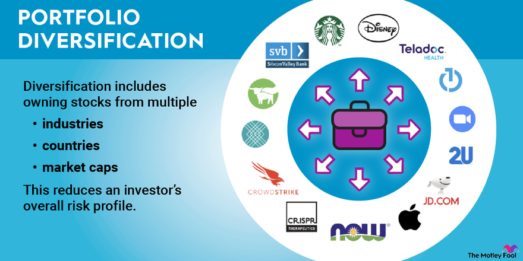

## Table of Contents

## What is portfolio diversification?

Portfolio diversification is when you spread your investments across different types of assets. Instead of putting all your money into one thing, like just stocks or just real estate, you mix it up. This way, if one type of investment doesn't do well, you won't lose all your money because other investments might still be doing okay.

The main reason people diversify their portfolios is to reduce risk. Imagine if you only invested in one company's stock and that company went bankrupt. You'd lose everything. But if you have a mix of stocks, bonds, and maybe even some real estate, the impact of one bad investment is less severe. Diversification helps protect your money and can lead to more stable returns over time.

## Why is diversification important in investing?

Diversification is important in investing because it helps reduce risk. When you spread your money across different types of investments, like stocks, bonds, and real estate, you're not putting all your eggs in one basket. If one investment doesn't do well, the others might still be okay, which means you won't lose all your money at once. This can make investing less scary because you know you're protected if something goes wrong.

Another reason diversification is important is that it can help you get better returns over time. Different investments can perform well at different times. For example, when the stock market is down, bonds might do better. By having a mix of investments, you can take advantage of these ups and downs. This can lead to a smoother and more consistent growth of your money, which is what most people want when they invest.

## What are the basic principles of diversification?

Diversification is all about spreading your money across different types of investments. The main idea is to not put all your money into just one thing. For example, instead of only buying stocks from one company, you could buy stocks from many different companies, or mix stocks with bonds and real estate. This way, if one investment does poorly, the others might still do well, which helps protect your money.

Another important principle is to invest in different industries and countries. If you only invest in tech companies and the tech industry has a bad year, all your money could be at risk. But if you also invest in healthcare, energy, and other sectors, you're more likely to have some investments doing well even if others aren't. The same goes for investing in different countries. If one country's economy is struggling, investments in other countries might still be growing.

Lastly, diversification also means balancing between risk and reward. Some investments, like stocks, can be riskier but offer higher potential rewards. Others, like bonds, are usually safer but might not grow as much. By having a mix of both, you can aim for good growth while keeping some safety. The key is to find a balance that fits your comfort level with risk and your long-term financial goals.

## How can beginners start diversifying their investment portfolio?

Beginners can start diversifying their investment portfolio by first understanding their own risk tolerance. This means figuring out how much risk you're comfortable with. If you don't like big risks, you might want to start with safer investments like bonds or mutual funds. If you're okay with more risk, you might put some money into stocks. A good way to begin is by choosing a few different types of investments. For example, you could put some money in a stock market index fund, some in bonds, and maybe a little in real estate through a real estate investment trust (REIT).

Next, beginners should consider using low-cost investment options to start diversifying. Index funds and exchange-traded funds (ETFs) are great because they automatically spread your money across many different investments. This can be easier than [picking](/wiki/asset-class-picking) individual stocks or bonds. You can start with just a few hundred dollars in an index fund that tracks the overall stock market, and then add more types of investments as you learn more and feel more comfortable. Over time, you can adjust your investments to keep them balanced and diversified, making sure you're not putting too much money into just one type of investment.

## What are the different types of assets one can include in a diversified portfolio?

A diversified portfolio can include different types of assets to spread out risk and potentially increase returns. One common type of asset is stocks, which are shares in a company. When you buy stocks, you're betting that the company will do well and its stock price will go up. Another type of asset is bonds, which are like loans you give to a company or government. Bonds are usually safer than stocks but don't grow as much. You can also invest in real estate, either by buying property directly or through real estate investment trusts (REITs), which let you invest in real estate without having to buy a building yourself.

Other assets you can include in a diversified portfolio are commodities, like gold or oil, which can act as a hedge against inflation. You can invest in commodities through mutual funds or ETFs. Another option is to invest in cash or cash equivalents, like savings accounts or money market funds, which are very safe but usually offer low returns. Lastly, you might consider alternative investments, such as hedge funds, private equity, or even cryptocurrencies, though these can be riskier and are usually better for more experienced investors. By mixing these different types of assets, you can build a portfolio that's more likely to weather different economic conditions and meet your long-term financial goals.

## How does asset allocation contribute to diversification?

Asset allocation is a big part of diversification because it's how you decide to spread your money across different types of investments. When you do asset allocation, you're choosing how much money to put into stocks, bonds, real estate, and other assets. This helps you balance risk and reward. For example, if you put all your money in stocks, you might have a chance for big gains, but it's also riskier. But if you mix in some bonds and real estate, you can lower the risk because those investments might not go up and down as much as stocks.

By using asset allocation, you can make sure your portfolio is diversified in a way that matches your goals and how much risk you're okay with. If you're young and can handle more risk, you might put more money into stocks. But if you're closer to retirement and want to be safer, you might put more into bonds. The key is to keep checking and changing your asset allocation over time. As your life changes or the market changes, you might need to adjust your investments to keep them balanced and diversified. This helps keep your money safe and growing over the long run.

## What are the risks of over-diversification?

Over-diversification can make managing your investments harder. When you spread your money too thin across too many different things, it can be tough to keep track of them all. You might end up with so many small investments that it's hard to see if any of them are doing really well or really badly. This can make it tricky to make good decisions about where to put your money next.

Another risk of over-diversification is that it can lower your returns. If you have too many investments, you might miss out on the big gains that come from having a bigger chunk of your money in a few really good investments. For example, if you own a tiny piece of hundreds of companies, you won't benefit as much if one of those companies does really well. It's like spreading your butter too thin on your toast – you might not taste the flavor as much. So, while diversification is good, too much of it can actually hurt your investment goals.

## How can investors measure the effectiveness of their diversification strategy?

Investors can measure the effectiveness of their diversification strategy by looking at how their portfolio performs over time. One way to do this is by checking the overall return of their investments. If the portfolio is well-diversified, it should have steady growth without big ups and downs. Another way is to compare the performance of different types of assets in the portfolio. If some investments are doing well while others are not, that's a sign that diversification is working because it's spreading the risk.

Another method is to use tools like the Sharpe Ratio, which measures how much return you're getting for the risk you're taking. A higher Sharpe Ratio means your diversification strategy is effectively reducing risk while still giving good returns. Investors can also look at the correlation between their investments. If the investments are not moving in the same direction all the time, it means they're diversified. This can help smooth out the bumps in the market and keep your money safer.

## What advanced strategies can be used to enhance portfolio diversification?

One advanced strategy to enhance portfolio diversification is to use alternative investments. These can include things like hedge funds, private equity, or even cryptocurrencies. These types of investments often don't move in the same way as stocks and bonds, so they can add a new layer of protection to your portfolio. For example, if the stock market goes down, your [hedge fund](/wiki/hedge-fund-trading-strategies) might still be doing well because it uses different strategies to make money. But remember, these investments can be riskier and harder to understand, so they're usually better for people who know a lot about investing.

Another strategy is to use tactical asset allocation. This means changing your mix of investments based on what's happening in the market. Instead of sticking to the same balance all the time, you might put more money into stocks if you think they're going to do well soon, or more into bonds if you think the market is going to get rocky. This can help you take advantage of opportunities and protect your money better. But it takes a lot of research and understanding of the market, so it's not for everyone. It's like trying to predict the weather and dressing accordingly – sometimes you get it right, and sometimes you don't.

## How does global diversification impact a portfolio's risk and return?

Global diversification means spreading your investments across different countries and regions. When you do this, you're not just betting on one country's economy. If the economy in one country is doing badly, your investments in other countries might still be doing well. This can help lower the risk of losing a lot of money if something goes wrong in one place. For example, if the U.S. stock market goes down, your investments in Europe or Asia might still be growing. This way, you're protecting your money by not putting all your eggs in one basket.

But global diversification can also affect your returns. Different countries and regions can have different levels of growth and risk. Sometimes, investing in emerging markets like Brazil or India can offer higher potential returns because their economies are growing fast. But they can also be riskier because they might not be as stable as developed markets like the U.S. or Europe. By mixing investments from around the world, you can aim for better overall returns while still keeping some safety. It's all about finding the right balance that fits your goals and how much risk you're okay with.

## What role do alternative investments play in a diversified portfolio?

Alternative investments can add a new layer of diversification to your portfolio. These investments, like hedge funds, private equity, or even cryptocurrencies, don't always move in the same way as stocks and bonds. This means they can help protect your money when the stock market is going down. For example, if the stock market has a bad year, your hedge fund might still make money because it uses different strategies to invest. By including alternative investments, you're spreading your risk even more, which can make your whole portfolio safer.

But alternative investments can also be riskier and harder to understand. They're usually better for people who know a lot about investing because they can be complex. For instance, private equity involves investing in companies that aren't publicly traded, which can be hard to research and might take a long time to pay off. Cryptocurrencies can be very volatile, meaning their value can go up and down a lot. So while alternative investments can help diversify your portfolio, you need to be careful and make sure you understand what you're getting into.

## How can one adjust their diversification strategy in response to changing market conditions?

When the market changes, you might need to adjust your diversification strategy to keep your investments safe and growing. One way to do this is by using something called tactical asset allocation. This means you change how much money you have in different types of investments based on what's happening in the market. For example, if you think stocks are going to do well soon, you might put more money into them. But if you think the market is going to get rocky, you might move more money into safer investments like bonds. This can help you take advantage of good times and protect your money during bad times.

Another way to adjust your strategy is by looking at how your investments are doing compared to each other. If you see that some investments are doing really well while others are not, you might want to rebalance your portfolio. This means selling some of the investments that have grown a lot and buying more of the ones that haven't done as well. This keeps your portfolio balanced and helps you stick to your diversification plan. It's like making sure your bike tires are equally inflated so you can ride smoothly no matter what the road is like.

## What is the Importance of Portfolio Diversification?

Diversification is a fundamental principle in investment that involves distributing investments across a range of asset classes, sectors, and geographic regions to mitigate risk. The primary objective of diversification is to reduce the impact of any single investment's poor performance on the overall portfolio. By holding a variety of assets, investors aim to enhance the stability and potential returns of their portfolios, especially during periods of market [volatility](/wiki/volatility-trading-strategies).

The concept of diversification is rooted in the statistical principle that combining assets with different correlations can reduce the overall volatility of a portfolio. For instance, if investments A and B have a low correlation, when investment A underperforms, investment B may not be equally affected, thus smoothing out the returns.

### The Mechanics of Diversification

Mathematically, diversification can be understood through the lens of portfolio variance, which is a measure of portfolio risk. The variance of a two-asset portfolio is given by:

$$
\sigma_p^2 = w_A^2 \sigma_A^2 + w_B^2 \sigma_B^2 + 2 w_A w_B \sigma_A \sigma_B \rho_{AB}
$$

where:
- $\sigma_p^2$ is the portfolio variance
- $w_A$ and $w_B$ are the weights of assets A and B in the portfolio
- $\sigma_A^2$ and $\sigma_B^2$ are the variances of assets A and B
- $\rho_{AB}$ is the correlation coefficient between the returns of assets A and B

A lower correlation ($\rho_{AB}$) between asset returns leads to a reduction in portfolio variance, thus lowering risk.

### Benefits of Diversification

1. **Risk Mitigation**: By holding a mix of asset types, regions, and industries, investors can safeguard against the downturn of any single market segment. For example, a decline in the technology sector may be offset by gains in the healthcare sector.

2. **Enhanced Stability**: Diversified portfolios tend to exhibit more stable returns over time. This stability is a result of the offsetting performance of different assets, which helps to smooth out peaks and troughs in portfolio value.

3. **Potential for Greater Returns**: While diversification primarily aims to reduce risk, it can also enhance returns by including a mix of asset classes that perform well under different economic conditions. For instance, while equities may offer high growth potential, bonds can provide steady income.

### Strategies for Diversification

To achieve effective diversification, investors can consider the following strategies:

- **Sector Diversification**: Spread investments across various industries such as technology, healthcare, financial services, and consumer goods to reduce exposure to industry-specific risks.

- **Geographic Diversification**: Incorporate international assets to benefit from different economic cycles and monetary policies. Foreign investments can provide access to emerging markets with high growth potential.

- **Asset Class Diversification**: Include a mix of stocks, bonds, real estate, commodities, and alternative investments to balance growth with income and stability.

### Practical Implementation

Python can be used to model and analyze diversified portfolios. The following is a simple example of how to calculate the expected return and variance of a diversified portfolio using Python:

```python
import numpy as np

# Define weights, returns, and covariance matrix
weights = np.array([0.4, 0.6])
returns = np.array([0.08, 0.12])
cov_matrix = np.array([[0.02, 0.01], [0.01, 0.03]])

# Calculate expected portfolio return
expected_return = np.dot(weights, returns)

# Calculate portfolio variance
portfolio_variance = np.dot(weights.T, np.dot(cov_matrix, weights))

print("Expected Portfolio Return:", expected_return)
print("Portfolio Variance:", portfolio_variance)
```

In summary, diversification is a vital strategy for investors seeking to optimize their portfolios by balancing risk and potential returns. Through strategic allocation across sectors, regions, and asset classes, investors can reduce risk and adapt to market fluctuations, ultimately aiming for more resilient financial outcomes.

## References & Further Reading

[1]: ["The Intelligent Investor: The Definitive Book on Value Investing"](https://www.amazon.com/Intelligent-Investor-Definitive-Investing-Essentials/dp/0060555661) by Benjamin Graham

[2]: ["A Random Walk Down Wall Street: The Time-Tested Strategy for Successful Investing"](https://www.amazon.com/Random-Walk-Down-Wall-Street/dp/0393358380) by Burton G. Malkiel

[3]: Markowitz, H. (1952). ["Portfolio Selection."](https://onlinelibrary.wiley.com/doi/abs/10.1111/j.1540-6261.1952.tb01525.x) The Journal of Finance, 7(1), 77-91.

[4]: ["Technical Analysis of the Financial Markets: A Comprehensive Guide to Trading Methods and Applications"](https://www.amazon.com/Technical-Analysis-Financial-Markets-Comprehensive/dp/0735200661) by John J. Murphy

[5]: ["Algorithmic Trading: Winning Strategies and Their Rationale"](https://play.google.com/store/books/details/Algorithmic_Trading_Winning_Strategies_and_Their_R?id=CIwCTVqEj4oC&hl=en-US) by Ernie Chan

[6]: ["The Little Book of Common Sense Investing: The Only Way to Guarantee Your Fair Share of Stock Market Returns"](https://www.amazon.com/Little-Book-Common-Sense-Investing/dp/1119404509) by John C. Bogle

[7]: Sharpe, W. F. (1964). ["Capital Asset Prices: A Theory of Market Equilibrium under Conditions of Risk."](https://onlinelibrary.wiley.com/doi/full/10.1111/j.1540-6261.1964.tb02865.x) The Journal of Finance, 19(3), 425-442.

[8]: ["Diversification and Portfolio Management of Mutual Funds"](https://archive.org/details/isbn_9780230019157) by G. Gregoriou and N. Papageorgiou 

[9]: Fabozzi, F. J., Focardi, S. M., & Jonas, C. (2010). ["Investment Management after the Global Financial Crisis"](https://www.semanticscholar.org/paper/Quantitative-Equity-Investing%3A-Techniques-and-Fabozzi-Focardi/1c49a2a53919f7e65cb96f16691b8ff726fd3cd7), The Journal of Portfolio Management, 36(5), 32-46.