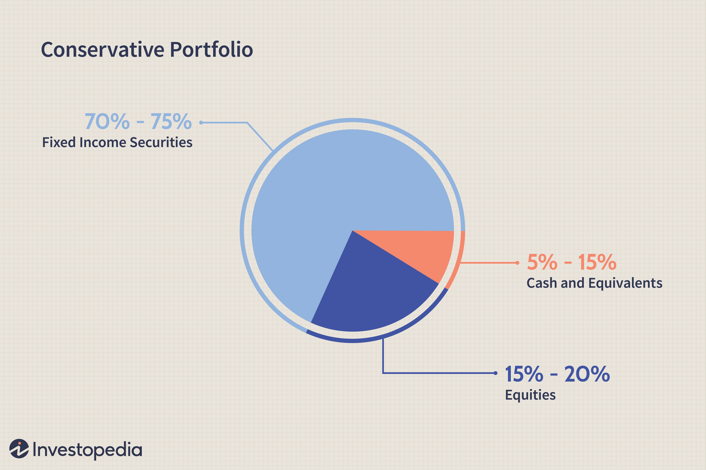

Portfolio income refers to earnings generated from investment holdings, encompassing interest, dividends, and capital gains. This form of income is a crucial component of comprehensive investment strategies, as it provides a pathway for wealth accumulation beyond regular employment earnings. By leveraging a diversified portfolio, investors can access a steady flow of income with the potential for growth over time. This diversification not only spreads risk but also enhances the overall stability of an investment portfolio. 

Diversifying income streams is essential in safeguarding against economic fluctuations and market uncertainties. An investor relying solely on a single income source may experience significant financial strain if that source diminishes or ceases. By contrast, a well-diversified portfolio that includes various asset classes such as stocks, bonds, and real estate offers multiple revenue channels, which can mitigate risks and ensure a more consistent income flow.



Algorithmic trading has emerged as a sophisticated and modern technique in managing investment portfolios. It utilizes computer algorithms to automate trading decisions and execute trades at optimal times and prices. This approach capitalizes on computational power and advanced mathematical models to analyze vast datasets, enabling quicker and more accurate decision-making than traditional manual methods. Algorithmic trading can be employed to enhance portfolio income by optimizing trading strategies for buying, holding, or selling assets, thereby maximizing returns while minimizing risks.

Incorporating algorithmic trading within a diversified investment strategy not only augments decision-making efficiency but also offers investors the potential to explore innovative income-generating methods. As technology continues to evolve, the scope for such integration will likely expand, offering promising prospects for achieving sustainable and enhanced portfolio income.

## Table of Contents

## Understanding Portfolio Income

Portfolio income is distinct from both passive and active income, each defined by the nature of their generation and involvement. Active income is generated through direct involvement, such as salaries or wages, where the individual actively participates in the work. Passive income, on the other hand, typically involves earnings without direct, continuous involvement, such as rental income or business income from a silent partnership. Portfolio income, in contrast, primarily arises from investments in financial assets, and includes earnings from dividends, interest, and capital gains.

### Components of Portfolio Income

1. **Dividends**: These are payments distributed by a corporation to its shareholders, usually derived from profits. For investors, dividends represent a direct return on their equity investment and can be a significant source of steady income, especially in dividend-focused stock strategies.

2. **Interest**: This is income earned from lending money or investing in interest-bearing accounts or bonds. Interest income is generally predictable and can provide consistent earnings, particularly from fixed-income securities like bonds or savings accounts.

3. **Capital Gains**: Capital gains occur when there is a positive difference between the purchase price and the selling price of an asset. These gains can be realized through the sale of stocks, real estate, or other appreciating assets. Capital gains can be a major component of portfolio income, significantly boosting the overall return on investment portfolios.

### Tax Advantages

Portfolio income often carries distinct tax advantages compared to other types of income. In many jurisdictions, capital gains and dividends are taxed at a lower rate than ordinary income (such as wages), which can enhance the net return on investments. Specifically:

- **Qualified Dividends**: In the United States, qualified dividends are taxed at a reduced rate, similar to long-term capital gains. For investors, this means higher after-tax returns compared to ordinary income.

- **Long-term Capital Gains**: Selling an asset held for more than a year qualifies the capital gain for reduced tax rates, providing an incentive for investing with a longer-term perspective.

Understanding the nature of portfolio income and its components allows investors to optimize their income streams, balancing between dividends, interest, and capital gains while leveraging potential tax benefits to maximize returns on their investment portfolios.

## Strategies to Generate Portfolio Income

Portfolio income generation involves several strategic approaches that enable investors to enhance their returns on investment through various means. Here, we explore different strategies that can help generate robust portfolio income.

### Invest in High-Paying Dividend Stocks

Investing in high-paying dividend stocks is a popular strategy for generating portfolio income. Dividend-paying stocks distribute a portion of a company’s earnings to shareholders, typically on a quarterly basis. Companies that consistently pay high dividends are often established and financially stable, making them attractive for income-focused investors. When selecting dividend stocks, it's important to consider the dividend yield, payout ratio, and the company's history of dividend payments. A common formula used to calculate dividend yield is:

$$
\text{Dividend Yield} = \left( \frac{\text{Annual Dividends per Share}}{\text{Price per Share}} \right) \times 100
$$

### Utilize Dividend Reinvestment Plans (DRIPs)

Dividend Reinvestment Plans (DRIPs) allow investors to reinvest their cash dividends into additional shares of the company's stock, often without paying brokerage fees. This compounding effect can significantly enhance investment returns over time. By continuously reinvesting dividends, an investor can increase their holdings, thereby potentially increasing future dividend payments. DRIPs are advantageous for long-term growth, as they harness the power of compounding without requiring additional capital outlay.

### Explore Dividend-Focused ETFs as a Diversified Approach

Dividend-focused Exchange-Traded Funds (ETFs) offer a diversified approach to investing in dividend-paying securities. These ETFs invest in a portfolio of stocks that pay dividends, spreading risk across multiple companies rather than relying on the performance of a single entity. This diversification can protect against sector-specific downturns while capitalizing on steady income from dividends. Popular dividend-focused ETFs often track indices like the S&P 500 Dividend Aristocrats, which comprises companies with a history of increasing dividends over several decades.

### Discuss Options like Covered Call Writing to Enhance Income

Covered call writing is an options strategy used to generate additional income from a stock portfolio. This involves selling call options on stocks that the investor already owns. The investor receives premiums from selling these options, which can enhance overall portfolio returns. However, this strategy may cap potential upside if the underlying stock's price significantly exceeds the option's strike price. The goal is to strike a balance between [earning](/wiki/earning-announcement) premium income and potentially realizing gains from the underlying asset.

```python
# Example of calculating covered call profit potential
def covered_call_profit(stock_price, strike_price, premium_received):
    if stock_price < strike_price:
        return premium_received
    else:
        return premium_received + (strike_price - stock_price)

# Example Usage
stock_price = 105  # Current stock price
strike_price = 110  # Option strike price
premium_received = 3  # Premium received from selling the call option

profit = covered_call_profit(stock_price, strike_price, premium_received)
print(f"Profit from covered call: ${profit}")
```

These strategies, when implemented thoughtfully, can optimize a portfolio's income generation potential while maintaining a balance between risk and reward. Investors are encouraged to consider their financial goals, risk tolerance, and market conditions when choosing the appropriate income-generating strategies for their portfolios.

## Algorithmic Trading in Investment Income

Algorithmic trading refers to the use of automated and pre-programmed trading instructions to execute trades in financial markets. These algorithms are designed to make trading decisions based on a variety of market variables, such as price, timing, and [volume](/wiki/volume-trading-strategy), without human intervention. In modern investment management, [algorithmic trading](/wiki/algorithmic-trading) plays a crucial role due to its ability to process large volumes of data, identify patterns, and execute trades with precision and speed. This tech-driven approach streamlines investment processes, allowing investors to react quickly to market changes and optimize their portfolios with minimal delay.

One significant area where algorithms are employed to enhance portfolio income is through optimizing covered call strategies. A covered call involves holding a long position in a stock while simultaneously selling a call option on the same asset. Algorithms can optimize this strategy by analyzing market trends and [volatility](/wiki/volatility-trading-strategies), determining the optimal strike prices, and executing trades at the most favorable moments. By continually assessing market conditions, algorithms can adjust positions dynamically to maximize potential income while managing risk. 

The benefits of using algorithms in covered call strategies extend beyond optimization. Algorithms reduce the impact of human error, which is prominent in manual trading. This minimizes emotional decisions and biases that often lead to suboptimal trading outcomes. Additionally, algorithms significantly enhance decision-making speed, allowing for rapid response to market trends. In volatile markets, the ability to execute trades swiftly can make a substantial difference in the realized outcome of an investment strategy.

The below Python code snippet demonstrates a simplified example of how an algorithm might select optimal strike prices for covered calls based on historical data:

```python
import numpy as np
import pandas as pd

# Simulate a DataFrame with historical stock prices
data = pd.DataFrame({
    'date': pd.date_range(start='2023-01-01', periods=100),
    'price': np.random.normal(100, 10, size=100)
})

# Parameters for covered call optimization
historical_volatility = data['price'].pct_change().std() * np.sqrt(252)
risk_free_rate = 0.01
days_to_expiry = 30

# Function to calculate Black-Scholes call option price
def call_option_price(spot, strike, volatility, time_to_expiry, risk_free_rate):
    from scipy.stats import norm
    from numpy import log, sqrt, exp

    d1 = (log(spot / strike) + (risk_free_rate + (volatility ** 2) / 2) * time_to_expiry) / (volatility * sqrt(time_to_expiry))
    d2 = d1 - volatility * sqrt(time_to_expiry)
    call_price = spot * norm.cdf(d1) - strike * exp(-risk_free_rate * time_to_expiry) * norm.cdf(d2)
    return call_price

# Determine optimal strike price
optimal_strike_prices = []
for _, row in data.iterrows():
    spot_price = row['price']
    strikes = np.arange(spot_price * 0.9, spot_price * 1.1, 1)
    call_prices = [call_option_price(spot_price, strike, historical_volatility, days_to_expiry / 365, risk_free_rate) for strike in strikes]
    optimal_strike = strikes[np.argmin(np.abs(call_prices))]
    optimal_strike_prices.append(optimal_strike)

data['optimal_strike'] = optimal_strike_prices
```

This code calculates the optimal call option strike prices based on a simplified Black-Scholes model, using historical volatility and other financial parameters. While this is a rudimentary example, actual trading algorithms would incorporate real-time data, [machine learning](/wiki/machine-learning) techniques, and advanced risk management practices to refine strategies.

In conclusion, algorithmic trading significantly enhances investment management by providing the tools for systematic analysis, precision in execution, and the ability to adjust strategies in real-time. As technology continues to advance, the reliance on algorithms in trading will likely expand, offering investors sophisticated means to generate income and manage investment portfolios effectively.

## Advantages and Disadvantages of Using Algorithms in Trading

Algorithmic trading has become a cornerstone of modern financial markets, offering numerous advantages over traditional trading methods. One of the primary benefits is its ability to significantly improve trading efficiency. Through automation, algorithmic trading allows for the execution of orders at speeds and frequencies that would be impossible for a human trader. This rapid execution enables traders to capitalize on fleeting market opportunities, thereby potentially increasing profitability.

Another significant advantage is the reduction of human error. Algorithmic systems can process large volumes of data and execute trades based on predefined criteria without the emotional biases that often affect human traders. This objectivity helps in maintaining consistency in trading strategies. Furthermore, algorithmic trading can optimize complex trading strategies like the covered call strategy. By utilizing algorithms, traders can set precise conditions under which trades are executed, ensuring that trades are made under favorable conditions.

Despite these advantages, there are notable drawbacks associated with algorithmic trading. One significant challenge is the necessity for technical expertise. Developing effective algorithms requires a deep understanding of both financial markets and programming. This requirement can be a barrier to entry for many individuals interested in algorithmic trading. Additionally, these systems require continuous monitoring and maintenance to ensure they are functioning correctly and are aligned with evolving market conditions.

The impact of algorithmic trading on market dynamics cannot be overlooked. On one hand, the increased efficiency and [liquidity](/wiki/liquidity-risk-premium) provided by algorithmic trading can lead to narrower spreads and more efficient markets. On the other hand, high-frequency trading, a subset of algorithmic trading, has been criticized for contributing to market volatility. Flash crashes—rapid, deep, and volatile falls in security prices—have been attributed to the speed and automation of algorithmic trading.

In summary, while algorithmic trading offers substantial efficiency gains and reduces human error, it also demands significant technical know-how and can affect market stability. As traders and firms continue to integrate these systems into their operations, understanding these nuances becomes crucial for maximizing the benefits while mitigating potential risks.

## Case Study: Covered Call ETFs and Algorithmic Trading

Covered Call Exchange-Traded Funds (ETFs) have emerged as a popular method for generating income in a diversified investment portfolio. These financial instruments provide investors with a unique opportunity to earn regular income while maintaining a level of exposure to potential upside in stock markets. Covered call writing involves selling call options on an existing stock position, and when incorporated into an [ETF](/wiki/etf-trading-strategies) structure, it allows for income generation through option premiums while minimizing individual stock risk.

When exploring a real-world example, the Global X Nasdaq 100 Covered Call ETF (ticker: QYLD) offers insight into how algorithmic trading can be effectively deployed within a covered call strategy. QYLD engages in writing covered call options on the Nasdaq 100 Index, effectively earning premium income, which is then distributed to investors as dividends.

Algorithmic trading plays a crucial role in optimizing the covered call strategy employed by QYLD. The use of algorithms allows for efficient monitoring and execution of trades, ensuring that call options are written effectively to maximize income while minimizing manual intervention. These algorithms are particularly useful given the sophisticated calculations involved in determining ideal strike prices and expiration dates for options to ensure optimal yield and risk management.

One of the primary performance metrics for evaluating covered call ETFs is the yield. The yield on QYLD has consistently been attractive to income-focused investors, typically ranging between 8% to 12% annually, although this can vary depending on market volatility and [interest rate](/wiki/interest-rate-trading-strategies) environments. It is important to note that the income generated by such ETFs might come with a lower participation in potential upward movement of the underlying index due to call options being exercised when stock prices rise significantly.

Another critical metric is Total Return, which considers both price appreciation and income distributions. While QYLD provides robust regular income, its total return profile can be less appealing in rapidly rising markets compared to a direct investment in the Nasdaq 100 Index, due to the capped upside from the covered call strategy.

In conclusion, covered call ETFs like QYLD demonstrate how algorithmic trading can enhance investment income strategies. While the primary advantage is consistent income through option premiums, potential downsides include capped gains and complex tax implications. Thus, investors should weigh these factors carefully, especially in the context of individual financial goals and broader investment strategy.

## Conclusion

Portfolio income strategies play a pivotal role in optimizing an investor's overall return by blending dividends, interest, and capital gains to form a robust income stream. These strategies have the advantage of tax efficiency, which can enhance real investment returns. By understanding and diversifying approaches to portfolio income, investors can create a more resilient investment portfolio capable of weathering market fluctuations and achieving long-term growth.

The integration of algorithmic trading into investment income strategies further elevates their potential. Algorithms bring precision and speed, optimizing strategies such as covered call writing to enhance income streams. Algorithmic trading minimizes human error and leverages data-driven decision-making, offering a significant competitive advantage in the fast-paced financial markets. This modern approach not only fosters efficiency but also can significantly improve trading outcomes through optimized transaction timing and pricing.

Investors are encouraged to explore and incorporate diverse income-generating investments into their portfolios. High-yield dividend stocks, dividend-focused exchange-traded funds (ETFs), and strategically employed options such as covered calls are viable components that can collectively bolster portfolio income. The versatility and adaptability provided by algorithmic trading make it an indispensable tool for maximizing these strategies.

In conclusion, understanding and executing varied portfolio income strategies with the support of algorithmic trading provides a potent pathway to financial growth. By embracing innovation and diversification, investors can more effectively pursue their financial objectives while navigating the complexities of modern financial markets.

## References & Further Reading

[1]: Bergstra, J., Bardenet, R., Bengio, Y., & Kégl, B. (2011). ["Algorithms for Hyper-Parameter Optimization."](https://dl.acm.org/doi/10.5555/2986459.2986743) Advances in Neural Information Processing Systems 24.

[2]: ["Advances in Financial Machine Learning"](https://www.amazon.com/Advances-Financial-Machine-Learning-Marcos/dp/1119482089) by Marcos Lopez de Prado

[3]: ["Evidence-Based Technical Analysis: Applying the Scientific Method and Statistical Inference to Trading Signals"](https://www.amazon.com/Evidence-Based-Technical-Analysis-Scientific-Statistical/dp/0470008741) by David Aronson

[4]: ["Machine Learning for Algorithmic Trading"](https://github.com/stefan-jansen/machine-learning-for-trading) by Stefan Jansen

[5]: ["Quantitative Trading: How to Build Your Own Algorithmic Trading Business"](https://www.amazon.com/Quantitative-Trading-Build-Algorithmic-Business/dp/1119800064) by Ernest P. Chan