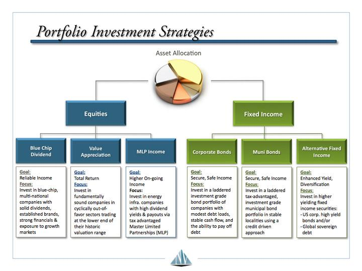

## Table of Contents

## What is portfolio income?

Portfolio income is money you earn from investments, like stocks, bonds, and mutual funds. It's different from money you earn from a job or from renting out property. When you own stocks, you might get portfolio income from dividends, which are payments companies make to their shareholders. If you own bonds, you can earn interest, which is like getting paid for lending money to the government or a company.

Portfolio income can also come from selling investments for more than you paid for them. This is called capital gains. For example, if you buy a stock for $100 and later sell it for $150, the $50 profit is portfolio income. This type of income can be important for people who want to grow their wealth over time, because it can provide a steady stream of money without having to work a regular job.

## How does portfolio income differ from earned income and passive income?

Portfolio income is money you get from investments like stocks, bonds, and mutual funds. It's different from earned income, which is the money you get from working a job. When you have a job, you earn money by trading your time and skills for a paycheck. Portfolio income, on the other hand, comes from things like dividends from stocks or interest from bonds. You don't have to work for it once you've made the investment; the money just comes to you.

Passive income is a bit different from both portfolio income and earned income. Passive income is money you earn from sources where you don't have to be actively involved every day. This can include rental income from properties or earnings from a business you own but don't manage day-to-day. While portfolio income also doesn't require daily work, it's specifically from financial investments. So, if you own a rental property, the rent you collect is passive income, not portfolio income, even though both are ways to earn money without a regular job.

Understanding these differences can help you plan how to make money in different ways. Earned income is what most people start with, but building up portfolio and passive income can help you become financially independent over time. Each type of income has its own tax rules and ways of being managed, so it's good to learn about them to make smart financial choices.

## What are common sources of portfolio income?

Portfolio income comes from different kinds of investments. One common source is dividends from stocks. When you own a piece of a company by buying its stock, that company might pay you part of its profits as dividends. Another source is interest from bonds. When you buy a bond, you're lending money to a company or the government, and they pay you interest for using your money.

Capital gains are another big source of portfolio income. This happens when you sell an investment for more than what you paid for it. For example, if you buy a stock for $50 and sell it later for $75, the $25 profit is your capital gain. You can also get portfolio income from mutual funds or exchange-traded funds (ETFs), which are collections of different investments managed by professionals. These funds can give you dividends and interest, and you can also make money by selling them at a higher price than you bought them.

Understanding these sources can help you build a good investment plan. Each type of portfolio income has its own risks and rewards, so it's important to learn about them and choose the ones that fit your goals and how much risk you're willing to take. By spreading your money across different investments, you can balance out the ups and downs and grow your wealth over time.

## Can you provide examples of investments that generate portfolio income?

One common investment that generates portfolio income is stocks. When you buy a stock, you become a part-owner of the company. If the company makes money, it might share some of that profit with you through dividends. For example, if you own shares in a company like Coca-Cola, you might get a dividend payment every few months. Another way to make money from stocks is by selling them for more than you paid. If you buy a stock for $100 and sell it later for $150, the $50 difference is your portfolio income.

Another type of investment that generates portfolio income is bonds. When you buy a bond, you're lending money to a company or the government. In return, they pay you interest. For example, if you buy a government bond that pays 2% interest, and you invest $1,000, you'll get $20 in interest each year. You can also make money from bonds by selling them for more than you paid, just like with stocks.

Mutual funds and exchange-traded funds (ETFs) are other investments that can generate portfolio income. These funds pool money from many investors to buy a mix of stocks, bonds, or other assets. They can pay out dividends and interest from the investments they hold. For example, if you invest in a mutual fund that owns a lot of different stocks, you might get dividends from those stocks. You can also make money by selling your shares in the fund for more than you paid for them.

## How can beginners start building a portfolio to generate income?

Starting to build a portfolio to generate income can seem hard at first, but it's easier than you might think. The first step is to set some money aside to invest. You don't need a lot to start; even small amounts can grow over time. A good way to begin is by opening a brokerage account, which is like a bank account but for buying and selling investments. Once you have an account, you can start looking at different kinds of investments like stocks, bonds, and mutual funds. It's a good idea to start with something simple like a low-cost index fund, which is a type of mutual fund that tries to match the performance of a part of the stock market.

After you've made your first investments, it's important to keep learning and adding to your portfolio. You can do this by setting up a plan to invest a little bit of money regularly, like every month. This is called dollar-cost averaging, and it helps you buy more shares when prices are low and fewer when prices are high. Over time, your investments can start to pay you dividends or interest, which is your portfolio income. It's also a good idea to spread your money across different types of investments to lower your risk. This is called diversification. By keeping an eye on your investments and making changes when needed, you can build a portfolio that grows and starts giving you income.

## What are the risks associated with portfolio income?

Building a portfolio to generate income can be a good way to make money, but it also comes with risks. One big risk is that the value of your investments can go down. If you buy a stock and the company does poorly, the price of the stock might drop, and you could lose money. The same thing can happen with bonds if the company or government you lent money to can't pay you back. This is called market risk, and it's something you have to be ready for when you invest.

Another risk is that you might not get as much income as you expect. For example, if you're counting on dividends from stocks, a company might decide to cut or stop paying dividends if it's not doing well. This can happen suddenly and affect your income. Also, interest rates can change, which can affect the value of bonds and the interest you earn. These changes can make it hard to plan how much money you'll get from your investments.

Understanding these risks can help you make better choices when building your portfolio. It's important to spread your money across different types of investments to lower your risk. This way, if one investment does badly, others might do well and help balance things out. By keeping an eye on your investments and being ready to make changes, you can work towards building a portfolio that gives you steady income over time.

## How can one assess the performance of a portfolio generating income?

To assess the performance of a portfolio that generates income, you need to look at a few key things. One important thing is the total return, which is how much money your portfolio has made or lost over time. This includes any dividends or interest you've earned, plus any changes in the value of your investments. You can compare this to what you expected or to how the overall market has done. Another thing to check is the yield, which is how much income your portfolio is giving you each year compared to how much you've invested. A higher yield means more income, but it can also mean more risk.

It's also helpful to look at how your portfolio is doing compared to a benchmark, like a stock market index. If your portfolio is doing better than the benchmark, that's a good sign. But if it's doing worse, you might need to make some changes. You should also think about how much risk you're taking. If your portfolio is going up and down a lot, it might be too risky. You can use something called the Sharpe ratio to see if the extra risk is worth the extra return. By keeping an eye on these things, you can see if your portfolio is doing well and make smart choices about what to do next.

## What tax considerations should be taken into account with portfolio income?

When you earn money from your investments, you have to think about taxes. Portfolio income like dividends and interest is usually taxed differently than the money you earn from a job. Dividends from stocks can be taxed at a lower rate than regular income if they are qualified dividends. Interest from bonds is usually taxed as regular income, but some bonds, like municipal bonds, might not be taxed at all. When you sell an investment for more than you paid for it, you have to pay capital gains tax. If you hold the investment for more than a year, the tax rate is usually lower than if you sell it sooner.

It's important to know about these tax rules because they can affect how much money you keep from your investments. You might want to put some of your investments in special accounts like IRAs or 401(k)s, which can help you save on taxes. In these accounts, you might not have to pay taxes on your investment income until you take the money out later, or you might not have to pay taxes at all if it's a Roth account. By understanding how taxes work with your portfolio income, you can make better choices about where to invest your money and how to keep more of what you earn.

## What strategies can be used to enhance portfolio income?

One way to boost the income from your investments is to pick stocks that pay good dividends. These are payments companies give to their shareholders. Look for companies that have a history of paying steady or growing dividends. Another way is to invest in bonds that pay higher interest. But be careful, because higher interest often means more risk. You can also put some of your money into real estate investment trusts (REITs), which are required to pay out most of their income as dividends. By choosing the right mix of these investments, you can increase the income you get from your portfolio.

Another strategy is to use dividend reinvestment plans (DRIPs). With DRIPs, instead of taking the dividend money, you use it to buy more shares of the same stock. Over time, this can help your investment grow and lead to even more dividends. You can also look into covered call options, where you own a stock and sell someone else the right to buy it from you at a set price. This can give you extra income on top of the dividends. But options can be tricky, so make sure you understand them well before you start. By using these strategies, you can work on making your portfolio income bigger and steadier.

## How does diversification impact portfolio income?

Diversification means spreading your money across different types of investments. This can help make your portfolio income more stable. If you put all your money into one stock or one kind of investment, you might get a lot of income from it, but it's risky. If that one investment does badly, your income could drop a lot. But if you have different kinds of investments, like stocks, bonds, and real estate, some might do well even if others don't. This can help keep your income steady, even when the market goes up and down.

Diversification can also help you find more ways to make money. Different investments pay income in different ways. Stocks might give you dividends, bonds can give you interest, and real estate might give you rent. By having a mix of these, you can get income from different sources. This can make your overall portfolio income higher and more reliable. So, by spreading your money around, you can lower your risk and maybe even increase your income over time.

## What advanced techniques can be used to optimize portfolio income for experienced investors?

Experienced investors can use advanced techniques like options strategies to boost their portfolio income. One popular method is selling covered calls. This means you own a stock and then sell someone else the right to buy it from you at a certain price. You get paid for this right, which adds to your income. Another option strategy is selling cash-secured puts. Here, you agree to buy a stock at a set price if it drops to that level, and you get paid for taking on this risk. These strategies can bring in extra money, but they need a good understanding of the market and come with their own risks.

Another way to optimize portfolio income is through tax management. Experienced investors can use tax-efficient investing strategies to keep more of their earnings. For example, they might put high-dividend stocks in tax-advantaged accounts like IRAs or 401(k)s to avoid paying taxes on the dividends until they withdraw the money. They can also use tax-loss harvesting, where they sell investments that have gone down in value to offset gains from other investments. This can lower their overall tax bill and increase their after-tax income. By carefully managing taxes, experienced investors can make their portfolio income go further.

## How can portfolio income be integrated into a broader financial plan?

Portfolio income can be a big part of a bigger financial plan. It's like a steady stream of money that can help you reach your goals. If you want to retire early, save for a big purchase, or just have more money to live on, portfolio income can help. You can use it to pay bills, save for the future, or even reinvest it to grow your wealth. By planning how to use your portfolio income, you can make sure it fits into your overall money strategy and helps you live the life you want.

To make the most of portfolio income in your financial plan, you need to think about your other sources of money too. This might include money from your job, savings, or passive income from things like rental properties. By balancing all these different types of income, you can create a plan that's strong and flexible. You might decide to use your portfolio income to cover regular expenses, while saving your job income for big goals. Or you could use it to pay down debt faster. The key is to look at your whole financial picture and see how portfolio income can help you reach your dreams.

## What are some strategies to generate portfolio income?

Portfolio income generation involves several strategic approaches that enable investors to enhance their returns on investment through various means. Here, we explore different strategies that can help generate robust portfolio income.

### Invest in High-Paying Dividend Stocks

Investing in high-paying dividend stocks is a popular strategy for generating portfolio income. Dividend-paying stocks distribute a portion of a company’s earnings to shareholders, typically on a quarterly basis. Companies that consistently pay high dividends are often established and financially stable, making them attractive for income-focused investors. When selecting dividend stocks, it's important to consider the dividend yield, payout ratio, and the company's history of dividend payments. A common formula used to calculate dividend yield is:

$$
\text{Dividend Yield} = \left( \frac{\text{Annual Dividends per Share}}{\text{Price per Share}} \right) \times 100
$$

### Utilize Dividend Reinvestment Plans (DRIPs)

Dividend Reinvestment Plans (DRIPs) allow investors to reinvest their cash dividends into additional shares of the company's stock, often without paying brokerage fees. This compounding effect can significantly enhance investment returns over time. By continuously reinvesting dividends, an investor can increase their holdings, thereby potentially increasing future dividend payments. DRIPs are advantageous for long-term growth, as they harness the power of compounding without requiring additional capital outlay.

### Explore Dividend-Focused ETFs as a Diversified Approach

Dividend-focused Exchange-Traded Funds (ETFs) offer a diversified approach to investing in dividend-paying securities. These ETFs invest in a portfolio of stocks that pay dividends, spreading risk across multiple companies rather than relying on the performance of a single entity. This diversification can protect against sector-specific downturns while capitalizing on steady income from dividends. Popular dividend-focused ETFs often track indices like the S&P 500 Dividend Aristocrats, which comprises companies with a history of increasing dividends over several decades.

### Discuss Options like Covered Call Writing to Enhance Income

Covered call writing is an options strategy used to generate additional income from a stock portfolio. This involves selling call options on stocks that the investor already owns. The investor receives premiums from selling these options, which can enhance overall portfolio returns. However, this strategy may cap potential upside if the underlying stock's price significantly exceeds the option's strike price. The goal is to strike a balance between [earning](/wiki/earning-announcement) premium income and potentially realizing gains from the underlying asset.

```python
# Example of calculating covered call profit potential
def covered_call_profit(stock_price, strike_price, premium_received):
    if stock_price < strike_price:
        return premium_received
    else:
        return premium_received + (strike_price - stock_price)

# Example Usage
stock_price = 105  # Current stock price
strike_price = 110  # Option strike price
premium_received = 3  # Premium received from selling the call option

profit = covered_call_profit(stock_price, strike_price, premium_received)
print(f"Profit from covered call: ${profit}")
```

These strategies, when implemented thoughtfully, can optimize a portfolio's income generation potential while maintaining a balance between risk and reward. Investors are encouraged to consider their financial goals, risk tolerance, and market conditions when choosing the appropriate income-generating strategies for their portfolios.

## References & Further Reading

[1]: Bergstra, J., Bardenet, R., Bengio, Y., & Kégl, B. (2011). ["Algorithms for Hyper-Parameter Optimization."](https://dl.acm.org/doi/10.5555/2986459.2986743) Advances in Neural Information Processing Systems 24.

[2]: ["Advances in Financial Machine Learning"](https://www.amazon.com/Advances-Financial-Machine-Learning-Marcos/dp/1119482089) by Marcos Lopez de Prado

[3]: ["Evidence-Based Technical Analysis: Applying the Scientific Method and Statistical Inference to Trading Signals"](https://www.amazon.com/Evidence-Based-Technical-Analysis-Scientific-Statistical/dp/0470008741) by David Aronson

[4]: ["Machine Learning for Algorithmic Trading"](https://github.com/stefan-jansen/machine-learning-for-trading) by Stefan Jansen

[5]: ["Quantitative Trading: How to Build Your Own Algorithmic Trading Business"](https://www.amazon.com/Quantitative-Trading-Build-Algorithmic-Business/dp/1119800064) by Ernest P. Chan