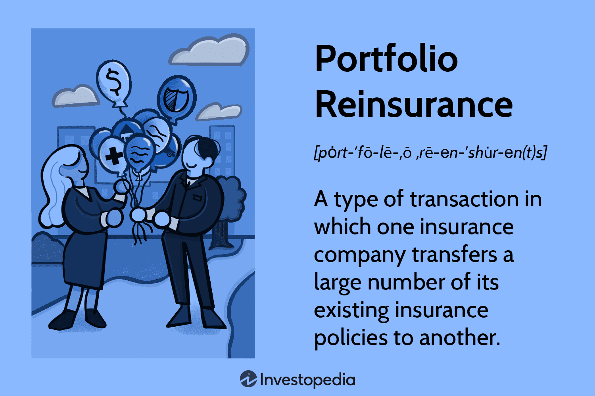

In the rapidly evolving world of finance, the integration of investment strategy, portfolio insurance, and risk management with algorithmic trading is essential for maximizing returns while minimizing risks. This multifaceted approach leverages the strengths of traditional investment principles with cutting-edge technology to create a robust framework capable of navigating complex financial markets.

Investment strategy serves as the foundational blueprint that guides decision-making processes, outlining objectives, asset allocations, and risk tolerance. Portfolio insurance provides a safety net, safeguarding investments against significant losses by using strategies such as options and futures. Risk management, a critical component of prudent investing, involves identifying, assessing, and prioritizing risks, employing tools and techniques to minimize the potential for financial loss. Together, these elements ensure that investments are aligned with investor goals while mitigating exposure to adverse market conditions.



Algorithmic trading, powered by the advancements in computing and data analytics, automates trading activities to achieve high-speed and precise execution. It reduces the impact of human emotions on trading decisions, allowing for the implementation of sophisticated strategies that can adapt to real-time market conditions. By processing vast amounts of data with speed and accuracy, algorithmic trading enables investors to capitalize on market inefficiencies and enhances the consistency of returns.

This article explores the dynamic interaction between these components and their contribution to a comprehensive investment approach. We will examine portfolio insurance and its role in cushioning against extreme market downturns, discuss the benefits and challenges of risk management techniques, and highlight the advantages of incorporating algorithmic trading into investment strategies. Our exploration covers both foundational knowledge and advanced applications, equipping investors with the insights necessary to enhance decision-making in the finance sector. By understanding and applying these tools effectively, investors can better navigate the complexities of financial markets and achieve sustainable success.

## Table of Contents

## Understanding Investment Risk

Investment risk is an inherent aspect of financial markets, consistently presenting the possibility of losses to investors. A comprehensive understanding of these risks is essential for developing strategies that align with one's financial objectives, thus mitigating potential adverse impacts. Risks in investment can be broadly categorized into two types: systematic and unsystematic.

Systematic risk, also known as market risk, is inevitable and affects the entire market. This type of risk arises from external factors that influence the overall market environment. Examples include fluctuations in interest rates, economic recessions, political instability, and changes in governmental policies. Since systematic risk impacts all securities in the market, it cannot be eliminated through diversification. Investors must therefore employ other strategies, such as hedging or asset allocation, to manage systematic risk.

In contrast, unsystematic risk, sometimes referred to as specific or idiosyncratic risk, is unique to a particular company or industry. This type of risk can be attributed to factors such as a company's management decisions, financial performance, product recalls, or changes in consumer preferences. Unlike systematic risk, unsystematic risk can often be mitigated through diversification. By investing in a wide range of assets across different industries and sectors, the negative performance of one investment can be offset by the positive performance of others, thus reducing overall risk exposure.

Understanding these categories of risks is crucial for crafting investment strategies that not only aim for potential returns but also protect the capital against unforeseen market events. Calculating metrics such as the beta coefficient, which measures the [volatility](/wiki/volatility-trading-strategies) of an asset in relation to the overall market, can help investors assess the level of systematic risk associated with a particular security. Meanwhile, standard deviation, which measures the scope of variability in an asset's returns, can provide insights into the potential unsystematic risk.

Incorporating this knowledge into the investment process enables investors to construct robust portfolios that align with their risk tolerance and financial goals. By recognizing the different types of risks and the tools available to manage them, investors are better equipped to navigate the complexities of the financial markets and strive towards achieving their desired outcomes.

## Risk Management Techniques

Risk management is a critical component in investment strategies, ensuring that returns are maximized relative to the risks undertaken. Several techniques can aid investors in assessing and managing these risks effectively.

The Sharpe Ratio is a widely-used measure that gauges the extra return earned relative to the risk-free rate per unit of risk, represented by standard deviation. The formula is expressed as:

$$
\text{Sharpe Ratio} = \frac{E[R_p - R_f]}{\sigma_p}
$$

where $E[R_p - R_f]$ is the expected portfolio return over the risk-free rate and $\sigma_p$ is the standard deviation of portfolio returns. A higher Sharpe Ratio indicates a more favorable risk-adjusted return.

R-squared, or the coefficient of determination, assesses the proportion of variance in portfolio returns that can be explained by the market. It is crucial for determining how much of a portfolio's performance can be attributed to broader market movements versus individual security risks. An R-squared value closer to 100% indicates a high correlation with the market.

Value-at-Risk (VaR) quantifies the potential loss in value of a portfolio at a specific confidence level over a defined period. VaR helps in understanding the worst-case scenario and is typically calculated for confidence levels such as 95% or 99%. VaR is given by:

$$
\text{VaR} = \text{(Historical simulation, variance-covariance, or Monte Carlo simulation techniques)}
$$

Conditional Value-at-Risk (CVaR), also known as Expected Shortfall, measures the expected loss beyond the VaR threshold. CVaR provides a more comprehensive risk assessment by predicting the average loss in extreme events, supplying additional insights into tail risks.

These tools are essential for appraising potential impacts on portfolios under varying market conditions. Employing these strategies helps to optimize portfolios, enhancing resilience and minimizing volatility. By understanding and implementing proper risk management techniques, investors can create more robust and adaptable portfolios in fluctuating markets.

## The Role of Algorithmic Trading

Algorithmic trading involves using computer algorithms to automate trading decisions, facilitating swift and efficient execution of trades based on predetermined criteria. By leveraging extensive data analysis and computational power, [algorithmic trading](/wiki/algorithmic-trading) minimizes the pitfalls associated with human emotional biases, such as fear and greed, allowing for a consistent and objective trading approach. Sophisticated algorithms can seamlessly implement complex strategies, which are often too intricate for manual trading.

One of the primary advantages is the speed at which algorithmic trading operates. The rapid execution of trades ensures that strategies are applied at the optimal moment, capitalizing on short-lived market opportunities. This swiftness is crucial in financial markets where milliseconds can make a significant difference in the profitability of trades.

While algorithmic trading offers these substantial benefits, it also poses distinct challenges. Technological risks, such as software bugs and system failures, can lead to undesirable trading outcomes or financial losses. Additionally, ensuring robust risk management frameworks is essential to safeguard against adverse market events and system errors. Effective risk management involves employing various financial metrics and stress-testing scenarios to anticipate potential disruptions.

The integration of technical and quantitative analysis in algorithmic trading enhances the precision of trade executions. Technical analysis relies on historical price data and [volume](/wiki/volume-trading-strategy) indicators to forecast future price movements. Quantitative analysis, on the other hand, uses mathematical and statistical models to identify trading opportunities. The combination of these analytical approaches enables the creation of algorithms that can adapt to diverse market conditions, thereby enhancing trading profitability.

Sample Python code to demonstrate a simple algorithmic trading strategy based on moving averages might look as follows:

```python
import pandas as pd
import numpy as np

# Create a function to calculate the moving averages
def moving_average_strategy(prices, short_window=40, long_window=100):
    signals = pd.DataFrame(index=prices.index)
    signals['price'] = prices
    signals['short_mavg'] = prices.rolling(window=short_window, min_periods=1).mean()
    signals['long_mavg'] = prices.rolling(window=long_window, min_periods=1).mean()
    signals['signal'] = 0.0

    # Create signals
    signals['signal'][short_window:] = np.where(signals['short_mavg'][short_window:] > signals['long_mavg'][short_window:], 1.0, 0.0)   

    # Generate trading orders
    signals['positions'] = signals['signal'].diff()

    return signals

# Example usage:
prices = pd.Series([/* Example price data */])
signals = moving_average_strategy(prices)
```

This code sets up a basic strategy where buy signals are generated when a short-term moving average crosses above a long-term moving average, which is a common approach in algorithmic trading to identify trend reversals. Such strategies highlight how computational techniques can be systematically applied to improve decision-making processes in markets.

## Building Robust Investment Strategies

Creating robust investment strategies requires a systematic approach that integrates technical and [fundamental analysis](/wiki/fundamental-analysis), diversification, and sophisticated risk management tools. These elements are crucial in constructing portfolios that can withstand market fluctuations and capture potential growth opportunities.

### Technical and Fundamental Analysis

Technical analysis involves examining historical price movements and trading volumes to forecast future market behavior. This method employs various indicators such as moving averages, MACD (Moving Average Convergence Divergence), and RSI (Relative Strength Index) to identify trends and potential reversal points. Fundamental analysis, on the other hand, focuses on evaluating the intrinsic value of assets by analyzing economic indicators, financial statements, and broader market conditions. A blend of these approaches provides a comprehensive view, enabling investors to make well-informed decisions.

### Diversification

Diversification is a critical component in reducing unsystematic risk, which affects individual sectors or companies. By spreading investments across various asset classes—such as equities, bonds, commodities, and real estate—and geographical regions, investors can mitigate the impact of localized market downturns while exploiting growth in different areas. The principle of diversification is often encapsulated in the adage, "Don't put all your eggs in one basket."

The effectiveness of diversification can be mathematically represented by the correlation coefficient, $\rho$. A lower correlation between asset returns indicates better diversification benefits. For instance, combining assets with a correlation coefficient close to zero can significantly reduce overall portfolio volatility.

### Backtesting Strategies

Backtesting involves applying investment strategies to historical market data to evaluate their potential profitability and risk profile. This process allows investors to test hypotheses and refine strategies before implementing them in live markets. Python, with libraries such as Pandas and Backtrader, offers robust tools for [backtesting](/wiki/backtesting). A simple backtesting skeleton in Python might look like this:

```python
import pandas as pd
import backtrader as bt

# Define a trading strategy
class TestStrategy(bt.Strategy):
    def __init__(self):
        self.sma = bt.indicators.SimpleMovingAverage(self.data, period=15)

    def next(self):
        if not self.position:  # not in the market
            if self.data.close[0] > self.sma[0]:
                self.buy()
        elif self.data.close[0] < self.sma[0]:
            self.sell()

# Set up data and run backtest
data = bt.feeds.PandasData(dataname=pd.read_csv('historical_data.csv'))
cerebro = bt.Cerebro()
cerebro.addstrategy(TestStrategy)
cerebro.adddata(data)
cerebro.run()
```

### Algorithmic Trading and Market Adaptability

Leveraging algorithmic trading can significantly enhance a strategy's adaptability to dynamic market conditions. Algorithmic systems, powered by advanced data analytics and [machine learning](/wiki/machine-learning) models, can process vast amounts of information and execute trades with precision and speed beyond human capabilities. This automation reduces emotional bias and allows for the implementation of complex strategies at scale.

Advanced machine learning techniques, such as [reinforcement learning](/wiki/reinforcement-learning), can develop adaptive systems that learn and evolve in response to market changes, ensuring that strategies remain effective over time. These algorithms continuously update their models based on new data, optimizing their performance as market dynamics shift.

In conclusion, building robust investment strategies necessitates an integration of diverse analytical methods, a well-diversified portfolio, rigorous backtesting, and the innovative application of algorithmic trading. Together, these elements can help investors navigate financial markets with greater confidence and resilience.

## Implementing Risk Mitigation in Algorithmic Trading

Risk mitigation in algorithmic trading is essential for maintaining the stability and effectiveness of trading strategies amidst the dynamic and often unpredictable nature of financial markets. To achieve this, several techniques are employed, each contributing to the robustness of trading algorithms.

One primary method is the use of circuit breakers, which act as safety measures to temporarily halt trading processes during extreme volatility. Circuit breakers help prevent significant losses by allowing the market to stabilize before resuming activities. These mechanisms are crucial in automated systems where trades are executed at extremely high speeds, potentially exacerbating market swings in the absence of human intervention.

Real-time monitoring is another critical component. Continuous tracking of market conditions and algorithmic performance enables prompt identification of anomalies or deviations from expected behavior. This monitoring is often complemented by stress-testing, a technique that subjects algorithms to hypothetical scenarios to evaluate their performance under adverse conditions. Stress-testing helps uncover potential vulnerabilities, ensuring that strategies remain resilient despite market fluctuations.

Periodic evaluation and adaptation of algorithms are vital for maintaining their effectiveness. Market conditions are ever-changing, necessitating regular updates and refinements to trading models. This process involves analyzing historical data and current market trends to adjust algorithms accordingly. Adaptive strategies ensure that algorithms do not become obsolete or ineffective in new market environments.

Incorporating learning models, such as machine learning algorithms, further enhances risk mitigation. These models can process vast amounts of data to detect patterns and make informed predictions, allowing algorithms to adapt and improve over time. For instance, reinforcement learning algorithms can be employed to continuously update trading strategies based on past performance outcomes and evolving market conditions.

Python, with its extensive libraries such as pandas for data manipulation and scikit-learn for machine learning, is often used to implement these adaptive models. Here is a simple example of how reinforcement learning might be applied in an algorithmic trading context:

```python
import numpy as np

class TradingAgent:
    def __init__(self, learning_rate=0.01, discount_factor=0.99):
        self.q_table = {}  # Stores state-action values
        self.learning_rate = learning_rate
        self.discount_factor = discount_factor

    def choose_action(self, state):
        if state not in self.q_table:
            self.q_table[state] = np.zeros(3)  # Example: Buy, sell, hold
        return np.argmax(self.q_table[state])  # Choose the best action

    def update_q_values(self, state, action, reward, next_state):
        q_current = self.q_table[state][action]
        q_next_max = np.max(self.q_table.get(next_state, np.zeros(3)))
        q_new = q_current + self.learning_rate * (reward + self.discount_factor * q_next_max - q_current)
        self.q_table[state][action] = q_new

# Usage example
agent = TradingAgent()
state = 'market_condition_uptrend'
action = agent.choose_action(state)
# Simulate reward from market
reward = 1  
next_state = 'market_condition_downtrend'
agent.update_q_values(state, action, reward, next_state)
```

In this example, a basic reinforcement learning agent is utilized to decide on stock trading actions based on market conditions, updating its strategy over time with experience. This approach highlights how learning models are integral to adaptive risk control in algorithmic trading, contributing to the resilience and optimization of trading strategies.

## Conclusion

The integration of investment strategy, portfolio insurance, and risk management with algorithmic trading enhances a comprehensive investment approach by effectively aligning these components for optimal performance. As investors aim for high returns, prioritizing risk management becomes indispensable for achieving sustainable success. Implementing robust risk management strategies not only protects portfolios from potential downturns but also enables investors to capitalize on market upswings without undue exposure to catastrophic losses.

The synthesis of traditional risk techniques with modern algorithmic tools offers a discernible advantage, especially in today's unpredictable markets. Algorithmic trading, with its capacity to analyze vast datasets at unprecedented speeds, allows investors to swiftly adapt to market conditions. This flexibility is crucial for exploiting transient opportunities that might be imperceptible through conventional methods. By leveraging algorithms, investors can mitigate emotional biases that often skew decision-making, thereby ensuring a more disciplined and objective approach to trading.

Investors must remain informed and adapt to maintain their competitive edge. Continuous education and adaptation are vital, as they enable investors to refine their strategies in response to evolving market dynamics. By consistently updating their knowledge base and technological toolkit, investors position themselves to not only endure but thrive amidst the complexities of global financial markets. This proactive stance is key to navigating and capitalizing on the opportunities inherent in volatility, thus ensuring long-term viability and growth.

## References & Further Reading

Bergstra, J., Bardenet, R., Bengio, Y., & Kégl, B. (2011). 'Algorithms for Hyper-Parameter Optimization.' This paper explores algorithms designed for optimizing hyper-parameters in machine learning models, a crucial aspect in enhancing the performance of algorithmic trading systems. Effective hyper-parameter optimization can significantly improve the predictive accuracy of trading models, allowing for more precise and profitable trading strategies.

'Advances in Financial Machine Learning' by Marcos Lopez de Prado provides a comprehensive guide to implementing machine learning techniques in finance. This book includes insights into creating more efficient trading algorithms, reducing overfitting through cross-validation, and developing better risk management protocols.

'Machine Learning for Algorithmic Trading' by Stefan Jansen offers a practical approach to applying machine learning models to trading. The book covers a wide range of topics, from data sourcing and feature engineering to developing, backtesting, and deploying trading strategies. It includes code examples and hands-on exercises, making it a valuable resource for practitioners aiming to enhance their algorithmic trading systems.

'Quantitative Trading: How to Build Your Own Algorithmic Trading Business' by Ernest P. Chan focuses on the practical aspects of starting and running a quantitative trading business. The book provides insights into strategy development, risk management, and performance evaluation, offering readers a roadmap to creating and sustaining profitable trading operations.

