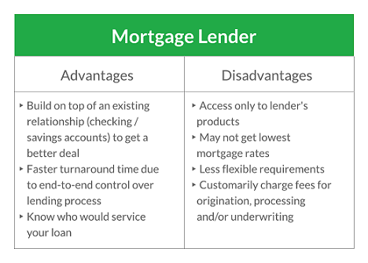

## Table of Contents

## What is a portfolio lender?

A portfolio lender is a bank or financial institution that keeps the loans it originates instead of selling them to other investors. This means that the lender holds onto the loan and manages it until it is paid off or until the borrower defaults. Because portfolio lenders keep the loans they make, they often have more flexibility in their lending criteria and can offer unique loan products that might not be available from other lenders who sell their loans on the secondary market.

For example, a portfolio lender might be more willing to approve a loan for someone with a lower credit score or for a property that doesn't meet standard guidelines. This can be beneficial for borrowers who might not qualify for loans from other institutions. However, because the lender is taking on more risk by keeping the loans, interest rates and fees might be higher than those from lenders who sell their loans.

## How does a portfolio lender differ from traditional banks?

A portfolio lender is different from traditional banks because it keeps the loans it makes instead of selling them to others. Traditional banks often sell their loans to investors or government agencies. This means that portfolio lenders have more control over their loans and can make their own rules about who gets a loan and what kind of loan they offer.

Because portfolio lenders keep their loans, they might be more willing to lend money to people who have lower credit scores or to help buy unusual properties. Traditional banks might not lend to these people because they have to follow strict rules set by investors. But, because portfolio lenders take on more risk by keeping the loans, they might charge higher interest rates or fees to make up for it.

## What types of loans do portfolio lenders typically offer?

Portfolio lenders usually offer a variety of loans that might not be available at traditional banks. They often provide loans for people who have lower credit scores or for properties that don't meet the usual standards. These can include home loans, business loans, and even loans for buying land or fixing up a house.

Because portfolio lenders keep the loans they make, they can be more flexible with their rules. This means they might offer special loan programs that help people who can't get loans from other places. But, because they take on more risk by keeping the loans, they might charge higher interest rates or fees to cover that risk.

## What are the advantages of using a portfolio lender for borrowers?

Using a portfolio lender can be a big help for borrowers who might not get a loan from a regular bank. Portfolio lenders keep the loans they make, so they can be more flexible with their rules. This means they might say yes to a loan for someone with a lower credit score or for a special kind of property that other banks won't touch. This can be a lifesaver for people who really need a loan but can't meet the strict rules of traditional banks.

However, there are some things to keep in mind. Because portfolio lenders take on more risk by keeping the loans, they might charge higher interest rates or fees. This means the loan could cost more over time. But for someone who really needs the loan and can't get it anywhere else, the higher cost might be worth it. It's all about weighing the pros and cons and seeing if a portfolio lender is the right fit for your needs.

## What are the potential disadvantages of borrowing from a portfolio lender?

One big downside of borrowing from a portfolio lender is that they might charge higher interest rates and fees. Since these lenders keep the loans they make instead of selling them, they take on more risk. To make up for this risk, they often need to charge more money. This means that over time, the loan could end up costing a lot more than if you borrowed from a traditional bank.

Another disadvantage is that not all portfolio lenders are the same. Some might have really good deals, while others might not be as trustworthy. It's important to do your homework and check out the lender before you decide to borrow from them. If you don't, you might end up with a loan that has bad terms or a lender that doesn't treat you fairly.

Overall, while portfolio lenders can be a great option for people who can't get loans from regular banks, they do come with some risks. It's a good idea to think carefully about the higher costs and make sure you're working with a reputable lender before you sign on the dotted line.

## How do portfolio lenders assess the creditworthiness of borrowers?

Portfolio lenders look at a lot of things to figure out if someone is a good bet for a loan. They don't just look at your credit score, like many traditional banks do. They also check your income, how much money you have saved up, and what you plan to do with the loan. This helps them see if you can pay back the loan, even if your credit score isn't perfect.

Because portfolio lenders keep the loans they make, they can be more flexible with their rules. They might be willing to give a loan to someone who has had some money troubles in the past, as long as they think the person can still pay it back. They might ask for more information or look at other parts of your financial life to make sure they're making a good choice.

## Can portfolio lenders offer more flexible terms than traditional banks?

Yes, portfolio lenders can offer more flexible terms than traditional banks. Because they keep the loans they make instead of selling them, they can set their own rules. This means they might be willing to give a loan to someone with a lower credit score or for a special kind of property that other banks won't touch. They can look at more than just your credit score and consider things like your income and savings to decide if you can pay back the loan.

However, this flexibility comes with a cost. Since portfolio lenders take on more risk by keeping the loans, they often charge higher interest rates or fees. This means the loan could end up costing more over time. But for someone who really needs a loan and can't get it from a traditional bank, the higher cost might be worth it if it means they can get the money they need.

## What role do portfolio lenders play in the real estate market?

Portfolio lenders are important in the real estate market because they help people buy homes who might not be able to get a loan from a regular bank. They keep the loans they make instead of selling them, which means they can be more flexible with their rules. This is really helpful for people with lower credit scores or for buying special kinds of properties that other banks won't lend money for. Because portfolio lenders can look at more than just your credit score, they might say yes to a loan if they think you can pay it back, even if you've had money troubles before.

However, using a portfolio lender can also mean paying more for the loan. Since these lenders take on more risk by keeping the loans, they often charge higher interest rates or fees. This means the loan could end up costing a lot more over time. But for someone who really needs to buy a home and can't get a loan from a traditional bank, the higher cost might be worth it. It's all about weighing the pros and cons and seeing if a portfolio lender is the right choice for your situation.

## How do interest rates from portfolio lenders compare to those of traditional banks?

Portfolio lenders often charge higher interest rates than traditional banks. This is because they keep the loans they make instead of selling them to other investors. By holding onto the loans, portfolio lenders take on more risk, so they need to charge more to cover that risk. If you borrow from a portfolio lender, you might end up paying more over time than if you got a loan from a regular bank.

However, the higher interest rates can be worth it for some people. Portfolio lenders are more flexible with their rules, so they might give a loan to someone with a lower credit score or for a special kind of property. If you can't get a loan from a traditional bank, a portfolio lender might be your only option, even if it means paying more in interest. It's all about weighing the costs and benefits to see if it's the right choice for you.

## What are the regulatory considerations for portfolio lenders?

Portfolio lenders have to follow rules just like any other bank, but they might have a bit more freedom because they keep the loans they make. They still need to follow laws set by the government, like the Truth in Lending Act, which makes sure they tell borrowers the truth about loan costs. They also have to follow rules from the Consumer Financial Protection Bureau, which protects people from unfair lending practices. But because they don't sell their loans, they might not have to follow all the strict rules that traditional banks do when they sell loans to investors.

Even though they have more freedom, portfolio lenders still need to be careful. They have to make sure they're lending money in a fair way and not taking advantage of people. If they don't follow the rules, they could get in trouble with the government. So, while they can be more flexible with their lending, they still need to make sure they're doing things the right way and treating borrowers fairly.

## How do portfolio lenders manage their risk exposure?

Portfolio lenders manage their risk exposure by being very careful about who they lend money to. They look at a lot of things, not just your credit score. They check your income, how much money you have saved up, and what you plan to do with the loan. This helps them see if you can pay back the loan, even if your credit score isn't perfect. By looking at the whole picture, they can make better decisions about who to lend money to and reduce the chance that someone won't pay them back.

Another way portfolio lenders manage risk is by charging higher interest rates and fees. Since they keep the loans they make instead of selling them, they take on more risk. To make up for this, they need to charge more money. This helps them cover the costs if someone can't pay back the loan. It's a way to balance the risk they take by being more flexible with their lending rules.

## What future trends might impact the operations of portfolio lenders?

In the future, technology will play a big role in how portfolio lenders work. They might use more computer programs to decide who gets a loan. These programs can look at a lot of information quickly and help lenders make better choices. Also, more people might want to do everything online, from applying for a loan to getting the money. This means portfolio lenders will need to have good websites and apps to keep up with what people want.

Another trend that could affect portfolio lenders is changes in the rules set by the government. If the government makes new laws about lending, portfolio lenders might have to change how they do things. They might need to be even more careful about who they lend money to or how much they charge. This could make it harder for them to be flexible with their rules, but it could also help them be fairer to borrowers. Keeping up with these changes will be important for portfolio lenders to stay successful.

## References & Further Reading

[1]: Agarwal, S., Amromin, G., Ben-David, I., Chomsisengphet, S., & Evanoff, D. D. (2010). ["The Role of Securitization in Mortgage Lending."](https://papers.ssrn.com/sol3/papers.cfm?abstract_id=1628975) Journal of Financial Economics, 97(3), 396-396.

[2]: Bennett, P. (2015). ["Portfolio Lending: The Future of Mortgage Lending?"](https://www.semanticscholar.org/paper/Applying-portfolio-theory-to-global-bank-lending-Bennett/00ff809cba5a8f4147aa740c8c88c8083f602226) Journal of Real Estate Finance and Economics, 50(3), 253-267.

[3]: Jaffee, D. M., & Quigley, J. M. (2009). ["The Future of the Government Sponsored Enterprises: The Role for Government in the U.S. Mortgage Market."](https://www.degruyter.com/document/doi/10.7208/9780226030616-011/pdf?licenseType=restricted) National Bureau of Economic Research.

[4]: Lopez de Prado, M. (2018). ["Advances in Financial Machine Learning."](https://www.amazon.com/Advances-Financial-Machine-Learning-Marcos/dp/1119482089) Wiley.

[5]: Chan, E. (2009). ["Quantitative Trading: How to Build Your Own Algorithmic Trading Business."](https://github.com/ftvision/quant_trading_echan_book) Wiley.