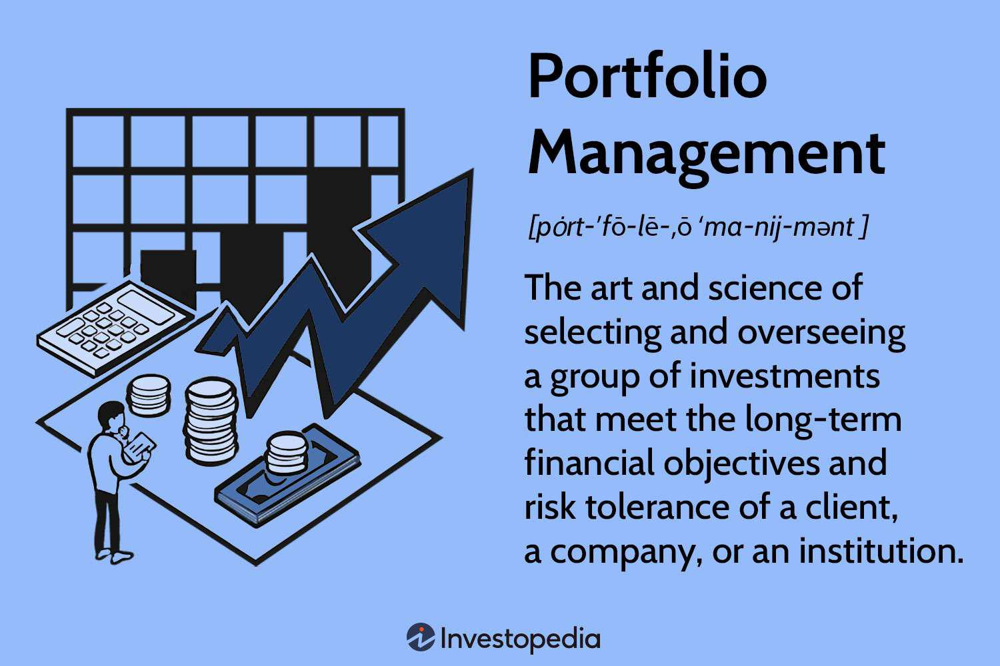

The synergy between investment strategies, financial planning, portfolio management, and algorithmic trading is essential to constructing a robust financial plan. Each component contributes distinct yet interrelated benefits that reinforce one another to achieve successful investment outcomes. Understanding and leveraging these elements can significantly enhance an investor's ability to manage wealth effectively.

Investment strategies form the foundation of any robust financial plan. These strategies represent the various methods used by investors to allocate assets and funds in a way that aligns with their financial goals and risk tolerance. Choices can range from aggressive strategies that seek high returns and involve higher risk, to conservative strategies prioritizing capital preservation. These strategies are tailored to individual profiles, ensuring that personal and financial goals are harmonized.



Financial planning is indispensable for achieving long-term financial security. It involves systematically organizing and managing financial resources through disciplined budgeting, saving, investing, and risk management. By integrating investment strategies into financial planning, individuals can optimize their financial outcomes. This integration ensures that investments are not only chosen for potential returns but also for how they fit into a holistic financial view that includes cash flow management, retirement planning, and legacy considerations.

Portfolio management acts as the operational arm that implements investment strategies. It requires ongoing management of an investment portfolio to achieve specific objectives. This entails key tasks such as asset allocation, diversification, and periodic rebalancing to align the portfolio with the investor's objectives and risk profile. There are two primary styles of portfolio management: active, which involves continuous monitoring and adjustment of investments, and passive, which seeks to replicate market indices and is generally less time-consuming.

Algorithmic trading further enhances the capabilities of investment management by employing computer algorithms to execute trading decisions at speeds and frequencies beyond human ability. This can include employing sophisticated models that utilize historical data to predict future market movements and deploy trades accordingly. The rise of algorithmic trading has introduced efficiencies in trading, reduced transaction costs, and minimized human emotion-driven errors.

In integration, these components create a comprehensive system that not only prepares investors to react to market changes but also anticipates them. Leveraging the intersection of these elements leads to more strategic decision-making and, ultimately, a financial plan that is both adaptive and resilient. Emphasizing the synergy between these elements ultimately empowers investors to achieve their financial objectives in a structured and informed manner.

## Table of Contents

## Investment Strategies

Investment strategies are systematic plans created to guide investment decisions, helping individuals and institutions achieve their financial objectives. These strategies play a crucial role in navigating the complex landscape of financial markets, as they determine how assets are allocated, how risks are managed, and how gains can be maximized. By providing a structured approach, investment strategies help investors match their financial goals with appropriate levels of risk exposure.

There are various types of investment strategies, each defined by its approach to risk and return. Aggressive investment strategies prioritize high returns, accepting higher degrees of risk and [volatility](/wiki/volatility-trading-strategies). These strategies generally involve investing in high-growth sectors like technology or emerging markets. For instance, an investor might allocate a significant portion of their portfolio to stocks with high potential for capital appreciation, even if these stocks exhibit substantial price fluctuations.

Conversely, conservative investment strategies focus on preserving capital and generating steady income with minimal risk. This typically involves investing in stable, lower-return assets such as government bonds or blue-chip stocks. Investors with a conservative approach often prioritize financial security over substantial capital gains.

Moderate investment strategies strike a balance between risk and return, incorporating elements from both aggressive and conservative approaches. This strategy typically involves diversifying a portfolio with a mix of equities and fixed-income securities. The goal is to achieve a moderate level of growth while maintaining a reasonable level of risk. 

Investment strategies can be tailored to meet individual goals and risk profiles by considering factors such as time horizon, risk tolerance, financial objectives, and market conditions. Customization is essential because each investor has unique circumstances and requirements. For example, a young investor with a long time horizon may be suited to an aggressive strategy, whereas a retiree might opt for a conservative approach to safeguard their savings.

In practice, tailoring investment strategies often involves quantitative assessments. For instance, an investor might use the Sharpe ratio to measure the potential reward for a given level of risk, thereby optimizing their asset allocation. Additionally, modern portfolio theory (MPT) offers frameworks to construct efficient portfolios that maximize returns for a given level of risk. The formula used in MPT to calculate the expected return of a portfolio is:

$$

E(R_p) = \sum_{i=1}^{n} w_i E(R_i) 
$$

Where $E(R_p)$ is the expected return of the portfolio, $w_i$ is the weight of asset $i$ in the portfolio, and $E(R_i)$ is the expected return of asset $i$. 

Through strategic planning and quantitative analysis, investment strategies enable investors to systematically pursue their financial goals while managing associated risks effectively.

## Financial Planning

Financial planning serves as a vital process in establishing and achieving long-term financial objectives. It acts as a roadmap, guiding individuals through their financial journey by aligning resources with goals. The pursuit of these long-term financial goals is structured through several key elements, each playing a distinct role in ensuring financial stability and growth.

**Key Elements of Financial Planning**

1. **Budgeting**: Budgeting forms the foundation of any financial plan. It involves creating a plan to track income and expenses, ensuring that spending does not exceed earnings. A well-maintained budget helps individuals understand their financial position and make informed decisions. This process ensures efficient allocation of resources towards essential expenditures and savings, paving the way for investment opportunities.

2. **Saving**: Saving is crucial for achieving financial goals and dealing with unexpected expenses. By setting aside a portion of income regularly, individuals can build a financial cushion that supports future endeavors such as education, property purchases, or retirement. The power of compounding, where interest earned on savings generates additional earnings, underscores the importance of saving consistently over time.

3. **Investing**: Investing involves allocating resources to various financial instruments with the expectation of generating a profit. It is a method of growing wealth over time by taking advantage of market opportunities. Different investment avenues, such as stocks, bonds, or real estate, offer varying levels of risk and return. A well-diversified investment portfolio can mitigate risks and enhance potential returns.

4. **Managing Risks**: Risk management is a crucial element of financial planning. It involves identifying financial risks and implementing strategies to protect against them, such as purchasing insurance or diversifying investment portfolios. Effective risk management ensures that unexpected events, such as health issues or market downturns, do not derail financial plans.

**Integrating Investment Strategies into Financial Planning**

Investment strategies are essential to optimizing financial outcomes within a financial plan. By aligning investment decisions with personal goals and risk tolerance, individuals can efficiently progress towards their financial objectives. Integration involves assessing the current financial situation, setting realistic investment goals, and selecting appropriate investment vehicles.

For instance, a conservative investment strategy might prioritize fixed-income securities for individuals nearing retirement, while a more aggressive approach involving equities might suit younger investors with a longer time horizon. Strategic allocation and diversification of assets help manage risk and enhance potential returns, contributing positively to the overall financial plan.

Incorporating disciplined investment strategies into the financial planning process ensures that resources are efficiently utilized and aligned with one's financial goals, ultimately leading to optimized financial success. Effective financial planning requires continuous monitoring and adjustments to stay aligned with changing circumstances and objectives.

## Portfolio Management

Portfolio management refers to the art and science of making decisions about investment mix and policy, aligning investments to objectives, asset allocation for individuals and institutions, and balancing risk against performance. The primary objective of portfolio management is to maximize returns for a given level of risk or minimize risk for a given level of expected return.

Portfolio managers employ two main strategies: passive and active management. Passive portfolio management involves simulating a specific index, thereby minimizing trading and transaction costs, and capitalizing on the market efficiency over time. It is a long-term strategy that assumes that markets are efficient and that the average investor cannot outperform them consistently over time. Investment vehicles used in passive management include index funds and exchange-traded funds (ETFs).

Conversely, active portfolio management involves ongoing trading with the aim of outperforming a specific benchmark or index. Active managers seek to capitalize on short-term price fluctuations and use a multitude of techniques, including market timing, sector rotation, and individual stock selection. This strategy assumes that market inefficiencies exist, and skilled individuals can exploit them for improved returns. However, active management often incurs higher fees and transaction costs.

Key tasks involved in portfolio management include asset allocation, diversification, and rebalancing. Asset allocation involves dividing an investment portfolio among different asset categories—such as stocks, bonds, and cash—to optimize risk-adjusted returns based on an investor’s goals, risk tolerance, and investment horizon. Diversification mitigates risk by mixing a variety of investments within a portfolio, thus reducing the impact of any single security's performance on the overall portfolio. Rebalancing refers to the process of realigning the weightings of a portfolio of assets to maintain an intended asset allocation based on changing market conditions and individual circumstances.

For example, if a portfolio initially has a target allocation of 60% stocks and 40% bonds, and the stock market subsequently outperforms the bond market, the portfolio may shift to 70% stocks and 30% bonds. In such cases, the investor might sell some stocks and buy bonds to restore the desired allocation ratio. Mathematically, this can be computed by determining the discrepancy between current and target allocations and executing trades to adjust the balance accordingly. Using Python, rebalancing operations can be performed as follows:

```python
def rebalance_portfolio(portfolio, target_allocation):
    current_value = sum(portfolio.values())
    for asset, target_percent in target_allocation.items():
        target_value = current_value * target_percent
        current_value_of_asset = portfolio.get(asset, 0)
        trade_amount = target_value - current_value_of_asset
        if trade_amount != 0:
            action = 'buy' if trade_amount > 0 else 'sell'
            print(f"{action.title()} {abs(trade_amount)} of {asset}")

# Sample portfolio and target allocation example
portfolio = {'stocks': 70000, 'bonds': 30000}
target_allocation = {'stocks': 0.6, 'bonds': 0.4}

rebalance_portfolio(portfolio, target_allocation)
```

Effective portfolio management seeks to construct a portfolio tailored to the investor's preferences and goals while applying systematic reviews and adjustments. It involves understanding both macroeconomic trends and individual financial needs to maintain a strategic advantage in a constantly evolving market environment.

## Algorithmic Trading

Algorithmic trading refers to the use of computer algorithms to automate the decision-making process and execution of trades in the financial markets. These algorithms leverage complex mathematical models and statistical techniques to identify and exploit market opportunities with high speed and precision, minimizing human intervention. The rise of [algorithmic trading](/wiki/algorithmic-trading) gained [momentum](/wiki/momentum) with the advancement of computer technology, particularly since the late 1990s, as it allowed for processing large volumes of data and executing trades at speeds far beyond human capabilities.

The integration of algorithms with investment strategies is central to achieving efficient trading. Algorithms are designed to assess market conditions, analyze trade patterns, and execute buy or sell orders almost instantaneously. An example of a basic algorithmic trading strategy is the "moving average crossover." In this strategy, buy or sell signals are triggered when a short-term moving average crosses above or below a long-term moving average. Implementing such strategies algorithmically can be done using Python as follows:

```python
import pandas as pd
import numpy as np

# Assuming data is a DataFrame with a 'Close' column for closing prices
def moving_average_crossover(data, short_window=40, long_window=100):
    signals = pd.DataFrame(index=data.index)
    signals['Signal'] = 0.0

    # Calculate short-term and long-term moving averages
    signals['Short_MA'] = data['Close'].rolling(window=short_window, min_periods=1, center=False).mean()
    signals['Long_MA'] = data['Close'].rolling(window=long_window, min_periods=1, center=False).mean()

    # Create signals
    signals['Signal'][short_window:] = np.where(signals['Short_MA'][short_window:] > signals['Long_MA'][short_window:], 1.0, 0.0)
    signals['Positions'] = signals['Signal'].diff()

    return signals
```

The benefits of algorithmic trading are numerous. First, it allows for the swift execution of trades, which is crucial in markets where prices can change in fractions of a second. Second, it eliminates human error and emotional biases, which can often negatively impact trading decisions. Third, it enables the [backtesting](/wiki/backtesting) of strategies using historical data to evaluate their effectiveness before deploying them in real market conditions.

However, algorithmic trading also presents challenges. One significant challenge is the risk of technical failures or bugs in the algorithms, which can lead to significant financial losses. Additionally, algorithmic trading can increase market volatility due to high-frequency trades executed in large volumes. Lastly, the reliance on complex models means that algorithms might not adapt well to unexpected market conditions or 'black swan' events, which are extreme and unpredictable.

In conclusion, while algorithmic trading offers greater efficiency and precision in executing investment strategies, careful oversight and robust risk management practices are essential to mitigate its inherent risks.

## Integration and Synergy

The integration of investment strategies, financial planning, portfolio management, and algorithmic trading forms a comprehensive approach to optimizing financial outcomes. Each element, while distinct in function, supports and enhances the others, creating a synergistic effect that improves the efficiency and effectiveness of investment activities.

Investment strategies provide the overarching plan for selecting financial instruments, which align with an investor's risk tolerance and financial goals. Effective financial planning uses these strategies as a foundational component, integrating them into a comprehensive plan that includes budgeting, risk management, and long-term financial objectives.

Portfolio management further refines this approach by focusing on the allocation of assets and ongoing adjustments to maintain an optimal balance in response to market conditions. Active portfolio management may involve frequent rebalancing, relying on investment strategies as a guide, while passive management takes a long-term perspective aligned with the initial strategic allocation. The key tasks of asset allocation, diversification, and rebalancing ensure that the portfolio evolves in line with the investor’s overarching strategy.

Algorithmic trading introduces the dimension of speed and precision, where predefined investment strategies can be executed automatically based on set criteria. By integrating algorithmic trading into portfolio management, trading decisions can be made rapidly and without the emotional biases that often affect human decision-making. This enhances overall efficiency by capturing market opportunities as they arise.

For example, consider a moderate investment strategy that targets a diversified portfolio of equities and bonds. Financial planning ensures that this strategy is viable for an investor's long-term goals, while portfolio management adjusts holdings to respond to economic shifts. By employing algorithmic trading, this strategy can be executed with precision, rebalancing the portfolio dynamically to maintain its intended risk-return profile.

The synergy of these components is evident in quantitative investment portfolios, where algorithms continuously optimize asset allocation based on input from financial analysts and planners. The blending of human expertise with automated precision exemplifies how effective integration can enhance decision-making, providing a robust framework for managing financial assets.

This cohesive framework not only increases efficiency but also improves risk management and returns, effectively navigating the complexities of modern financial markets. By aligning investment strategies, financial planning, portfolio management, and algorithmic trading, investors can achieve a cohesive approach that optimizes their financial outcomes, adapting seamlessly to changes in the investment landscape.

## Future Trends

The investment sector is witnessing a rapid transformation, driven largely by technological advancements reshaping how portfolios are managed and trades executed. One of the most significant emerging trends is the adoption of [artificial intelligence](/wiki/ai-artificial-intelligence) (AI) and [machine learning](/wiki/machine-learning) (ML) in investment strategies and financial planning, which promises to enhance decision-making and improve financial outcomes.

### Technology in Portfolio Management and Algorithmic Trading

Technological advancements are redefining portfolio management by introducing sophisticated tools for risk assessment, asset allocation, and real-time performance monitoring. Modern portfolio management systems utilize AI to analyze vast amounts of data, helping investors make informed decisions in a fraction of the time traditionally required. AI-driven platforms can assess market conditions, news, historical data, and economic indicators, offering recommendations that align with investors’ risk profiles and investment goals.

Algorithmic trading, which uses computer programs to automatically execute trades based on predefined criteria, is greatly benefiting from advances in AI and ML. Algorithms equipped with AI capabilities can identify trading opportunities, optimize trading strategies, and execute orders with minimal human intervention. The scalability and efficiency of such systems allow investors to capitalize on market movements more rapidly and accurately than manual trading.

### Impact of Artificial Intelligence and Machine Learning

AI and ML are revolutionizing investment strategies by enabling a more granular analysis of data to identify patterns and predictions that were previously unattainable. These technologies allow for the development of advanced predictive models that can forecast market trends, adjust investment strategies in real-time, and even simulate different market conditions to help mitigate risks.

In financial planning, AI can automate complex calculations and projections, providing personalized financial advice based on comprehensive analysis of individual financial situations. This approach not only increases the accuracy of financial plans but also makes customized financial planning more accessible.

The integration of AI and ML in investment and financial planning poses some challenges. Ensuring data quality and security, addressing ethical concerns about automated decision-making, and maintaining transparency in AI-driven recommendations are critical to gaining trust from investors.

Despite these challenges, the benefits of AI and ML in enhancing the precision, efficiency, and personalization of financial services are undeniable. As these technologies evolve, they are expected to further blur the lines between investment strategies, financial planning, portfolio management, and algorithmic trading, leading to more cohesive and interoperable financial ecosystems.

Future trends may also include increased use of natural language processing (NLP) for understanding unstructured data, such as news articles or social media commentary, and sentiment analysis to gauge market mood. The continual adaptation and improvement of algorithms based on new data inputs will further refine financial decision-making processes, making AI and ML indispensable tools in the arsenal of modern investors and financial planners.

## Conclusion

In the intricate landscape of investing, understanding how to seamlessly integrate investment strategies, financial planning, portfolio management, and algorithmic trading is pivotal for achieving optimal financial outcomes. Each component contributes a unique value to the investment process, creating a comprehensive framework that helps investors navigate market complexities. 

Investment strategies provide a structured approach to deciding what, when, and how to invest, aligned with personal risk tolerance and financial goals. Financial planning serves as the overarching guide to building and sustaining wealth, ensuring that budgeting, saving, and risk management efforts are systematically aligned to meet long-term targets. Portfolio management further refines this approach by emphasizing task-driven processes like asset allocation and diversification, which minimize risk and enhance returns.

Algorithmic trading introduces a technological edge, allowing for rapid, data-driven execution of trades, thus improving the efficiency and effectiveness of trading strategies. The synergy created by integrating these diverse elements allows for a comprehensive, well-rounded investment strategy that is resilient yet flexible enough to adapt to changing market conditions.

In conclusion, embracing this holistic approach not only empowers individual investors but also optimizes financial planning and management. By exploring and implementing these synergistic elements, investors are more likely to achieve sustained financial success, making informed decisions that enhance their overall financial well-being.

## References & Further Reading

[1]: Bergstra, J., Bardenet, R., Bengio, Y., & Kégl, B. (2011). ["Algorithms for Hyper-Parameter Optimization."](https://dl.acm.org/doi/10.5555/2986459.2986743) Advances in Neural Information Processing Systems 24.

[2]: ["Advances in Financial Machine Learning"](https://www.amazon.com/Advances-Financial-Machine-Learning-Marcos/dp/1119482089) by Marcos Lopez de Prado

[3]: ["Evidence-Based Technical Analysis: Applying the Scientific Method and Statistical Inference to Trading Signals"](https://www.amazon.com/Evidence-Based-Technical-Analysis-Scientific-Statistical/dp/0470008741) by David Aronson

[4]: ["Machine Learning for Algorithmic Trading"](https://github.com/PacktPublishing/Machine-Learning-for-Algorithmic-Trading-Second-Edition) by Stefan Jansen

[5]: ["Quantitative Trading: How to Build Your Own Algorithmic Trading Business"](https://books.google.com/books/about/Quantitative_Trading.html?id=j70yEAAAQBAJ) by Ernest P. Chan