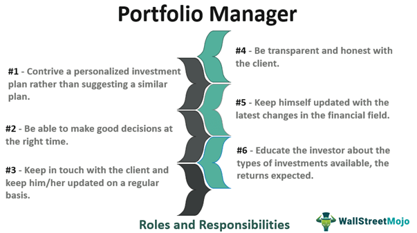

In the fast-paced world of finance, a career as a portfolio manager is both challenging and rewarding. This role is pivotal in investment management, requiring a blend of traditional financial expertise and modern technological acumen. Key among these technological advancements is algorithmic trading, which has revolutionized how investment decisions are made. Portfolio management involves balancing tried-and-true financial strategies with the latest in technological innovation, posing both a challenge and an opportunity for finance professionals.

As we explore this field, it becomes evident that understanding the intersection of traditional finance and technological developments is crucial for those aspiring to succeed. This complex landscape demands a comprehensive grasp of financial markets, risk management, and the ability to swiftly adapt to new tools and methodologies. Aspiring portfolio managers who can skillfully navigate these multifaceted challenges will find themselves well-equipped to carve out successful career paths.



Join us as we explore the essential skills, roles, and technological advancements that are driving modern portfolio management, offering insights into how professionals can thrive in this dynamic and evolving field.

## Table of Contents

## Understanding the Role of a Portfolio Manager

Portfolio managers play a pivotal role in the financial ecosystem by making investment decisions for clients or organizations. Their primary objective is to achieve optimal returns while effectively managing risk. This requires a nuanced grasp of financial markets where fluctuations and trends can significantly impact investment outcomes. An adept portfolio manager must understand asset allocation—the process of distributing investments across various asset classes, such as equities, bonds, and real estate, to optimize the risk-return profile of a portfolio.

Risk management strategies are integral to a portfolio manager's role. These strategies often involve the application of financial theories and models that predict market behavior to mitigate potential losses. For example, the use of the Capital Asset Pricing Model (CAPM) helps in determining an investment's expected return relative to its risk. The formula for CAPM is:

$$

E(R_i) = R_f + \beta_i(E(R_m) - R_f) 
$$

where $E(R_i)$ is the expected return on the investment, $R_f$ is the risk-free rate, $\beta_i$ is the investment's beta, reflecting its volatility relative to the market, and $E(R_m)$ is the expected market return.

Portfolio managers are also tasked with analyzing market trends and conducting research. This involves studying economic indicators, analyzing financial statements, and keeping abreast of geopolitical events that can influence markets. They develop investment strategies based on both quantitative models and qualitative assessments, balancing a long-term investment vision with the necessity of short-term adjustments. Successful portfolio managers possess not only robust analytical skills but also a keen sense of market timing, enabling them to capitalize on opportunities as they arise.

Incorporating technology and quantitative methods, such as [algorithmic trading](/wiki/algorithmic-trading), has enhanced the precision and efficiency of executing investment strategies. Nevertheless, the fundamental responsibilities of portfolio managers remain centered on thorough market analysis and strategic foresight, continuously navigating the complexities of financial markets to optimize portfolios and achieve client objectives.

## Investment Management: Core Concepts and Strategies

Investment management involves the professional management of various securities and assets, aiming to optimize the return on investment while mitigating risk. Central to this practice are several core strategies: asset allocation, diversification, and the choice between active and passive management.

Asset allocation is a fundamental strategy that involves distributing investments across various asset categories, such as stocks, bonds, and real estate. The primary objective is to balance risk and reward according to an investor's risk tolerance, investment goals, and time horizon. This process is often guided by the Modern Portfolio Theory (MPT), which advocates for an optimal portfolio that offers the maximum expected return for a given level of risk. This is mathematically represented by the efficient frontier, which illustrates the set of optimal portfolios that provide the highest expected return for a defined level of risk.

Diversification, another key strategy, involves spreading investments across different financial instruments, industries, and other categories to reduce exposure to any single asset or risk. The underlying principle is that a diversified portfolio is less volatile, as the performance of different assets often correlates inversely. This strategy helps manage unsystematic risk, which is specific to a particular company or industry.

The decision between active and passive management is another critical aspect of investment management. Active management involves selecting stocks and other securities to outperform the market, often relying on research, forecasting, and judgment. In contrast, passive management seeks to mirror the performance of a specific index, such as the S&P 500, by holding all or a representative sample of its securities, often resulting in lower fees and operating expenses.

Understanding the portfolio theory is crucial for effective asset management. The risk-return tradeoff is a core concept, asserting that potential return rises with an increase in risk. It denotes that investors must be willing to accept higher risk to achieve potentially higher returns, a principle that guides their investment decisions and portfolio construction.

Balancing clients' long-term goals with market conditions is essential for portfolio managers. They must align investment strategies with the financial objectives and risk tolerance of their clients while navigating economic fluctuations and market dynamics. This requires a keen understanding of economic indicators such as interest rates, inflation, and global financial events, which can significantly impact market conditions and investment performance.

Staying informed and responsive to these indicators and events is integral to successful investment management. This includes monitoring geopolitical developments, technological advancements, and regulatory changes, as these factors can have profound effects on markets worldwide.

In conclusion, investment management is a multifaceted discipline requiring a blend of strategic asset allocation, diversification, and informed decision-making between active and passive management approaches. Mastery of these concepts, alongside a sharp understanding of economic indicators and market trends, enables portfolio managers to achieve client objectives effectively while navigating the complex and ever-evolving financial landscape.

## The Rising Influence of Algorithmic Trading

Algorithmic trading, often termed "algo trading," is a transformative force in investment management, significantly enhancing trading efficiency and precision. This advanced approach employs complex mathematical models and computing power to execute trades at optimal prices and speeds, thereby reshaping how portfolio managers strategize and operate in financial markets.

Portfolio managers are increasingly incorporating algorithmic trading into their processes, as it allows for rapid execution of trades, often in milliseconds, which is essential in capitalizing on brief market opportunities that are unavailable through traditional means. Algorithms can simultaneously analyze multiple market conditions and make split-second decisions that a human trader could not; this involves leveraging historical data, market indicators, and statistical patterns to predict future price movements.

The rise of Artificial Intelligence (AI) and [machine learning](/wiki/machine-learning) has further revolutionized the field. Machine learning algorithms can adapt based on historical data, improving their predictive accuracy over time. For example, a machine learning model can be trained to predict market movements by analyzing years of past trading data, thereby continuously optimizing its trading strategy.

Here is a simple example of how algorithms might be structured in Python for [backtesting](/wiki/backtesting) a moving average crossover strategy, a common algorithmic trading strategy:

```python
import pandas as pd

# Load historical data
data = pd.read_csv("historical_data.csv")
data['MA50'] = data['Close'].rolling(window=50).mean()
data['MA200'] = data['Close'].rolling(window=200).mean()

# Define strategy conditions
data['Signal'] = 0.0
data['Signal'][50:] = np.where(data['MA50'][50:] > data['MA200'][50:], 1.0, 0.0)

data['Position'] = data['Signal'].diff()

# Output positions where a trade should occur
print(data.loc[data['Position'] != 0])
```

Despite its advantages, algorithmic trading introduces distinct risks and ethical considerations. Market risks could arise from over-reliance on algorithms, technical failures, and unforeseen market conditions. For instance, in volatile markets, algorithms might react unpredictably, exacerbating price fluctuations. Ethical issues may also emerge, such as those related to high-frequency trading ([HFT](/wiki/high-frequency-trading-strategies)), where the speed advantage can disproportionately benefit large institutional investors over individual investors, raising concerns of fairness and transparency in financial markets.

Proper regulation and oversight are crucial to managing these risks. For instance, mechanisms such as circuit breakers can temporarily halt trading to prevent market crashes triggered by algorithms. Additionally, algorithm transparency and the inclusion of ethical guidelines in their design aim to balance the incredible efficiency brought by algorithmic trading with market fairness and stability.

In conclusion, as technology continues to advance, the role of portfolio managers is evolving. The blend of traditional investment strategies with cutting-edge algorithmic techniques is not only enhancing operational efficiency but also necessitating a deeper understanding of technology among finance professionals. Proactively engaging with these technological trends is essential for successfully navigating modern financial markets.

## Essential Skills and Qualifications for Aspiring Portfolio Managers

A strong educational background is pivotal for those aspiring to become portfolio managers, with degrees in finance, economics, or business often serving as the foundational stepping stone. Understanding financial principles, economic theory, and business practices provides the essential knowledge required in this career. Moreover, professional certifications, such as the Chartered Financial Analyst (CFA) designation, are highly regarded in the industry. The CFA program covers a wide range of topics essential for portfolio management, including ethical practices, quantative methods, economics, financial reporting, and analysis of equities and fixed income.

Analytical skills are indispensable for portfolio managers, who must evaluate vast amounts of financial data, identify trends and opportunities, and develop strategies to optimize portfolio performance. Effective communication is equally important, as portfolio managers must articulate investment strategies and financial outcomes to clients and stakeholders. Decision-making prowess is critical, as portfolio managers make strategic investment choices under uncertain market conditions.

In today's technology-driven financial markets, an understanding of algorithms and data science is increasingly vital. Algorithmic trading leverages computer models to execute trades, requiring knowledge of programming and quantitative analysis. For example, Python has become a popular tool for portfolio managers due to its versatility in data analysis, algorithm development, and financial modeling:

```python
import numpy as np
import pandas as pd
from scipy.optimize import minimize

# Example of a portfolio optimization function
def portfolio_optimization(returns, target_return):
    n = len(returns.columns)
    # Function to minimize: portfolio variance
    def portfolio_variance(weights):
        cov_matrix = returns.cov()
        return np.dot(weights.T, np.dot(cov_matrix, weights))

    # Constraints: sum of weights = 1 and portfolio return = target_return
    constraints = ({'type': 'eq', 'fun': lambda weights: np.sum(weights) - 1},
                   {'type': 'eq', 'fun': lambda weights: np.sum(weights * returns.mean()) - target_return})

    # Initial guess for weights
    initial_weights = np.array([1/n] * n)

    # Bounds for weights: [0, 1] for each asset
    bounds = tuple((0, 1) for asset in range(n))

    # Minimize the portfolio variance
    optimized = minimize(portfolio_variance, initial_weights, method='SLSQP', bounds=bounds, constraints=constraints)

    return optimized.x
```

Real-world experience is invaluable, often obtained through internships or entry-level positions in financial services. These roles provide insights into market dynamics, investment processes, and client interactions, laying the groundwork for future success. Integrating this practical experience with academic knowledge and technical skills prepares aspiring portfolio managers to navigate the complexities of today's financial landscapes.

## Challenges and Opportunities in Modern Portfolio Management

The dynamic nature of financial markets represents a constant challenge for portfolio managers who must continuously adapt to evolving conditions. The modern financial landscape is characterized by rapid regulatory changes and significant market [volatility](/wiki/volatility-trading-strategies) that can affect asset values and returns. Navigating this environment requires acute awareness of policy updates and a readiness to quickly modify strategies in response to new regulations and fluctuating market conditions.

Technological advancements present both opportunities and disruptions in investment strategies. The introduction of sophisticated technologies such as blockchain, [artificial intelligence](/wiki/ai-artificial-intelligence) (AI), and machine learning has transformed traditional methods of portfolio management. These tools enable portfolio managers to process vast amounts of data and identify investment opportunities with greater precision. For instance, AI-driven algorithms can analyze market trends and economic indicators at speeds and accuracy levels unattainable by human analysts alone, leading to more informed decision-making processes.

However, the rapid evolution of technology also poses potential risks. The complexity of advanced trading systems increases the likelihood of errors and operational risks. Therefore, portfolio managers must implement robust risk management frameworks to mitigate such dangers. Additionally, the security of digital assets and privacy concerns regarding data usage necessitate stringent cybersecurity measures.

Adapting to changing client expectations and new investment products is essential for modern portfolio management. Investors today are increasingly inclined towards sustainable and socially responsible investing, prompting managers to integrate environmental, social, and governance ([ESG](/wiki/esg-investing)) criteria into their strategies. This trend requires managers to develop expertise in evaluating the impact of ESG factors on portfolio performance and aligning investment choices with clients' values and objectives.

Ultimately, continuous learning and adaptability are critical for portfolio managers aiming to excel in this swiftly changing field. Staying informed about technological advancements, regulatory changes, and shifting market dynamics is necessary. Engaging in professional development opportunities, such as attending industry conferences and obtaining relevant certifications, can enhance expertise and ensure preparedness for emerging trends. Embracing digital tools and adopting innovative approaches while maintaining strong fundamental skills will position portfolio managers for success in the ever-evolving financial sector.

## Conclusion

The role of a portfolio manager is fundamental to the financial services industry. This position requires the adept balancing of traditional investment strategies with innovative technologies, which is essential for sustaining success in today's fast-evolving financial markets. As algorithmic trading and data analysis become more prevalent, portfolio managers are tasked with integrating these advancements into their traditional practices to enhance decision-making and optimize performance.

Aspiring portfolio managers must not only have a strong grasp of core finance principles but also be proficient in the technological tools that are reshaping the industry. This dual expertise ensures that they can leverage both historical financial wisdom and modern technological advancements to craft robust investment strategies. Key skills include understanding the complexities of financial derivatives, using statistical models for predictive analysis, and employing software solutions for real-time market monitoring.

Remaining informed and adaptive is imperative for career advancement in this dynamic field. The continuous emergence of new regulations, investment products, and market conditions requires portfolio managers to be lifelong learners, always ready to adjust their strategies to stay ahead. This adaptability is critical for navigating the complexities and uncertainties of modern financial landscapes.

With dedication and the right skill set, a career in portfolio management offers significant opportunities and rewards. Those who excel can expect to not only achieve financial success for their clients but also advance within an industry that plays a vital role in shaping global economic futures. The ability to marry traditional financial acumen with cutting-edge technological insight will mark the most successful professionals in this arena.

## References & Further Reading

[1]: ["Advances in Financial Machine Learning"](https://www.amazon.com/Advances-Financial-Machine-Learning-Marcos/dp/1119482089) by Marcos Lopez de Prado

[2]: ["Evidence-Based Technical Analysis: Applying the Scientific Method and Statistical Inference to Trading Signals"](https://www.amazon.com/Evidence-Based-Technical-Analysis-Scientific-Statistical/dp/0470008741) by David Aronson

[3]: ["Machine Learning for Algorithmic Trading"](https://github.com/stefan-jansen/machine-learning-for-trading) by Stefan Jansen

[4]: ["Quantitative Trading: How to Build Your Own Algorithmic Trading Business"](https://www.amazon.com/Quantitative-Trading-Build-Algorithmic-Business/dp/1119800064) by Ernest P. Chan

[5]: Fabozzi, F. J., Focardi, S. M., & Kolm, P. N. (2006). ["Quantitative Equity Investing: Techniques and Strategies."](https://www.semanticscholar.org/paper/Quantitative-Equity-Investing%3A-Techniques-and-Fabozzi-Focardi/1c49a2a53919f7e65cb96f16691b8ff726fd3cd7) John Wiley & Sons.

[6]: Sharpe, William F. (1964). ["Capital Asset Prices: A Theory of Market Equilibrium Under Conditions of Risk,"](https://onlinelibrary.wiley.com/doi/full/10.1111/j.1540-6261.1964.tb02865.x) The Journal of Finance.

[7]: Markowitz, H. M. (1952). ["Portfolio Selection,"](https://onlinelibrary.wiley.com/doi/abs/10.1111/j.1540-6261.1952.tb01525.x) The Journal of Finance.