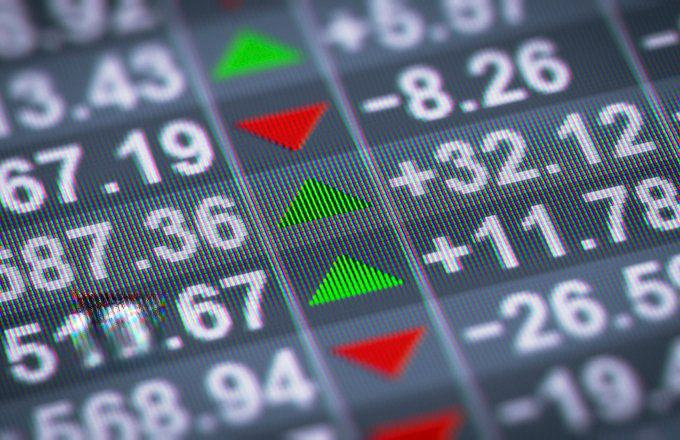

## Table of Contents

## What is portfolio margin and how does it differ from standard margin?

Portfolio margin is a way that brokers calculate the amount of money you need to have in your account to trade. It looks at the overall risk of all the investments in your portfolio, not just each one by itself. This means that if you have a mix of investments that balance each other out, you might need less money in your account than with standard margin. For example, if you own stocks and also have options that protect against those stocks losing value, the broker might see your portfolio as less risky and let you use less money as margin.

Standard margin, on the other hand, is simpler and more common. It calculates the margin requirement for each investment separately, without considering how they might affect each other. So, if you buy a stock on standard margin, the broker will ask for a certain percentage of the stock's value as margin, no matter what else you have in your portfolio. This can mean you need more money in your account overall, because the broker isn't taking into account the way different investments might balance each other out.

## What are the basic requirements to qualify for portfolio margin?

To qualify for portfolio margin, you need to have a certain amount of money in your account. Usually, this is at least $100,000, but it can vary depending on the broker. This higher amount is because portfolio margin looks at the overall risk of your investments, and the broker wants to make sure you have enough money to cover potential losses.

You also need to have experience with trading. Brokers want to make sure you know what you're doing because portfolio margin can be more complex than standard margin. They might ask you to show that you've been trading for a while or that you understand how different investments can affect each other. This helps them feel confident that you can handle the risks that come with portfolio margin.

## How does portfolio margin calculate margin requirements?

Portfolio margin calculates margin requirements by looking at the total risk of all the investments in your account, not just each one by itself. It uses computer models to figure out how much your whole portfolio could lose in a short time, like a day. If you have a mix of investments that can balance each other out, like stocks and options that protect against those stocks losing value, the portfolio margin might see your account as less risky. This means you might need less money in your account to cover potential losses.

For example, if you own a stock and also have an option that gains value if the stock goes down, these two investments can balance each other out. The portfolio margin system will see this and might ask for less money as margin than if it looked at each investment separately. This is different from standard margin, which looks at each investment on its own and doesn't consider how they might affect each other. So, with portfolio margin, you could have a lower margin requirement if your investments work well together to reduce risk.

## What types of securities are eligible for portfolio margin?

Portfolio margin can be used with many different types of securities, like stocks, options, and futures. Stocks are shares in a company, options are contracts that give you the right to buy or sell something at a certain price, and futures are agreements to buy or sell something at a future date. These securities can all be part of a portfolio that's looked at together to figure out how much money you need to have in your account.

The key thing is that the securities in your portfolio should be ones that can be easily bought and sold. This is because the portfolio margin system needs to be able to quickly figure out how much your investments could lose in a short time. So, things like stocks listed on big stock exchanges, options that are traded a lot, and futures contracts are usually okay for portfolio margin. If your investments can't be easily traded, they might not be eligible.

## Can you explain the concept of 'timing risk' in portfolio margin?

Timing risk in portfolio margin is about how quickly the value of your investments can change. When you use portfolio margin, the system looks at how much your whole portfolio could lose in a short time, like a day. If the value of your investments can change a lot in a short time, that's called timing risk. This is important because if the market moves fast, you might need to put more money into your account quickly to cover potential losses.

Brokers need to think about timing risk because it can affect how much money you need to have in your account. If your investments have a lot of timing risk, the broker might ask for more money as margin to make sure you can cover any quick changes in value. This helps protect both you and the broker from big losses if the market moves suddenly.

## How does portfolio margin handle concentrated positions?

Portfolio margin looks at the whole risk of your investments, including if you have a lot of money in just one or a few things, which is called a concentrated position. If you have a lot of money in one stock or a few stocks, it can make your portfolio riskier. This is because if that stock goes down a lot, your whole portfolio could lose a lot of value quickly. So, portfolio margin might ask for more money in your account if you have a concentrated position, to make sure you can cover any big losses.

The system uses computer models to figure out how much your portfolio could lose in a short time, like a day. If you have a concentrated position, these models will see it as more risky and might need you to have more money in your account. This is different from standard margin, which looks at each investment by itself and might not see the extra risk from having a lot of money in just one thing. So, with portfolio margin, having a concentrated position can mean you need more money as margin to cover the higher risk.

## What are the benefits of using portfolio margin over traditional margin?

Using portfolio margin can help you need less money in your account to trade. This is because it looks at all your investments together and sees how they can balance each other out. For example, if you own a stock and also have an option that protects against that stock losing value, portfolio margin might see your account as less risky. This means you might not need as much money as you would with traditional margin, which looks at each investment by itself and doesn't consider how they work together.

Another benefit is that portfolio margin can give you more flexibility in how you trade. Because it takes into account the overall risk of your portfolio, you can use different strategies to manage risk. This can be helpful if you like to use options or other complex investments. With traditional margin, you might not be able to use these strategies as easily because it doesn't look at how your investments affect each other. So, portfolio margin can let you try different ways to make money while still keeping your account safe.

## What are the risks associated with portfolio margin?

Using portfolio margin can be riskier than using traditional margin. This is because portfolio margin lets you use more of your money to trade, which means you can lose more money if things go wrong. If the market moves a lot in a short time, you might need to put more money into your account quickly to cover losses. This is called timing risk, and it can be a big problem if you don't have enough money ready to go.

Another risk is that portfolio margin can be hard to understand. It uses computer models to figure out how much money you need in your account, and these models can be complicated. If you don't know how they work, you might not realize how much risk you're taking on. This can lead to big losses if the market doesn't go the way you expect. So, it's important to really understand portfolio margin before you start using it.

## How do regulatory bodies oversee the use of portfolio margin?

Regulatory bodies like the Securities and Exchange Commission (SEC) and the Financial Industry Regulatory Authority (FINRA) watch over how brokers use portfolio margin. They make rules that brokers have to follow to make sure people using portfolio margin are safe. For example, they say that you need to have at least $100,000 in your account to use portfolio margin. They also check that brokers are telling people about the risks of using portfolio margin and that they're using the right computer models to figure out how much money people need in their accounts.

These regulatory bodies also do regular checks on brokers to make sure they're following the rules. If a broker isn't doing things right, they can get in trouble and might have to pay fines or stop offering portfolio margin. This helps keep the system fair and safe for everyone. By keeping a close eye on things, regulatory bodies help make sure that using portfolio margin doesn't lead to big problems for people or the market.

## Can you describe a real-world scenario where portfolio margin would be advantageous?

Imagine you're a trader with a diverse portfolio that includes stocks, options, and futures. You own shares in a tech company, but you're worried about a possible drop in its stock price. To protect yourself, you buy put options on the same stock. These options will gain value if the stock price goes down, which helps balance out any losses from the stock. With traditional margin, the broker would look at each of these investments separately and ask for a certain amount of money for each one. But with portfolio margin, the broker sees how the stock and the options work together to reduce risk. Because of this, you might need less money in your account to trade, giving you more flexibility to use your money for other investments.

In another scenario, you're an experienced trader who likes to use complex strategies to make money. You have a mix of stocks and options that you use to hedge against market changes. For example, you own shares in several companies and also have options that will gain value if those stocks go down. With portfolio margin, the broker can see how these investments balance each other out and might let you use less money as margin. This means you can keep more money in your account to take advantage of new trading opportunities. It's like having a safety net that lets you try different ways to make money without needing as much cash on hand.

## How does portfolio margin adapt to market volatility?

Portfolio margin changes how much money you need in your account when the market gets bumpy. It looks at how much your whole group of investments could lose in a short time, like a day. If the market is moving a lot, the computer models that figure out your margin will see that your investments could lose more value quickly. This means you might need to put more money into your account to cover the extra risk. So, if the market is really up and down, portfolio margin can ask for more money to keep things safe.

But portfolio margin also looks at how your investments can balance each other out. If you have things like stocks and options that protect against those stocks losing value, the system might see your account as less risky even when the market is volatile. This means you might not need as much extra money as you would with traditional margin, which doesn't look at how your investments work together. So, even when the market is moving a lot, portfolio margin can still let you trade with less money in your account if your investments are set up well.

## What advanced strategies can be employed with portfolio margin to optimize a trading portfolio?

With portfolio margin, you can use strategies like hedging to protect your investments. Hedging means you buy things like options that will gain value if your stocks lose value. This can help balance out any losses if the market goes down. For example, if you own a lot of shares in a company, you can buy put options on those shares. If the stock price drops, the put options will go up in value, which can help cover the losses from the stock. Portfolio margin sees how these investments work together and might let you use less money as margin, giving you more room to try different ways to make money.

Another strategy is using spreads, where you buy and sell options at different prices. This can help you make money from small changes in the market without needing a lot of money upfront. For example, you can buy a call option at one price and sell another call option at a higher price. If the stock price goes up a little, you can make money from the difference between the two options. Portfolio margin looks at the overall risk of these spreads and might let you use less money in your account, which means you can try more of these strategies without tying up all your cash.

You can also use portfolio margin to take advantage of market volatility. If you think the market will move a lot, you can use strategies like straddles or strangles. A straddle means you buy both a call option and a put option at the same price. If the market moves a lot in either direction, one of the options will gain value. A strangle is similar, but you buy the call and put options at different prices. Portfolio margin can help you use less money for these strategies because it sees how they can balance out the risk in your portfolio. This lets you try to make money from big market moves without needing as much cash in your account.

## References & Further Reading

[1]: Marcos López de Prado. ["Advances in Financial Machine Learning."](https://www.amazon.com/Advances-Financial-Machine-Learning-Marcos/dp/1119482089) Wiley, 2018.

[2]: David Aronson. ["Evidence-Based Technical Analysis: Applying the Scientific Method and Statistical Inference to Trading Signals."](https://www.amazon.com/Evidence-Based-Technical-Analysis-Scientific-Statistical/dp/0470008741) Wiley, 2006.

[3]: Stefan Jansen. ["Machine Learning for Algorithmic Trading."](https://github.com/stefan-jansen/machine-learning-for-trading) Packt Publishing, 2018.

[4]: Ernest P. Chan. ["Quantitative Trading: How to Build Your Own Algorithmic Trading Business."](https://www.amazon.com/Quantitative-Trading-Build-Algorithmic-Business/dp/0470284889) Wiley, 2009.

[5]: Joseph Rosen. ["Portfolio Margining: The New Risk Management Paradigm."](https://www.bogleheads.org/forum/viewtopic.php?t=385039) Springer Finance, 2011.