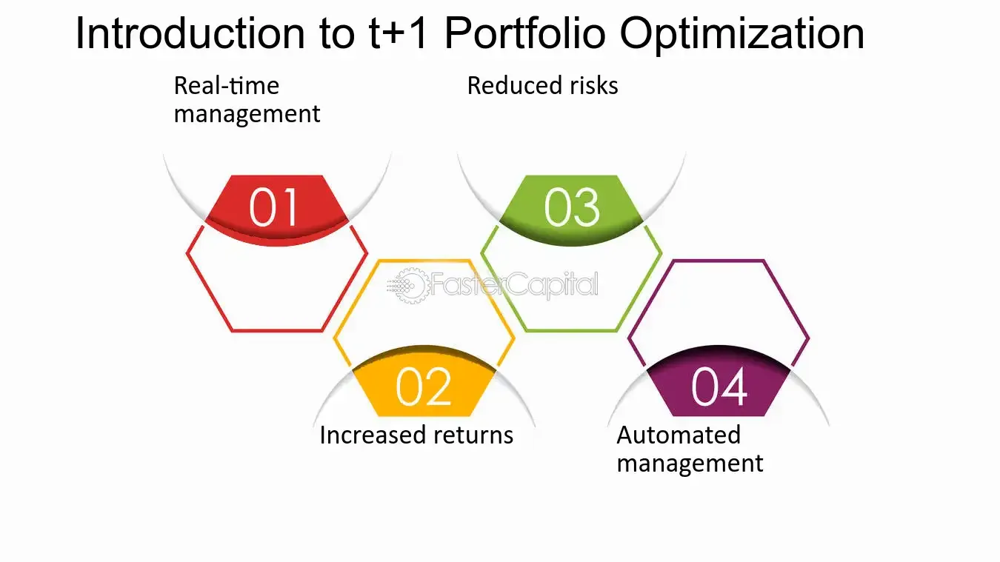

## Table of Contents

## What is portfolio optimization?

Portfolio optimization is a way to pick the best mix of investments to help you reach your financial goals while taking the least amount of risk. It's like trying to find the perfect balance in a recipe, where you want the best taste without using too many ingredients. In finance, this means choosing a combination of stocks, bonds, or other assets that will give you the highest return for the level of risk you're comfortable with.

To do portfolio optimization, people often use math and computers to figure out the best mix. They look at how different investments have performed in the past and how they might behave in the future. By studying these patterns, they can predict which combination of investments will likely give the best results. This process helps investors make smarter choices about where to put their money, aiming to grow their wealth over time without taking on too much risk.

## Why is fee reduction important in portfolio management?

Fee reduction is important in portfolio management because it helps you keep more of your money. When you invest, you often have to pay fees to people who manage your investments or to the companies where you buy your investments. These fees can add up over time, and they come right out of your returns. If you can lower these fees, you get to keep more of the money your investments earn, which can make a big difference in how much your portfolio grows over the years.

Lower fees also mean you need to earn less from your investments to reach your financial goals. For example, if you're saving for retirement, every dollar you save on fees is a dollar that stays in your account and can be invested to grow even more. Over many years, this can lead to a lot more money in your pocket. That's why smart investors pay close attention to fees and try to keep them as low as possible.

## How can beginners start optimizing their investment portfolios?

Beginners can start optimizing their investment portfolios by first understanding their own financial goals and how much risk they are willing to take. This means thinking about what they want their money to do for them, like saving for a house, retirement, or just growing their wealth. Once they know their goals, they can look at different types of investments, like stocks, bonds, or mutual funds, and see which ones fit their risk level. A good rule of thumb is to not put all your money in one place. Instead, spread it out across different types of investments to reduce risk. This is called diversification.

Next, beginners should consider using low-cost investment options. Fees can eat into your returns, so choosing investments with low fees can help keep more money in your pocket over time. Many people start with index funds or ETFs because they are often cheaper and still offer a good way to diversify. There are also tools and apps available that can help beginners manage their portfolios. These tools can suggest a mix of investments based on your goals and risk tolerance. As you learn more, you can start adjusting your portfolio to try and get the best balance of risk and return.

## What are the common fees associated with investment portfolios?

When you invest your money, you might have to pay different kinds of fees. One common fee is the management fee, which is what you pay to the people or the company that manages your investments. For example, if you invest in a mutual fund, the fund manager charges a fee for [picking](/wiki/asset-class-picking) the stocks and bonds that make up the fund. Another fee you might see is the expense ratio, which covers the costs of running the fund, like administrative costs and marketing. These fees are usually a small percentage of your total investment, but they can add up over time.

There are also transaction fees, which you pay when you buy or sell investments. If you're trading stocks, for instance, your broker might charge you a fee each time you make a trade. Some investments also come with load fees, which are charges you pay when you buy or sell certain types of funds. A front-end load is a fee you pay when you buy the investment, while a back-end load is a fee you pay when you sell it. All these fees can affect how much money you keep from your investments, so it's important to understand them and try to keep them as low as possible.

## What are the basic strategies for reducing investment fees?

One basic strategy for reducing investment fees is to choose low-cost investment options. This means looking for funds with low expense ratios, like index funds or ETFs. These types of funds often have lower fees because they just try to match the performance of a market index, rather than trying to beat it. By picking these funds, you can keep more of your money working for you instead of paying it out in fees.

Another strategy is to pay attention to transaction fees. If you're buying and selling investments a lot, those fees can add up quickly. One way to cut down on these costs is to use a broker that offers low or no transaction fees. Also, try to trade less often. The less you trade, the fewer fees you'll have to pay. This can help you save money over time and keep your investment costs down.

Lastly, be aware of any load fees when you're choosing your investments. Some funds charge a fee when you buy or sell them, and these can take a big chunk out of your money. To avoid these fees, look for no-load funds, which don't charge you for buying or selling. By steering clear of load fees and choosing low-cost, no-load investments, you can keep your investment costs low and help your portfolio grow more over time.

## How does diversification play a role in portfolio optimization?

Diversification is a key part of portfolio optimization because it helps spread out your risk. Imagine you have all your money in one company's stock. If that company does badly, you could lose a lot of money. But if you spread your money across different types of investments, like stocks, bonds, and real estate, you're less likely to lose everything at once. If one investment goes down, others might go up or stay the same, balancing things out. This way, diversification can help protect your money and make your portfolio more stable.

By having a mix of investments, you also open up more chances to make money. Different investments do well at different times. For example, when the stock market is doing great, your stocks might grow a lot. But when the stock market is down, your bonds might hold their value better. By having a bit of everything, you can take advantage of these ups and downs. This approach can help you reach your financial goals with less risk, making diversification a smart move in portfolio optimization.

## What advanced techniques can be used to optimize a portfolio?

One advanced technique for optimizing a portfolio is using modern portfolio theory (MPT). MPT helps you find the best mix of investments by looking at how they move together. It uses math to figure out which combination of stocks, bonds, and other assets will give you the highest return for the level of risk you're okay with. By studying past data and using special formulas, MPT can help you build a portfolio that balances risk and reward. This way, you can aim for the best possible returns while keeping your risk under control.

Another technique is using [factor](/wiki/factor-investing)-based investing. This means picking investments based on certain traits, like size, value, or [momentum](/wiki/momentum). By focusing on these factors, you can build a portfolio that might do better than just picking random investments. For example, you might choose stocks that are smaller or cheaper than average because they often have higher returns over time. Factor-based investing can help you fine-tune your portfolio and aim for better results by considering these special characteristics of investments.

Lastly, you can use risk parity strategies to optimize your portfolio. Risk parity means spreading your risk evenly across different types of investments. Instead of putting most of your money in stocks, which can be risky, you might balance it out with bonds and other assets. This way, no single part of your portfolio can hurt you too much if it goes down. Risk parity can help you build a more stable portfolio that can handle ups and downs in the market better, making it a smart choice for advanced investors looking to optimize their investments.

## How do robo-advisors help in reducing fees and optimizing portfolios?

Robo-advisors are computer programs that help you manage your investments. They can help you save money on fees because they usually charge less than human financial advisors. Instead of paying a big fee to a person, you pay a smaller fee to the robo-advisor. This can make a big difference over time because you get to keep more of your money. Robo-advisors often use low-cost index funds or ETFs, which also helps keep your overall investment costs down.

Robo-advisors also help with optimizing your portfolio. They use smart math and computer programs to figure out the best mix of investments for you based on your goals and how much risk you're okay with. They can automatically adjust your investments to keep them balanced and working towards your goals. This means you don't have to spend a lot of time or money trying to figure out the best way to invest. By using a robo-advisor, you can have a well-optimized portfolio without the high costs and hassle.

## What is the impact of tax considerations on portfolio optimization and fee reduction?

Taxes can have a big impact on how much money you keep from your investments. When you earn money from your investments, like from selling stocks or getting dividends, you usually have to pay taxes on that money. This can eat into your returns, just like fees do. To keep more of your money, you can use strategies like tax-loss harvesting, where you sell investments that have gone down in value to offset the taxes you owe on your gains. By doing this, you can lower your tax bill and help your portfolio grow more over time.

Another way taxes affect your portfolio is by making you think about where you put your money. Some types of accounts, like retirement accounts, have special tax benefits. For example, money in a Roth IRA grows without being taxed, and you don't pay taxes when you take it out in retirement. By putting your money in the right kind of account, you can save on taxes and keep more of your investment returns. This can make a big difference in how much your portfolio grows and helps you reach your financial goals.

## How can one measure the effectiveness of portfolio optimization strategies?

To measure how well your portfolio optimization strategies are working, you can look at your returns over time. Returns show how much your investments have grown. If your portfolio is doing better than it was before you started optimizing, that's a good sign. You can also compare your portfolio's performance to a benchmark, like a stock market index. If your portfolio is beating the benchmark, your strategies might be working well. It's important to look at these returns over a long period, like a few years, to get a clear picture.

Another way to check the effectiveness of your strategies is to see how much risk you're taking. A good optimization strategy should give you higher returns without making your portfolio much riskier. You can measure risk by looking at how much your portfolio's value goes up and down. If your portfolio is growing and not swinging wildly in value, it means your strategies are balancing risk and reward well. By keeping an eye on both returns and risk, you can tell if your portfolio optimization efforts are paying off.

## What are the latest trends in fee structures within the investment industry?

One big trend in the investment world right now is moving toward lower fees. More and more people are choosing low-cost options like index funds and ETFs because they want to keep more of their money. This has pushed many investment companies to lower their fees to stay competitive. For example, many brokers now offer zero-commission trades, which means you don't have to pay a fee every time you buy or sell a stock. This can save you a lot of money over time, especially if you trade often.

Another trend is the rise of flat-fee models. Instead of charging a percentage of your money, some advisors and robo-advisors now charge a flat fee, no matter how much you invest. This can be a good deal if you have a lot of money to invest because you end up paying less overall. It's also simpler and easier to understand than percentage-based fees. As more people look for ways to cut costs, these flat-fee models are becoming more popular in the investment industry.

## How do institutional investors approach portfolio optimization and fee reduction differently from retail investors?

Institutional investors, like big pension funds or endowments, have a lot more money to invest than regular people. Because they manage huge amounts of money, they can use fancy math and computer programs to find the best mix of investments. They can also hire teams of experts to help them. When it comes to fees, institutional investors can often get special deals because they invest so much money. They might pay lower fees than regular people, which helps them keep more of their returns. They also use strategies like tax management and risk management to make their portfolios even better.

Retail investors, or regular people, usually don't have as much money to invest. They might not have access to the same fancy tools and experts that big investors do. But they can still optimize their portfolios by using low-cost index funds or ETFs and by diversifying their investments. To reduce fees, retail investors can look for brokers that don't charge for trades and choose funds with low expense ratios. They might not get the same special deals as big investors, but they can still save money by being smart about their choices and using tools like robo-advisors to help them manage their investments.

## What is Understanding Portfolio Optimization?

Portfolio optimization is a systematic approach to maximize returns while minimizing risks within a portfolio of investments. This process entails a strategic selection of assets, taking into account the investor's risk tolerance and financial goals. The objective is to achieve the highest possible return at a given level of risk or, conversely, the lowest risk for a given level of return.

At the core of portfolio optimization lies the Modern Portfolio Theory (MPT), proposed by Harry Markowitz in the 1950s. MPT suggests that an investor can achieve optimal portfolio diversification, balancing risk and return, by considering the expected return of each asset, their variance, and the correlation between asset returns. The theory posits that risk can be minimized through diversification, and it introduces the efficient frontier—a set of optimal portfolios offering the highest expected return for a defined level of risk.

Mean-Variance Optimization (MVO) is a mathematical framework derived from MPT, which helps investors determine the portfolio composition that offers the maximum expected return for a given risk level. This is achieved by solving the optimization problem:

$$
\max_p \left( \mu_p - \frac{\lambda}{2} \sigma_p^2 \right)
$$

where $\mu_p$ is the expected return of the portfolio, $\sigma_p^2$ is the variance of the portfolio returns, and $\lambda$ is the risk aversion coefficient.

In recent years, sophisticated models and tools have further refined portfolio optimization techniques. The Black-Litterman Model is notable for integrating investor views with market equilibrium to derive expected returns, facilitating a more tailored asset allocation. This model overcomes the limitations of MVO by addressing estimation errors in expected returns and aiding in clearer investment insights.

Monte Carlo simulation is another powerful tool in portfolio optimization, providing a probabilistic analysis of potential portfolio performance. By generating a range of possible investment outcomes using random sampling, Monte Carlo simulations can evaluate the risk and return profiles of various portfolio configurations under numerous market scenarios. This allows investors to visualize potential portfolio fluctuations and optimize strategies accordingly.

Python, with its extensive libraries such as NumPy, SciPy, and pandas, is widely used for implementing these models and simulations. For example, a basic Mean-Variance Optimization in Python could be performed using libraries like PyPortfolioOpt. Here is a sample code snippet:

```python
import numpy as np
import pandas as pd
from pypfopt import EfficientFrontier, risk_models, expected_returns

# Assume historical_returns is a DataFrame of asset returns
historical_returns = pd.read_csv('historical_returns.csv')

# Calculate expected returns and sample covariance
mu = expected_returns.mean_historical_return(historical_returns)
S = risk_models.sample_cov(historical_returns)

# Optimize for maximal Sharpe ratio
ef = EfficientFrontier(mu, S)
weights = ef.max_sharpe()

# Clean weights and display the portfolio
cleaned_weights = ef.clean_weights()
print(cleaned_weights)
```

In summary, portfolio optimization involves a strategic blending of assets within a defined framework of risk and return objectives. Employing tools like the Black-Litterman Model and Monte Carlo simulation, alongside robust computational methods, investors can create efficient portfolios tailored to their risk appetite and investment goals.

## How can combining strategies enhance financial management?

Integrating various financial strategies can yield significant improvements in financial management by providing investors with enhanced diversification, cost efficiency, and responsiveness to market changes. The synergy between portfolio optimization, investment fee management, and [algorithmic trading](/wiki/algorithmic-trading) often results in an investment strategy that is well aligned with an investor's specific risk and return objectives.

**Portfolio Optimization and Diversification**

Portfolio optimization aims to create a portfolio that offers the highest expected return for a given level of risk. By integrating Modern Portfolio Theory (MPT) and tools such as the Black-Litterman Model, investors can achieve a diversified portfolio that efficiently manages risks. Diversification reduces the impact of any single asset's poor performance by spreading investment across different assets, therefore reducing unsystematic risk.

Mathematically, the optimization of a portfolio involves solving:

$$
\min_{w} \, \frac{1}{2} w^T \Sigma w - \lambda \mu^T w 
$$

subject to $\sum_{i=1}^{n} w_i = 1$; where $w$ is the vector of asset weights, $\Sigma$ is the covariance matrix of asset returns, $\mu$ is the expected return vector, and $\lambda$ represents the risk aversion parameter.

**Cost Efficiency through Fee Management**

Investment fees can erode returns over time. By understanding and managing these costs, such as expense ratios and transactional fees, investors can improve their net returns. Strategies include choosing no-load funds, employing discount brokers, and opting for passive management over active management. Passive strategies typically involve lower fees, which, compounded over time, can result in significant savings and improved portfolio performance.

**Algorithmic Trading for Responsive Trading Capabilities**

Algorithmic trading utilizes computer algorithms to execute trading decisions at speeds and frequencies that are beyond human capability. By integrating pre-set rules for trading, investors can enhance the precision and efficiency of their trading activities. Algorithms can be coded to optimize trading execution, reduce transaction costs, and manage large volumes of data more effectively. 

Python, a popular coding language in finance, can be employed to implement basic algorithmic trading strategies. For example:

```python
import numpy as np
import pandas as pd

# Calculate moving averages
data['Short_MA'] = data['Close'].rolling(window=40).mean()
data['Long_MA'] = data['Close'].rolling(window=100).mean()

# Generate trading signals
data['Signal'] = 0
data.loc[data['Short_MA'] > data['Long_MA'], 'Signal'] = 1
data.loc[data['Short_MA'] < data['Long_MA'], 'Signal'] = -1
```

This simple strategy uses moving averages to dictate buy and sell signals, enabling quick adaptation to changing market conditions without being swayed by emotional bias.

**Conclusion**

By effectively combining portfolio optimization techniques with mindful investment fee strategies and algorithmic trading, investors can create a powerful framework for financial management. This integrated approach allows for better diversification, cost-efficiency, and robust trading capabilities, while aligning the portfolio with personal risk and return preferences.

## References & Further Reading

[1]: Markowitz, H. (1952). ["Portfolio Selection."](https://onlinelibrary.wiley.com/doi/abs/10.1111/j.1540-6261.1952.tb01525.x) The Journal of Finance, 7(1), 77-91.

[2]: Black, F., & Litterman, R. (1992). ["Global Portfolio Optimization."](https://people.duke.edu/~charvey/Teaching/BA453_2006/Black_Litterman_Global_Portfolio_Optimization_1992.pdf) Financial Analysts Journal, 48(5), 28-43.

[3]: Fabozzi, F. J., & Markowitz, H. M. (2011). ["The Theory and Practice of Investment Management: Asset Allocation, Valuation, Portfolio Construction, and Strategies."](https://onlinelibrary.wiley.com/doi/book/10.1002/9781118267028) John Wiley & Sons.

[4]: Lopez de Prado, M. (2018). ["Advances in Financial Machine Learning."](https://www.amazon.com/Advances-Financial-Machine-Learning-Marcos/dp/1119482089) John Wiley & Sons.

[5]: Chan, E. P. (2009). ["Quantitative Trading: How to Build Your Own Algorithmic Trading Business."](https://github.com/ftvision/quant_trading_echan_book) John Wiley & Sons.

[6]: Jansen, S. (2020). ["Machine Learning for Algorithmic Trading - Second Edition."](https://www.amazon.com/Machine-Learning-Algorithmic-Trading-alternative-ebook/dp/B08D9SP6MB) Packt Publishing.

[7]: Bodie, Z., Kane, A., & Marcus, A. J. (2014). ["Investments."](https://www.mheducation.com/highered/product/Investments-Bodie.html) McGraw-Hill Education.

[8]: Ang, A. (2014). ["Asset Management: A Systematic Approach to Factor Investing."](https://archive.org/details/assetmanagements0000anga) Oxford University Press. 

[9]: Koller, T., Goedhart, M., & Wessels, D. (2020). ["Valuation: Measuring and Managing the Value of Companies."](https://www.mckinsey.com/capabilities/strategy-and-corporate-finance/our-insights/valuation-measuring-and-managing-the-value-of-companies) John Wiley & Sons.