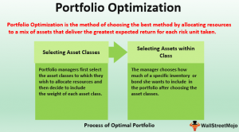

In today's rapidly changing financial environment, success hinges on adopting a blend of strategies and expert tools. At the forefront of these strategies are portfolio optimization, comprehending investment fees, and the adoption of algorithmic trading. These elements form the backbone of effective financial management.

Portfolio optimization involves constructing a portfolio that strikes a balance between risk and return, utilizing methodologies like Modern Portfolio Theory. It's not merely about asset selection; it’s about ensuring that these choices align with an investor's risk tolerance and financial goals. By employing sophisticated models such as the Black-Litterman Model and utilizing simulations like Monte Carlo, investors can design portfolios that are finely tuned to their specific objectives.



Investment fees, although often unavoidable, have a profound effect on the long-term performance of a portfolio. Understanding the structure and impact of these fees is essential for investors keen on minimizing costs and maximizing returns. Strategies to mitigate these charges include opting for no-load funds and selecting brokers that offer competitive pricing structures. Embracing passive management over active management can also substantially cut investment costs.

The integration of algorithmic trading into modern markets represents a paradigm shift towards enhanced efficiency and speed in executing trades. By encoding predefined rules into algorithms, investors can automate their trading processes, reducing emotional biases and increasing their capacity to handle large volumes of data. This technological advancement not only optimizes trade executions but also creates opportunities to enhance overall financial strategies.

This article provides an in-depth exploration of these pivotal elements, offering investors a roadmap to refine their investment approaches. By enhancing portfolio performance, curbing unnecessary expenses, and leveraging cutting-edge trading technologies, investors can effectively adapt to market dynamics and secure improved financial outcomes.

## Table of Contents

## Understanding Portfolio Optimization

Portfolio optimization is a systematic approach to maximize returns while minimizing risks within a portfolio of investments. This process entails a strategic selection of assets, taking into account the investor's risk tolerance and financial goals. The objective is to achieve the highest possible return at a given level of risk or, conversely, the lowest risk for a given level of return.

At the core of portfolio optimization lies the Modern Portfolio Theory (MPT), proposed by Harry Markowitz in the 1950s. MPT suggests that an investor can achieve optimal portfolio diversification, balancing risk and return, by considering the expected return of each asset, their variance, and the correlation between asset returns. The theory posits that risk can be minimized through diversification, and it introduces the efficient frontier—a set of optimal portfolios offering the highest expected return for a defined level of risk.

Mean-Variance Optimization (MVO) is a mathematical framework derived from MPT, which helps investors determine the portfolio composition that offers the maximum expected return for a given risk level. This is achieved by solving the optimization problem:

$$
\max_p \left( \mu_p - \frac{\lambda}{2} \sigma_p^2 \right)
$$

where $\mu_p$ is the expected return of the portfolio, $\sigma_p^2$ is the variance of the portfolio returns, and $\lambda$ is the risk aversion coefficient.

In recent years, sophisticated models and tools have further refined portfolio optimization techniques. The Black-Litterman Model is notable for integrating investor views with market equilibrium to derive expected returns, facilitating a more tailored asset allocation. This model overcomes the limitations of MVO by addressing estimation errors in expected returns and aiding in clearer investment insights.

Monte Carlo simulation is another powerful tool in portfolio optimization, providing a probabilistic analysis of potential portfolio performance. By generating a range of possible investment outcomes using random sampling, Monte Carlo simulations can evaluate the risk and return profiles of various portfolio configurations under numerous market scenarios. This allows investors to visualize potential portfolio fluctuations and optimize strategies accordingly.

Python, with its extensive libraries such as NumPy, SciPy, and pandas, is widely used for implementing these models and simulations. For example, a basic Mean-Variance Optimization in Python could be performed using libraries like PyPortfolioOpt. Here is a sample code snippet:

```python
import numpy as np
import pandas as pd
from pypfopt import EfficientFrontier, risk_models, expected_returns

# Assume historical_returns is a DataFrame of asset returns
historical_returns = pd.read_csv('historical_returns.csv')

# Calculate expected returns and sample covariance
mu = expected_returns.mean_historical_return(historical_returns)
S = risk_models.sample_cov(historical_returns)

# Optimize for maximal Sharpe ratio
ef = EfficientFrontier(mu, S)
weights = ef.max_sharpe()

# Clean weights and display the portfolio
cleaned_weights = ef.clean_weights()
print(cleaned_weights)
```

In summary, portfolio optimization involves a strategic blending of assets within a defined framework of risk and return objectives. Employing tools like the Black-Litterman Model and Monte Carlo simulation, alongside robust computational methods, investors can create efficient portfolios tailored to their risk appetite and investment goals.

## The Significance of Investment Fees

Investment fees are a pivotal element of financial management, as these costs can substantially erode portfolio gains over time. Gaining a thorough understanding of the various types of fees is essential for investors who aim to optimize their cost structure and enhance portfolio performance.

### Types of Investment Fees

1. **Expense Ratios**: These are annual fees expressed as a percentage of an investor's assets, intended to cover the operational costs of mutual funds or exchange-traded funds (ETFs). An expense ratio might seem negligible initially, such as 0.5%, but can severely impact returns over the long run due to compounding effects.

2. **Transaction Costs**: Every time securities are bought or sold, investors may incur transaction costs. These can include brokerage fees, spreads, and other charges. Frequent trading can result in higher transaction costs, which eat into returns.

3. **Load Fees**: Some mutual funds charge load fees, which are sales charges that can be imposed upfront (front-end load) or upon the sale of the fund (back-end load). These fees can deter investors from realizing their full investment gains.

4. **Management Fees**: These are charged by investment managers for managing an investor's portfolio. Active management typically incurs higher fees compared to passive strategies due to the purported expertise and frequency of trades.

### Strategies to Minimize Investment Fees

Investors can significantly reduce fees by implementing a few strategic approaches:

- **Utilizing No-Load Funds**: Opting for no-load mutual funds can eliminate sales charges, which in turn can positively impact net returns. These funds do not charge front-end or back-end sales loads, enabling investors to allocate a greater portion of their capital directly to their investments.

- **Choosing Discount Brokers**: Discount brokerage firms offer lower trade commissions compared to traditional brokers. This can be particularly advantageous for active traders or those with smaller portfolios, who are more sensitive to transaction costs.

- **Opting for Passive Management**: Engaging in passive investment strategies typically results in lower management fees. Index funds and ETFs generally track an index and involve less frequent trading, which contributes to cost savings. For instance, in Python, an investor might use a simple strategy to review the cost impact, such as this:

  ```python
  def calculate_cost_savings(active_fee, passive_fee, investment_amount):
      active_cost = investment_amount * (active_fee / 100)
      passive_cost = investment_amount * (passive_fee / 100)
      return active_cost - passive_cost

  active_fee = 1.5  # Active management fee in percentage
  passive_fee = 0.3  # Passive management fee in percentage
  investment_amount = 100000  # Example investment amount

  savings = calculate_cost_savings(active_fee, passive_fee, investment_amount)
  print(f"Cost savings by choosing passive management: ${savings:.2f}")
  ```

  This example illustrates how opting for a passive strategy can yield substantial cost savings over an active management approach.

By prudently managing investment fees, investors can enhance their overall return on investment. Understanding and mitigating these costs ensures that a larger share of investment earnings is retained, contributing to a more robust financial trajectory.

## Algorithmic Trading in Modern Markets

Algorithmic trading has transformed modern financial markets by significantly enhancing the speed and efficiency of trade execution. It involves the use of algorithms—pre-set trading rules encoded in computer programs—to make trading decisions autonomously. This automation allows for rapid decision-making and execution that would be impossible for human traders to achieve manually. 

The cornerstone of [algorithmic trading](/wiki/algorithmic-trading) is its ability to remove emotional biases that often plague human decision-making. By adhering strictly to the programmed instructions, algorithms maintain a level of objectivity and consistency in trading strategies, facilitating a systematic approach to market opportunities.

One primary advantage of algorithmic trading is increased efficiency. Algorithms can process complex market data instantly, making informed trade decisions far quicker than manual analysis would allow. This speed is crucial for capitalizing on fleeting market conditions and price discrepancies. For example, high-frequency trading ([HFT](/wiki/high-frequency-trading-strategies)) strategies, a subset of algorithmic trading, rely on executing thousands of trades in milliseconds to capture very small price differences.

The ability to manage large volumes of data is another significant benefit of algorithmic trading. Financial markets generate vast amounts of data every second, and manually analyzing this data in real-time is impractical. Algorithms can sift through these extensive datasets, identify patterns, and exploit them for trading opportunities. Techniques such as [machine learning](/wiki/machine-learning) can further refine these strategies by allowing algorithms to adapt to changing market conditions and improve over time.

Here is a simple Python example of a moving average crossover strategy, a basic form of algorithmic trading:

```python
import numpy as np
import pandas as pd

# Sample data: a DataFrame with 'Date' and 'Price' columns
data = pd.DataFrame({
    'Date': pd.date_range(start='2023-01-01', periods=10, freq='D'),
    'Price': [100, 101, 102, 103, 102, 101, 100, 99, 101, 102]
})

# Calculate moving averages
data['Short_MA'] = data['Price'].rolling(window=3).mean()
data['Long_MA'] = data['Price'].rolling(window=5).mean()

# Generate buy/sell signals
data['Signal'] = np.where(data['Short_MA'] > data['Long_MA'], 1, 0)

# Compute returns based on signals
data['Strategy_Return'] = data['Signal'].shift(1) * (data['Price'] / data['Price'].shift(1) - 1)

print(data)
```

This code demonstrates the use of moving averages to make buy or sell decisions. The strategy generates a signal to buy when the short-term moving average crosses above the long-term moving average and to sell when the opposite occurs.

In conclusion, algorithmic trading offers reduced emotional biases, enhanced efficiency, and superior data management capabilities, making it an indispensable tool in contemporary finance. By automating the trading process, algorithms enable investors to execute more precise and timely trades while reducing the impact of human error.

## Combining Strategies for Enhanced Financial Management

Integrating various financial strategies can yield significant improvements in financial management by providing investors with enhanced diversification, cost efficiency, and responsiveness to market changes. The synergy between portfolio optimization, investment fee management, and algorithmic trading often results in an investment strategy that is well aligned with an investor's specific risk and return objectives.

**Portfolio Optimization and Diversification**

Portfolio optimization aims to create a portfolio that offers the highest expected return for a given level of risk. By integrating Modern Portfolio Theory (MPT) and tools such as the Black-Litterman Model, investors can achieve a diversified portfolio that efficiently manages risks. Diversification reduces the impact of any single asset's poor performance by spreading investment across different assets, therefore reducing unsystematic risk.

Mathematically, the optimization of a portfolio involves solving:

$$
\min_{w} \, \frac{1}{2} w^T \Sigma w - \lambda \mu^T w 
$$

subject to $\sum_{i=1}^{n} w_i = 1$; where $w$ is the vector of asset weights, $\Sigma$ is the covariance matrix of asset returns, $\mu$ is the expected return vector, and $\lambda$ represents the risk aversion parameter.

**Cost Efficiency through Fee Management**

Investment fees can erode returns over time. By understanding and managing these costs, such as expense ratios and transactional fees, investors can improve their net returns. Strategies include choosing no-load funds, employing discount brokers, and opting for passive management over active management. Passive strategies typically involve lower fees, which, compounded over time, can result in significant savings and improved portfolio performance.

**Algorithmic Trading for Responsive Trading Capabilities**

Algorithmic trading utilizes computer algorithms to execute trading decisions at speeds and frequencies that are beyond human capability. By integrating pre-set rules for trading, investors can enhance the precision and efficiency of their trading activities. Algorithms can be coded to optimize trading execution, reduce transaction costs, and manage large volumes of data more effectively. 

Python, a popular coding language in finance, can be employed to implement basic algorithmic trading strategies. For example:

```python
import numpy as np
import pandas as pd

# Calculate moving averages
data['Short_MA'] = data['Close'].rolling(window=40).mean()
data['Long_MA'] = data['Close'].rolling(window=100).mean()

# Generate trading signals
data['Signal'] = 0
data.loc[data['Short_MA'] > data['Long_MA'], 'Signal'] = 1
data.loc[data['Short_MA'] < data['Long_MA'], 'Signal'] = -1
```

This simple strategy uses moving averages to dictate buy and sell signals, enabling quick adaptation to changing market conditions without being swayed by emotional bias.

**Conclusion**

By effectively combining portfolio optimization techniques with mindful investment fee strategies and algorithmic trading, investors can create a powerful framework for financial management. This integrated approach allows for better diversification, cost-efficiency, and robust trading capabilities, while aligning the portfolio with personal risk and return preferences.

## Conclusion: Achieving Financial Success

Successful financial management depends significantly on an investor's ability to optimize portfolios, minimize costs, and leverage the capabilities of modern trading technologies. These elements together create a robust investment framework that can adapt to changing market conditions and capitalize on opportunities.

A sound portfolio optimization strategy is essential for managing the trade-off between risk and return. By employing techniques such as Mean-Variance Optimization, investors strive to create a balanced portfolio that aligns with their risk tolerance while seeking to maximize expected returns. Moreover, tools like the Black-Litterman Model can refine asset allocation strategies by incorporating market views, and Monte Carlo simulations can model various financial scenarios to assess potential outcomes.

Minimizing costs is another crucial aspect of successful financial management. Investment fees, including expense ratios and transaction costs, can erode returns over time. Adopting strategies to reduce fees, such as selecting no-load funds, engaging discount brokers, or opting for passive investment approaches, can enhance net performance. By being cost-conscious and leveraging efficient investment vehicles, investors can retain more of their capital for compounding and growth.

Modern trading technologies, particularly algorithmic trading, represent a powerful ally for investors seeking to maximize efficiency and effectiveness. By automating trading decisions through pre-defined rules, investors can reduce emotional biases and execute trades with precision and speed. The ability to process and analyze large volumes of market data rapidly provides a competitive edge, enhancing strategic flexibility and decision-making prowess.

The synthesis of these strategies and tools can significantly improve an investor's market position and financial outcomes. Continuous learning and adaptation remain paramount in responding to the ever-evolving financial landscape. By staying informed about the latest advancements and refining their strategies, investors can sustain long-term success and meet their financial goals in a dynamic market environment.

## References & Further Reading

[1]: Markowitz, H. (1952). ["Portfolio Selection."](https://onlinelibrary.wiley.com/doi/abs/10.1111/j.1540-6261.1952.tb01525.x) The Journal of Finance, 7(1), 77-91.

[2]: Black, F., & Litterman, R. (1992). ["Global Portfolio Optimization."](https://people.duke.edu/~charvey/Teaching/BA453_2006/Black_Litterman_Global_Portfolio_Optimization_1992.pdf) Financial Analysts Journal, 48(5), 28-43.

[3]: Fabozzi, F. J., & Markowitz, H. M. (2011). ["The Theory and Practice of Investment Management: Asset Allocation, Valuation, Portfolio Construction, and Strategies."](https://onlinelibrary.wiley.com/doi/book/10.1002/9781118267028) John Wiley & Sons.

[4]: Lopez de Prado, M. (2018). ["Advances in Financial Machine Learning."](https://www.amazon.com/Advances-Financial-Machine-Learning-Marcos/dp/1119482089) John Wiley & Sons.

[5]: Chan, E. P. (2009). ["Quantitative Trading: How to Build Your Own Algorithmic Trading Business."](https://github.com/ftvision/quant_trading_echan_book) John Wiley & Sons.

[6]: Jansen, S. (2020). ["Machine Learning for Algorithmic Trading - Second Edition."](https://www.amazon.com/Machine-Learning-Algorithmic-Trading-alternative-ebook/dp/B08D9SP6MB) Packt Publishing.

[7]: Bodie, Z., Kane, A., & Marcus, A. J. (2014). ["Investments."](https://www.mheducation.com/highered/product/Investments-Bodie.html) McGraw-Hill Education.

[8]: Ang, A. (2014). ["Asset Management: A Systematic Approach to Factor Investing."](https://archive.org/details/assetmanagements0000anga) Oxford University Press. 

[9]: Koller, T., Goedhart, M., & Wessels, D. (2020). ["Valuation: Measuring and Managing the Value of Companies."](https://www.mckinsey.com/capabilities/strategy-and-corporate-finance/our-insights/valuation-measuring-and-managing-the-value-of-companies) John Wiley & Sons.