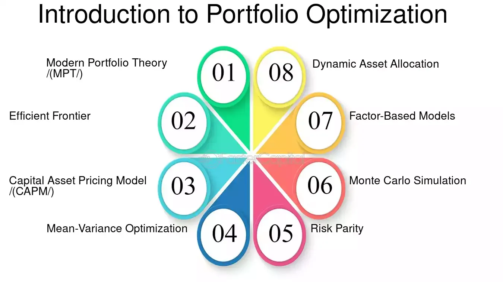

## Table of Contents

## What is portfolio optimization?

Portfolio optimization is a way to pick the best mix of investments to help you reach your financial goals while keeping risks in check. Imagine you have a basket where you can put different types of fruits. You want to fill this basket in a way that gives you the tastiest mix of fruits without overloading it with too many of one kind, which might spoil faster or not be as enjoyable. In the world of investments, your basket is your portfolio, and the fruits are different assets like stocks, bonds, and real estate. The goal is to find the right balance that maximizes your returns while minimizing your risks.

To do portfolio optimization, people often use math and computer models to figure out the best mix. They look at how different investments have performed in the past and how they might perform in the future. They also consider how these investments move together – if one goes up when another goes down, that can help balance out the risks. By using these tools and data, investors can make smarter choices about where to put their money, aiming to get the best possible results without taking on too much risk. It's like planning a balanced diet for your finances to keep them healthy and growing.

## Why is portfolio optimization important for investors?

Portfolio optimization is important for investors because it helps them make the most out of their money while keeping risks under control. Imagine you're trying to grow a garden. You want to plant a mix of flowers and vegetables that will give you the best results. If you plant too many of one type, your garden might not be as healthy or productive. Similarly, with investments, you want a mix that will give you good returns without putting all your eggs in one basket. By using portfolio optimization, investors can figure out the best way to spread their money across different types of investments, like stocks, bonds, and real estate, to achieve their financial goals.

Another reason portfolio optimization is important is that it helps investors adapt to changes in the market. The world of investing is always changing, with new opportunities and risks popping up all the time. Just like how you might need to adjust your garden based on the weather or the season, investors need to adjust their portfolios too. By regularly reviewing and optimizing their portfolio, investors can stay on top of these changes and make sure their investments are still working hard for them. This way, they can keep their financial garden healthy and growing, no matter what the market throws their way.

## What are the basic principles of portfolio optimization?

Portfolio optimization is all about finding the best mix of investments to help you reach your financial goals while keeping risks in check. It's like making a recipe where you want the dish to taste good but also be healthy. You need to balance different ingredients, or in this case, different types of investments like stocks, bonds, and real estate. The main idea is to pick investments that work well together. If one investment goes down, another might go up, which helps balance out the risk. By spreading your money across different investments, you can reduce the chance that a single bad investment will hurt your whole portfolio.

Another key principle of portfolio optimization is understanding how much risk you're willing to take. Everyone has different comfort levels with risk, and this affects how you should build your portfolio. If you're okay with taking more risks, you might put more money into stocks, which can go up and down a lot but also offer bigger rewards. If you want to play it safer, you might lean more towards bonds, which are usually more stable but offer smaller returns. By figuring out your risk tolerance, you can tailor your portfolio to match your personal financial goals and sleep better at night knowing your investments are set up the way you want them to be.

## How does Modern Portfolio Theory (MPT) relate to portfolio optimization?

Modern Portfolio Theory (MPT) is like a roadmap for portfolio optimization. It was created by Harry Markowitz in the 1950s and helps investors understand how to balance their investments to get the best returns for the amount of risk they're willing to take. MPT says that it's not just about [picking](/wiki/asset-class-picking) the best individual investments, but about how they all work together. By choosing a mix of investments that don't all move in the same way, you can lower your overall risk without giving up potential rewards. This is called diversification, and it's a key part of portfolio optimization.

In MPT, there's something called the efficient frontier, which is like a line on a graph that shows the best possible portfolios. Portfolios on this line give you the highest return for a given level of risk, or the lowest risk for a given level of return. By using MPT, investors can find their spot on this line that matches their own comfort with risk. This helps them build a portfolio that's optimized for their needs, making it a very important tool in the world of investing.

## What is the difference between strategic and tactical asset allocation in portfolio optimization?

Strategic asset allocation is like setting a long-term plan for your investments. It's about deciding how much of your money you want to put into different types of investments, like stocks, bonds, and real estate, based on your goals and how much risk you're okay with. Once you set this plan, you usually stick with it for a long time, maybe years or even decades. It's like planning a garden and deciding how much space you want for flowers, vegetables, and trees. You check on it now and then, but you don't change the plan every day.

Tactical asset allocation, on the other hand, is more like making short-term adjustments to your investment plan. It's about taking advantage of what's happening in the market right now. If you see that stocks are doing really well, you might decide to put more money into them for a little while. Or if you think the market might go down, you might move some money into safer investments. It's like seeing that it's going to rain, so you quickly move some of your plants under cover. Tactical asset allocation lets you try to get a bit more out of your investments by reacting to what's happening around you.

## What are the most common portfolio optimization methods for beginners?

For beginners, one of the most common portfolio optimization methods is to start with a simple diversified portfolio. This means spreading your money across different types of investments, like stocks and bonds, to reduce risk. A popular way to do this is to use a mix of low-cost index funds or ETFs. Index funds track a broad market index, like the S&P 500, and they're a great way to get exposure to a lot of different companies without having to pick individual stocks. By putting some money into a stock index fund and some into a bond index fund, you can create a balanced portfolio that's easy to manage and doesn't require a lot of time or expertise.

Another common method for beginners is to use a target-date fund. These funds are designed for people saving for a specific goal, like retirement. You pick a fund with a date that's close to when you want to use the money, and the fund managers will automatically adjust the mix of investments as you get closer to that date. Early on, the fund might have more stocks, which can grow faster but are riskier. As the target date approaches, it will shift more towards bonds, which are safer but grow more slowly. This method takes a lot of the guesswork out of portfolio optimization and can be a good choice if you're not sure how to balance your investments on your own.

## How can risk be quantified and managed in portfolio optimization?

Risk in portfolio optimization can be quantified using measures like standard deviation, which shows how much the returns of an investment can go up and down. Another way is to look at beta, which tells you how much an investment moves compared to the overall market. For example, if a stock has a beta of 1.5, it's likely to go up or down 50% more than the market. By understanding these numbers, investors can see how risky their portfolio is and make smarter choices about where to put their money.

Managing risk in a portfolio is all about balancing different types of investments. One way to do this is through diversification, which means spreading your money across different assets like stocks, bonds, and real estate. If one type of investment goes down, another might go up, which can help balance out the risk. Another way to manage risk is by using asset allocation, which is deciding how much of your money to put into each type of investment based on your goals and how much risk you're okay with. By regularly checking and adjusting your portfolio, you can keep your risk at a level that feels right for you.

## What role do correlation and diversification play in optimizing a portfolio?

Correlation and diversification are key parts of making your investment portfolio better. Correlation is about how different investments move together. If two investments go up and down at the same time, they have a high correlation. If one goes up when the other goes down, they have a low correlation. By picking investments that don't all move the same way, you can lower your risk. It's like having a team where not everyone gets sick at the same time, so the team can keep going strong.

Diversification is all about spreading your money across different types of investments. Instead of putting all your money into one stock or one type of investment, you spread it out. This way, if one investment does badly, the others might do well and balance things out. It's like not putting all your eggs in one basket. By using diversification, you can make your portfolio safer and still aim for good returns. Together, understanding correlation and using diversification help you build a strong and balanced portfolio.

## What advanced mathematical techniques are used in portfolio optimization?

Advanced mathematical techniques in portfolio optimization help investors find the best mix of investments to balance risk and reward. One common method is called mean-variance optimization, which was introduced by Harry Markowitz as part of Modern Portfolio Theory. This technique uses math to figure out how to spread your money across different investments to get the highest return for a given level of risk. It looks at the average return (mean) and how much the returns can go up and down (variance) for each investment. By understanding these numbers, investors can create a portfolio that sits on the efficient frontier, which is the best possible balance of risk and return.

Another advanced technique is Monte Carlo simulation, which helps investors see how their portfolio might perform under different scenarios. This method uses random numbers to run thousands of possible future outcomes for the investments in the portfolio. By looking at all these different possibilities, investors can get a better idea of the risks they're taking and how likely they are to reach their financial goals. Monte Carlo simulations are especially useful for planning long-term goals like retirement, where many things can change over time. Both mean-variance optimization and Monte Carlo simulation are powerful tools that help investors make smarter choices about their money.

## How do multi-factor models contribute to portfolio optimization?

Multi-[factor](/wiki/factor-investing) models help investors understand why investments go up or down by looking at different reasons, or factors, that affect them. These factors can be things like how big a company is, how fast it's growing, or how much it pays in dividends. By using these models, investors can see which factors are most important for their investments and pick a mix that matches their goals. For example, if you want to focus on companies that are growing fast, you might choose investments that score high on the growth factor. This helps you build a portfolio that's more likely to do well in the areas you care about.

These models also help with managing risk in a portfolio. By understanding how different factors affect your investments, you can spread your money across investments that don't all move the same way. This means if one factor, like the size of a company, starts to do badly, other parts of your portfolio might still do well because they're influenced by different factors. This kind of diversification can make your portfolio safer and more balanced. Overall, multi-factor models give investors a clearer picture of what's driving their investments, helping them make smarter choices and optimize their portfolio for better results.

## What are the limitations and challenges of current portfolio optimization methods?

One big challenge with portfolio optimization methods is that they often rely on past data to predict the future. But the future doesn't always follow the past. If the market changes in a way no one expected, like a sudden economic crisis, the models might not work well. Also, these methods need a lot of data and math, which can be hard for regular people to understand and use. They might need help from experts or special software, which can be expensive and still not perfect.

Another limitation is that these methods sometimes don't take into account all the risks that can affect investments. They might focus on numbers like returns and volatility, but they might miss other important things like changes in the law or big world events. Plus, the more complicated the model, the harder it can be to trust it. If you can't explain how a model works in simple terms, it's tough to feel confident in its decisions. So, while these methods can help, they're not a perfect solution and need to be used carefully.

## How can machine learning and AI enhance portfolio optimization strategies?

Machine learning and AI can make portfolio optimization better by looking at huge amounts of data and finding patterns that people might miss. They can use past data to predict how investments might do in the future, and they can keep learning and getting better over time. This means they can help investors make smarter choices about where to put their money. For example, AI can look at news, social media, and other information to see how people feel about different companies, which can help predict if their stock prices will go up or down.

Another way AI and machine learning help is by making it easier to manage risk. They can run lots of different scenarios to see how a portfolio might do in different situations, like if the market goes up or down a lot. This can help investors understand their risks better and adjust their investments to be safer. Plus, AI can do all this work quickly and without getting tired, which means investors can get help whenever they need it, not just during business hours. So, using AI and machine learning can make portfolio optimization more accurate, faster, and easier to understand.

## What is Mean-Variance Optimization?

Proposed by Harry Markowitz in 1952, Mean-Variance Optimization (MVO) represents a fundamental concept in portfolio management, crucial for achieving an optimal balance between risk and return. It operates on the principle of maximizing expected returns for a given level of risk, defined as portfolio variance. The primary objective is to construct an efficient frontier, a set of portfolios offering the highest expected return for each level of risk.

The MVO approach requires the estimation of expected returns, variances, and covariances among the assets in a portfolio. These components are essential in constructing the covariance matrix, a key input in the optimization process. The mathematical backbone of MVO involves solving a quadratic optimization problem, which can be expressed mathematically as:

$$
\text{minimize } \frac{1}{2} w^T \Sigma w - \mu^T w
$$

subject to:

$$
w^T \mathbf{1} = 1
$$

where $w$ represents the vector of asset weights, $\Sigma$ is the covariance matrix, and $\mu$ is the vector of expected returns. The constraints ensure that the sum of the weights equals one, representing full investment.

This optimization process helps identify portfolios on the efficient frontier by balancing potential returns against associated risks. The systematic calculation of risk-return trade-offs enables investors to make informed decisions based on their risk appetite.

In the context of [algorithmic trading](/wiki/algorithmic-trading), MVO facilitates dynamic portfolio adjustments in response to market fluctuations. Algorithms are employed to ensure that the portfolio remains optimal as asset prices, expected returns, or covariances change. By continuously solving the optimization problem, traders can swiftly adapt to evolving market conditions, thereby enhancing portfolio performance.

Recent advancements in technology and computational power have further empowered algorithmic traders to employ sophisticated MVO strategies. This includes using Python libraries such as NumPy and SciPy to handle calculations efficiently. Below is an example of using Python to solve a mean-variance optimization problem:

```python
import numpy as np
from scipy.optimize import minimize

# Expected returns and covariance matrix
expected_returns = np.array([0.1, 0.2, 0.15])
cov_matrix = np.array([[0.005, -0.010, 0.004],
                       [-0.010, 0.040, -0.002],
                       [0.004, -0.002, 0.023]])

# Portfolio optimization function
def portfolio_variance(weights, cov_matrix):
    return np.dot(weights.T, np.dot(cov_matrix, weights))

# Constraint that the portfolio weights sum to 1
constraints = {'type': 'eq', 'fun': lambda weights: np.sum(weights) - 1}

# Initial guess
num_assets = len(expected_returns)
init_guess = np.ones(num_assets) / num_assets

# Perform optimization
result = minimize(portfolio_variance, init_guess, args=(cov_matrix,),
                  method='SLSQP', constraints=constraints)

# Optimal weights
optimal_weights = result.x
print("Optimal Portfolio Weights: ", optimal_weights)
```

In summary, Mean-Variance Optimization remains a cornerstone in portfolio management. Its application in algorithmic trading through dynamic adjustments and computational techniques provides traders with robust tools to optimize portfolios across various market conditions.

## What is Risk Parity?

Risk Parity is a portfolio management strategy that focuses on equalizing the risk contribution of each asset within the portfolio, rather than equalizing the capital allocation. This approach aims to create a more balanced risk distribution, reducing the likelihood of risk concentration which can occur when a few dominant assets overwhelmingly influence the overall portfolio risk. 

The popularity of Risk Parity surged after the 2008 financial crisis. The crisis highlighted the vulnerability of portfolios that were disproportionately affected by market downturns due to concentrated risk in particular assets or asset classes. Risk Parity addresses this by ensuring that no single asset or group of assets dominates the risk profile, thereby enhancing the portfolio's resilience to market fluctuations.

For a portfolio consisting of $n$ assets, the risk contribution of an asset is defined in terms of its marginal contribution to the portfolio's standard deviation. The goal of Risk Parity is to solve for asset weights $w_1, w_2, \ldots, w_n$ such that each asset i has the same risk contribution:

$$
RC_i = w_i \cdot \left( \Sigma \cdot w \right)_i = \frac{1}{n} \cdot \sum_{j=1}^{n} RC_j
$$

where $RC_i$ is the risk contribution of the i-th asset, $\Sigma$ is the covariance matrix of asset returns, and $w$ is the weight vector of the asset allocations. The optimization challenge is to adjust these weights such that the risk contributions are equal across all assets.

Risk Parity is particularly effective when assets in the portfolio exhibit similar Sharpe ratios. The Sharpe ratio measures the risk-adjusted return of an investment, thus ensuring similar reward-to-variability metrics among the assets results in a more coherent risk-balanced portfolio.

In practical implementation, algorithmic traders rely on advanced optimization algorithms to dynamically adjust portfolios and maintain risk parity. These adjustments are crucial in response to the continuous changes in asset returns and volatilities, which affect the portfolio's covariance structure. Python, with its robust ecosystem for numerical computation and optimization, is widely used in building and maintaining these Risk Parity models. Libraries such as NumPy, SciPy, and specific optimization packages for financial data (like CVXPY or PyPortfolioOpt) facilitate the complex computations involved in achieving risk parity.

Here is a simplified Python example demonstrating how to calculate and visualize the risk contribution of assets in a portfolio:

```python
import numpy as np
import matplotlib.pyplot as plt
from scipy.optimize import minimize

# Example covariance matrix
cov_matrix = np.array([
    [0.04, 0.01, 0.01],
    [0.01, 0.09, 0.02],
    [0.01, 0.02, 0.16]
])

def compute_risk_contribution(weights, cov_matrix):
    portfolio_variance = weights.T @ cov_matrix @ weights
    marginal_contribs = cov_matrix @ weights
    risk_contribs = weights * marginal_contribs / np.sqrt(portfolio_variance)
    return risk_contribs

# Example weights
weights = np.array([0.4, 0.3, 0.3])

# Compute and plot risk contributions
risk_contributions = compute_risk_contribution(weights, cov_matrix)
plt.bar(range(len(weights)), risk_contributions)
plt.xlabel('Asset Index')
plt.ylabel('Risk Contribution')
plt.title('Risk Contribution per Asset')
plt.show()
```

This example calculates the risk contribution of each asset based on a hypothetical covariance matrix, demonstrating how algorithmic adjustments can ensure a balanced risk distribution among portfolio components.

## What is a Minimum Variance Portfolio?

The Minimum Variance Portfolio aims to achieve the lowest possible [volatility](/wiki/volatility-trading-strategies) for a given set of assets, making it an attractive strategy for investors seeking to minimize risk without significantly sacrificing returns. This optimization approach is rooted in Modern Portfolio Theory, which emphasizes the importance of asset diversification and the role of the covariance matrix in assessing the risk and return trade-offs within a portfolio.

### Covariance Matrix and Portfolio Optimization

At the heart of the Minimum Variance Portfolio is the covariance matrix, which captures the interrelationships between the returns of different assets. The matrix is used to calculate portfolio variance, denoted as:

$$
\sigma_p^2 = w^T \Sigma w
$$

where:
- $\sigma_p^2$ is the portfolio variance,
- $w$ represents the vector of asset weights in the portfolio,
- $\Sigma$ is the covariance matrix of asset returns.

The goal is to determine the set of weights $w$ that minimizes $\sigma_p^2$, subject to constraints such as the sum of the weights equaling one. This optimization problem can be solved using quadratic programming techniques, which efficiently handle the quadratic nature of the variance function.

### Adaptation to Changing Market Conditions

As market dynamics shift, the covariance between assets can change, necessitating adjustments to portfolio allocations to maintain a minimum variance status. Algorithmic trading strategies often incorporate real-time data and sophisticated statistical models to predict changes in asset volatilities and correlations. By continuously recalibrating the portfolio, traders can better manage risk and capture potential returns despite market fluctuations.

### Statistical and Machine Learning Models

Traders increasingly leverage statistical and [machine learning](/wiki/machine-learning) models to enhance their understanding of future volatilities and covariances. For example, time-series models such as GARCH (Generalized Autoregressive Conditional Heteroskedasticity) might be employed to forecast volatility. Furthermore, machine learning techniques like clustering can identify periods of regime shifts in market volatility, enabling more informed adjustment of portfolio weights.

#### Python Example: Optimizing a Minimum Variance Portfolio

Here's a simple Python example using `numpy` and `scipy` to optimize a minimum variance portfolio:

```python
import numpy as np
from scipy.optimize import minimize

# Example: Returns covariance matrix
cov_matrix = np.array([
    [0.0004, 0.0002, 0.0001],
    [0.0002, 0.0003, 0.00015],
    [0.0001, 0.00015, 0.0002]
])

# Number of assets
n = len(cov_matrix)

# Objective function: portfolio variance
def portfolio_variance(weights, cov_matrix):
    return weights.T @ cov_matrix @ weights

# Constraints: sum of weights is 1
constraints = ({'type': 'eq', 'fun': lambda x: np.sum(x) - 1})

# Bounds for weights: between 0 and 1
bounds = [(0, 1) for _ in range(n)]

# Initial guess: equal weights
initial_guess = np.ones(n) / n

# Optimization
result = minimize(portfolio_variance, initial_guess, args=(cov_matrix,), constraints=constraints, bounds=bounds)

# Optimized weights
optimized_weights = result.x

print("Optimized Portfolio Weights:", optimized_weights)
```

This code snippet illustrates how traders can compute optimized asset allocations that minimize portfolio variance given a specified covariance matrix.

The Minimum Variance Portfolio remains a robust strategy for managing portfolio risk effectively. As traders increasingly adopt algorithmic solutions, incorporating advanced statistical and machine learning models enhances the adaptability and precision of portfolio optimization under varying economic conditions.

## References & Further Reading

[1]: Markowitz, H. (1952). ["Portfolio Selection."](https://onlinelibrary.wiley.com/doi/abs/10.1111/j.1540-6261.1952.tb01525.x) The Journal of Finance, 7(1), 77-91.

[2]: Roncalli, T. (2013). ["Introduction to Risk Parity and Budgeting."](https://papers.ssrn.com/sol3/papers.cfm?abstract_id=2272973) Chapman and Hall/CRC.

[3]: De Prado, M. L. (2018). ["Advances in Financial Machine Learning."](https://www.amazon.com/Advances-Financial-Machine-Learning-Marcos/dp/1119482089) Wiley.

[4]: Chan, E. (2008). ["Quantitative Trading: How to Build Your Own Algorithmic Trading Business."](https://rickorford.com/quantitative-trading/) Wiley.

[5]: Aronson, D. R. (2007). ["Evidence-Based Technical Analysis: Applying the Scientific Method and Statistical Inference to Trading Signals."](https://onlinelibrary.wiley.com/doi/book/10.1002/9781118268315) Wiley.

[6]: Jansen, S. (2020). ["Machine Learning for Algorithmic Trading."](https://github.com/stefan-jansen/machine-learning-for-trading) Packt Publishing.

[7]: Fabozzi, F. J., Kolm, P. N., Pachamanova, D., & Focardi, S. (2007). ["Robust Portfolio Optimization and Management."](https://onlinelibrary.wiley.com/doi/book/10.1002/9781119202172) Wiley.