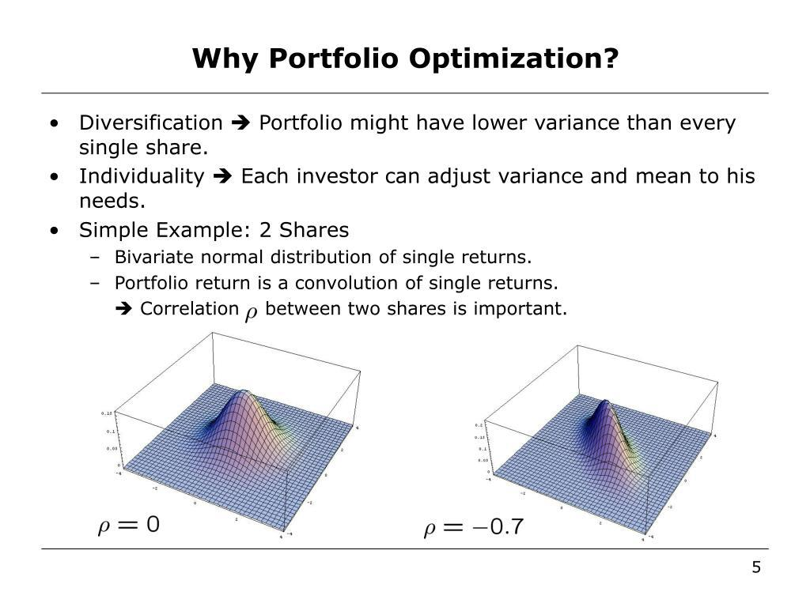

Portfolio optimization is a pivotal component of algorithmic trading, aimed at maximizing returns while minimizing risk. This intricate process involves selecting an optimal combination of assets to meet defined investment goals under various constraints. These constraints might arise from a range of factors, including legal obligations or personal investment strategies, reflecting the diverse nature of investor requirements and market conditions.

Algorithmic trading leverages quantitative analysis and sophisticated algorithms to automate trading processes. Through the use of these advanced techniques, traders can efficiently navigate the complexities of financial markets, enhancing decision-making and execution. This article focuses on how portfolio optimization can be effectively conducted under constraints, particularly within the context of algorithmic trading.

In exploring this topic, we will address both the challenges that arise and the strategies employed in this multifaceted process. By understanding the intersection between optimization techniques and constraints, investors can better align their portfolios with overarching financial objectives.

## Table of Contents

## Understanding Constraints in Portfolio Optimization

Constraints are fundamental parameters within the realm of portfolio optimization. They are essential for defining how a portfolio is structured and significantly influence the outcome of investment strategies. Constraints are conditions or limits that must be adhered to when constructing a portfolio, ensuring that it aligns with the investor's goals and risk profile.

One of the primary types of constraints is budget constraints, which impose limitations on the total amount of capital that can be allocated across the portfolio. This affects the number and type of assets that can be included, aiming to ensure that investments do not exceed the available financial resources.

Risk tolerance is another critical constraint, dictating the level of risk that an investor is willing to accept. It often requires setting an acceptable range for potential portfolio volatility or establishing a maximum drawdown limit. This ensures that the potential for losses is kept within acceptable bounds, corresponding to the investor's comfort level.

Asset allocation limits further delineate how assets are distributed across various categories within a portfolio. These constraints might stipulate that a certain percentage of the portfolio must be invested in specific asset classes, such as equities, bonds, or alternative investments. Similarly, sector-specific restrictions could mandate or prohibit investments in particular industries, thus managing exposure to sector-related risks.

Regulatory constraints are indispensable, as they ensure compliance with financial laws and regulations, which can vary by jurisdiction. These might involve restrictions on certain types of securities, limits on leverage, or rules concerning diversification.

Managing these constraints effectively is crucial for successful portfolio optimization. It requires a delicate balance to align the portfolio with the investor’s predefined objectives and risk tolerance. This often involves the use of sophisticated mathematical models and computational techniques to navigate the complex set of constraints. By adhering to these constraints, investors can better achieve a portfolio that not only meets legal and personal investment criteria but also optimizes potential returns according to their risk profile.

## The Role of Algorithmic Trading in Portfolio Optimization

Algorithmic trading significantly impacts portfolio optimization by utilizing advanced mathematical models to streamline the investment process. By automating trades, it minimizes human error and increases operational efficiency. The algorithms implemented in these trading systems are capable of processing vast datasets, allowing them to detect trading opportunities and make informed, real-time investment decisions.

The core advantage of [algorithmic trading](/wiki/algorithmic-trading) is its capacity for rapid adaptation to market changes. This adaptability ensures that traders can implement strategies with precision, acting swiftly as market conditions fluctuate. For instance, algorithms might leverage statistical models such as linear regression, time series forecasting, or [machine learning](/wiki/machine-learning) techniques to predict asset price movements. These algorithms can analyze various factors, including historical price data, trading volumes, and even sentiment analysis derived from news articles or social media platforms.

Moreover, algorithmic trading assists in managing the constraints associated with portfolio optimization. These constraints, whether related to budgetary limits, regulatory compliance, or risk management, require careful consideration in the optimization process. Algorithmic systems can incorporate these constraints into their trading models, ensuring that portfolio decisions remain aligned with predefined parameters. For example, they can apply linear or quadratic programming to balance expected returns against risk while adhering to constraints like minimum or maximum investment levels in specific asset classes.

The adaptability and sophistication of algorithmic trading facilitate dynamic portfolio adjustments. This capability is particularly essential in volatile markets, enabling investors to rebalance portfolios efficiently in response to market shifts. Python, a popular programming language in the financial sector, can be used to implement these algorithms. Using libraries such as NumPy for linear algebra operations, pandas for data manipulation, and libraries like Scikit-learn for machine learning, traders can develop, test, and deploy algorithms that meet their specific portfolio optimization needs.

In summary, algorithmic trading's integration into portfolio management provides powerful tools and methods to optimize investment strategies. By reducing errors, processing data efficiently, and executing trades with precision, it transforms the way portfolios are constructed and managed, helping traders achieve their investment objectives while respecting necessary constraints.

## Techniques for Portfolio Optimization Under Constraints

Various techniques are employed to achieve portfolio optimization while adhering to specified constraints, each offering unique methodologies to balance returns and manage risk effectively.

Mean-variance optimization is a foundational technique in portfolio management, developed by Harry Markowitz in 1952. The primary objective of this approach is to minimize the portfolio's variance (or risk) for a given expected return, or equivalently, to maximize return for a given level of risk. The optimization problem can be expressed mathematically as follows:

$$

\min_{w} \frac{1}{2} w^T \Sigma w - \lambda \mu^T w
$$

subject to:

$$
\sum_{i=1}^{n} w_i = 1 
$$

$$
w_i \geq 0 \quad \forall i
$$

where $w$ represents the weights of the assets in the portfolio, $\Sigma$ is the covariance matrix of asset returns, $\mu$ is the vector of expected returns, and $\lambda$ is the risk aversion coefficient. This technique effectively balances returns and risk by optimizing the portfolio allocation under specific constraints, such as budget limits and risk tolerance.

Linear and quadratic programming offer robust solutions to portfolio optimization problems involving multiple constraints. In linear programming, problems are defined by linear relationships, while in quadratic programming, they involve quadratic relationships typically related to the optimization of convex functions. These methods are particularly effective when portfolio constraints include asset limit restrictions and minimum or maximum holdings. For instance, linear programming would be used in optimization models where the return is linear concerning the decision variables, and quadratic programming would accommodate models that include quadratic terms, such as variance.

Heuristic algorithms, including genetic algorithms, are used to explore large and complex solution spaces where traditional optimization techniques may falter. These algorithms simulate natural evolutionary processes to generate high-quality solutions for optimization problems. For example, a genetic algorithm iteratively evolves a population of portfolios through selection, crossover, and mutation, aiming to converge toward an optimal solution by retaining the best-performing portfolio allocations across generations. Given their adaptability, heuristic algorithms are particularly valuable in navigating environments where the solution space is too complex for conventional methods.

Machine learning techniques are increasingly being integrated into portfolio optimization to enhance prediction accuracy and optimization efficiency. These methodologies employ algorithms such as decision trees, neural networks, and support vector machines to predict asset returns and risk factors accurately. By learning from historical data patterns, machine learning models can identify hidden relationships and trends that may not be apparent through traditional methods. The application of machine learning to portfolio optimization extends beyond prediction; it involves refining the optimization process itself by dynamically adjusting models in response to new data, thereby improving the robustness and adaptiveness of the investment strategy.

In summary, these techniques offer diverse and powerful tools in the pursuit of optimized portfolios under various constraints, contributing to more effective portfolio management strategies in today's dynamic financial landscape.

## Challenges of Portfolio Optimization Under Constraints

Balancing multiple constraints in portfolio optimization presents a complex and computationally demanding challenge. Each constraint, such as budget limits, risk tolerance, and regulatory requirements, must be adhered to, impacting the decision-making process. The simultaneous satisfaction of these conditions necessitates sophisticated computational techniques and algorithms, revealing the intricacy of this task.

The accuracy of predictions and the quality of input data are critical in determining the success of portfolio optimization. Predictive models rely heavily on historical data to forecast future performance, but inaccuracies or poor-quality data can lead to suboptimal decisions. The evaluation of potential investments is inherently uncertain, and errors in data processing or model formulation may propagate through the optimization process, affecting the final outcomes.

Market [volatility](/wiki/volatility-trading-strategies) introduces another layer of complexity to portfolio optimization. Sudden price fluctuations and unforeseen market events can swiftly alter the risk-return profile of a portfolio. This volatility demands robust models capable of adapting quickly to changing market conditions. Dynamic rebalancing strategies and stochastic models are often employed to mitigate the effects of volatility, but they add to the computational demand.

Constant monitoring and rebalancing are imperative to maintain an optimized portfolio. As market conditions evolve, the original allocations may become misaligned with the investor's goals or constraints. This necessitates frequent reassessment and adjustment of the portfolio to ensure continued compliance with constraints and alignment with objectives. Portfolio rebalancing is not only a technical challenge but also poses transaction cost implications, which must be factored into the optimization process.

Furthermore, striking a balance between automation and human oversight is critical in managing these challenges. While algorithmic trading offers efficiency in executing complex calculations and strategies, human judgment remains invaluable in interpreting broader market trends and anomalies. Decision-making frameworks that integrate both automated systems and expert oversight can enhance the overall effectiveness of portfolio optimization.

Overall, addressing these challenges requires a harmonious integration of advanced computational techniques and insightful human intervention to achieve optimal results in constrained portfolio optimization. The growing sophistication of algorithms and computational power continues to improve the capacity to tackle these challenges effectively, yet the inherent complexities of financial markets ensure that this remains a demanding field.

## Conclusion

Portfolio optimization under constraints is a sophisticated process that can significantly enhance trading strategies. By effectively managing these constraints, algorithmic trading offers substantial improvements in handling complex investment scenarios. The integration of algorithms into portfolio management is pivotal, as it provides precision and efficiency in navigating financial markets. These algorithms help resolve optimization challenges by analyzing large datasets and executing trades with high accuracy, thereby reducing human error and optimizing decision-making.

Continuous advancements in technology, particularly in machine learning and [artificial intelligence](/wiki/ai-artificial-intelligence), are expected to further enhance optimization techniques. These technological improvements can enable more accurate predictions and facilitate better handling of constraints, offering traders increasingly efficient tools to tackle the complexities of modern financial environments. As these technologies evolve, they are likely to introduce more sophisticated models that improve the robustness and adaptability of portfolio optimization strategies.

Investors who understand and leverage these advanced techniques can achieve desired outcomes in dynamic financial markets. By combining algorithmic efficiency with strategic management of constraints, traders can craft portfolios that are better aligned with their investment goals and risk appetites. This strategic alignment fosters resilience and adaptability, ensuring that portfolios remain optimized even as market conditions fluctuate. Overall, the integration of technology in portfolio optimization under constraints not only enhances trading strategies but also promises a future of improved financial decision-making.

## References & Further Reading

[1]: Markowitz, H. (1952). ["Portfolio Selection"](https://onlinelibrary.wiley.com/doi/abs/10.1111/j.1540-6261.1952.tb01525.x). The Journal of Finance, 7(1), 77-91.

[2]: Brandimarte, P. (2006). ["Quantitative Methods: An Introduction for Business Management"](https://onlinelibrary.wiley.com/doi/book/10.1002/9781118023525). John Wiley & Sons.

[3]: Chavez-Demoulin, V., & Embrechts, P. (2004). ["The Estimation of Value-at-Risk for Frequent Changes in a High Frequency Data Stream"](https://research.tue.nl/files/352799797/2401.14910v2.pdf). OR Spectrum, 26, 239-256.

[4]: Lopez de Prado, M. (2018). ["Advances in Financial Machine Learning"](https://www.amazon.com/Advances-Financial-Machine-Learning-Marcos/dp/1119482089). Wiley.

[5]: Grinold, R. C., & Kahn, R. N. (1999). ["Active Portfolio Management: A Quantitative Approach for Producing Superior Returns and Controlling Risk"](https://www.amazon.com/Active-Portfolio-Management-Quantitative-Controlling/dp/0070248826). McGraw-Hill.

[6]: Jansen, S. (2020). ["Machine Learning for Algorithmic Trading"](https://github.com/stefan-jansen/machine-learning-for-trading). Packt Publishing.

[7]: Fabozzi, F. J., Kolm, P. N., Pachamanova, D. A., & Focardi, S. M. (2007). ["Robust Portfolio Optimization and Management"](https://onlinelibrary.wiley.com/doi/book/10.1002/9781119202172). Wiley.

[8]: Chan, E. P. (2009). ["Quantitative Trading: How to Build Your Own Algorithmic Trading Business"](https://github.com/justinchou/books-quantitative-trading). Wiley.