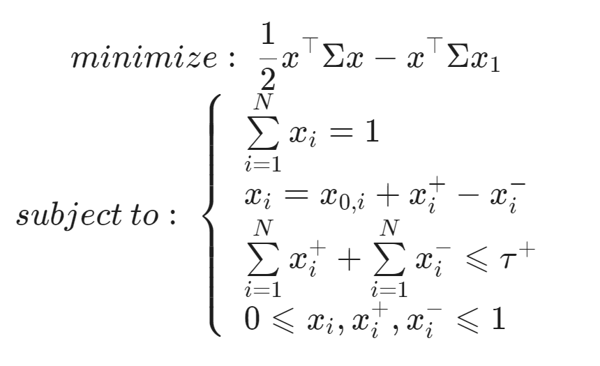

## Table of Contents

## What is portfolio optimization?

Portfolio optimization is a way to pick the best mix of investments to help you reach your financial goals while keeping risk under control. It's like trying to find the perfect balance between different things you can invest in, like stocks, bonds, or real estate, so that you can get the most reward for the least amount of risk. People use math and computers to figure out which mix of investments will work best for them.

The main idea behind portfolio optimization is something called "diversification." This means spreading your money across different types of investments so that if one doesn't do well, the others might make up for it. By doing this, you can lower the overall risk of your portfolio. For example, if you only invest in one company's stock and that company does badly, you could lose a lot of money. But if you spread your money across many different companies and types of investments, you're less likely to lose everything at once.

To do portfolio optimization, people often use a tool called the "efficient frontier." This tool helps you see which combinations of investments give you the best possible return for a given level of risk. By looking at the efficient frontier, you can choose a portfolio that fits your comfort level with risk and your financial goals. It's a bit like choosing a path on a map that gets you to your destination with the least amount of trouble along the way.

## Why is it important to consider constraints in portfolio optimization?

Considering constraints in portfolio optimization is important because it helps make sure your investment plan fits with what you can actually do. Constraints can be things like how much money you have to invest, rules about what you can invest in, or even your own feelings about risk. If you don't think about these limits, you might end up with a plan that sounds good on paper but isn't possible in real life. For example, if you don't have enough money to buy a lot of different stocks, a plan that says you should might not work for you.

Also, constraints help you stay within the rules and laws that affect your investments. Some investments might be off-limits because of where you live or the kind of investor you are. By including these limits in your optimization, you make sure your portfolio is not only good for making money but also follows the rules. This way, you avoid getting into trouble and can focus on growing your investments safely and legally.

## What are common types of constraints in portfolio optimization?

In portfolio optimization, common types of constraints include limits on how much money you can put into different types of investments. For example, you might have a rule that says you can't put more than 10% of your money into any one stock. This helps spread your risk so that if one company does badly, it won't hurt your whole portfolio too much. Another common constraint is the total amount of money you have to invest. If you only have a small amount to start with, you can't buy a lot of different investments, so you need to choose carefully.

There are also constraints based on rules and laws. For instance, some investors might not be allowed to invest in certain industries or types of assets because of where they live or the kind of investor they are. These rules can change what your portfolio looks like. Another type of constraint is how you feel about risk. If you don't like taking big risks, you might set a limit on how much of your money can go into risky investments like stocks, and instead put more into safer options like bonds.

Lastly, there are time constraints. If you need your money back quickly, you might avoid investments that lock up your money for a long time. Also, if you have a goal to reach in a certain number of years, like saving for retirement, you might choose investments that are likely to grow at the right pace to meet that goal. All these constraints shape your investment plan to make sure it fits your real-life situation and goals.

## How does the Markowitz model work in portfolio optimization?

The Markowitz model, also known as Modern Portfolio Theory, is a way to pick the best mix of investments to balance risk and reward. It was created by Harry Markowitz. The main idea is to look at how different investments move together, or their correlation. By choosing investments that don't all go up or down at the same time, you can spread your risk. The model uses math to figure out the best way to split your money between different investments so that you get the highest return for the least amount of risk.

To use the Markowitz model, you need to know three things about each investment: its expected return, its risk (measured by something called standard deviation), and how it moves with other investments (its correlation). The model then creates something called the efficient frontier, which is a line showing all the possible portfolios that give you the best return for each level of risk. You can pick a spot on this line that matches how much risk you're comfortable with. This way, you can build a portfolio that fits your goals and how much risk you're willing to take.

## What is the role of risk and return in constrained portfolio optimization?

In constrained portfolio optimization, risk and return are really important. They help you figure out the best way to invest your money while sticking to the rules you have to follow. Risk is how much you could lose, and return is how much you could gain. The goal is to find a mix of investments that gives you a good return without taking on too much risk. The rules, or constraints, might say you can't put too much money in one stock or that you need to keep some money in safe investments like bonds. By thinking about these rules along with risk and return, you can make a plan that fits what you want and what you can do.

When you use the Markowitz model for portfolio optimization, it helps you see how different levels of risk and return work together. The model looks at how each investment could do on its own and how they might move together. It then shows you a line called the efficient frontier, which tells you the best return you can get for each level of risk. With constraints, you might not be able to reach every point on this line, but you can still find a good spot that balances risk and return while following your rules. This way, you can make smart choices about where to put your money, even when you have to follow certain limits.

## How can linear programming be used to solve portfolio optimization problems with constraints?

Linear programming is a math tool that can help you figure out the best way to split your money across different investments when you have rules, or constraints, to follow. In portfolio optimization, you want to find the mix of investments that gives you the highest return while keeping risk under control. Linear programming helps by setting up equations that show how much return you can expect and how much risk you're taking. It also includes your constraints, like not putting too much money into one stock or needing to keep some money in safe investments like bonds. The computer then solves these equations to find the best solution that fits all your rules.

By using linear programming, you can make sure your investment plan is not only good for making money but also follows the limits you have to work with. For example, if you have a rule that says you can't put more than 10% of your money into any one stock, linear programming will make sure your plan sticks to that rule. It looks at all the possible ways to split your money and picks the one that gives you the best return for the least amount of risk, while still following your constraints. This way, you can feel confident that your investment plan is both smart and practical.

## What are the differences between hard and soft constraints in portfolio optimization?

In portfolio optimization, hard constraints are rules that you must follow no matter what. They are like strict limits that can't be broken. For example, if a rule says you can't put more than 5% of your money in one stock, that's a hard constraint. Your investment plan has to follow this rule exactly, or it won't work. Hard constraints are important because they help make sure your plan is safe and follows the law or other important rules.

Soft constraints, on the other hand, are more like guidelines that you can bend a little if you need to. They are goals you want to reach, but it's okay if you don't meet them perfectly. For instance, you might want to keep at least 30% of your money in safe investments like bonds, but if you can get a better return by putting a bit less in bonds, you might choose to do that. Soft constraints give you more flexibility to find the best mix of investments, while still trying to meet your main goals.

## How do transaction costs affect portfolio optimization under constraints?

Transaction costs are the fees you pay when you buy or sell investments. They can make a big difference in portfolio optimization, especially when you have to follow certain rules, or constraints. If you don't think about these costs, you might end up with a plan that looks good on paper but costs too much to actually do. For example, if you need to buy and sell a lot of different stocks to follow your rules, the costs could eat into your returns. So, when you're figuring out the best way to split your money, you need to think about these costs to make sure your plan is not only good but also affordable.

Including transaction costs in your portfolio optimization helps you find a balance between following your rules and keeping your costs down. You might choose investments that don't need to be traded as often, or you might decide to adjust your rules a bit to avoid too many costly transactions. By thinking about these costs, you can make a plan that fits your goals and constraints while also saving money. This way, you can get the most out of your investments without letting high fees take away your gains.

## What advanced techniques can be used to handle multiple constraints in portfolio optimization?

When you have a lot of different rules, or constraints, to follow in portfolio optimization, you might need to use some advanced techniques to make it work. One way to do this is by using something called multi-objective optimization. This means you're trying to meet more than one goal at the same time, like getting a good return while keeping risk low and following all your rules. Multi-objective optimization helps you find the best balance between these goals. It can show you different plans that meet your rules in different ways, so you can pick the one that fits you best.

Another technique is using genetic algorithms. These are like computer programs that try out lots of different ways to split your money, kind of like how nature tries out different ways to make plants and animals better over time. Genetic algorithms can handle a lot of rules and find good solutions even when things get complicated. They keep testing and changing the plans until they find one that works well with all your constraints. By using these advanced techniques, you can make sure your investment plan fits all your rules and helps you reach your financial goals.

## How does the inclusion of alternative investments impact constrained portfolio optimization?

When you add alternative investments like real estate, commodities, or hedge funds to your portfolio, it can change how you do portfolio optimization with constraints. Alternative investments often act differently from stocks and bonds. They might not go up and down at the same time as the stock market, which can help spread out your risk. But, they also come with their own set of rules. For example, real estate might need a lot of money to start, and some hedge funds might only let certain types of investors in. So, when you're figuring out the best way to split your money, you need to think about these new rules along with the ones you already have.

Including alternative investments can make your portfolio better by giving you more ways to balance risk and return. But it also makes things more complicated. You have to think about how these new investments fit with your old ones and how they affect your overall plan. For example, if you want to keep some of your money in safe investments but also want to try real estate, you need to find a way to do both while still following your rules. By carefully thinking about all these factors, you can make a plan that uses alternative investments to help you reach your financial goals while staying within your limits.

## What are the latest research trends in portfolio optimization under multiple and complex constraints?

The latest research in portfolio optimization under multiple and complex constraints is focusing on using advanced math and computer tools to make better investment plans. One big trend is using [machine learning](/wiki/machine-learning) and [artificial intelligence](/wiki/ai-artificial-intelligence) to handle lots of different rules at the same time. These tools can look at huge amounts of data to find patterns and make smart choices about where to put your money. They can also learn from past mistakes and get better over time. Another trend is using something called robust optimization, which helps make plans that can handle surprises and changes in the market. This way, your investment plan can stay strong even when things don't go as expected.

Another important trend is looking at how different rules affect each other. For example, if you have a rule about not putting too much money into one stock and another rule about keeping some money in safe investments, researchers are trying to figure out how these rules work together. They're using new math models to find the best balance between all your rules. Also, there's a lot of work being done on how to include things like environmental, social, and governance ([ESG](/wiki/esg-investing)) factors in your investment plan. This means thinking about how your investments affect the world, not just how much money they can make. By using these new methods, you can make an investment plan that fits all your rules and helps you reach your goals, even when things get complicated.

## How can machine learning and AI enhance the process of portfolio optimization under constraints?

Machine learning and AI can make portfolio optimization under constraints much better by looking at a lot of data and finding patterns that people might miss. These tools can learn from past data to predict how different investments might do in the future. They can also handle many different rules at the same time, like not putting too much money in one stock or keeping some money in safe investments. By using machine learning, you can find the best way to split your money that follows all your rules and gives you a good return while keeping risk low. These tools can also keep learning and getting better over time, so your investment plan can stay up-to-date with new information.

Another way machine learning and AI help is by making it easier to deal with surprises and changes in the market. They can use something called robust optimization to make plans that can handle unexpected events. This means your investment plan can stay strong even when things don't go as planned. Machine learning can also think about things like how your investments affect the environment or society, which is becoming more important to many investors. By using these advanced tools, you can make a smart investment plan that fits all your rules and helps you reach your financial goals, even when things get complicated.

## What are the techniques for portfolio optimization under constraints?

Various techniques are employed to achieve portfolio optimization while adhering to specified constraints, each offering unique methodologies to balance returns and manage risk effectively.

Mean-variance optimization is a foundational technique in portfolio management, developed by Harry Markowitz in 1952. The primary objective of this approach is to minimize the portfolio's variance (or risk) for a given expected return, or equivalently, to maximize return for a given level of risk. The optimization problem can be expressed mathematically as follows:

$$

\min_{w} \frac{1}{2} w^T \Sigma w - \lambda \mu^T w
$$

subject to:

$$
\sum_{i=1}^{n} w_i = 1 
$$

$$
w_i \geq 0 \quad \forall i
$$

where $w$ represents the weights of the assets in the portfolio, $\Sigma$ is the covariance matrix of asset returns, $\mu$ is the vector of expected returns, and $\lambda$ is the risk aversion coefficient. This technique effectively balances returns and risk by optimizing the portfolio allocation under specific constraints, such as budget limits and risk tolerance.

Linear and quadratic programming offer robust solutions to portfolio optimization problems involving multiple constraints. In linear programming, problems are defined by linear relationships, while in quadratic programming, they involve quadratic relationships typically related to the optimization of convex functions. These methods are particularly effective when portfolio constraints include asset limit restrictions and minimum or maximum holdings. For instance, linear programming would be used in optimization models where the return is linear concerning the decision variables, and quadratic programming would accommodate models that include quadratic terms, such as variance.

Heuristic algorithms, including genetic algorithms, are used to explore large and complex solution spaces where traditional optimization techniques may falter. These algorithms simulate natural evolutionary processes to generate high-quality solutions for optimization problems. For example, a genetic algorithm iteratively evolves a population of portfolios through selection, crossover, and mutation, aiming to converge toward an optimal solution by retaining the best-performing portfolio allocations across generations. Given their adaptability, heuristic algorithms are particularly valuable in navigating environments where the solution space is too complex for conventional methods.

Machine learning techniques are increasingly being integrated into portfolio optimization to enhance prediction accuracy and optimization efficiency. These methodologies employ algorithms such as decision trees, neural networks, and support vector machines to predict asset returns and risk factors accurately. By learning from historical data patterns, machine learning models can identify hidden relationships and trends that may not be apparent through traditional methods. The application of machine learning to portfolio optimization extends beyond prediction; it involves refining the optimization process itself by dynamically adjusting models in response to new data, thereby improving the robustness and adaptiveness of the investment strategy.

In summary, these techniques offer diverse and powerful tools in the pursuit of optimized portfolios under various constraints, contributing to more effective portfolio management strategies in today's dynamic financial landscape.

## References & Further Reading

[1]: Markowitz, H. (1952). ["Portfolio Selection"](https://onlinelibrary.wiley.com/doi/abs/10.1111/j.1540-6261.1952.tb01525.x). The Journal of Finance, 7(1), 77-91.

[2]: Brandimarte, P. (2006). ["Quantitative Methods: An Introduction for Business Management"](https://onlinelibrary.wiley.com/doi/book/10.1002/9781118023525). John Wiley & Sons.

[3]: Chavez-Demoulin, V., & Embrechts, P. (2004). ["The Estimation of Value-at-Risk for Frequent Changes in a High Frequency Data Stream"](https://research.tue.nl/files/352799797/2401.14910v2.pdf). OR Spectrum, 26, 239-256.

[4]: Lopez de Prado, M. (2018). ["Advances in Financial Machine Learning"](https://www.amazon.com/Advances-Financial-Machine-Learning-Marcos/dp/1119482089). Wiley.

[5]: Grinold, R. C., & Kahn, R. N. (1999). ["Active Portfolio Management: A Quantitative Approach for Producing Superior Returns and Controlling Risk"](https://www.amazon.com/Active-Portfolio-Management-Quantitative-Controlling/dp/0070248826). McGraw-Hill.

[6]: Jansen, S. (2020). ["Machine Learning for Algorithmic Trading"](https://github.com/stefan-jansen/machine-learning-for-trading). Packt Publishing.

[7]: Fabozzi, F. J., Kolm, P. N., Pachamanova, D. A., & Focardi, S. M. (2007). ["Robust Portfolio Optimization and Management"](https://onlinelibrary.wiley.com/doi/book/10.1002/9781119202172). Wiley.

[8]: Chan, E. P. (2009). ["Quantitative Trading: How to Build Your Own Algorithmic Trading Business"](https://github.com/justinchou/books-quantitative-trading). Wiley.