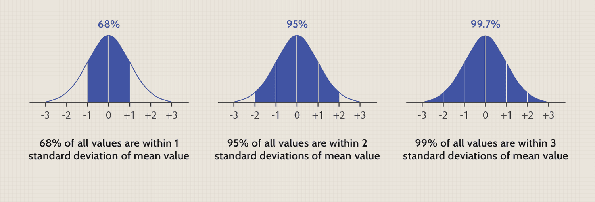

## Table of Contents

## What is portfolio optimization and why is it important?

Portfolio optimization is a way to choose the best mix of investments to help you reach your financial goals while taking the least amount of risk possible. Imagine you have a basket, and you want to fill it with different fruits. You want to pick fruits that not only taste good together but also make sure that if one fruit goes bad, it doesn't ruin your whole basket. In the same way, portfolio optimization helps you pick different investments that work well together and reduce the chance that a bad investment will hurt your overall financial plan.

This process is important because it helps you make the most out of your money. By carefully choosing and balancing your investments, you can increase your chances of earning more money over time while keeping risks under control. For example, if you put all your money into one company's stock and that company does poorly, you could lose a lot. But if you spread your money across different types of investments, like stocks, bonds, and real estate, you're less likely to lose everything at once. This way, you can sleep better at night knowing your money is safer and working harder for you.

## How does the normal distribution relate to portfolio optimization?

The normal distribution, often called the bell curve, is really important in portfolio optimization because it helps us understand how risky our investments might be. Imagine you're looking at how much money you could make or lose from an investment. The normal distribution shows us that most of the time, the returns will be close to the average, with fewer big wins or big losses. This helps us figure out how likely it is that our investments will do well or badly.

When we use the normal distribution in portfolio optimization, we can make better guesses about the future. We look at the past performance of our investments to see how they've moved around the average return. By doing this, we can decide which investments to mix together to make our portfolio safer and more likely to grow. It's like planning a trip and knowing the weather might be mostly mild but could get a bit hot or cold; you pack your bag to be ready for anything, making your trip more enjoyable and less risky.

## What are the basic assumptions of using normal distribution in portfolio optimization?

When we use the normal distribution for portfolio optimization, we make a few key assumptions. The first big one is that the returns of our investments follow a normal distribution. This means most of the time, the returns will be close to the average, with fewer big gains or losses. It's like saying if you flip a coin a lot, you'll get close to half heads and half tails, but sometimes you might get a few more heads or tails in a row.

Another assumption is that the returns of different investments are independent of each other. This means the performance of one investment doesn't affect the others. It's like saying if you plant different types of flowers in your garden, how well one type grows won't change how the others do. This helps us mix investments in a way that reduces risk, because if one investment does badly, it won't drag down the others.

Lastly, we assume that the future will be a lot like the past. We use historical data to guess how our investments will perform. It's like using last year's weather to plan for next year's picnic. While it's not perfect, it gives us a good starting point to make our portfolio as safe and profitable as possible.

## Can you explain the concept of expected return and standard deviation in the context of normal distribution?

Expected return is like guessing how much money you might make from an investment over time. Imagine you're playing a game where you can win or lose money. If you play the game many times, the average amount you win or lose is your expected return. When we use the normal distribution, we think that most of the time, the returns will be close to this average. So, if you invest in a stock, the expected return helps you know what to expect on average, which is really helpful for planning your financial future.

Standard deviation is a way to measure how much the returns of your investment might jump around. Think of it as how wild the ride might be. If the standard deviation is small, it means the returns will usually stay close to the expected return, like a calm boat ride. But if it's big, the returns could swing a lot more, like a roller coaster. In the context of the normal distribution, about 68% of the time, the returns will be within one standard deviation of the expected return, and about 95% of the time, they'll be within two standard deviations. This helps you understand the risk you're taking with your investment.

## How do you calculate the expected return of a portfolio using normal distribution?

To calculate the expected return of a portfolio using normal distribution, you first need to know the expected return of each investment in your portfolio. Imagine you have different buckets of money, and each bucket is invested in something different, like stocks or bonds. You look at how much money you expect to make from each bucket over time. Then, you add up all these expected returns, but you have to think about how much money you put into each bucket. If you put more money into one bucket, it will have a bigger say in your overall expected return. So, you multiply the expected return of each investment by the fraction of your total money that's in that investment, and then you add all those numbers together. That's your portfolio's expected return.

For example, let's say you have a portfolio with two investments: one in stocks and one in bonds. The expected return for the stocks is 8%, and for the bonds, it's 3%. If you put 60% of your money in stocks and 40% in bonds, you calculate the portfolio's expected return like this: (0.60 * 8%) + (0.40 * 3%). That comes out to 4.8% + 1.2%, which equals 6%. This means, on average, you can expect your portfolio to grow by 6% each year. By using the normal distribution, you assume that most of the time, your returns will be close to this 6%, helping you plan your financial future with a bit more confidence.

## What is the role of covariance in portfolio optimization when using normal distribution?

Covariance is like a secret handshake between different investments in your portfolio. It tells you how much the returns of two investments move together. If one investment goes up when another goes up, they have a positive covariance. If one goes up when the other goes down, they have a negative covariance. When you're using normal distribution to optimize your portfolio, you need to know this because it helps you figure out how to mix your investments to make your portfolio safer. If you can find investments that don't move in the same way, you can balance them out, reducing the overall risk.

For example, imagine you have two stocks: one in a tech company and one in a grocery store. Tech stocks might go up and down a lot, while grocery stores are usually more stable. If the tech stock goes up when the grocery stock goes down, that's a negative covariance. By putting some money in each, you can smooth out the ups and downs of your portfolio. This is why covariance is so important in portfolio optimization using normal distribution – it helps you pick the right mix of investments to keep your money safer while still growing it.

## How can the efficient frontier be constructed using normal distribution?

The efficient frontier is like a map that shows you the best ways to mix your investments to get the most return for the least amount of risk. To build this map using normal distribution, you start by figuring out the expected return and the risk (measured by standard deviation) for each investment in your portfolio. Then, you look at how these investments move together, which is called covariance. By mixing different amounts of these investments, you can see how changing the mix changes your expected return and risk. You keep trying different mixes until you find the ones that give you the highest return for each level of risk. When you plot all these best mixes on a graph, you get a curve that's called the efficient frontier.

Once you have this curve, it shows you all the best ways to invest your money. Any point on the curve is a good choice because it gives you the highest return for the risk you're willing to take. If you're okay with more risk, you can pick a point higher up on the curve for a higher return. If you want less risk, you can choose a point lower down on the curve for a smaller return. The efficient frontier helps you make smart choices about your investments by showing you the best balance between risk and reward.

## What are the limitations of assuming normal distribution in portfolio optimization?

Assuming normal distribution in portfolio optimization has some big limitations. One big problem is that real-life investment returns often don't follow a normal distribution. They can have bigger swings than the normal distribution expects, especially during times like financial crises. This means using normal distribution might make you think your investments are safer than they really are. If you're not ready for those big swings, you could be in for a surprise.

Another limitation is that normal distribution doesn't account for things like sudden big changes in the market, which can happen because of news or events. These sudden changes, called "fat tails," can make your investments lose a lot more money than you expected. Also, normal distribution assumes that past performance will tell you about the future, but markets can change in ways that the past doesn't predict. So, relying too much on normal distribution might not prepare you well for all the surprises the market can throw at you.

## How does the Capital Asset Pricing Model (CAPM) integrate with normal distribution in portfolio optimization?

The Capital Asset Pricing Model (CAPM) is a tool that helps you figure out how much return you should expect from an investment based on how risky it is. It uses the idea of normal distribution to do this. In CAPM, you start with something called the "risk-free rate," which is like the return you get from super safe investments like government bonds. Then, you look at how much riskier your investment is compared to the whole market. This is called "beta." If your investment moves a lot with the market, it has a high beta and is riskier. CAPM says that the expected return of your investment should be the risk-free rate plus a bit extra for taking on that extra risk. The normal distribution helps here because it assumes that the returns of the market and your investment follow a bell curve, making it easier to guess how much extra return you might get for the risk you're taking.

But, just like with normal distribution, using CAPM has its limits. Real-life markets don't always follow the neat patterns of normal distribution. Sometimes, they have big surprises that CAPM doesn't expect. Also, CAPM assumes that everyone can borrow and lend at the same risk-free rate, which isn't true in the real world. And it doesn't consider other risks that might affect your investments, like changes in the economy or unexpected events. So, while CAPM can be a helpful guide, it's important to remember that it's based on some assumptions that might not always hold up in the wild world of investing.

## Can you discuss the impact of non-normal distributions on portfolio optimization strategies?

When we think about portfolio optimization, we often use normal distribution to guess how our investments will do. But real life doesn't always follow this neat pattern. Sometimes, investments can have big surprises, like sudden drops or jumps in value, which don't fit into the normal distribution's bell curve. These surprises are called "fat tails," and they can make your portfolio lose more money than you expected. If you plan your investments based on normal distribution and don't account for these big swings, you might be in for a shock when the market does something unexpected.

Because of these surprises, it's important to think about other ways to plan your investments. Some people use different kinds of distributions, like the Student's t-distribution or even more complex models, to better capture the big swings in the market. These models can help you prepare for those unexpected events and make your portfolio safer. By understanding that markets can be wilder than a normal distribution suggests, you can choose investments that might not move together as much, reducing the risk that a big drop in one investment will hurt your whole portfolio.

## What advanced techniques can be used to adjust for non-normality in portfolio optimization?

When normal distribution doesn't fit the real world well, we can use other methods to make our portfolio safer. One way is to use something called the Student's t-distribution. It's like the normal distribution but allows for bigger surprises, or "fat tails," which can happen in real markets. By using the Student's t-distribution, we can better guess how much our investments might swing up or down and plan our portfolio to be ready for those big changes. Another method is to use something called Value at Risk (VaR), which tells us the worst loss we might expect over a certain time with a certain confidence level. This helps us understand the risk better and choose investments that balance out those risks.

Another advanced technique is to use simulations like Monte Carlo methods. These simulations run many different scenarios of what might happen to our investments, not just the average case. By doing this, we can see how our portfolio might do in all sorts of situations, including the really bad ones that normal distribution might miss. This helps us make our portfolio more robust and ready for surprises. Also, we can use something called copulas, which help us understand how different investments move together in ways that normal distribution can't. By using copulas, we can mix our investments in a smarter way to reduce the risk that a big drop in one investment will hurt our whole portfolio.

## How do practitioners apply these concepts in real-world portfolio management?

In real-world portfolio management, practitioners often start by looking at past data to guess how their investments might do in the future. They use tools like the normal distribution to figure out the average return and risk of each investment. But because real markets can be unpredictable, they also use more advanced methods like the Student's t-distribution and Value at Risk (VaR) to prepare for big surprises. These methods help them understand that investments can swing more wildly than expected, so they plan their portfolios to be ready for those big changes. They might use simulations, like Monte Carlo methods, to run many different scenarios and see how their portfolio might do in all sorts of situations, not just the average ones.

Practitioners also pay attention to how different investments move together, using concepts like covariance and copulas. They want to mix their investments in a way that if one goes down, others might not go down at the same time, which helps keep their portfolio safer. By understanding these relationships, they can create a balanced portfolio that reduces the risk of big losses. In the end, the goal is to find the best mix of investments that gives them the highest return for the least amount of risk, using all the tools and methods they have to make smart choices about where to put their money.

## What is Understanding Normal Distribution?

Normal distribution, often termed a Gaussian distribution, plays a critical role in statistical modeling and is frequently represented by the familiar bell-shaped curve. This continuous probability distribution is characterized by its symmetric shape about the mean, implying that values are equally likely to appear on either side of the mean. One of its defining mathematical properties includes its probability density function (PDF), which is given by:

$$
f(x|\mu,\sigma^2) = \frac{1}{\sqrt{2\pi\sigma^2}} e^{-\frac{(x-\mu)^2}{2\sigma^2}}
$$

where:
- $\mu$ is the mean or expectation of the distribution (also the peak of the curve),
- $\sigma^2$ is the variance (standard deviation squared), which measures the spread or width of the distribution.

In the context of financial modeling, particularly within the framework of portfolio theory, it is often assumed that asset returns are normally distributed. This assumption simplifies the mathematical computations associated with financial predictions, allowing for the use of mean-variance optimization strategies. 

The normal distribution is advantageous for several reasons in finance. First, it allows for statistical inference, making it possible to infer characteristics about the overall population of returns from a sample. This is pivotal when modeling asset returns to estimate expected returns ($\mu$) and associated risks ($\sigma$). Secondly, the normal distribution aids in determining correlations among various assets, enabling portfolio diversification—a cornerstone of an optimized portfolio.

However, this assumption carries implications for portfolio optimization. Since the entire statistical exercise often relies on the central estimates of mean (expected return) and variance (risk), a normal distribution implies that these are the primary filters through which financial data is interpreted. Therefore, it impacts decisions around asset allocation and risk management by quantifying the distribution of potential returns and losses.

The bell curve's implications also extend into risk metrics such as Value at Risk (VaR), which relies on normal distribution to forecast the maximum expected loss at a certain confidence level. This is particularly useful in risk management, allowing investors to gauge the likelihood of extreme losses.

In real-world investing, while assuming normality can facilitate computational simplicity and analytical clarity, it may not always portray the actual return dynamics, especially during turbulent market phases. Despite its simplifying assumptions, normal distribution remains a pivotal concept in statistical inference and portfolio optimization, providing a foundation upon which more complex, realistic models can be built.

## What is Modern Portfolio Theory (MPT) and what are its foundations?

Modern Portfolio Theory (MPT) is a seminal framework in finance developed by Harry Markowitz in 1952. It aims to construct an investment portfolio to maximize returns for a specific level of risk by considering the statistical correlation between different asset classes. The fundamental premise of MPT is that risk in a diversified portfolio can be quantified and minimized, producing an "efficient frontier" of optimal portfolios.

At the core of MPT is the assumption that asset returns follow a normal distribution. This assumption allows investors to quantify both expected returns ($\mu$) and associated risks, as measured by standard deviation ($\sigma$). The normal distribution facilitates the use of mean-variance analysis, where the focus is on finding the balance between risk (variance) and expected return. The relationship between assets is a crucial element of MPT, often expressed through covariance or correlation matrices that assess how different securities co-move.

The main equation used in portfolio optimization involves calculating the expected return of a portfolio ($E(R_p)$) and its variance ($\sigma^2_p$) as follows:

1. **Expected Return of the Portfolio:**
$$
   E(R_p) = \sum_{i=1}^n w_i \cdot E(R_i)

$$
   where $w_i$ is the weight of asset $i$ in the portfolio, and $E(R_i)$ is the expected return of asset $i$.

2. **Variance of the Portfolio:**
$$
   \sigma^2_p = \sum_{i=1}^n \sum_{j=1}^n w_i w_j \sigma_{ij}

$$
   where $\sigma_{ij}$ is the covariance between the returns of asset $i$ and asset $j$.

The optimization goal in MPT is to choose the weights $w_i$ such that the portfolio's expected return is maximized for a given level of risk, or conversely, the risk is minimized for a given level of expected return. This leads to the establishment of the efficient frontier, which represents the set of portfolios that offer the maximum expected return for a defined level of risk.

While MPT's reliance on normal distribution is foundational, it is essential to acknowledge the critiques regarding its assumptions. Real-world asset returns often exhibit skewness and kurtosis; that is, they deviate from a perfect normal distribution. Thus, while MPT provides a critical framework for portfolio construction, investors should remain wary of its assumptions and consider complementing it with other analytic approaches when necessary.

## References & Further Reading

[1]: Markowitz, H. (1952). ["Portfolio Selection."](https://onlinelibrary.wiley.com/doi/abs/10.1111/j.1540-6261.1952.tb01525.x) The Journal of Finance, 7(1), 77-91.

[2]: Lopez de Prado, M. (2018). ["Advances in Financial Machine Learning."](https://www.amazon.com/Advances-Financial-Machine-Learning-Marcos/dp/1119482089) Wiley.

[3]: Jansen, S. (2020). ["Machine Learning for Algorithmic Trading: Predictive Models to Extract Signals from Market and Alternative Data for Systematic Trading Strategies with Python."](https://github.com/stefan-jansen/machine-learning-for-trading) Packt Publishing.

[4]: Chan, E. P. (2008). ["Quantitative Trading: How to Build Your Own Algorithmic Trading Business."](https://github.com/ftvision/quant_trading_echan_book) Wiley.

[5]: Mandelbrot, B. B., & Hudson, R. L. (2004). ["The (Mis)Behavior of Markets: A Fractal View of Risk, Ruin, and Reward."](https://books.google.com/books/about/The_Mis_Behaviour_of_Markets.html?id=zg91TAIs6bgC) Basic Books.