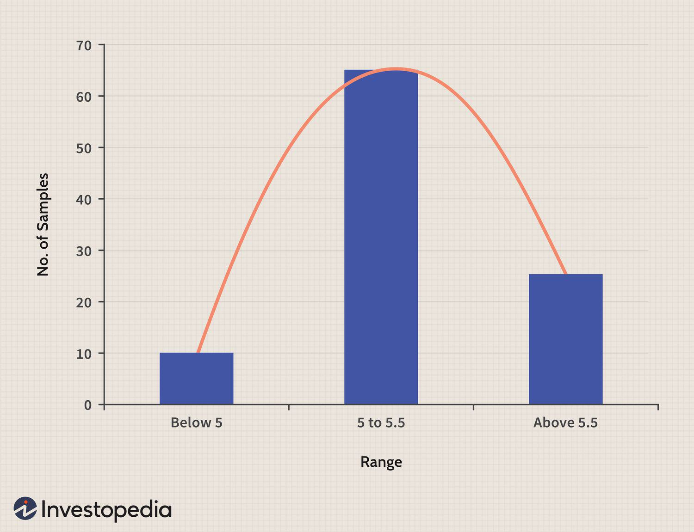

Investment strategy and portfolio optimization are key elements in achieving desirable financial outcomes. In an increasingly complex financial market, having a well-structured approach to investing is essential for managing risk and maximizing returns. One significant aspect of investment strategy is the integration of statistical principles, notably the normal distribution, with algorithmic trading.

Normal distribution, often visualized as a bell curve, is a fundamental concept in statistics and plays a vital role in financial modeling. It assumes that asset returns are symmetrically distributed around the mean, allowing for a standardized approach to predicting investment performance. This statistical model provides a foundation for calculating probability distributions, risk assessment, and decision-making processes, which are crucial in managing investment portfolios.



Algorithmic trading further enhances investment strategies by using computational algorithms to execute trades at optimal times, thereby improving efficiency and accuracy. The integration of normal distribution in algorithmic models allows for more precise predictions of asset behavior and better risk management practices. By using historical data and statistical analysis, algorithms can forecast potential market movements and enable investors to capitalize on these predictions.

This article investigates the intersection of the normal distribution with modern portfolio theory and algorithmic trading. Modern Portfolio Theory (MPT) uses normal distribution to assess the correlation between different assets and optimize a portfolio's risk-return profile. By understanding the statistical elements involved, investors can develop diversified portfolios that align with their risk tolerance and financial goals. 

Furthermore, the application of algorithmic trading, combined with these statistical models, allows for automation and sophistication in executing investment strategies. However, while the normal distribution provides a valuable framework for predicting market behavior, it is essential to recognize its limitations and the potential for deviations in financial markets. Investment decisions should be informed by comprehensive analysis and an awareness of these statistical assumptions.

## Table of Contents

## Understanding Normal Distribution

Normal distribution, often termed a Gaussian distribution, plays a critical role in statistical modeling and is frequently represented by the familiar bell-shaped curve. This continuous probability distribution is characterized by its symmetric shape about the mean, implying that values are equally likely to appear on either side of the mean. One of its defining mathematical properties includes its probability density function (PDF), which is given by:

$$
f(x|\mu,\sigma^2) = \frac{1}{\sqrt{2\pi\sigma^2}} e^{-\frac{(x-\mu)^2}{2\sigma^2}}
$$

where:
- $\mu$ is the mean or expectation of the distribution (also the peak of the curve),
- $\sigma^2$ is the variance (standard deviation squared), which measures the spread or width of the distribution.

In the context of financial modeling, particularly within the framework of portfolio theory, it is often assumed that asset returns are normally distributed. This assumption simplifies the mathematical computations associated with financial predictions, allowing for the use of mean-variance optimization strategies. 

The normal distribution is advantageous for several reasons in finance. First, it allows for statistical inference, making it possible to infer characteristics about the overall population of returns from a sample. This is pivotal when modeling asset returns to estimate expected returns ($\mu$) and associated risks ($\sigma$). Secondly, the normal distribution aids in determining correlations among various assets, enabling portfolio diversification—a cornerstone of an optimized portfolio.

However, this assumption carries implications for portfolio optimization. Since the entire statistical exercise often relies on the central estimates of mean (expected return) and variance (risk), a normal distribution implies that these are the primary filters through which financial data is interpreted. Therefore, it impacts decisions around asset allocation and risk management by quantifying the distribution of potential returns and losses.

The bell curve's implications also extend into risk metrics such as Value at Risk (VaR), which relies on normal distribution to forecast the maximum expected loss at a certain confidence level. This is particularly useful in risk management, allowing investors to gauge the likelihood of extreme losses.

In real-world investing, while assuming normality can facilitate computational simplicity and analytical clarity, it may not always portray the actual return dynamics, especially during turbulent market phases. Despite its simplifying assumptions, normal distribution remains a pivotal concept in statistical inference and portfolio optimization, providing a foundation upon which more complex, realistic models can be built.

## The Role of Normal Distribution in Risk and Returns

Normal distribution plays a vital role in assessing investment risk and returns, forming the backbone of several financial models and strategies. In finance, the distribution's characteristics — primarily its mean (average) and standard deviation ([volatility](/wiki/volatility-trading-strategies)) — provide a meaningful framework for making informed investment decisions.

The mean of a normal distribution represents the expected return on an investment. This is the level of return an investor anticipates achieving over a specified period. Because asset returns are often assumed to follow a normal distribution, the mean becomes a central value around which returns fluctuate. Analysts and investors use this expected return as a baseline for assessing the potential performance of an asset or portfolio.

The standard deviation, on the other hand, measures risk by quantifying how much the returns deviate from the mean. In a normal distribution, about 68% of the observations fall within one standard deviation of the mean, 95% within two standard deviations, and 99.7% within three standard deviations, according to the empirical rule. This property allows investors to estimate the probability of various outcomes and make predictions about future returns. A higher standard deviation indicates greater volatility, signifying higher risk and potentially higher returns.

For example, consider two investment portfolios: Portfolio A and Portfolio B. Both have an expected return of 8%, but Portfolio A has a standard deviation of 5%, while Portfolio B has a standard deviation of 15%. Portfolio A would be considered less risky than Portfolio B, as its returns are expected to vary less from the mean.

The ability to predict investment outcomes using normal distribution is crucial for risk management. By modeling expected returns and their variability, investors can devise strategies to mitigate potential risks. One common technique is to determine a portfolio's Value at Risk (VaR), which estimates the potential loss in value of an asset or portfolio over a defined period for a given confidence interval. 

For example, in Python, the calculation of VaR at a 95% confidence level might look something like this:

```python
import numpy as np

# Assuming mean return and standard deviation
mean_return = 0.08
std_dev = 0.15
confidence_level = 0.95

# Calculate VaR
VaR = np.percentile(np.random.normal(mean_return, std_dev, 10000), (1-confidence_level)*100)
print(f"Value at Risk (95% confidence level): {VaR:.2f}")
```

In this example, the `np.random.normal` function simulates 10,000 possible returns based on the specified mean and standard deviation. The `np.percentile` function then calculates the VaR, providing investors with a quantitative measure to understand potential losses under adverse market conditions.

However, it is critical to acknowledge that real-world financial returns often exhibit skewness and kurtosis, deviating from the perfect bell curve of a normal distribution. Despite these deviations, the normal distribution remains a fundamental tool for financial modeling, enabling the assessment of risk and return to craft diversified and optimized investment portfolios.

## Modern Portfolio Theory (MPT) and Its Foundations

Modern Portfolio Theory (MPT) is a seminal framework in finance developed by Harry Markowitz in 1952. It aims to construct an investment portfolio to maximize returns for a specific level of risk by considering the statistical correlation between different asset classes. The fundamental premise of MPT is that risk in a diversified portfolio can be quantified and minimized, producing an "efficient frontier" of optimal portfolios.

At the core of MPT is the assumption that asset returns follow a normal distribution. This assumption allows investors to quantify both expected returns ($\mu$) and associated risks, as measured by standard deviation ($\sigma$). The normal distribution facilitates the use of mean-variance analysis, where the focus is on finding the balance between risk (variance) and expected return. The relationship between assets is a crucial element of MPT, often expressed through covariance or correlation matrices that assess how different securities co-move.

The main equation used in portfolio optimization involves calculating the expected return of a portfolio ($E(R_p)$) and its variance ($\sigma^2_p$) as follows:

1. **Expected Return of the Portfolio:**
$$
   E(R_p) = \sum_{i=1}^n w_i \cdot E(R_i)

$$
   where $w_i$ is the weight of asset $i$ in the portfolio, and $E(R_i)$ is the expected return of asset $i$.

2. **Variance of the Portfolio:**
$$
   \sigma^2_p = \sum_{i=1}^n \sum_{j=1}^n w_i w_j \sigma_{ij}

$$
   where $\sigma_{ij}$ is the covariance between the returns of asset $i$ and asset $j$.

The optimization goal in MPT is to choose the weights $w_i$ such that the portfolio's expected return is maximized for a given level of risk, or conversely, the risk is minimized for a given level of expected return. This leads to the establishment of the efficient frontier, which represents the set of portfolios that offer the maximum expected return for a defined level of risk.

While MPT's reliance on normal distribution is foundational, it is essential to acknowledge the critiques regarding its assumptions. Real-world asset returns often exhibit skewness and kurtosis; that is, they deviate from a perfect normal distribution. Thus, while MPT provides a critical framework for portfolio construction, investors should remain wary of its assumptions and consider complementing it with other analytic approaches when necessary.

## Algorithmic Trading and Portfolio Optimization

Algorithmic trading revolutionizes investment strategies by leveraging computational power to execute trades based on predefined criteria and optimizing the timing of these executions. This technology-driven approach utilizes complex algorithms capable of processing large volumes of historical data to identify patterns and predict future market movements, thereby enhancing portfolio optimization.

The integration of [algorithmic trading](/wiki/algorithmic-trading) with Modern Portfolio Theory (MPT) and normal distribution models provides a robust framework for optimizing investment portfolios. MPT uses the statistical properties of asset returns to develop efficient frontiers, which represent the optimal portfolios offering the highest expected return for a defined level of risk. These frontiers are constructed using the mean and variance of asset returns—key characteristics described by the normal distribution.

Algorithmic trading harnesses these principles by utilizing historical price data and other market information to generate predictive signals. These signals guide the automated execution of trades, aiming to capitalize on the expected return and diversification benefits predicted by MPT. An essential component of algorithmic systems is their adaptive nature, allowing them to adjust strategies based on real-time data streams and evolving market conditions.

```python
import numpy as np
import pandas as pd
from sklearn.svm import SVR
from sklearn.preprocessing import StandardScaler

# Load historical market data
market_data = pd.read_csv('historical_data.csv')

# Feature engineering - generating technical indicators from historical data
market_data['SMA'] = market_data['close'].rolling(window=50).mean()  # Simple Moving Average
market_data['volatility'] = market_data['close'].rolling(window=50).std()  # Volatility

# Prepare data for training
features = market_data[['SMA', 'volatility']].dropna()
scaler = StandardScaler()
features_scaled = scaler.fit_transform(features)
target = market_data['close'].shift(-1).dropna()[features.index]

# Initialize and train the Support Vector Regression model
model = SVR(kernel='rbf')
model.fit(features_scaled, target)

# Predict future closing prices
future_prices = model.predict(features_scaled[-10:])  # Predict the next 10 closing prices
```

The code snippet above demonstrates a simplified algorithmic approach to forecasting future asset prices using historical data. By employing a Support Vector Regression (SVR) model, traders can generate predictions for market movements and subsequently refine trading strategies accordingly. The model makes use of technical indicators—such as the Simple Moving Average (SMA) and volatility—derived from historical price data to inform its predictions.

In conclusion, the synergy between algorithmic trading, MPT, and normal distribution allows for sophisticated, data-driven decision-making in financial markets. This synergy enhances the ability to construct and maintain optimized portfolios while continuously adapting to changing market dynamics. Nevertheless, successful implementation necessitates a deep understanding of underlying statistical models and a keen awareness of market conditions and potential deviations from assumed distributions.

## Challenges with Assumptions of Normality

The assumption that asset returns follow a normal distribution is foundational in finance, but it has significant limitations. Critics argue that this assumption often underestimates the probability of extreme events, known as "tail risk". Events such as financial crises are far more frequent than a normal distribution model would predict. This phenomenon is often described by the term "fat tails", referring to heavier distribution tails indicating a higher likelihood of extreme returns. 

Empirical studies demonstrate that asset returns may exhibit skewness and kurtosis, deviating from the symmetric and unimodal nature of the normal distribution. For instance, the 1987 Black Monday crash showed a massive divergence from what would be predicted by a normal distribution, suggesting that models predicated on normality could fail during periods of financial turmoil.

Furthermore, financial returns often display volatility clustering as outlined in Mandelbrot's work on financial markets. Returns tend to demonstrate periods of high volatility followed by periods of relative calm, a pattern inconsistent with the constant variance assumed in a normal distribution. 

In response to these challenges, alternative models like the Student's t-distribution and the Generalized Autoregressive Conditional Heteroskedasticity (GARCH) model have been employed. The t-distribution includes an additional parameter that allows for heavier tails, thus better accommodating extreme values. The GARCH model accounts for changing variances over time, capturing the clustering of volatility observed in financial markets more effectively than a simple normal distribution.

Moreover, extreme value theory (EVT) provides a mathematical framework focusing specifically on tail risk management. By analyzing the extreme deviations from the median in datasets, EVT enables more accurate predictions regarding the likelihood and impact of rare but consequential financial events.

Inclusion of these alternative mechanisms highlights the importance of acknowledging and adjusting for deviations from normality in financial modeling. Relying solely on the normal distribution could result in significant underestimation of risk, with potential implications for portfolio management and risk assessment. Consequently, adopting a more nuanced approach that incorporates these statistical insights is crucial for robust investment decision-making.

## Practical Applications and Examples

Practical applications of normal distribution in portfolio optimization and algorithmic trading are numerous, offering insights into constructing and managing investments more effectively. Normal distribution, with its symmetrical bell curve, facilitates an understanding of asset returns, enabling investors to evaluate risk and return profiles.

### Portfolio Optimization using Normal Distribution

One fundamental application of normal distribution in portfolio optimization is the construction of the efficient frontier. This concept originates from Markowitz's Modern Portfolio Theory, which suggests that for each level of risk (standard deviation), there is an optimal portfolio offering the highest expected return (mean). The efficient frontier represents a set of optimal portfolios that maximize expected return for a specific level of risk or minimize risk for a given level of expected return.

Consider a scenario with two assets where asset returns are normally distributed. Using historical return data, investors can calculate the expected returns and standard deviations for these assets. By varying the weights of each asset in the portfolio, one can obtain various portfolios. The efficient frontier can be visualized by plotting these portfolios on a graph, with the x-axis representing risk and the y-axis representing return. Portfolios lying on the frontier are considered efficient, showing optimal risk-return trade-offs.

Here's a Python snippet illustrating the construction of an efficient frontier:

```python
import numpy as np
import matplotlib.pyplot as plt
from scipy.optimize import minimize

# Define expected returns and covariance matrix
expected_returns = np.array([0.1, 0.12])
cov_matrix = np.array([[0.005, 0.002], [0.002, 0.006]])

# Function to compute portfolio statistics
def portfolio_stats(weights, expected_returns, cov_matrix):
    portfolio_return = np.dot(weights, expected_returns)
    portfolio_volatility = np.sqrt(np.dot(weights.T, np.dot(cov_matrix, weights)))
    return portfolio_return, portfolio_volatility

# Minimize the negative Sharpe ratio
def negative_sharpe(weights, expected_returns, cov_matrix, risk_free_rate=0.02):
    p_return, p_volatility = portfolio_stats(weights, expected_returns, cov_matrix)
    return -(p_return - risk_free_rate) / p_volatility

# Constraints and bounds
constraints = ({'type': 'eq', 'fun': lambda x: np.sum(x) - 1})
bounds = ((0, 1), (0, 1))

# Maximize the Sharpe ratio
result = minimize(negative_sharpe, [0.5, 0.5], args=(expected_returns, cov_matrix), 
                  method='SLSQP', bounds=bounds, constraints=constraints)

# Extract optimal portfolio
optimal_weights = result.x
optimal_return, optimal_volatility = portfolio_stats(optimal_weights, expected_returns, cov_matrix)

# Generate portfolios for efficient frontier plot
num_portfolios = 1000
results = np.zeros((3, num_portfolios))
for i in range(num_portfolios):
    weights = np.random.random(2)
    weights /= np.sum(weights)
    p_return, p_vol = portfolio_stats(weights, expected_returns, cov_matrix)
    results[0, i] = p_return
    results[1, i] = p_vol
    results[2, i] = (p_return - 0.02) / p_vol  # Sharpe Ratio

# Plot
plt.scatter(results[1, :], results[0, :], c=results[2, :], cmap='viridis', marker='o')
plt.colorbar(label='Sharpe Ratio')
plt.scatter(optimal_volatility, optimal_return, marker='X', color='red', s=200, label='Optimal Portfolio')
plt.xlabel('Volatility')
plt.ylabel('Return')
plt.title('Efficient Frontier')
plt.legend()
plt.show()
```

### Algorithmic Trading and Real-Time Analytics

Algorithmic trading uses programmed algorithms to execute trades at optimal prices utilizing real-time analytics. These systems can exploit patterns and trends in large datasets that human traders might miss. By leveraging principles from normal distribution, algorithmic strategies assess the statistical likelihood of asset price movements, allowing for prompt execution.

An example of application involves mean reversion strategies, where the assumption is that asset prices and returns eventually revert to a long-term mean. High-frequency trading algorithms are effective in employing this strategy by identifying statistical anomalies in asset prices from their mean value, assuming a normal distribution. Algorithms can then buy undervalued assets and sell overvalued ones, banking on the eventual price correction.

Overall, these applications exemplify how normal distribution and advanced computational techniques merge to refine financial strategies and improve portfolio management.

## Conclusion

Normal distribution is integral to many aspects of investment strategy and portfolio optimization. It forms the backbone of numerous financial models by enabling the quantification of risk and expected return, primarily through its properties of mean and standard deviation. Although this statistical tool provides a stable foundation for understanding asset behavior, particularly under the framework of Modern Portfolio Theory (MPT), its application must be handled with caution.

Algorithmic trading, with its sophisticated computational capabilities, has significantly advanced financial markets by executing complex and predefined investment strategies based on statistical models, including those utilizing normal distribution. The application of algorithms allows for the rapid analysis of vast datasets, seeking patterns and making investment decisions in real-time. This fusion of statistical principles with cutting-edge technology can optimize portfolio decisions, offering enhanced precision and superior risk management.

However, solely relying on normal distribution for investment decisions carries inherent risks. The assumption that asset returns are normally distributed is often criticized because financial markets can exhibit heavy tails and skewness, diverging from this idealized model. These anomalies can lead to underestimation of extreme risks, known as tail risks, which are not adequately captured by normal distribution.

Thus, while the normal distribution and algorithmic trading offer valuable insights and tools for investors, they must be complemented with a thorough analysis that considers their limitations. Recognizing the potential for deviations from normality and incorporating alternative statistical approaches, like fat-tailed distributions or non-parametric models, can provide a more robust framework for investment decisions. By blending traditional statistical methods with innovative trading technologies and acknowledging their constraints, investors can devise more resilient and informed strategies to navigate the complexities of financial markets.

## FAQs

### What is normal distribution in the context of investing?

In investing, the normal distribution is a statistical concept that assumes the returns of an asset are symmetrically distributed around a mean, resembling a bell curve when graphed. This assumption simplifies the analysis of financial data by providing a framework for estimating probabilities. The normal distribution is crucial for calculating key investment metrics, such as expected returns and volatility. In a normally distributed dataset, approximately 68% of the data falls within one standard deviation from the mean, 95% within two standard deviations, and 99.7% within three. This property helps investors predict the likelihood of various return outcomes.

### How does modern portfolio theory utilize normal distribution?

Modern Portfolio Theory (MPT) utilizes normal distribution to optimize the relationship between an investment portfolio's risk and return. By assuming that asset returns follow a normal distribution, MPT uses mean and standard deviation (a measure of volatility) to assess portfolio performance. Through the expected return (mean) and risk (standard deviation), investors can make informed choices about the trade-offs between different portfolio combinations. MPT employs the concept of the efficient frontier, a curve representing the set of optimal portfolios that offer the highest expected return for a given level of risk. By diversifying assets with different correlations, investors can minimize portfolio variance, assuming assets' returns are normally distributed.

### Are there risks in relying solely on normal distribution for investment decisions?

While the normal distribution provides useful insights, relying solely on it for investment decisions has significant risks due to its assumptions. Asset returns often exhibit skewness and kurtosis, leading to anomalies such as fat tails and extreme events that the normal distribution underestimates. These deviations can result in significant financial losses, as exemplified by market crashes. Additionally, correlations between assets are not always stable, affecting the accuracy of diversification strategies based on normal distribution assumptions. To address these limitations, investors often incorporate alternative distributions, like the Student's t-distribution or models like Value at Risk (VaR), which account for tail risks and extreme outcomes in financial markets.

## References & Further Reading

[1]: Markowitz, H. (1952). ["Portfolio Selection."](https://onlinelibrary.wiley.com/doi/abs/10.1111/j.1540-6261.1952.tb01525.x) The Journal of Finance, 7(1), 77-91.

[2]: Lopez de Prado, M. (2018). ["Advances in Financial Machine Learning."](https://www.amazon.com/Advances-Financial-Machine-Learning-Marcos/dp/1119482089) Wiley.

[3]: Jansen, S. (2020). ["Machine Learning for Algorithmic Trading: Predictive Models to Extract Signals from Market and Alternative Data for Systematic Trading Strategies with Python."](https://github.com/stefan-jansen/machine-learning-for-trading) Packt Publishing.

[4]: Chan, E. P. (2008). ["Quantitative Trading: How to Build Your Own Algorithmic Trading Business."](https://github.com/ftvision/quant_trading_echan_book) Wiley.

[5]: Mandelbrot, B. B., & Hudson, R. L. (2004). ["The (Mis)Behavior of Markets: A Fractal View of Risk, Ruin, and Reward."](https://books.google.com/books/about/The_Mis_Behaviour_of_Markets.html?id=zg91TAIs6bgC) Basic Books.