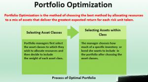

## Table of Contents

## What is portfolio optimization?

Portfolio optimization is a way to pick the best mix of investments to help you reach your financial goals while keeping risks low. It's like choosing a team where each player (or investment) has different strengths and weaknesses. The goal is to find the perfect balance so that the whole team performs well together. By using math and data, you can figure out which mix of stocks, bonds, or other investments will give you the highest return for the least amount of risk.

One common method for portfolio optimization is called the Modern Portfolio Theory (MPT). This theory was created by Harry Markowitz and it says that you can lower risk without giving up too much return by spreading your money across different types of investments. MPT uses something called the efficient frontier, which is a graph that shows the best possible combinations of risk and return. By choosing a portfolio on this efficient frontier, you can make sure you're getting the most out of your investments while keeping risks under control.

In practice, portfolio optimization involves a lot of number crunching and analysis. You need to look at how different investments move together, which is called correlation. If two investments tend to go up and down at the same time, they are highly correlated. By picking investments that don't move in the same way, you can smooth out the ups and downs of your portfolio. Tools like computers and software help investors do this math quickly and accurately, making it easier to build a strong, balanced portfolio.

## Why is portfolio optimization important for investors?

Portfolio optimization is important for investors because it helps them make the most of their money while keeping risks in check. By choosing the right mix of investments, investors can aim for the highest possible returns without taking on too much risk. This is like finding the perfect balance in a game, where you want to score high but also avoid losing points. When investors use portfolio optimization, they can feel more confident that their money is working hard for them, and they're not just hoping for the best.

Another reason portfolio optimization is key is that it helps investors manage their emotions. When the market goes up and down, it's easy to get scared or too excited. But with a well-optimized portfolio, investors can stick to their plan and not make hasty decisions. This steady approach can lead to better results over time. Plus, by spreading money across different types of investments, investors can protect themselves from big losses if one part of the market does poorly. This way, they can sleep better at night knowing their money is safer.

## What are the basic principles of portfolio optimization?

Portfolio optimization is all about picking the best mix of investments to get the most return for the least amount of risk. The main idea is to spread your money across different types of investments, like stocks, bonds, and other assets. This is called diversification. When you diversify, you're less likely to lose a lot of money if one investment does badly. The goal is to find a balance where your investments work well together, helping each other out so your overall portfolio performs better.

Another key principle is understanding how different investments move together, which is called correlation. If two investments tend to go up and down at the same time, they are highly correlated. By choosing investments that don't move in the same way, you can smooth out the ups and downs of your portfolio. This makes it less risky. Tools like the efficient frontier, part of Modern Portfolio Theory, help you see the best combinations of risk and return. By using these tools, you can pick a portfolio that gives you the highest return for the level of risk you're comfortable with.

## How does diversification play a role in portfolio optimization?

Diversification is like having a team of different players, each with their own strengths and weaknesses. In a portfolio, it means spreading your money across different types of investments, like stocks, bonds, and other assets. By doing this, you're not putting all your eggs in one basket. If one type of investment does poorly, others might do well, helping to balance things out. This way, your overall portfolio is less likely to lose a lot of money all at once.

Think of it like this: if you only invest in one company's stock and that company has a bad year, you could lose a lot. But if you also have bonds, real estate, and stocks from different companies and industries, a bad year for one won't hurt your whole portfolio as much. Diversification helps you manage risk while still aiming for good returns. It's a key part of portfolio optimization because it makes your investments work together to give you a smoother ride in the ups and downs of the market.

## What is the difference between risk and return in the context of portfolio optimization?

In portfolio optimization, risk and return are like two sides of the same coin. Return is what you earn from your investments, like the money you make from stocks going up or the interest you get from bonds. Everyone wants high returns because it means more money in your pocket. But, to get those high returns, you often have to take on more risk. Risk is the chance that you might lose money or not make as much as you hoped. It's like riding a roller coaster - the higher you go, the more thrilling it is, but also the scarier it can be.

The key to portfolio optimization is finding the right balance between risk and return. You want to aim for the highest return possible while keeping risk at a level you're comfortable with. This is where diversification comes in. By spreading your money across different types of investments, you can lower your risk without giving up too much return. It's like having a team where different players help each other out, so even if one player has a bad day, the team can still win. This balance helps you sleep better at night, knowing your money is working hard but also safe.

## What are some common portfolio optimization techniques?

One common portfolio optimization technique is called Modern Portfolio Theory (MPT). MPT helps investors find the best mix of investments by looking at how much risk they're willing to take and what kind of return they want. It uses something called the efficient frontier, which is a graph that shows the best possible combinations of risk and return. By choosing a portfolio that's on this efficient frontier, you can get the highest return for the least amount of risk. MPT also looks at how different investments move together, called correlation. If two investments go up and down at the same time, they're highly correlated. By picking investments that don't move the same way, you can make your portfolio smoother and less risky.

Another technique is called the Capital Asset Pricing Model (CAPM). CAPM helps figure out how much return you should expect from an investment based on its risk. It compares the risk of an investment to the overall market risk, which is usually measured by something like the S&P 500. CAPM tells you if an investment is worth the risk by looking at its expected return. If the return is higher than what you'd get from the market for the same level of risk, then it might be a good choice for your portfolio. This helps you decide which investments to add to your mix to get the best balance of risk and return.

A third technique is mean-variance optimization. This method focuses on finding the best balance between the average return (mean) and the ups and downs (variance) of your portfolio. It uses math to figure out how to spread your money across different investments to get the highest return for the least risk. Mean-variance optimization also looks at how different investments move together, similar to MPT. By understanding these movements, you can pick a mix of investments that work well together, helping you reach your financial goals while keeping your portfolio stable.

## How does the Modern Portfolio Theory (MPT) apply to portfolio optimization?

Modern Portfolio Theory (MPT) helps investors find the best mix of investments to get the most return for the least risk. It does this by looking at something called the efficient frontier, which is a graph that shows the best possible combinations of risk and return. By picking a portfolio that's on this efficient frontier, you can be sure you're getting the highest return for the risk you're taking. MPT also pays attention to how different investments move together, called correlation. If two investments go up and down at the same time, they're highly correlated. By choosing investments that don't move the same way, you can make your portfolio smoother and less risky.

In practice, MPT uses math to figure out the best way to spread your money across different types of investments, like stocks, bonds, and other assets. This helps you diversify your portfolio, which means you're not putting all your eggs in one basket. If one investment does poorly, others might do well, balancing things out. This way, your overall portfolio is less likely to lose a lot of money all at once. MPT helps you find the right balance so your investments work together to give you a smoother ride in the ups and downs of the market.

## What role do correlation and covariance play in optimizing a portfolio?

Correlation and covariance are like secret helpers in making your investment portfolio better. They tell you how different investments move together. If two investments go up and down at the same time, they have a high correlation. If they move differently, they have a low correlation. Covariance is similar but it also looks at how big these movements are. By understanding correlation and covariance, you can pick investments that don't all move the same way. This helps you spread out your risk, so if one investment does badly, others might do well and balance things out.

Using correlation and covariance in your portfolio is like having a team where each player does something different. If all your investments move the same way, it's like having a team of players who are all good at one thing but bad at others. By choosing investments with low correlation, you can make sure your portfolio is more balanced. This means your investments can work together to give you a smoother ride in the ups and downs of the market. So, by paying attention to correlation and covariance, you can build a stronger, more stable portfolio.

## How can one use the Efficient Frontier in portfolio optimization?

The Efficient Frontier is like a map that helps you pick the best mix of investments. It shows you all the possible combinations of risk and return you can get from different portfolios. By looking at this map, you can find the portfolios that give you the highest return for the amount of risk you're willing to take. It's like finding the shortest path to your goal without taking too many scary shortcuts. When you use the Efficient Frontier, you can see which investments work well together to make your portfolio stronger and less risky.

To use the Efficient Frontier in your portfolio, you need to think about how much risk you're okay with and how much return you want. Once you know that, you can look at the Efficient Frontier to find the portfolio that fits your goals. It's like choosing the right gear for a hike - you want something that helps you reach the top without wearing you out. By picking a portfolio on the Efficient Frontier, you can feel more confident that your money is working hard for you while keeping risks under control.

## What are the limitations and challenges of portfolio optimization models?

Portfolio optimization models can be really helpful, but they have some limitations. One big challenge is that these models often use past data to predict the future. But the market can change a lot, and what worked before might not work again. This means the models might not be as accurate as we hope. Another limitation is that these models can be hard to understand and use. They need a lot of math and computer power, which can make them tricky for regular people to handle. Plus, the models might not take into account things like taxes, fees, or how much you can actually buy or sell of an investment.

Another challenge is that portfolio optimization models often assume that investors are always logical and make decisions based on numbers. But in real life, people can be influenced by their feelings and might make choices that don't follow the model's advice. This can mess up the results. Also, these models might not consider all the risks out there, like big events that happen out of the blue. So, while portfolio optimization models can guide you, they're not perfect and you need to be careful and think about more than just what the model says.

## How do advanced optimization techniques like Black-Litterman model enhance portfolio optimization?

The Black-Litterman model is like a special tool that helps investors make better guesses about how their investments will do. It starts with what's called the "market equilibrium," which is a fancy way of saying what everyone else thinks the market will do. Then, it lets you add your own ideas about which investments might do better or worse. This mix of what everyone thinks and your own thoughts helps make a more balanced and realistic guess about the future. By using the Black-Litterman model, you can make your portfolio stronger because it takes into account both what's happening in the market and what you believe will happen.

One big advantage of the Black-Litterman model is that it helps manage risk better. It doesn't just focus on getting the highest return; it also looks at how sure you are about your guesses. If you're not very sure about an investment, the model will be careful and not put too much money into it. This way, your portfolio is less likely to be thrown off by a bad guess. The Black-Litterman model also helps you avoid having a portfolio that's too focused on just a few investments, which can be risky. By using this model, you can feel more confident that your portfolio is well-balanced and ready for whatever the market might do.

## What are the latest trends and technologies impacting portfolio optimization?

The latest trends and technologies in portfolio optimization are making it easier and smarter for investors to manage their money. One big trend is the use of artificial intelligence (AI) and machine learning. These technologies can look at huge amounts of data quickly and find patterns that humans might miss. They can predict how different investments might do in the future and suggest the best mix of investments for your portfolio. AI and machine learning can also learn from past mistakes and get better over time, which means your portfolio can keep getting smarter and more optimized.

Another important trend is the rise of robo-advisors. These are online platforms that use algorithms to build and manage your portfolio for you. They're like having a personal financial advisor, but cheaper and more accessible. Robo-advisors can automatically adjust your investments based on what's happening in the market, so you don't have to worry about making changes yourself. They often use the latest portfolio optimization techniques, like the Black-Litterman model, to make sure your money is working hard for you. With these new tools, even people who don't know much about investing can build a strong, well-optimized portfolio.

## What is Modern Portfolio Theory?

Modern Portfolio Theory (MPT), introduced by Harry Markowitz in 1952, has profoundly reshaped investment strategies by emphasizing the importance of diversification and efficient portfolio construction. MPT posits that an investor can construct an "efficient frontier" of optimal portfolios offering the maximum possible expected return for a given level of risk. This insight promotes not only the idea of diversifying investments to mitigate risk but also the notion of evaluating both risk and return as part of the investment decision-making process.

The efficient frontier is central to MPT. It represents a set of portfolios that are not dominated by other portfolios in terms of higher expected return for the same risk or less risk for the same expected return. Mathematically, for a portfolio of assets, the expected return $E(R_p)$ and the variance $\sigma^2_p$ are calculated as follows:

$$
E(R_p) = \sum_{i=1}^{n} w_i E(R_i)
$$

$$
\sigma^2_p = \sum_{i=1}^{n} \sum_{j=1}^{n} w_i w_j \text{Cov}(R_i, R_j)
$$

where $w_i$ is the weight of asset $i$ in the portfolio, $E(R_i)$ is the expected return of asset $i$, and $\text{Cov}(R_i, R_j)$ is the covariance between the returns of assets $i$ and $j$.

Algorithmic trading systems frequently leverage MPT to optimize portfolios by balancing expected returns and risk levels. Using statistical models and optimization algorithms, these systems can analyze vast datasets rapidly, allowing them to create and adjust portfolios dynamically as market conditions change. By optimizing asset weights, these systems aim to maintain the portfolio on the efficient frontier, thus achieving the most favorable risk-return profile. 

The application of MPT in [algorithmic trading](/wiki/algorithmic-trading) also involves incorporating various risk metrics and constraints to fine-tune portfolios. This may include assessing correlations and volatilities of asset returns or adjusting for market and [liquidity](/wiki/liquidity-risk-premium) risks. Here, optimization software can implement MPT by using algorithms like quadratic programming, which is well-suited to solve the optimization problem MPT poses, given its requirement to minimize variance for a target return or maximize return for a given variance level. 

In summary, Modern Portfolio Theory acts as a cornerstone of portfolio optimization strategies, especially within algorithmic trading, where automation and speed are crucial. By employing the principles of MPT, traders can strategically adjust portfolios to strive for optimal performance while managing risk effectively.

## What mathematical tools are used in portfolio optimization?

Constructing a covariance matrix acts as a cornerstone for optimizing portfolios, as it allows for the assessment of asset return correlations. By understanding the relationships between different assets, investors can more accurately predict how a portfolio may perform under various market conditions. This matrix helps identify and minimize risk through diversification.

To tackle the complexity and scale of optimizing large portfolios, tools like linear programming and stochastic programming are critical. Linear programming methods aid in finding the optimal asset weights that minimize risk or maximize returns, given certain constraints. Its strength lies in its ability to handle linear constraints efficiently, making it suitable for certain fixed-income portfolio optimizations or where constraints are straightforwardly linear. An example of a linear programming problem is:

$$

\min \sum_{i=1}^{n} w_i \sigma_{i}^2 
$$

subject to:

$$
\sum_{i=1}^{n} w_i = 1
$$

and

$$
w_i \geq 0 \quad \forall i
$$

where $w_i$ represents the weight of asset $i$, and $\sigma_i^2$ is the variance associated with asset $i$.

Stochastic programming extends these concepts by accounting for uncertainty in the model inputs, such as future asset returns or [interest rate](/wiki/interest-rate-trading-strategies)s, which are not deterministic. This makes it suitable for multi-period portfolio optimization, where future returns are uncertain. It allows for scenario analysis by introducing probabilistic constraints.

Algorithmic trading systems benefit significantly from meta-heuristic methods and principal component-based approaches. Meta-heuristics, such as genetic algorithms and simulated annealing, provide solutions to optimization problems where traditional techniques struggle with large-scale and non-convex spaces. These methods explore a broad search space and are particularly effective in finding near-optimal solutions when exact methods are computationally expensive or inapplicable.

Principal component analysis (PCA) reduces the dimensionality of financial data, identifying the most critical components that explain the bulk of the variance in asset returns. This approach not only simplifies the covariance matrix but also enhances computational efficiency. It allows traders to focus on the key [factor](/wiki/factor-investing)s driving price movements, thereby optimizing portfolio performance.

By integrating these mathematical tools, portfolio optimization becomes a more agile and precise process, allowing algorithmic systems to make informed and efficient trading decisions.

## References & Further Reading

[1]: Markowitz, H. (1952). ["Portfolio Selection."](https://onlinelibrary.wiley.com/doi/abs/10.1111/j.1540-6261.1952.tb01525.x) Journal of Finance, 7(1), 77–91.

[2]: Luenberger, D. G. (1998). ["Investment Science."](https://www.amazon.com/Investment-Science-David-G-Luenberger/dp/0199740089) Oxford University Press.

[3]: Fabozzi, F. J., & Markowitz, H. M. (2011). ["Theory and Practice of Investment Management: Asset Allocation, Valuation, Portfolio Construction, and Strategies."](https://onlinelibrary.wiley.com/doi/book/10.1002/9781118267028) Wiley.

[4]: Roncalli, T. (2013). ["Introduction to Risk Parity and Budgeting."](https://papers.ssrn.com/sol3/papers.cfm?abstract_id=2272973) Chapman and Hall/CRC.

[5]: Grinold, R. C., & Kahn, R. N. (1999). ["Active Portfolio Management: A Quantitative Approach for Producing Superior Returns and Controlling Risk."](https://archive.org/details/activeportfoliom0000grin) McGraw-Hill.