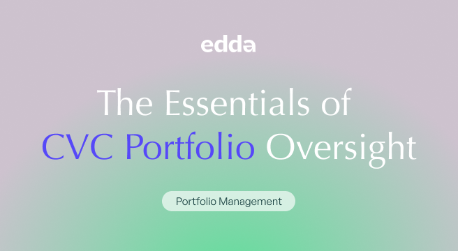

## Table of Contents

## What is portfolio oversight?

Portfolio oversight is when someone or a group keeps an eye on a collection of investments to make sure they are doing well and meeting their goals. This collection, called a portfolio, can include things like stocks, bonds, and other types of investments. The person or group doing the oversight, often called a portfolio manager, checks how the investments are performing, looks at risks, and makes changes if needed to keep the portfolio on track.

The main job of portfolio oversight is to make sure the investments are helping to reach the goals set for them, like growing money or providing income. This involves regularly reviewing the performance of each investment, comparing it to benchmarks or targets, and deciding if any adjustments are necessary. Good portfolio oversight can help avoid big losses and take advantage of opportunities to make more money, making it an important part of managing investments.

## Why is portfolio oversight important for investors?

Portfolio oversight is important for investors because it helps them keep their money safe and growing. When someone watches over their investments, they can see if things are going well or if there are problems. This means they can make changes to avoid losing money or to make more money. Without oversight, investors might not know if their investments are doing badly until it's too late.

Also, portfolio oversight helps investors reach their goals. Everyone has different reasons for investing, like saving for a house, retirement, or their kids' education. By regularly checking the portfolio, investors can make sure their investments are on the right path to meet these goals. If something isn't working, they can fix it before it affects their plans. This way, they can feel more confident and secure about their financial future.

## What are the basic components of a portfolio?

A portfolio is like a collection of different things that someone invests in to try and make more money or reach other financial goals. The basic parts of a portfolio can include stocks, which are pieces of ownership in a company, and bonds, which are like loans that investors give to companies or the government in exchange for interest payments. Another common part is cash or cash equivalents, like money in a savings account or short-term investments that can be turned into cash quickly.

Besides these, a portfolio might also have other types of investments like mutual funds, which are pools of money from many investors used to buy a variety of stocks, bonds, or other assets, and exchange-traded funds (ETFs), which are similar but can be traded like stocks. Some people also include real estate, commodities like gold or oil, and even cryptocurrencies in their portfolios. Each of these parts can help spread out the risk and increase the chances of making money.

The mix of these parts in a portfolio depends on what the investor wants to achieve and how much risk they are willing to take. Someone who wants to grow their money quickly might have more stocks, while someone who wants to keep their money safe might have more bonds and cash. By balancing these different parts, investors can create a portfolio that fits their goals and comfort level with risk.

## How can beginners start with portfolio oversight?

For beginners, starting with portfolio oversight can seem hard, but it's really about keeping an eye on your investments and making sure they're doing what you want them to do. First, you need to know what's in your portfolio. This means understanding the different types of investments you have, like stocks, bonds, or mutual funds. Once you know what you own, you can start checking how they're doing. You can do this by looking at their performance over time, comparing them to similar investments, and seeing if they're helping you reach your goals.

Next, you should set up a routine to check your portfolio regularly. This could be once a month or every few months, depending on what works for you. When you check, look at how each investment is doing and think about if you need to make any changes. If one investment is doing really badly, you might want to sell it and buy something else. Or if your goals have changed, you might need to adjust your portfolio to match. It's also a good idea to learn more about investing as you go, so you can make better decisions. Remember, the key is to keep learning and adjusting your portfolio to make sure it's working for you.

## What tools are available for managing a portfolio?

There are many tools that can help you manage your portfolio. One common tool is a portfolio tracker, which is a website or app that lets you see all your investments in one place. These trackers can show you how your investments are doing, how much they're worth, and even give you ideas on what to buy or sell. Some popular portfolio trackers are apps like Personal Capital, Mint, and websites like Morningstar or Yahoo Finance. They make it easy to keep an eye on your investments without having to check each one separately.

Another useful tool is a robo-advisor, which is a service that uses computer programs to manage your investments for you. Robo-advisors like Betterment or Wealthfront ask you about your goals and how much risk you're okay with, then they pick investments for you and keep an eye on them. They can automatically adjust your portfolio to make sure it stays on track with your goals. This can be a good option if you don't want to spend a lot of time managing your investments yourself. Both portfolio trackers and robo-advisors can make managing your portfolio easier and help you make better decisions about your money.

## What are common metrics used to evaluate portfolio performance?

When you want to know how well your investments are doing, there are a few common ways to measure it. One important measure is the return on investment, or ROI. This tells you how much money you've made or lost from your investments over time. You can look at the total return, which includes any money you've made from selling investments and any money you've gotten from things like dividends or interest. Another common measure is the risk-adjusted return, which looks at how much money you've made compared to how much risk you took. This can help you see if the returns you're getting are worth the risks you're taking.

Another way to check your portfolio's performance is by comparing it to benchmarks. A benchmark is like a standard that you can use to see how well your investments are doing. For example, if you have a lot of stocks, you might compare your portfolio to a stock market index like the S&P 500. If your portfolio is doing better than the benchmark, that's a good sign. You can also look at the volatility of your portfolio, which tells you how much your investments go up and down in value. High volatility means your investments can change a lot, which can be riskier. By using these measures, you can get a good idea of how your portfolio is doing and if you need to make any changes.

## How does risk management play a role in portfolio oversight?

Risk management is a big part of looking after your investments. It's all about figuring out what could go wrong and trying to stop it from happening. When you manage your portfolio, you need to think about how much risk you're okay with. Some investments, like stocks, can go up and down a lot, which means they're riskier. Others, like bonds, are usually safer but might not grow as much. By understanding these risks, you can pick the right mix of investments that fits what you want and how much risk you can handle.

Once you know the risks, you can use different ways to keep them under control. One way is to spread your money around, which is called diversification. This means you don't put all your money in one type of investment. If one investment does badly, the others might do well and balance it out. Another way is to keep checking your portfolio and making changes if things get too risky. For example, if one investment starts to go down a lot, you might sell some of it and buy something safer. By doing these things, you can help protect your money and make sure your investments are working towards your goals.

## What are advanced strategies for optimizing a portfolio?

Advanced strategies for optimizing a portfolio involve using more sophisticated methods to make your investments work better for you. One strategy is called asset allocation, which is about deciding how much of your money to put into different types of investments, like stocks, bonds, and real estate. By choosing the right mix, you can balance risk and reward to match your goals. Another strategy is rebalancing, which means checking your portfolio regularly and making changes to keep it in line with your plan. If one type of investment has grown a lot, you might sell some of it and buy more of another type to keep your portfolio balanced.

Another advanced strategy is using derivatives, like options and futures, to manage risk or boost returns. Derivatives are financial tools that let you bet on the future price of an investment without actually owning it. They can be tricky to use but can help protect your portfolio from big drops or make money if you guess right about market movements. Lastly, tax optimization is important, which means making smart choices to reduce the taxes you pay on your investments. This could involve picking certain types of investments that have tax benefits or selling investments in a way that keeps your tax bill low. By using these advanced strategies, you can make your portfolio work harder and smarter for you.

## How can portfolio oversight be integrated with financial planning?

Portfolio oversight and financial planning go hand in hand because they both help you reach your money goals. When you keep an eye on your investments, you can see if they're helping you save for things like buying a house, retiring, or paying for your kids' school. By checking your portfolio regularly, you can make sure it's on track with your financial plan. If your investments aren't doing well, you might need to change them to keep your plan on track. This way, portfolio oversight helps you stick to your financial plan and make sure your money is working for you.

Financial planning is all about setting goals and figuring out how to reach them, and portfolio oversight is a big part of that. When you make a financial plan, you decide what you want to achieve and how much risk you're okay with. Then, you pick investments that fit your plan. As time goes on, you need to keep checking your portfolio to make sure it's still doing what you want it to do. If your goals change or if the market changes, you might need to adjust your investments. By integrating portfolio oversight with your financial planning, you can make sure your investments are always helping you move towards your goals.

## What are the regulatory considerations in portfolio oversight?

When you manage your investments, you need to follow certain rules set by the government. These rules are called regulations, and they are there to make sure everyone plays fair and to protect investors. For example, if you're working with a financial advisor or a company that manages your money, they have to follow rules about what they can and can't do with your investments. They also have to tell you about any fees they charge and any risks involved. If they don't follow these rules, they could get in trouble.

Regulations can also affect what kinds of investments you can make. Some investments might have special rules about who can buy them or how much you can invest. For example, there are rules about investing in things like mutual funds or retirement accounts. It's important to know these rules so you don't accidentally break them. By understanding and following these regulations, you can make sure your portfolio oversight is done the right way and keep your investments safe and legal.

## How do institutional investors approach portfolio oversight differently from individual investors?

Institutional investors, like big companies or pension funds, have a lot more money to invest than individual investors. Because of this, they can use more advanced strategies and tools to manage their portfolios. They often have teams of experts who watch over their investments all the time. These teams use special computer programs and data to make decisions about buying and selling investments. Institutional investors also have to follow strict rules and report what they're doing to the people who give them money to invest. This means they have to be very careful and organized in how they manage their portfolios.

On the other hand, individual investors usually don't have as much money to invest, so they might not have access to the same tools and resources. They often manage their own portfolios or use simple apps and websites to keep track of their investments. Individual investors might not have to follow as many rules, but they still need to be careful and make smart choices. They might focus more on their personal goals, like saving for a house or retirement, and adjust their investments based on what's happening in their own lives. While institutional investors have more resources and follow stricter rules, individual investors have the flexibility to make decisions that fit their own needs and goals.

## What are the latest trends and technologies impacting portfolio oversight?

The latest trends and technologies are changing how people keep an eye on their investments. One big trend is using artificial intelligence (AI) and machine learning. These technologies can look at a lot of data really fast and find patterns that humans might miss. They can help predict what might happen in the market and suggest the best times to buy or sell investments. Another trend is using robo-advisors, which are computer programs that manage your money for you. They can automatically adjust your investments to keep them in line with your goals, making it easier for people who don't want to spend a lot of time managing their portfolios.

Another important technology is blockchain, which is used for things like cryptocurrencies. Blockchain can make buying and selling investments faster and safer because it keeps a record of everything that happens. It can also help with something called tokenization, which means turning things like real estate or art into digital investments that more people can buy. Lastly, there's a growing focus on sustainable investing, where people choose investments that are good for the environment or society. New tools and data help investors see how their investments affect the world, making it easier to pick ones that match their values.

## References & Further Reading

[1]: Bergstra, J., Bardenet, R., Bengio, Y., & Kégl, B. (2011). ["Algorithms for Hyper-Parameter Optimization."](https://proceedings.neurips.cc/paper/2011/file/86e8f7ab32cfd12577bc2619bc635690-Paper.pdf) Advances in Neural Information Processing Systems 24.

[2]: ["Advances in Financial Machine Learning"](https://www.amazon.com/Advances-Financial-Machine-Learning-Marcos/dp/1119482089) by Marcos Lopez de Prado

[3]: ["Evidence-Based Technical Analysis: Applying the Scientific Method and Statistical Inference to Trading Signals"](https://www.amazon.com/Evidence-Based-Technical-Analysis-Scientific-Statistical/dp/0470008741) by David Aronson

[4]: ["Machine Learning for Algorithmic Trading"](https://github.com/stefan-jansen/machine-learning-for-trading) by Stefan Jansen

[5]: ["Quantitative Trading: How to Build Your Own Algorithmic Trading Business"](https://books.google.com/books/about/Quantitative_Trading.html?id=j70yEAAAQBAJ) by Ernest P. Chan