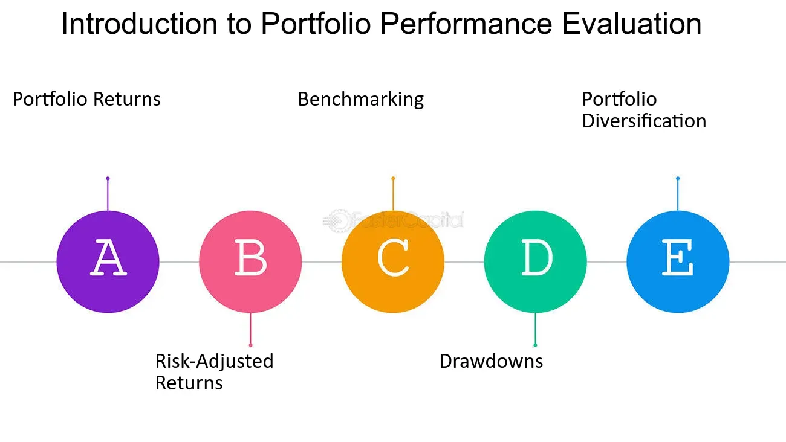

## Table of Contents

## What is portfolio performance evaluation?

Portfolio performance evaluation is a way to check how well your investments are doing. It helps you see if your investments are making money or losing money over time. By looking at the performance, you can decide if you need to change your investments or keep them the same. It's like checking the score in a game to see if you are winning or losing.

There are different ways to measure how well your portfolio is doing. One common way is to compare your portfolio's returns to a benchmark, like a stock market index. If your portfolio is doing better than the benchmark, that's good. Another way is to look at the risk you are taking. If your portfolio is making good returns but with a lot of risk, you might want to think about that. Evaluating your portfolio helps you make smart choices about your money.

## Why is it important to evaluate portfolio performance?

Evaluating portfolio performance is important because it tells you if your investments are doing well or not. It's like checking the health of your money. By looking at how your portfolio is performing, you can see if you are making money or losing it. This helps you decide if you need to make changes to your investments. If your portfolio is not doing well, you might want to sell some investments and buy others that could do better.

Another reason to evaluate portfolio performance is to see if you are taking too much risk. Some investments can make a lot of money but are also very risky. By checking your portfolio's performance, you can see if the risk you are taking is worth it. If your investments are too risky, you might want to switch to safer ones. This helps you keep your money safe while still trying to make it grow.

## What are the basic metrics used in portfolio performance evaluation?

One of the basic metrics used in portfolio performance evaluation is the return on investment (ROI). This tells you how much money you have made or lost from your investments over a certain period. You can compare this return to a benchmark, like a stock market index, to see if your portfolio is doing better or worse than the market. If your portfolio's return is higher than the benchmark, that's a good sign. If it's lower, you might need to make some changes to your investments.

Another important metric is risk, which you can measure using standard deviation. This tells you how much your portfolio's returns can go up and down. A higher standard deviation means more risk, while a lower one means less risk. You want to see if the risk you are taking is worth the return you are getting. If your portfolio has high returns but also high risk, you need to decide if that's okay for you. If the risk is too high, you might want to choose safer investments.

Lastly, the Sharpe ratio is a useful metric that combines both return and risk. It tells you how much return you are getting for the risk you are taking. A higher Sharpe ratio means you are getting good returns without taking too much risk. This helps you see if your portfolio is doing well overall. By looking at these metrics, you can make smart decisions about your investments and keep your money safe and growing.

## How do you calculate the return on a portfolio?

To calculate the return on a portfolio, you first need to know the value of your investments at the beginning and the end of the period you're looking at. Let's say you started with $10,000 and at the end of the year, your portfolio is worth $11,000. The return is the difference between these two amounts, which is $1,000. To turn this into a percentage, you divide the $1,000 by the starting value of $10,000 and then multiply by 100. So, your return is (1,000 / 10,000) * 100 = 10%.

Sometimes, you might also get dividends or interest from your investments. If you do, you need to add these to the end value of your portfolio before calculating the return. For example, if you got $200 in dividends during the year, you would add that to the $11,000, making your end value $11,200. Then, you calculate the return as (11,200 - 10,000) / 10,000 * 100 = 12%. This gives you a more complete picture of how well your portfolio did over the year.

## What is the difference between absolute and relative performance?

Absolute performance tells you how much your portfolio has grown or shrunk over a certain time. It's like looking at the total score in a game. For example, if you started with $10,000 and now your portfolio is worth $11,000, your absolute performance is a 10% increase. This number shows you the actual gain or loss in your investments, without comparing it to anything else.

Relative performance, on the other hand, compares your portfolio's performance to something else, usually a benchmark like the stock market. It's like seeing how your game score compares to others. If the stock market went up by 8% and your portfolio went up by 10%, your relative performance is better than the market. This helps you understand if your investments are doing well compared to what other people are getting.

## How can risk be measured in a portfolio?

Risk in a portfolio can be measured using something called standard deviation. This tells you how much the returns of your investments can go up and down. If the standard deviation is high, it means your portfolio's value can change a lot, which is riskier. If it's low, the value doesn't change as much, so it's less risky. By looking at the standard deviation, you can see if you're comfortable with how much your investments might change.

Another way to measure risk is by looking at something called beta. Beta tells you how your portfolio moves compared to the overall market. If your portfolio has a high beta, it means it moves more than the market, which is riskier. A low beta means it moves less than the market, so it's less risky. This helps you understand if your investments are more or less risky than the market as a whole.

## What role does the Sharpe ratio play in performance evaluation?

The Sharpe ratio is really helpful when you want to see how well your investments are doing. It tells you how much return you're getting for the risk you're taking. If you have a high Sharpe ratio, it means you're getting good returns without taking too much risk. This is like getting a good grade in school while not having to study too hard. A low Sharpe ratio means you might be taking a lot of risk for not much return, which is like studying really hard but still getting a bad grade.

By using the Sharpe ratio, you can compare different investments or see how your whole portfolio is doing. It helps you decide if you should keep your investments the same or make changes. If you see that your Sharpe ratio is lower than you want it to be, you might want to look for safer investments that still give you good returns. This way, you can keep your money safe while trying to make it grow.

## How does the Treynor ratio differ from the Sharpe ratio?

The Treynor ratio and the Sharpe ratio both help you see how well your investments are doing, but they look at risk in different ways. The Sharpe ratio looks at the total risk of your portfolio, which is measured by something called standard deviation. This tells you how much your investments can go up and down. The Sharpe ratio helps you see if the return you're getting is worth the risk you're taking. If you have a high Sharpe ratio, it means you're getting good returns without taking too much risk.

The Treynor ratio, on the other hand, looks at a different kind of risk called beta. Beta tells you how your portfolio moves compared to the overall market. If your portfolio has a high beta, it means it moves more than the market, which is riskier. The Treynor ratio helps you see if the return you're getting is worth the market risk you're taking. So, while the Sharpe ratio is good for looking at the total risk of your investments, the Treynor ratio is better for understanding how your investments do compared to the market.

## What are the limitations of using traditional performance metrics?

Traditional performance metrics like the Sharpe ratio and the Treynor ratio can be very helpful, but they have some limitations. One big problem is that these metrics assume that returns are normally distributed, which means they follow a certain pattern. But in real life, investment returns can be all over the place and not follow this pattern at all. This can make the metrics less accurate because they don't account for the big ups and downs that can happen in the market.

Another limitation is that these metrics focus a lot on past performance, but they don't tell you much about what might happen in the future. Just because your investments did well in the past doesn't mean they will keep doing well. Also, these metrics don't consider things like taxes or fees, which can really affect how much money you actually keep. So, while these metrics are useful, they don't give you the whole picture and should be used along with other ways of looking at your investments.

## How can behavioral finance impact portfolio performance evaluation?

Behavioral finance looks at how people's feelings and habits can affect their choices about money. When it comes to evaluating portfolio performance, people might get too happy when their investments are doing well and too sad when they're not. This can make them make quick decisions without thinking things through. For example, someone might sell all their investments after a big drop in the market because they're scared, even though holding on might be a better choice in the long run.

Also, people often compare their portfolio's performance to what their friends or the market are doing. This can make them feel bad if they're not doing as well, even if their investments are still growing. They might then change their investments to try to keep up, which can lead to taking too much risk. Understanding these behaviors can help people look at their portfolio's performance more clearly and make smarter choices about their money.

## What advanced statistical methods can be used to enhance portfolio performance analysis?

One advanced method to make portfolio performance analysis better is called Monte Carlo simulation. This method uses a computer to run many different scenarios of what might happen to your investments. It's like playing out a bunch of different games to see all the possible outcomes. By doing this, you can see not just what has happened in the past, but also what could happen in the future. This helps you understand the risks and rewards of your investments better and can help you make smarter choices.

Another useful method is called Value at Risk (VaR). This method tells you the most money you could lose over a certain time, like a day or a month, with a certain chance. For example, if your VaR is $1,000 at a 5% chance over a month, it means there's a 5% chance you could lose $1,000 or more in a month. VaR helps you see the worst-case scenarios and plan for them. It's a good way to measure risk and can help you decide if you're okay with the risks you're taking in your portfolio.

## How do multi-factor models contribute to a more nuanced understanding of portfolio performance?

Multi-[factor](/wiki/factor-investing) models help you understand your portfolio's performance in a more detailed way. They look at different things, called factors, that can affect how your investments do. These factors can be things like how big a company is, how much it's growing, or how much risk it takes. By looking at these factors, you can see which ones are helping your portfolio do well and which ones might be holding it back. This helps you make smarter choices about which investments to keep or change.

For example, if you find out that your portfolio does well when companies are growing fast but not so well when they are small, you can use this information to adjust your investments. Multi-factor models give you a clearer picture of what's going on with your money. They help you see beyond just the total return and understand the different pieces that make up your portfolio's performance. This way, you can make more informed decisions and try to improve your investments over time.

## What is Understanding Portfolio Evaluation in Algo Trading?

Algorithmic trading, utilizing sophisticated computer algorithms, enables traders to execute orders, manage trades, and optimize portfolios with precision and speed. One of the core aspects of successful algorithmic trading is the evaluation of portfolio performance, which focuses on maintaining an equilibrium between risk and return. Effective portfolio evaluation is vital for assessing a trading strategy's performance against various risk factors, ultimately guiding traders in refining their strategies.

Key performance indicators (KPIs) offer critical insights into the efficacy of trading algorithms. These metrics help quantify how well a portfolio is performing relative to the risks it undertakes. The two primary factors guiding portfolio evaluation are the returns generated by the portfolio and the associated risks. By analyzing these metrics, traders can gain a clearer understanding of a strategy's strengths and weaknesses.

To achieve a balanced assessment, portfolio evaluation must look at both historical performance and current market conditions. Regular evaluations ensure that trading strategies stay aligned with ever-evolving market trends. This alignment is essential because the financial markets are highly dynamic, with various factors influencing asset prices and market movements.

Risk assessment plays a significant role in the portfolio evaluation process. Risk-return metrics, such as the Sharpe Ratio, [volatility](/wiki/volatility-trading-strategies), and beta, are commonly used. The Sharpe Ratio, for instance, measures the risk-adjusted return of a portfolio, calculated as the average portfolio return minus the risk-free rate divided by the standard deviation of returns:

$$
\text{Sharpe Ratio} = \frac{R_p - R_f}{\sigma_p}
$$

where $R_p$ is the expected portfolio return, $R_f$ is the risk-free rate, and $\sigma_p$ is the standard deviation of the portfolio return.

Additionally, aligning trading strategies with dynamic market conditions involves leveraging tools and techniques like [backtesting](/wiki/backtesting). Backtesting involves simulating a strategy using historical data to evaluate its potential performance in real-market scenarios. This process identifies whether a strategy's success is due to genuine robustness or mere chance.

Python can be a useful tool in this process, allowing for automated backtesting and analysis. Python libraries like pandas, NumPy, and PyAlgoTrade provide functionalities for data manipulation, numerical computations, and backtesting strategies respectively. Here is a simple example of using Python for strategy backtesting:

```python
import pandas as pd
import talib
import numpy as np

# Load historical data
data = pd.read_csv('historical_data.csv')
prices = data['Close']

# Generate trading signals based on a simple moving average crossover
short_window = 40
long_window = 100
signals = pd.DataFrame(index=data.index)
signals['signal'] = 0.0

# Generate short simple moving average
signals['short_mavg'] = prices.rolling(window=short_window, min_periods=1, center=False).mean()

# Generate long simple moving average
signals['long_mavg'] = prices.rolling(window=long_window, min_periods=1, center=False).mean()

# Create signals
signals['signal'][short_window:] = np.where(signals['short_mavg'][short_window:] > signals['long_mavg'][short_window:], 1.0, 0.0)

# Calculate returns
signals['returns'] = prices.pct_change()
signals['strategy_returns'] = signals['returns'] * signals['signal'].shift(1)

# Evaluate strategy
sharpe_ratio = signals['strategy_returns'].mean() / signals['strategy_returns'].std() * np.sqrt(252)

print(f'Sharpe Ratio: {sharpe_ratio}')
```

Such tools and methods play a pivotal role in effectively evaluating and continuously refining [algorithmic trading](/wiki/algorithmic-trading) strategies, ensuring they meet the set performance standards and maintain strong alignment with the market's dynamic nature. As part of this process, traders can make informed decisions to optimize their portfolios, enhancing the overall outcomes of their algorithmic trading endeavors.

## What are the key metrics for evaluating algorithmic trading strategies?

In algorithmic trading, evaluating a strategy’s performance is vital to ensuring its effectiveness and profitability. Several key metrics are widely used to assess algorithmic trading strategies, each providing a unique perspective on risk and return. 

The **Sharpe Ratio** is one of the most established metrics, measuring the risk-adjusted return of an investment strategy. It is calculated by subtracting the risk-free rate from the strategy's return and dividing the result by the standard deviation of the strategy's returns. Mathematically, the Sharpe Ratio ($S$) can be represented as:

$$
S = \frac{R_p - R_f}{\sigma_p}
$$

where $R_p$ is the portfolio return, $R_f$ is the risk-free rate, and $\sigma_p$ is the standard deviation of the portfolio's excess return. A higher Sharpe Ratio indicates better risk-adjusted returns.

**Maximum Drawdown** assesses the largest loss from a peak to a trough in a portfolio's value. This metric is crucial for understanding downside risk. It is expressed as a percentage drop from the highest point (peak) to the lowest point (trough). The formula for Maximum Drawdown (MDD) is:

$$
MDD = \frac{\text{Peak Value} - \text{Trough Value}}{\text{Peak Value}}
$$

A smaller maximum drawdown suggests a more resilient trading strategy against losses.

**Win Rate** calculates the percentage of trades that are profitable from the total number of trades executed. It is an indicator of the strategy’s success rate and is calculated as:

$$
\text{Win Rate} = \left( \frac{\text{Number of Winning Trades}}{\text{Total Number of Trades}} \right) \times 100\%
$$

A high win rate suggests a high probability of executing successful trades, but it should be considered alongside other metrics as it does not account for the magnitude of wins and losses.

The **Profit Factor** is the ratio of gross profits to gross losses. It gives a straightforward measure of overall profitability by examining how much profit is made for every dollar lost. The Profit Factor is expressed as:

$$
\text{Profit Factor} = \frac{\text{Total Profit}}{\text{Total Loss}}
$$

A Profit Factor above 1 indicates that a strategy is profitable overall.

Lastly, **Average Trade** provides insight into the mean profit or loss per trade executed, offering a parameter for understanding typical trade performance. It is calculated as:

$$
\text{Average Trade} = \frac{\text{Total Net Profit}}{\text{Total Number of Trades}}
$$

This metric is useful for understanding the expected value of trades.

These metrics together paint a comprehensive picture of a trading strategy's performance, offering insights that can guide further development and enhancement of algorithms. Understanding and utilizing these metrics is crucial for optimizing strategies to achieve desired investment outcomes.

## References & Further Reading

[1]: ["Advances in Financial Machine Learning"](https://www.amazon.com/Advances-Financial-Machine-Learning-Marcos/dp/1119482089) by Marcos Lopez de Prado

[2]: Bergstra, J., Bardenet, R., Bengio, Y., & Kégl, B. (2011). ["Algorithms for Hyper-Parameter Optimization."](https://proceedings.neurips.cc/paper/2011/file/86e8f7ab32cfd12577bc2619bc635690-Paper.pdf) Advances in Neural Information Processing Systems 24.

[3]: ["Quantitative Trading: How to Build Your Own Algorithmic Trading Business"](https://www.amazon.com/Quantitative-Trading-Build-Algorithmic-Business/dp/1119800064) by Ernest P. Chan

[4]: ["Machine Learning for Algorithmic Trading"](https://github.com/stefan-jansen/machine-learning-for-trading) by Stefan Jansen

[5]: ["Evidence-Based Technical Analysis: Applying the Scientific Method and Statistical Inference to Trading Signals"](https://www.amazon.com/Evidence-Based-Technical-Analysis-Scientific-Statistical/dp/0470008741) by David Aronson