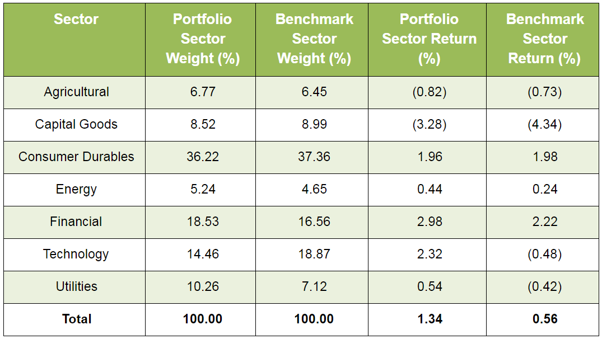

Algorithmic trading, often abbreviated as algo trading, refers to the practice of using computer algorithms to facilitate and manage trading processes, thereby automating decision-making in financial markets. This approach leverages advanced mathematical models and statistical techniques to execute orders at speeds and frequencies that are beyond the capabilities of human traders. As algo trading becomes increasingly prevalent, the evaluation of portfolio performance emerges as a critical aspect of ensuring the effective implementation of trading strategies.

Portfolio evaluation in algo trading is essential for several reasons. Firstly, it enables traders to assess the effectiveness of their strategies by measuring key performance metrics, such as returns and risks. This assessment aids traders in identifying and rectifying any discrepancies or errors present in their strategies, thus optimizing performance. By conducting systematic evaluations, traders can adjust their strategies to align them with prevailing market conditions, thereby enhancing their decision-making process.



This article aims to explore the key metrics used to evaluate portfolio performance within the context of algorithmic trading. Understanding these metrics is fundamental to improving investment outcomes, as they provide valuable insights that guide traders in making informed decisions. Evaluating portfolio performance not only helps in optimizing trading strategies but also contributes to improved risk management, ensuring that traders are well-prepared to navigate the complexities of the financial markets.

Through careful assessment and regular performance checks, traders can maintain high standards of strategy implementation, leading to potential enhancements in investment returns. By systematically leveraging performance metrics, algorithmic traders can make data-driven decisions, ultimately optimizing their trading portfolios for improved financial outcomes.

## Table of Contents

## Understanding Portfolio Evaluation in Algo Trading

Algorithmic trading, utilizing sophisticated computer algorithms, enables traders to execute orders, manage trades, and optimize portfolios with precision and speed. One of the core aspects of successful algorithmic trading is the evaluation of portfolio performance, which focuses on maintaining an equilibrium between risk and return. Effective portfolio evaluation is vital for assessing a trading strategy's performance against various risk factors, ultimately guiding traders in refining their strategies.

Key performance indicators (KPIs) offer critical insights into the efficacy of trading algorithms. These metrics help quantify how well a portfolio is performing relative to the risks it undertakes. The two primary factors guiding portfolio evaluation are the returns generated by the portfolio and the associated risks. By analyzing these metrics, traders can gain a clearer understanding of a strategy's strengths and weaknesses.

To achieve a balanced assessment, portfolio evaluation must look at both historical performance and current market conditions. Regular evaluations ensure that trading strategies stay aligned with ever-evolving market trends. This alignment is essential because the financial markets are highly dynamic, with various factors influencing asset prices and market movements.

Risk assessment plays a significant role in the portfolio evaluation process. Risk-return metrics, such as the Sharpe Ratio, [volatility](/wiki/volatility-trading-strategies), and beta, are commonly used. The Sharpe Ratio, for instance, measures the risk-adjusted return of a portfolio, calculated as the average portfolio return minus the risk-free rate divided by the standard deviation of returns:

$$
\text{Sharpe Ratio} = \frac{R_p - R_f}{\sigma_p}
$$

where $R_p$ is the expected portfolio return, $R_f$ is the risk-free rate, and $\sigma_p$ is the standard deviation of the portfolio return.

Additionally, aligning trading strategies with dynamic market conditions involves leveraging tools and techniques like [backtesting](/wiki/backtesting). Backtesting involves simulating a strategy using historical data to evaluate its potential performance in real-market scenarios. This process identifies whether a strategy's success is due to genuine robustness or mere chance.

Python can be a useful tool in this process, allowing for automated backtesting and analysis. Python libraries like pandas, NumPy, and PyAlgoTrade provide functionalities for data manipulation, numerical computations, and backtesting strategies respectively. Here is a simple example of using Python for strategy backtesting:

```python
import pandas as pd
import talib
import numpy as np

# Load historical data
data = pd.read_csv('historical_data.csv')
prices = data['Close']

# Generate trading signals based on a simple moving average crossover
short_window = 40
long_window = 100
signals = pd.DataFrame(index=data.index)
signals['signal'] = 0.0

# Generate short simple moving average
signals['short_mavg'] = prices.rolling(window=short_window, min_periods=1, center=False).mean()

# Generate long simple moving average
signals['long_mavg'] = prices.rolling(window=long_window, min_periods=1, center=False).mean()

# Create signals
signals['signal'][short_window:] = np.where(signals['short_mavg'][short_window:] > signals['long_mavg'][short_window:], 1.0, 0.0)

# Calculate returns
signals['returns'] = prices.pct_change()
signals['strategy_returns'] = signals['returns'] * signals['signal'].shift(1)

# Evaluate strategy
sharpe_ratio = signals['strategy_returns'].mean() / signals['strategy_returns'].std() * np.sqrt(252)

print(f'Sharpe Ratio: {sharpe_ratio}')
```

Such tools and methods play a pivotal role in effectively evaluating and continuously refining [algorithmic trading](/wiki/algorithmic-trading) strategies, ensuring they meet the set performance standards and maintain strong alignment with the market's dynamic nature. As part of this process, traders can make informed decisions to optimize their portfolios, enhancing the overall outcomes of their algorithmic trading endeavors.

## Key Metrics for Evaluating Algorithmic Trading Strategies

In algorithmic trading, evaluating a strategy’s performance is vital to ensuring its effectiveness and profitability. Several key metrics are widely used to assess algorithmic trading strategies, each providing a unique perspective on risk and return. 

The **Sharpe Ratio** is one of the most established metrics, measuring the risk-adjusted return of an investment strategy. It is calculated by subtracting the risk-free rate from the strategy's return and dividing the result by the standard deviation of the strategy's returns. Mathematically, the Sharpe Ratio ($S$) can be represented as:

$$
S = \frac{R_p - R_f}{\sigma_p}
$$

where $R_p$ is the portfolio return, $R_f$ is the risk-free rate, and $\sigma_p$ is the standard deviation of the portfolio's excess return. A higher Sharpe Ratio indicates better risk-adjusted returns.

**Maximum Drawdown** assesses the largest loss from a peak to a trough in a portfolio's value. This metric is crucial for understanding downside risk. It is expressed as a percentage drop from the highest point (peak) to the lowest point (trough). The formula for Maximum Drawdown (MDD) is:

$$
MDD = \frac{\text{Peak Value} - \text{Trough Value}}{\text{Peak Value}}
$$

A smaller maximum drawdown suggests a more resilient trading strategy against losses.

**Win Rate** calculates the percentage of trades that are profitable from the total number of trades executed. It is an indicator of the strategy’s success rate and is calculated as:

$$
\text{Win Rate} = \left( \frac{\text{Number of Winning Trades}}{\text{Total Number of Trades}} \right) \times 100\%
$$

A high win rate suggests a high probability of executing successful trades, but it should be considered alongside other metrics as it does not account for the magnitude of wins and losses.

The **Profit Factor** is the ratio of gross profits to gross losses. It gives a straightforward measure of overall profitability by examining how much profit is made for every dollar lost. The Profit Factor is expressed as:

$$
\text{Profit Factor} = \frac{\text{Total Profit}}{\text{Total Loss}}
$$

A Profit Factor above 1 indicates that a strategy is profitable overall.

Lastly, **Average Trade** provides insight into the mean profit or loss per trade executed, offering a parameter for understanding typical trade performance. It is calculated as:

$$
\text{Average Trade} = \frac{\text{Total Net Profit}}{\text{Total Number of Trades}}
$$

This metric is useful for understanding the expected value of trades.

These metrics together paint a comprehensive picture of a trading strategy's performance, offering insights that can guide further development and enhancement of algorithms. Understanding and utilizing these metrics is crucial for optimizing strategies to achieve desired investment outcomes.

## Portfolio Evaluation Tools

Backtesting platforms are essential in algorithmic trading as they allow traders to simulate strategies using historical data to evaluate potential performance without financial risk. These platforms provide an environment to test how a trading strategy would have performed over a past period. By using historical market data, traders can assess if their strategies can generate profits and evaluate risk-adjusted returns. For instance, a basic backtesting setup in Python might involve using libraries such as pandas for data manipulation and numpy for calculations, alongside specific algorithmic trading libraries like Backtrader.

Statistical analysis tools are employed to analyze data beyond mere performance metrics, focusing on the effectiveness and reliability of trading strategies. These tools often calculate key metrics like volatility, correlation, and distribution of returns. The aim is to quantitatively validate the assumptions behind a trading strategy, ensuring that it is not just a result of random chance but holds statistical significance. For example, a Monte Carlo simulation could be used to understand potential variations in strategy performance by simulating thousands of possible scenarios.

Visualization tools serve a significant role by graphically representing performance data. They help traders uncover patterns and trends that might not be immediately evident in raw numerical data. Visualization enables a clearer understanding of how strategies perform over time, highlighting aspects like volatility spikes or drawdowns visually. Tools such as matplotlib or Plotly in Python can be used to create comprehensive visual representations, facilitating better insights into trading strategy performance.

Collectively, these tools help refine trading strategies before live implementation, minimizing potential losses and enhancing strategy robustness. Through backtesting, statistical analysis, and visualization, traders gain a comprehensive understanding of their strategies, enabling informed decision-making and strategy optimization in algorithmic trading.

## Challenges and Considerations in Performance Evaluation

Overfitting is a significant challenge in performance evaluation for algorithmic trading. This occurs when a trading strategy is excessively tailored to historical data, resulting in suboptimal performance when applied to new data. Overfitting can be identified by a strategy's high complexity and a disproportionately large number of parameters, which enable it to capture noise rather than the underlying market trends. To mitigate overfitting, traders can employ techniques such as cross-validation, wherein the dataset is divided into multiple parts to ensure the model's robustness across different data segments.

Transaction costs, including brokerage fees, taxes, and slippage, represent another critical consideration. These costs can erode potential profits, particularly in high-frequency trading environments where trades occur at rapid intervals. For example, slippage—the difference between the expected price of a trade and the actual price—can lead to significant losses during volatile market conditions. Incorporating transaction costs into algorithmic models is essential for realistic performance evaluation. In Python, transaction costs can be factored into backtesting simulations using libraries such as `zipline` or `[backtrader](/wiki/backtrader)`.

Market conditions, which can fluctuate due to economic, political, or technological factors, greatly influence strategy performance. Strategies that perform well under certain market conditions (e.g., bull markets) may not yield similar returns during bear markets or periods of high volatility. Adaptive strategies that adjust to changing conditions are more resilient. For instance, a strategy incorporating [momentum](/wiki/momentum) indicators might excel in trending markets but require adjustments in range-bound scenarios.

Lastly, risk tolerance and investment objectives are fundamental when evaluating performance. Traders must align their strategies with their risk appetite, which can vary from conservative to aggressive. A comprehensive evaluation should consider the drawdown, volatility, and return expectations to ensure the strategy matches the investor's objectives. This balance can be quantified with metrics such as the Sharpe Ratio, which juxtaposes return against risk. 

To optimize algorithmic trading strategies, addressing these challenges and considerations with a systematic approach is crucial, ensuring alignment with both market dynamics and individual investment goals.

## Steps for Effective Performance Evaluation

Effective performance evaluation of algorithmic trading strategies involves several structured steps designed to ensure a precise and informed analysis of trading outcomes. This process is essential in optimizing strategies and making data-driven decisions.

**Collect and Prepare Historical Market Data**

The first step in performance evaluation is the collection and preparation of historical market data. This data serves as the foundation for simulating trading strategies through backtesting. Traders must ensure that the data is clean, free of errors, and encompasses a representative time frame that captures various market conditions. Pre-processing steps may include adjusting for corporate actions like stock splits and dividend distributions as well as filtering out anomalous data points. 

**Conduct Backtesting**

Backtesting involves simulating trading strategies using historical data to evaluate how they would have performed in the past. This step is critical as it provides a preliminary assessment of a strategy’s potential success. The process typically involves implementing the trading strategy in a backtesting platform and analyzing its performance without the biases of real-world execution limitations. The main objective is to identify patterns, profitability, and potential weaknesses. Here is a basic Python example using a library like pandas alongside a hypothetical strategy:

```python
import pandas as pd

# Example data loading
data = pd.read_csv('historical_data.csv', parse_dates=True, index_col='Date')

# Example strategy: Simple Moving Average Crossover
data['SMA50'] = data['Close'].rolling(window=50).mean()
data['SMA200'] = data['Close'].rolling(window=200).mean()

# Backtesting logic
data['Signal'] = 0
data['Signal'][50:] = np.where(data['SMA50'][50:] > data['SMA200'][50:], 1, -1)
data['Strategy_Return'] = data['Signal'].shift(1) * data['Close'].pct_change()

# Performance evaluation
cumulative_strategy_return = (1 + data['Strategy_Return']).cumprod()
```

**Calculate Performance Metrics**

After conducting backtesting, it is essential to compute performance metrics such as the Sharpe Ratio, Maximum Drawdown, and Profit Factor. These metrics provide insight into the strategy's risk-adjusted returns, potential losses, and overall profitability. Calculating these metrics allows traders to objectively compare different strategies or the same strategy under different conditions.

Math formulas for essential metrics include:

- **Sharpe Ratio**: $\text{Sharpe Ratio} = \frac{\bar{R} - R_f}{\sigma_R}$
  where $\bar{R}$ is the average return, $R_f$ is the risk-free rate, and $\sigma_R$ is the standard deviation of returns.

- **Maximum Drawdown**: Calculated as the largest drop from a peak to a trough.

**Perform Statistical Analysis**

Statistical analysis is conducted to validate the robustness and reliability of the trading strategy. This can include hypothesis testing, regression analysis, or Monte Carlo simulations to understand the probability of various outcomes under different scenarios. Statistical methods help ensure that the observed performance is not due to random chance and is likely to persist in different market conditions.

**Iterate and Refine Strategies**

Performance evaluation is an iterative process. Based on the findings from backtesting and analysis, traders need to refine and adjust their strategies. This may involve tweaking parameters, testing different market conditions, or adapting new algorithms. Continuous iteration allows the strategy to remain aligned with changing market dynamics and enhance its performance over time.

Overall, following these steps for performance evaluation increases the likelihood of deploying successful algorithmic trading strategies that are well-suited to achieving desired trading objectives.

## Conclusion

Portfolio performance evaluation is crucial in algorithmic trading as it enables optimization of trading strategies. By understanding and monitoring key metrics, traders are equipped to uphold performance standards. Essential metrics like the Sharpe Ratio, Maximum Drawdown, Win Rate, Profit Factor, and Average Trade provide comprehensive insights into the risk and returns associated with trading strategies. Utilizing these metrics allows for systematic assessment and improvement of trading methods.

Regular performance evaluations are necessary to ensure that trading strategies remain in sync with ever-changing market conditions. This dynamic alignment aids in risk management, offering traders the ability to adjust their strategies proactively rather than reactively. Successful risk management not only safeguards investments but also enhances potential returns, as strategies are continually fine-tuned to meet market demands and investor goals.

Moreover, effective evaluation practices lead to more informed decision-making, which is a cornerstone of successful trading. By leveraging performance metrics, algorithmic traders can optimize their portfolios to align with their risk tolerance and investment objectives. This optimization involves iterative testing and refinement of strategies, utilizing historical data and statistical analysis to verify their robustness and reliability.

In conclusion, the systematic evaluation of portfolio performance is an indispensable element of algorithmic trading. It empowers traders with the knowledge and tools necessary to navigate complex market environments, maximize returns, and maintain effective, risk-adjusted strategies over time.

## References & Further Reading

[1]: ["Advances in Financial Machine Learning"](https://www.amazon.com/Advances-Financial-Machine-Learning-Marcos/dp/1119482089) by Marcos Lopez de Prado

[2]: Bergstra, J., Bardenet, R., Bengio, Y., & Kégl, B. (2011). ["Algorithms for Hyper-Parameter Optimization."](https://proceedings.neurips.cc/paper/2011/file/86e8f7ab32cfd12577bc2619bc635690-Paper.pdf) Advances in Neural Information Processing Systems 24.

[3]: ["Quantitative Trading: How to Build Your Own Algorithmic Trading Business"](https://www.amazon.com/Quantitative-Trading-Build-Algorithmic-Business/dp/1119800064) by Ernest P. Chan

[4]: ["Machine Learning for Algorithmic Trading"](https://github.com/stefan-jansen/machine-learning-for-trading) by Stefan Jansen

[5]: ["Evidence-Based Technical Analysis: Applying the Scientific Method and Statistical Inference to Trading Signals"](https://www.amazon.com/Evidence-Based-Technical-Analysis-Scientific-Statistical/dp/0470008741) by David Aronson