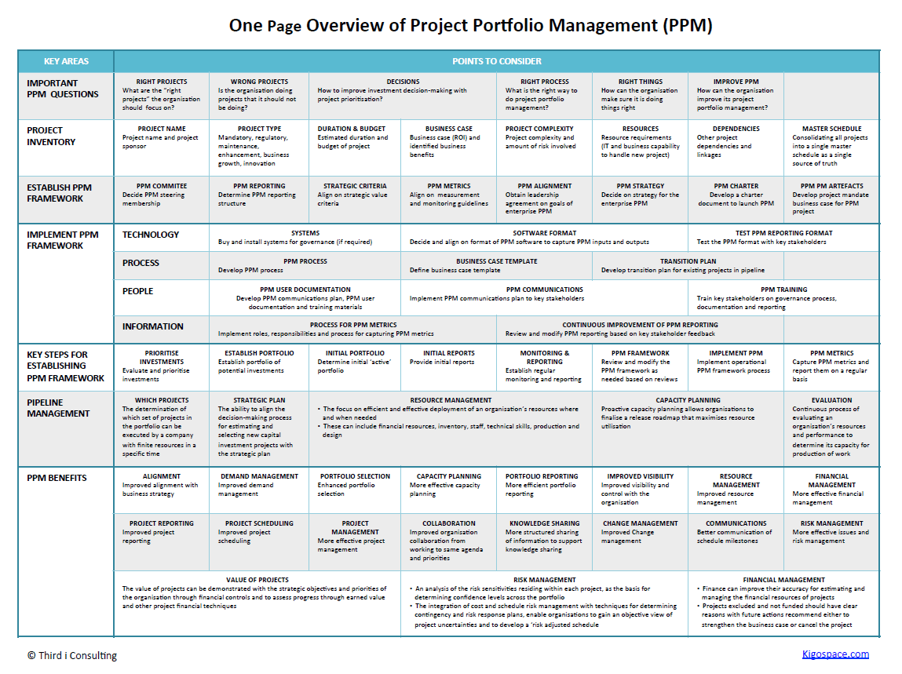

Understanding and effectively managing investments is crucial for achieving long-term financial goals. Investment strategy, portfolio planning, financial planning, and algorithmic trading each play interconnected roles in this process. As investors strive to achieve their financial objectives, these components offer distinct yet complementary functions that, when combined, enhance the potential for optimal outcomes.

Investment strategy serves as a guide, determining how assets are allocated based on specific goals and risk tolerance. Different strategies, whether aggressive or conservative, need to be aligned with personal financial objectives to ensure effective asset management and growth over time. Meanwhile, financial planning provides a framework to organize resources, ensuring economic stability and enabling the realization of set goals through budgeting, saving, and risk management.



Portfolio management focuses on constructing and maintaining an investment portfolio that aligns with the investor's objectives, involving tasks like asset allocation, diversification, and continuous rebalancing. This ensures that investments remain aligned with the intended strategy, adapting to changing market conditions and thus reducing risks.

Algorithmic trading introduces significant advancements by leveraging computer programs to execute trades with precision and speed, minimizing human emotion's impact on decision-making. It employs complex strategies to exploit market opportunities, enhancing investment efficiency.

The convergence of these elements allows investors to develop a comprehensive, resilient, and adaptable strategy to manage their investments effectively. By evaluating and integrating these components, investors can enhance risk management and make informed financial decisions that contribute to sustained success.

The rise of technology, particularly in artificial intelligence (AI) and machine learning, is providing enhanced capabilities within this domain. AI-driven tools are transforming investment management by analyzing massive data sets for better insights, enabling investors to anticipate and respond to market shifts effectively. Embracing these technological advancements promises to equip investors with a competitive edge, ultimately facilitating a more informed and systematic approach to achieving richer financial outcomes.

## Table of Contents

## Investment Strategy

Investment strategy is pivotal in determining how assets are allocated, taking into account an investor's specific goals and risk tolerance. These strategies form the blueprint for making informed investment decisions, thereby maximizing potential returns while managing associated risks.

Investment strategies can broadly be categorized along a spectrum that ranges from aggressive to conservative. Aggressive investment strategies are characterized by a higher risk tolerance with the objective of achieving substantial returns. These strategies often include investments in volatile markets, emerging sectors, or [growth stocks](/wiki/growth-stocks), which can yield significant profits but also [carry](/wiki/carry-trading) a higher likelihood of loss. On the other end of the spectrum, conservative strategies prioritize capital preservation and typically involve investments in stable and less volatile markets, such as government bonds or blue-chip stocks. Such strategies suit investors who prefer safety and predictability over high returns.

The selection of an appropriate investment strategy should align closely with the individual’s financial objectives and personal risk profile. Understanding one's risk appetite and financial goals is essential in tailoring an investment strategy that balances risk and reward effectively.

Tools such as the Sharpe ratio and modern portfolio theory (MPT) are instrumental in optimizing investment decisions. The Sharpe ratio, defined as:

$$
\text{Sharpe Ratio} = \frac{R_p - R_f}{\sigma_p}
$$

where $R_p$ is the return on the portfolio, $R_f$ is the risk-free rate, and $\sigma_p$ is the standard deviation of the portfolio’s excess return, offers a measure of the risk-adjusted return of an investment. A higher Sharpe ratio indicates a more favorable risk-adjusted performance.

Modern portfolio theory, developed by Harry Markowitz, hinges on the concept of diversification. MPT suggests that an optimal portfolio can be constructed to provide the maximum expected return for a given level of risk through a mix of asset types. The theory posits that risk can be minimized not by choosing one high-risk or low-risk investment, but by creating a portfolio that combines different types of assets whose price variations offset each other to some extent.

Using these tools, investors can create well-rounded portfolios that align with their overall strategy, whether they prioritize growth, balance, or capital preservation. The strategic allocation of assets, influenced by these factors and tools, forms the cornerstone of effective investment management, facilitating the achievement of long-term financial goals.

## Financial Planning

Financial planning is a structured approach to managing personal finance with the aim of achieving economic stability and growth over time. It involves the systematic organization of financial resources through budgeting, saving, investing, and risk management to ensure an individual's or household's financial health and progress toward future financial objectives.

Budgeting is one of the most critical components of financial planning. It involves creating a detailed plan that outlines income, expenses, and savings targets. By understanding and tracking where money comes from and where it goes, individuals can make informed decisions to allocate resources more effectively, ensuring that spending aligns with personal financial goals. 

Saving is another essential element, serving as a foundation for both financial security and investment opportunities. It involves setting aside a portion of income for future use, which can provide a safety net for emergencies or be used for specific goals such as buying a home, funding education, or retirement. A systematic savings plan can help in accumulating wealth over time, often facilitated by tools like high-yield savings accounts or retirement accounts such as 401(k)s or IRAs in the U.S.

Investing, closely related to saving, focuses on using saved resources to generate returns. When integrating investment strategies into a financial plan, individuals can optimize their resources for better financial outcomes. This involves selecting appropriate investment vehicles that align with one's risk tolerance and financial objectives. The use of metrics like the Sharpe ratio can help assess the risk-return tradeoff of an investment portfolio, guiding decision-making to optimize returns.

Risk management is equally vital in financial planning, aimed at identifying, assessing, and prioritizing risks. It involves implementing strategies to mitigate potential financial losses due to unforeseen events. Insurance products like health, life, and property insurance can provide protection against significant financial setbacks.

Effective financial planning ensures a smooth path toward achieving future financial goals. By setting clear objectives, individuals can measure progress and make necessary adjustments along the way. Regularly reviewing and updating the financial plan in response to changing circumstances or goals is crucial to maintaining financial stability.

Integrating these key components—budgeting, saving, investing, and risk management—within a coherent financial strategy enhances the overall optimization of resources. This strategic integration not only facilitates progress toward predefined financial goals but also enables flexibility to adapt to economic changes, ultimately leading to better financial outcomes and increased economic security.

## Portfolio Management

Portfolio management involves constructing and maintaining a collection of investments that align with an investor's financial objectives. An effective portfolio manager seeks to balance the expected returns of the portfolio with the associated risk, taking into account an investor's specific goals and risk tolerance.

Active management and passive management are two primary approaches to portfolio management. Active management aims to outperform benchmark indices through the selection of securities that the manager believes are undervalued or have growth potential. This may involve extensive research, market analysis, and the ability to predict future trends. On the other hand, passive management seeks to replicate market performance by purchasing and holding a diversified portfolio of securities that mirror a market index, such as the S&P 500. Passive management typically involves lower fees due to reduced transaction costs and management expenses.

Key tasks in portfolio management include asset allocation, diversification, and rebalancing. Asset allocation refers to the distribution of investments across various asset classes, such as stocks, bonds, and real estate, to optimize the balance between risk and return. Diversification involves investing in a wide range of assets to reduce the risk of the portfolio by minimizing the impact of any single investment's poor performance on the overall portfolio return.

Rebalancing is an essential process in maintaining the intended asset allocation of a portfolio over time. As market conditions shift and the values of assets change, the proportion of each asset class in a portfolio may drift from the target allocation. Rebalancing involves periodically buying or selling assets to realign the portfolio with its original allocation. This ensures that the portfolio continues to reflect the investor's risk tolerance and investment strategy.

A classic formula utilized in portfolio management is the Modern Portfolio Theory (MPT) framework, which is expressed as:

$$
E(R_p) = \sum_{i=1}^{n} w_i E(R_i)
$$

where $E(R_p)$ is the expected return of the portfolio, $w_i$ is the weight of each individual asset in the portfolio, and $E(R_i)$ is the expected return of each individual asset.

In summary, effective portfolio management requires a strategic approach to asset allocation, diversification, and regular rebalancing to accommodate changing market conditions and maintain alignment with an investor's financial goals. By choosing the appropriate mix of active and passive strategies, investors can optimize their portfolios for maximum returns within their desired risk parameters.

## Algorithmic Trading

Algorithmic trading employs computer programs to automatically execute trades based on a set of predetermined criteria, enhancing trading efficiency by ensuring speed and precision while negating emotional biases in decision-making. This method leverages quantitative models to identify trading opportunities and execute orders at optimal times, reacting immediately to market conditions without human intervention.

The fundamental premise of [algorithmic trading](/wiki/algorithmic-trading) is to capitalize on the efficiency of computers to process vast amounts of data, analyze market conditions, and execute trades swiftly. This can lead to significant advantages over manual trading, particularly in high-frequency trading environments where decisions must be made within fractions of a second. Algorithms can also process more information than a human trader could, spotting trends or anomalies that may indicate profitable trading opportunities.

There are several common strategies employed in algorithmic trading:

1. **Trend-following strategies**: These strategies aim to capture gains through the analysis of an asset's momentum in a particular direction. Popular indicators used in these strategies include moving averages and channel breakouts, which do not require predictive forecasts but rely on known market patterns.

2. **Arbitrage opportunities**: Algorithms facilitate the identification and exploitation of price discrepancies across different markets or instruments. If a stock is traded at different prices on two different exchanges, the algorithm quickly executes buy and sell orders to exploit the price difference.

3. **Mean reversion**: This strategy is based on the concept that an asset's price will tend to return to its average value or mean price over time. When the current price deviates significantly from the average, algorithms trigger orders anticipating a return to the mean.

Despite the significant potential benefits, algorithmic trading carries its own set of risks. A primary concern is the risk of technical failures, which can result from software glitches, connectivity issues, or errors in the logic of the trading algorithms themselves. Markets can also behave irrationally or unpredictably, leading to unexpected consequences for algorithmic strategies that weren't programmed to handle such conditions.

Market [volatility](/wiki/volatility-trading-strategies) poses another risk, as rapid market movements can lead to varying trading conditions not accounted for by static algorithmic programs. This increases the importance of rigorous testing and continual adaptation of algorithms to ensure robustness against a wide variety of market scenarios.

In summary, while algorithmic trading offers considerable advantages through automation, efficiency, and reduced emotional influence, it is crucial for traders to deploy comprehensive risk management strategies. These should include regular algorithm reviews, system fail-safes, and an in-depth understanding of the strategies employed, ensuring the system can cope with the dynamic nature of financial markets.

## Integration and Synergy

Combining investment strategy, financial planning, portfolio management, and algorithmic trading creates a robust financial plan by leveraging the strengths of each component. Investment strategies dictate how assets are allocated, providing the groundwork for financial planning. This helps investors define clear financial objectives and risk profiles, which align with their desired outcomes.

Financial planning provides a structured approach to organize and prioritize resources, ensuring continuity in achieving financial goals. By incorporating investment strategies, financial plans gain the ability to capitalize on market opportunities and mitigate risks, thus optimizing the use of available resources. This union ensures smooth progress toward the investor's financial objectives.

Portfolio management further complements this by focusing on the construction and ongoing oversight of an investment portfolio that mirrors the investor's goals. Active management seeks to capture opportunities for outperforming benchmarks, while passive management leans toward stable, market-aligned returns. The integration with financial planning facilitates asset allocation and diversification, essential for risk mitigation. Regular rebalancing ensures the portfolio remains aligned with the investor's risk tolerance and target asset mix, adapting to market changes effectively.

Algorithmic trading, driven by predefined criteria in computer programs, introduces a level of precision and speed unattainable by manual trading methods. It aids in executing strategies across diverse market conditions without emotional interference, enhancing the execution of both active and passive management strategies. Algorithms can provide insights by analyzing historical data to identify trading opportunities in real-time, thereby supporting decision-making processes.

This combined integration and synergy of investment strategy, financial planning, portfolio management, and algorithmic trading enable investors to efficiently anticipate and respond to market shifts. The holistic approach enhances risk management by ensuring strategies are cohesive, well-timed, and responsive to dynamic market conditions. Ultimately, this synergy results in more robust financial decision-making capabilities, paving the way toward achieving sustained financial success.

## Future Trends

Technological advancements in [artificial intelligence](/wiki/ai-artificial-intelligence) (AI) and [machine learning](/wiki/machine-learning) are significantly influencing investment management, offering transformative capabilities that enhance the efficiency and efficacy of decision-making processes. AI-driven tools are at the forefront of this transformation, enabling financial experts to analyze vast and complex datasets rapidly. These tools can identify patterns, predict market trends, and make informed investment decisions by processing both structured and unstructured data, far beyond human capacity.

Machine learning algorithms have become pivotal in crafting more sophisticated and effective models for portfolio optimization and risk management. For instance, AI techniques such as [reinforcement learning](/wiki/reinforcement-learning) are being employed to develop adaptive strategies that adjust dynamically to market conditions. These methodologies adopt a trial-and-error learning approach, refining strategies over time to maximize returns while managing risks.

Algorithmic trading has witnessed considerable improvements through the integration of AI. The speed and precision of executing trades have been enhanced, enabling investors to capitalize on fleeting opportunities with reduced latency. By implementing automated systems that operate based on predefined criteria, traders can efficiently conduct a high [volume](/wiki/volume-trading-strategy) of transactions that would be impractical for manual trading. This efficiency is crucial in high-frequency trading environments, where milliseconds can affect profitability significantly.

Additionally, natural language processing (NLP) and sentiment analysis are emerging as critical future trends. These technologies are capable of interpreting market sentiment by analyzing textual content from news articles, social media platforms, and financial reports. As illustrated in the python code snippet below, sentiment analysis can be utilized to anticipate market reactions and inform trading strategies:
```python
from textblob import TextBlob
import requests

def get_sentiment(text):
    analysis = TextBlob(text)
    return analysis.sentiment.polarity

news_headlines = requests.get('https://newsapi.org/v2/top-headlines', {
    'apiKey': 'YOUR_API_KEY',
    'category': 'business',
}).json()

sentiments = [get_sentiment(article['title']) for article in news_headlines['articles']]
average_sentiment = sum(sentiments) / len(sentiments)
print("The average market sentiment is:", average_sentiment)
```
By interpreting market sentiment scores, investors can gain insights into the market mood and adjust their strategies accordingly, potentially predicting market shifts driven by changes in sentiment.

Looking to the future, AI and machine learning will continue to evolve, potentially incorporating advanced techniques such as quantum computing to further amplify computational capabilities and algorithmic efficiencies. As the investment landscape becomes increasingly data-driven, these technological innovations are set to redefine traditional investment strategies, paving the way for more adaptive and resilient financial decision-making frameworks.

## Conclusion

Optimizing financial outcomes requires investors to harness the synergy across various financial components such as investment strategy, financial planning, portfolio management, and algorithmic trading. By adopting a systematic approach, investors can enhance their ability to plan and execute financial strategies effectively. This involves aligning asset allocation with risk tolerance, integrating comprehensive financial planning, and utilizing advanced portfolio management techniques to maintain an optimal balance. 

Understanding and leveraging technological advancements, particularly in artificial intelligence and machine learning, can provide a significant competitive advantage in managing investments. These technologies facilitate the analysis of large datasets, uncovering patterns and insights that were previously inaccessible. For instance, algorithmic trading powered by machine learning algorithms can improve the speed and accuracy of trades, leading to higher returns on investment.

Incorporating these elements into a unified strategy leads to more informed decision-making, allowing investors to anticipate and respond to market changes effectively. The result is a comprehensive strategy that not only enhances financial resilience but also ensures sustained financial success over time. Investors who embrace this integrated approach are better positioned to achieve their financial goals and secure long-term growth.

## References & Further Reading

[1]: Bergstra, J., Bardenet, R., Bengio, Y., & Kégl, B. (2011). ["Algorithms for Hyper-Parameter Optimization."](https://dl.acm.org/doi/10.5555/2986459.2986743) Advances in Neural Information Processing Systems 24.

[2]: ["Advances in Financial Machine Learning"](https://www.amazon.com/Advances-Financial-Machine-Learning-Marcos/dp/1119482089) by Marcos Lopez de Prado

[3]: ["Evidence-Based Technical Analysis: Applying the Scientific Method and Statistical Inference to Trading Signals"](https://www.amazon.com/Evidence-Based-Technical-Analysis-Scientific-Statistical/dp/0470008741) by David Aronson

[4]: ["Machine Learning for Algorithmic Trading"](https://github.com/stefan-jansen/machine-learning-for-trading) by Stefan Jansen

[5]: ["Quantitative Trading: How to Build Your Own Algorithmic Trading Business"](https://www.amazon.com/Quantitative-Trading-Build-Algorithmic-Business/dp/1119800064) by Ernest P. Chan