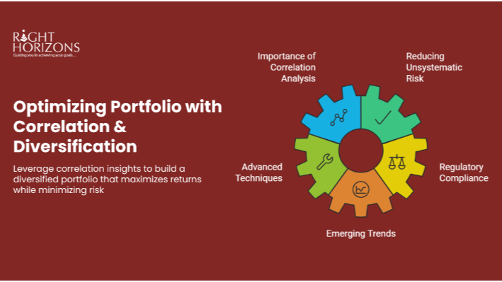

## Table of Contents

## What is a portfolio in the context of investments?

A portfolio in the context of investments is a collection of different investments owned by a person or an organization. These investments can include stocks, bonds, mutual funds, real estate, and other assets. The idea behind having a portfolio is to spread out the risk. Instead of putting all your money into one thing, you divide it among different types of investments. This way, if one investment does poorly, the others might still do well and help balance out the loss.

Building a portfolio often involves thinking about how much risk you are willing to take and what your financial goals are. For example, someone who is close to retiring might choose to have a portfolio with less risk, focusing more on bonds and other stable investments. On the other hand, a younger person might be more willing to take risks and could have a portfolio with more stocks. By regularly reviewing and adjusting your portfolio, you can make sure it continues to meet your needs and goals over time.

## Why is diversification important in portfolio management?

Diversification is important in portfolio management because it helps to spread out risk. Imagine you have all your money in one company's stock. If that company does badly, you could lose a lot of money. But if you spread your money across different types of investments, like stocks, bonds, and real estate, you're not relying on just one thing to do well. If one investment goes down, others might go up and help balance out the loss.

Another reason diversification is important is that it can lead to more stable returns over time. Different investments can perform differently at different times. For example, when the stock market is doing well, stocks might be a good investment. But when the economy is not doing so well, bonds might be safer. By having a mix of investments, you can smooth out the ups and downs of the market and have a more consistent growth in your portfolio. This can help you reach your financial goals without too many surprises along the way.

## What is correlation in finance?

In finance, correlation is a way to measure how two investments move in relation to each other. If two investments go up and down at the same time, they have a high positive correlation. For example, if stocks in the technology sector usually go up when stocks in the electronics sector go up, they have a high positive correlation. On the other hand, if one investment goes up when the other goes down, they have a negative correlation. This can be useful because if you have investments with negative correlation, they can help balance each other out.

Understanding correlation is important for building a good investment portfolio. If all your investments are highly correlated, they will likely all go up or down together, which can be risky. But if you choose investments with low or negative correlation, you can spread out your risk better. This way, if one part of your portfolio is not doing well, another part might be doing better, which can help protect your overall investment. So, looking at how different investments correlate can help you make smarter choices about what to include in your portfolio.

## How can correlation be measured between different assets?

Correlation between different assets can be measured using a number called the correlation coefficient. This number ranges from -1 to +1. If the correlation coefficient is close to +1, it means the two assets tend to move in the same direction. For example, if one asset goes up, the other one usually goes up too. If the correlation coefficient is close to -1, it means the two assets move in opposite directions. So, if one asset goes up, the other one tends to go down. If the correlation coefficient is around 0, it means the movements of the two assets are not related to each other.

To calculate the correlation coefficient, you need data on the returns of the two assets over a period of time. You can then use a formula or a software tool to figure out the correlation. Many financial websites and investment platforms provide this data and can calculate the correlation for you. By understanding the correlation between different assets, you can make better decisions about how to build your investment portfolio. For example, if you want to reduce risk, you might choose assets that have a low or negative correlation with each other.

## What does positive correlation mean for a portfolio?

Positive correlation in a portfolio means that the different investments tend to move in the same direction. For example, if you have two stocks that are positively correlated, when one stock goes up, the other one usually goes up too. This can be good if the market is doing well because all your investments might go up together. But it can also be risky because if the market goes down, all your investments might go down at the same time.

Having a lot of investments with positive correlation can make your portfolio more vulnerable to big swings in the market. If all your money is in things that move together, you might see bigger gains when the market is good, but you could also see bigger losses when the market is bad. To reduce this risk, it's often a good idea to include some investments that don't move in the same way, which can help balance out your portfolio and make it more stable.

## What does negative correlation mean for a portfolio?

Negative correlation in a portfolio means that the different investments tend to move in opposite directions. For example, if one investment goes up, another one usually goes down. This can be really helpful for balancing out your portfolio. When one part of your portfolio is not doing well, the other part might be doing better, which can help protect your overall investment from big losses.

Having investments with negative correlation can make your portfolio more stable. It's like having a safety net. If the stock market goes down and your stocks lose value, your bonds or other investments that move in the opposite direction might go up and help offset those losses. By including some investments that have a negative correlation with each other, you can smooth out the ups and downs of the market and have a more consistent growth in your portfolio over time.

## How can correlation diversification help protect a portfolio?

Correlation diversification helps protect a portfolio by spreading out the risk. When you have investments that don't all move in the same way, you're less likely to lose a lot of money all at once. For example, if you have stocks and bonds in your portfolio, and they don't go up and down together, then when the stock market goes down, your bonds might still be doing okay. This can help balance out the losses and keep your portfolio more stable.

By choosing investments that have low or negative correlation, you can make your portfolio safer. It's like having a safety net. If one part of your portfolio is not doing well, another part might be doing better, which can help protect your overall investment. This way, you can still grow your money over time without too many big ups and downs.

## What are some common asset classes used for correlation diversification?

Some common asset classes used for correlation diversification are stocks, bonds, real estate, and commodities. Stocks are shares in companies, and they can go up or down based on how the company and the economy are doing. Bonds are loans you give to a company or government, and they usually pay you back with interest. Real estate is property like houses or buildings, and its value can change based on the location and the market. Commodities are things like gold, oil, or wheat, and their prices can go up or down based on supply and demand.

These asset classes often don't move in the same way. For example, when stocks are doing badly, bonds might do better because people want safer investments. Real estate can be a good choice because it doesn't always follow the stock market. Commodities like gold can be a safe place to put money when other investments are risky. By having a mix of these asset classes, you can help protect your portfolio from big losses and make it more stable over time.

## Can you explain the concept of a correlation matrix and its use in portfolio management?

A correlation matrix is a table that shows how different investments move together. It uses numbers to tell you if two investments go up and down at the same time or if they move in opposite directions. The numbers in the matrix are called correlation coefficients, and they range from -1 to +1. If the number is close to +1, it means the two investments move in the same way. If it's close to -1, they move in opposite ways. And if it's around 0, they don't really move together at all.

In portfolio management, a correlation matrix is really helpful because it lets you see at a glance how all your investments relate to each other. By looking at the matrix, you can figure out which investments to put together to make your portfolio safer. For example, if you see that two investments have a high positive correlation, you might not want to put all your money in both because they'll go up and down together. But if you see that two investments have a negative correlation, you might want to include both because they can help balance each other out. This way, you can build a portfolio that's more likely to grow steadily over time without big ups and downs.

## What are the challenges in achieving effective correlation diversification?

Achieving effective correlation diversification can be tricky because it's not always easy to find investments that move in different ways. Sometimes, even things that seem different can end up moving together. For example, during a big economic crisis, a lot of different investments might all go down at the same time. This means that even if you try to spread out your risk, you might still see big losses if everything is affected by the same event.

Another challenge is that correlations can change over time. What worked well in the past might not work the same way in the future. This means you need to keep checking and adjusting your portfolio to make sure it's still diversified the way you want. It can take a lot of time and effort to keep up with all the changes and make sure your investments are still balancing each other out the way you need them to.

## How does the time frame affect correlation and diversification strategies?

The time frame you choose can really change how well your correlation and diversification strategies work. Over short periods, like a few weeks or months, investments might seem to move together a lot. This can make it hard to see if they are really different from each other. But over longer periods, like years, you might see that they actually move in different ways. So, if you're looking at a short time frame, you might think your portfolio isn't diversified when it really is, if you look at it over a longer time.

Choosing the right time frame is important for making good decisions about your investments. If you're trying to grow your money over many years, you might want to look at correlations over a long time to make sure your portfolio is well-balanced. But if you need your money sooner, you might have to pay more attention to what's happening right now. It's all about finding the right balance between what's happening in the short term and what you expect to happen in the long term.

## What advanced statistical tools can be used to optimize portfolio protection through correlation diversification?

One advanced statistical tool that can help with optimizing portfolio protection through correlation diversification is called principal component analysis (PCA). PCA helps you see what's really driving the movements in your investments. It can find patterns that you might not see just by looking at the numbers. By using PCA, you can figure out which investments are really different from each other and which ones are moving together. This can help you pick the right mix of investments to make your portfolio safer and more balanced.

Another tool you can use is called copula modeling. Copulas are good at showing how different investments move together, even if they don't follow a normal pattern. They can help you understand the risks better, especially during times when the market is doing crazy things. By using copulas, you can make better decisions about how to spread out your investments to protect your portfolio from big losses. Both PCA and copula modeling can give you a deeper look into how your investments are connected, so you can make smarter choices about how to diversify your portfolio.

## What is the role of correlation in investment?

Correlation in investment is a statistical measure that quantifies the degree to which two or more assets move in relation to one another. The value of correlation ranges from -1 to 1. A correlation of 1 implies that the assets move perfectly in the same direction, whereas a correlation of -1 indicates that they move in exactly opposite directions. A correlation of 0 suggests no relationship between the movements of the assets.

Understanding correlation is crucial for minimization of risk through strategic asset allocation and effective diversification. By selecting assets that exhibit low or negative correlation, investors can reduce the overall [volatility](/wiki/volatility-trading-strategies) of a portfolio. This occurs because when some assets may perform poorly, others with a negative correlation may perform well, thereby mitigating losses.

For instance, if an investor holds two stocks: Stock A and Stock B, where Stock A is a high-tech equity and Stock B is a traditional energy company, these could exhibit low correlation due to their differing response to market conditions. The classic formula to calculate the correlation coefficient ($\rho$) between two variables, $X$ and $Y$, is given by:

$$
\rho = \frac{\text{cov}(X, Y)}{\sigma_X \sigma_Y}
$$

Where $\text{cov}(X, Y)$ represents the covariance between X and Y, $\sigma_X$ is the standard deviation of X, and $\sigma_Y$ is the standard deviation of Y.

Investors often use correlation metrics to identify diversification opportunities that can optimize risk-adjusted returns. This involves adjusting the weights of different assets within a portfolio based on their correlation to one another, thereby enhancing the portfolio's stability against market swings.

Moreover, the implications of correlation analysis extend beyond merely balancing risk. It also aids in achieving a resilient portfolio structure that can endure both market surges and downturns. The advantage lies in the ability to dynamically rebalance in response to shifts in correlations that occur due to global economic changes.

For practical application, Python libraries such as NumPy and pandas offer tools for calculating correlation matrices, allowing investors to visualize and analyze the correlation among assets effectively. Here's an example using Python:

```python
import numpy as np
import pandas as pd

# Example data: Prices of Stock A and Stock B
data = {'Stock_A': [100, 102, 101, 104, 105],
        'Stock_B': [99, 101, 100, 102, 104]}

# Creating a DataFrame
df = pd.DataFrame(data)

# Calculating the correlation matrix
correlation_matrix = df.corr()

print(correlation_matrix)
```

This Python code computes the correlation matrix for the given stock prices, providing insights into how these assets interact in terms of their price movements.

In summary, correlation analysis stands as a cornerstone in the framework of investment strategy, offering a pathway to create portfolios that are both balanced and resilient against market forces. Investors can capitalize on this knowledge to enhance their decision-making and achieve desired financial outcomes.

## References & Further Reading

[1]: Bergstra, J., Bardenet, R., Bengio, Y., & Kégl, B. (2011). ["Algorithms for Hyper-Parameter Optimization."](https://papers.nips.cc/paper/4443-algorithms-for-hyper-parameter-optimization) Advances in Neural Information Processing Systems 24.

[2]: ["Advances in Financial Machine Learning"](https://www.amazon.com/Advances-Financial-Machine-Learning-Marcos/dp/1119482089) by Marcos Lopez de Prado

[3]: ["Evidence-Based Technical Analysis: Applying the Scientific Method and Statistical Inference to Trading Signals"](https://onlinelibrary.wiley.com/doi/book/10.1002/9781118268315) by David Aronson

[4]: ["Machine Learning for Algorithmic Trading"](https://github.com/stefan-jansen/machine-learning-for-trading) by Stefan Jansen

[5]: ["Quantitative Trading: How to Build Your Own Algorithmic Trading Business"](https://www.amazon.com/Quantitative-Trading-Build-Algorithmic-Business/dp/1119800064) by Ernest P. Chan