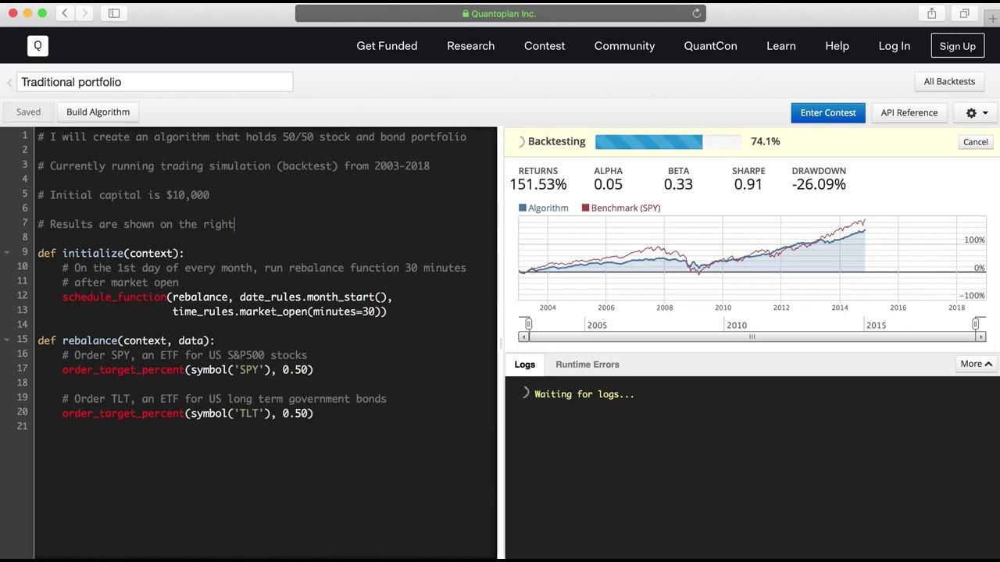

Portfolio rebalancing is a fundamental process in financial management aimed at maintaining a desired asset allocation and risk profile over time. As market conditions fluctuate, the values of different assets within a portfolio can change, resulting in a shift away from the original allocation. This drift can alter the portfolio's risk and return characteristics, potentially misaligning it with the investor's objectives.

To counter this, rebalancing involves the strategic buying and selling of assets to restore the portfolio's target allocation. By resetting the portfolio back to its intended mix of asset classes, investors can manage risk more effectively and stay on track toward their financial goals. This process becomes increasingly important in dynamic markets where asset values can shift rapidly.

Automated rebalancing algorithms have revolutionized this process by enhancing efficiency and ensuring consistent alignment with investment goals. These algorithms operate by implementing predetermined rules for asset allocation, often based on criteria like time intervals or percentage thresholds. By automating adjustments, they reduce the need for constant manual intervention, thus saving time and minimizing emotional decision-making.

This article provides a comprehensive exploration of rebalancing algorithms, detailing their various types, benefits, and challenges. With advancements in technology, these algorithms continue to evolve, offering more sophisticated solutions to meet the diverse needs of investors.

## Table of Contents

## Types of Rebalancing Algorithms

Portfolio rebalancing algorithms serve as an essential tool for maintaining an investor’s desired asset allocation, adjusting portfolios to reflect predetermined investment strategies despite market fluctuations. Different types of rebalancing algorithms exist, each with distinctive methodologies tailored to various investment approaches and risk tolerance. 

Time-based rebalancing is a straightforward algorithmic approach that adjusts the asset allocation of a portfolio at regular intervals. These intervals are commonly set on a monthly or quarterly basis. The primary advantage of time-based rebalancing lies in its simplicity and predictability, allowing investors to plan their strategies systematically. However, it may not account for significant market changes occurring between intervals, potentially leaving portfolios exposed to undesirable levels of risk until the next rebalancing period.

Threshold-based rebalancing operates by triggering portfolio adjustments whenever asset allocations deviate from their target proportions by a specified percentage. This method ensures that the portfolio remains closely aligned with the investor’s intended risk profile, acting automatically once an asset strays, for example, by 5% from its target allocation. The key benefit of threshold-based rebalancing is its responsiveness to market conditions, maintaining an optimal investment stance without waiting for set intervals. 

Volatility-based rebalancing is a strategy that reacts to shifts in market [volatility](/wiki/volatility-trading-strategies), adjusting asset allocations dynamically to manage risk. When market volatility increases, the portfolio may be adjusted to favor less risky assets, thereby reducing the overall risk exposure. Conversely, in stable market conditions, the portfolio might take on more risk to capitalize on potential gains. This type of rebalancing is particularly suited for investors with varying risk appetites who wish to balance risk and return more actively.

Dynamic rebalancing is the most adaptive and complex approach, as it continuously monitors portfolio composition, making adjustments in real-time as required. Instead of adhering to specific time intervals or thresholds, dynamic rebalancing utilizes a comprehensive suite of market data and analytics tools to optimize portfolio performance continuously. Incorporating cutting-edge technologies, such as [machine learning](/wiki/machine-learning) algorithms and [artificial intelligence](/wiki/ai-artificial-intelligence), dynamic rebalancing offers a tailored and responsive investment strategy, albeit with increased computational demands and complexity.

Each type of rebalancing algorithm possesses unique benefits and trade-offs, necessitating careful consideration by investors based on their strategic objectives, investment horizon, and risk tolerance.

## Methodologies for Implementing Rebalancing Algorithms

Mean-Variance Optimization (MVO) is a foundational methodology rooted in Modern Portfolio Theory (MPT) for implementing rebalancing algorithms. MVO seeks to construct a portfolio that maximizes expected returns for a specified level of risk or, conversely, minimizes risk for a given level of expected returns. This is achieved by optimizing the asset allocation based on the mean (expected return) and the variance (volatility) of asset returns. Mathematically, this involves solving an optimization problem that balances risk and return, typically using the formula:

$$

\max \left( \mathbf{w}^T \mathbf{\mu} - \frac{\lambda}{2} \mathbf{w}^T \Sigma \mathbf{w} \right) 
$$

Where:
- $\mathbf{w}$ is the vector of asset weights,
- $\mathbf{\mu}$ is the vector of expected asset returns,
- $\Sigma$ is the covariance matrix of asset returns,
- $\lambda$ is the risk aversion parameter.

Monte Carlo Simulation is another robust methodology that assists in rebalancing by simulating a wide range of potential future asset price movements based on historical data. This approach allows investors to assess and plan for various market scenarios, thereby guiding rebalancing decisions. Monte Carlo methods involve generating random samples to model future price paths, enabling the estimation of the statistical distribution of returns. This stochastic process helps in understanding the potential risks and returns, which can be critical for strategic rebalancing.

Machine Learning Techniques have increasingly been adopted for implementing rebalancing algorithms, leveraging historical data to forecast optimal rebalancing times. These techniques include supervised learning models such as regression analysis, decision trees, and neural networks. By training on historical market data, these algorithms can identify patterns and trends that may indicate favorable opportunities for rebalancing. The ability of machine learning models to handle vast amounts of data and learn complex relationships makes them powerful tools for adapting to changing market dynamics.

Incorporating these methodologies allows for the development of sophisticated rebalancing algorithms that effectively maintain portfolio alignment with desired investment goals. These approaches address the intricacies associated with market variability and investor preferences, contributing significantly to the robustness of portfolio management strategies.

## Benefits of Rebalancing Algorithms

Rebalancing algorithms offer several notable benefits for portfolio management. Firstly, they ensure consistency in investment strategy by maintaining the intended asset allocation. This consistency is vital for investors who aim to adhere to a specific investment plan. Through regular adjustments, rebalancing algorithms enable portfolios to align with predefined allocation targets, minimizing deviations resulting from market volatility or asset performance disparities.

Risk management is another critical advantage. Rebalancing algorithms allow investors to maintain their desired risk profile by regulating the proportions of various asset classes within a portfolio. By ensuring that assets do not disproportionally drift away from their target weights, the algorithms help manage potential risks that arise from market fluctuations. This alignment with investor risk tolerance can be mathematically expressed through the constraint:

$$

\sum_{i=1}^{n} w_i \cdot \sigma_i^2 = \sigma^2_{target}
$$

where $w_i$ represents the weight of asset $i$, $\sigma_i^2$ is the variance of asset $i$, and $\sigma^2_{target}$ is the targeted portfolio variance.

Efficiency is also significantly enhanced through the use of automated rebalancing. By reducing the need for frequent manual oversight, these algorithms lower operational costs and required effort. This automation facilitates timely and precise portfolio adjustments, which are especially beneficial when managing large volumes of assets or complex strategies. 

Moreover, rebalancing algorithms contribute to emotional discipline in investing. Automated processes remove the potential for human emotions to influence decisions, promoting a systematic and rational approach to managing investments. This detachment from emotional biases helps investors maintain focus on long-term goals and reduces the risk of impulsive decision-making induced by short-term market movements.

Overall, the integration of rebalancing algorithms in portfolio management provides a robust framework for maintaining strategic consistency, effective risk management, operational efficiency, and emotional discipline.

## Challenges in Rebalancing Algorithms

Rebalancing algorithms face several challenges that can hinder their effectiveness in maintaining an optimal portfolio balance. One of the primary challenges is transaction costs. Frequent rebalancing often incurs significant expenses, including brokerage fees and taxes, which can erode the benefits of maintaining a precise asset allocation. For example, if a portfolio rebalances monthly, each transaction, especially in a taxable account, can trigger capital gains taxes, diminishing the overall return.

Slippage is another issue that can impact the efficacy of rebalancing strategies. Slippage refers to the difference between the expected price of a trade and the actual price executed. In volatile markets, slippage can be pronounced, altering the intended asset allocation and nullifying the predictions of the rebalancing algorithm.

The complexity of developing effective rebalancing algorithms poses a significant challenge. Creating sophisticated algorithms requires deep expertise in quantitative analysis and financial modeling. Developers must account for numerous variables, including market volatility, correlations, and individual security characteristics, demanding advanced statistical and programming skills.

Market impact is a further concern, particularly for large portfolios. Executing sizeable trades can have a substantial effect on market prices, especially in markets with low [liquidity](/wiki/liquidity-risk-premium). Large trades can move market prices, resulting in less favorable terms for the portfolio manager and possibly altering the asset allocation in unintended ways.

Addressing these challenges necessitates a thoughtful approach to rebalancing algorithm development and implementation. Strategies must carefully balance the frequency and scale of rebalancing actions against the costs and potential market impacts to maintain effectiveness. Advanced techniques like machine learning and optimization algorithms can help mitigate these challenges, although they often require complex programming and modeling capabilities.

## Case Studies of Rebalancing Algorithms

Betterment and Wealthfront are two prominent case studies that exemplify the use of rebalancing algorithms in automated investment platforms.

Betterment implements a combination of time-based and threshold-based rebalancing techniques to ensure that client portfolios remain aligned with their financial goals. Time-based rebalancing entails adjusting the portfolio at pre-defined intervals, such as monthly or quarterly, irrespective of market conditions. This method provides a disciplined approach to maintaining the targeted asset allocation over the long term. Furthermore, threshold-based rebalancing in Betterment's strategy triggers adjustments whenever the actual asset allocation deviates from the desired allocation by a predetermined percentage. This approach is particularly effective in responding to significant market events, allowing for more precise and responsive realignment of portfolios.

Wealthfront enhances its investment outcomes through the application of advanced algorithms focused on both tax-loss harvesting and dynamic rebalancing. Tax-loss harvesting is a strategic move to offset capital gains by selling securities at a loss, thereby optimizing the tax efficiency of the portfolio. Wealthfront's algorithm continuously scans for opportunities to realize tax losses while maintaining the portfolio's intended risk and return profile. Dynamic rebalancing, another facet of Wealthfront's approach, involves continual adjustments made in real-time based on market movements and individual portfolio drift. This method eschews the rigidity of fixed intervals, providing a more fluid and responsive allocation strategy that potentially leads to better performance, especially in volatile markets.

The effectiveness of these algorithms is augmented by the integration of sophisticated technology that processes real-time data and employs predictive analytics. Such algorithms reduce human intervention and emotional biases, fostering disciplined and consistent investment practices. As these case studies illustrate, firms like Betterment and Wealthfront are leveraging rebalancing algorithms to enhance portfolio management, demonstrating the practical application and benefits of automated rebalancing in modern investment strategies.

## Future Trends and Innovations

Artificial intelligence (AI) and [deep learning](/wiki/deep-learning) are playing an increasingly pivotal role in portfolio rebalancing by creating sophisticated models capable of adapting to fluctuating market conditions. These technologies leverage vast datasets to recognize complex patterns in market behaviors, which traditional methods might overlook. By employing neural networks and other machine learning algorithms, rebalancing strategies can be continuously refined to predict market trends and optimize asset allocations dynamically.

Blockchain technology is emerging as a transformative force in portfolio rebalancing by offering a transparent and efficient mechanism for executing trades. The immutable and decentralized nature of blockchain ensures secure and verifiable transactions, reducing the risk of fraud and error. Smart contracts, automated protocols that execute pre-defined actions, can be used to automate rebalancing strategies, leading to faster and more reliable execution without the need for intermediaries.

Real-time data integration is revolutionizing the efficiency and accuracy of rebalancing decisions. By accessing live financial data, including stock prices, market news, and economic indicators, rebalancing algorithms can make instantaneous decisions, ensuring that portfolios are promptly adjusted to current market conditions. This capability is particularly crucial in volatile markets, where the timeliness of a decision can significantly impact investment outcomes.

Personalized rebalancing is increasingly focusing on customizing strategies to align with individual investor preferences and risk profiles. By leveraging data analytics and machine learning, investment managers can develop bespoke rebalancing strategies that consider an investor's unique financial situation, goals, and risk tolerance. This personalization extends beyond mere asset allocation, incorporating factors such as tax considerations, investment horizon, and [ESG](/wiki/esg-investing) (Environmental, Social, and Governance) concerns, thereby enhancing the investor's overall experience and satisfaction.

In summary, these future trends and innovations are expected to significantly enhance the effectiveness of portfolio rebalancing, offering more precise, efficient, and personalized investment management solutions.

## Conclusion

Rebalancing algorithms play an essential role in portfolio management by maintaining asset allocations aligned with investment objectives. This alignment is pivotal in managing risk and optimizing returns over time. These algorithms facilitate adherence to predetermined investment strategies, ensuring that portfolios remain consistent with the investor's risk tolerance and financial goals. The automation provided by these algorithms reduces the operational effort involved in portfolio management while promoting disciplined investing by removing emotional biases.

Despite the evident advantages, such as consistency and efficiency, rebalancing algorithms face several challenges. Transaction costs, market slippage, and potential market impact from large trades can affect the effectiveness of these strategies. Additionally, the complexity involved in developing sophisticated algorithms necessitates substantial expertise in quantitative analysis and technological infrastructure.

As technological advancements continue to accelerate, the future of rebalancing algorithms holds promise. Innovations in artificial intelligence and deep learning have the potential to create adaptive models that respond dynamically to market changes. The integration of blockchain technology offers transparency and efficiency improvements, while real-time data inputs facilitate prompt decision-making. Moreover, personalized rebalancing strategies tailored to individual investor profiles are becoming increasingly feasible, allowing for more nuanced portfolio management solutions.

In conclusion, while rebalancing algorithms encounter certain obstacles, their role in facilitating consistent, efficient, and effective portfolio management is undeniable. As technology evolves, these algorithms are likely to become even more sophisticated, offering enhanced tools for investors to manage their portfolios with higher precision and adaptability.

## References & Further Reading

[1]: ["Portfolio Rebalancing: A Manual for Portfolio Management"](https://investor.vanguard.com/investor-resources-education/portfolio-management/rebalancing-your-portfolio) by the CFA Institute

[2]: ["Due Diligence: The Intelligent Investor, Rebalancing Your Portfolio"](https://investor.vanguard.com/investor-resources-education/portfolio-management/rebalancing-your-portfolio) - Morningstar article discussing rebalancing techniques

[3]: Sharpe, W. F. (1994). ["The Sharpe Ratio."](https://web.stanford.edu/~wfsharpe/art/sr/SR.htm) The Journal of Portfolio Management, 21(1), 49-58.

[4]: ["Advances in Financial Machine Learning"](https://www.amazon.com/Advances-Financial-Machine-Learning-Marcos/dp/1119482089) by Marcos Lopez de Prado

[5]: ["Python for Finance: Apply Powerful Finance Models and Quantitative Analysis with Python"](https://www.amazon.com/Python-Finance-powerful-quantitative-analysis/dp/1787125696) by Yves Hilpisch

[6]: Perold, A. F., & Sharpe, W. F. (1988). ["Dynamic Strategies for Asset Allocation."](https://caia.org/sites/default/files/dynamic_strategies_for_asset_allocation.pdf) Financial Analysts Journal, 44(1), 16-27.