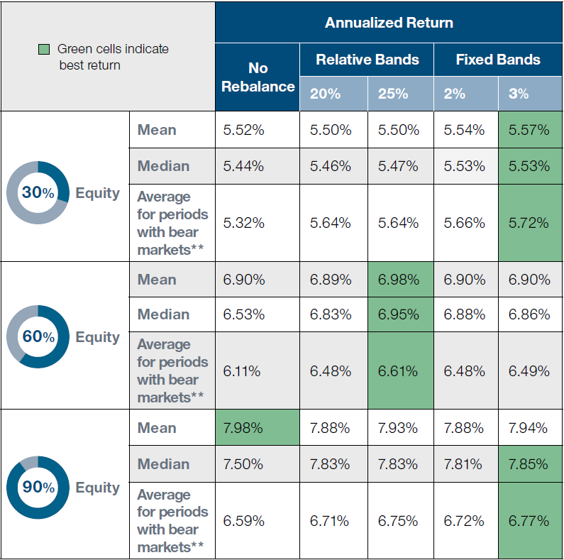

## Table of Contents

## What is portfolio rebalancing and why is it important?

Portfolio rebalancing is when you adjust your investment mix to keep it in line with your original plan. Imagine you decided to put half your money in stocks and half in bonds. Over time, if stocks do really well, you might end up with more money in stocks than you planned. Rebalancing means selling some stocks and buying more bonds to get back to your 50-50 split.

It's important because it helps you stick to your investment strategy and manage risk. If you don't rebalance, your portfolio might become too risky or not grow as you hoped. By rebalancing, you make sure your investments match your goals and comfort with risk, which can lead to better long-term results.

## How often should a beginner rebalance their investment portfolio?

For a beginner, rebalancing your investment portfolio once a year is a good starting point. This gives you a chance to check how your investments are doing without making too many changes. It's like setting a reminder to look at your investments every year and make sure they still match what you want.

If your investments change a lot, you might want to rebalance more often, like every six months. But remember, rebalancing too much can be a hassle and might cost you money in fees. So, for most beginners, sticking to once a year is simple and effective.

## What are the common methods used for portfolio rebalancing?

One common method for portfolio rebalancing is the calendar method. With this method, you pick a specific time each year, like your birthday or the start of the new year, to check your investments. You look at how much you have in stocks, bonds, and other things, and then you buy or sell to get back to your original plan. It's simple because you only need to remember to do it once a year.

Another method is the threshold method. Here, you set a rule, like if any part of your portfolio changes by more than 5%, you'll rebalance. So, if your stocks grow too much and go over that 5% limit, you'll sell some stocks and buy other things to fix it. This method can mean you rebalance more often, but it helps keep your investments closer to your plan all the time.

Both methods have their pros and cons. The calendar method is easier to remember and do, but it might not catch big changes in your investments right away. The threshold method can keep your portfolio more in line with your goals, but it might mean you have to check and change things more often.

## Can you explain the difference between calendar-based and threshold-based rebalancing?

Calendar-based rebalancing means you pick a certain time each year to look at your investments. It could be on your birthday or at the start of the new year. You check if your money is still split the way you want it, like half in stocks and half in bonds. If it's not, you sell some of what you have too much of and buy more of what you need. This method is easy because you only have to remember to do it once a year, but it might not catch big changes in your investments right away.

Threshold-based rebalancing is different. Here, you set a rule, like if any part of your investments changes by more than 5%, you'll fix it. So, if your stocks grow too much and go over that 5% limit, you'll sell some stocks and buy other things to get back to your plan. This method can keep your investments closer to what you want all the time, but it might mean you have to check and change things more often. It's good for keeping your portfolio in line, but it can be more work.

## What are the tax implications of rebalancing a portfolio?

When you rebalance your portfolio, you might have to pay taxes. This happens if you sell investments that have gone up in value. The money you make from selling these investments is called a capital gain, and you have to pay taxes on it. The tax rate depends on how long you held the investment. If you held it for more than a year, it's a long-term capital gain, and the tax rate is usually lower. If you held it for less than a year, it's a short-term capital gain, and you'll pay a higher tax rate, like your regular income tax.

To keep your tax bill lower, you can do things like rebalancing inside tax-advantaged accounts, like an IRA or 401(k). In these accounts, you don't have to pay taxes on the gains right away. Another way is to use new money to buy more of what you need instead of selling what you have. This way, you can rebalance without triggering taxes. It's a good idea to think about taxes when you rebalance, so you can keep more of your money.

## How does rebalancing help in managing risk in an investment portfolio?

Rebalancing helps manage risk by keeping your investments in line with your original plan. Imagine you wanted half your money in stocks and half in bonds. If stocks do really well and grow a lot, you might end up with more money in stocks than you planned. This makes your portfolio riskier because stocks can go up and down a lot. By rebalancing, you sell some stocks and buy more bonds to get back to your 50-50 split. This way, you keep the risk at the level you're comfortable with.

Rebalancing also stops your portfolio from getting too focused on one type of investment. If one part of your portfolio grows a lot, it might take over and make your investments less diverse. Having a mix of different investments helps spread out the risk. When you rebalance, you make sure you still have a good mix, which can protect you from big losses if one type of investment does badly. So, rebalancing keeps your investments balanced and helps you manage risk better over time.

## What role does asset allocation play in portfolio rebalancing strategies?

Asset allocation is like deciding how to split your money between different types of investments, like stocks, bonds, and cash. It's the starting point for your investment plan. When you rebalance your portfolio, you're making sure your money stays split the way you first decided. If you wanted half your money in stocks and half in bonds, but stocks grew a lot and now you have more in stocks, rebalancing helps you sell some stocks and buy more bonds to get back to your original plan.

This process is important because it keeps your investments in line with your goals and how much risk you're okay with. If you don't rebalance, your portfolio might become too risky or not grow the way you hoped. By sticking to your asset allocation through rebalancing, you make sure your investments match what you want and help manage risk better over time.

## How can one use rebalancing to take advantage of market volatility?

Rebalancing can help you take advantage of market [volatility](/wiki/volatility-trading-strategies) by letting you buy low and sell high. When the market goes up and down a lot, some of your investments might grow more than others. If stocks go up a lot, you might end up with more money in stocks than you planned. By rebalancing, you sell some of those stocks that went up and buy more of the investments that didn't do as well. This way, you're selling high and buying low, which can help your portfolio grow over time.

It's like getting a discount on the investments that went down in value. When the market is volatile, rebalancing lets you move your money around to keep your investments balanced. This can help you make the most of the ups and downs in the market. By sticking to your plan and rebalancing regularly, you can use market volatility to your advantage and keep your portfolio on track with your goals.

## What advanced tools or software can be used for effective portfolio rebalancing?

For effective portfolio rebalancing, you can use tools like Personal Capital. This software helps you see all your investments in one place and shows you if your money is still split the way you want. It can tell you when it's time to rebalance and even suggest what to buy or sell. It's easy to use and can save you time by doing a lot of the work for you.

Another tool is Morningstar's Portfolio Manager. This tool lets you track your investments and see how they're doing compared to your plan. It can help you figure out when to rebalance and gives you ideas on how to do it. It's good for people who want to understand their investments better and make smart choices about rebalancing.

## How do different economic cycles affect portfolio rebalancing decisions?

Different economic cycles can change how you rebalance your portfolio. In a bull market, when stocks are going up a lot, your portfolio might have more money in stocks than you planned. You might need to sell some stocks and buy more bonds or other investments to keep your money split the way you want. This helps you take some profit from the stocks that went up and buy other things that might not have grown as much.

In a bear market, when stocks are going down, your portfolio might have less money in stocks than you planned. You might need to buy more stocks and sell some bonds or other investments to get back to your original plan. This can be hard because it means buying stocks when they're going down, but it can help you stick to your plan and be ready for when the market goes back up. By rebalancing during different economic cycles, you keep your investments in line with your goals and manage risk better over time.

## Can you discuss the impact of transaction costs on rebalancing strategies?

Transaction costs can affect how often you rebalance your portfolio. Every time you buy or sell an investment, you might have to pay fees. These fees can add up, especially if you rebalance a lot. If you're always buying and selling to keep your investments in line with your plan, those costs can eat into your returns. So, you might want to think about how often you rebalance and try to keep those costs down.

One way to manage transaction costs is to rebalance less often. Instead of checking your portfolio every month, you could do it once or twice a year. This way, you're not paying fees as often. Another way is to use new money to rebalance. If you get more money to invest, you can use it to buy more of what you need instead of selling what you have. This can help you keep your portfolio balanced without paying extra fees.

## What are some expert-level considerations for rebalancing portfolios with alternative investments?

When you're dealing with alternative investments like real estate, commodities, or private equity, rebalancing your portfolio can be trickier than with stocks and bonds. These investments often don't trade as easily, which means you might not be able to sell them quickly when you want to rebalance. Because of this, you need to think about how often you can actually make changes. You might need to plan your rebalancing around when these investments can be sold or when new money comes in. It's also important to keep an eye on the fees, because alternative investments can have higher costs, and rebalancing too often could make those costs even higher.

Another thing to consider is how alternative investments fit into your overall plan. They can help spread out your risk because they often don't move the same way as stocks and bonds. But because they're harder to trade, you might need to adjust your asset allocation targets to account for this. You might decide to have a smaller part of your portfolio in these harder-to-sell investments, so you can still rebalance the rest of your portfolio more easily. By thinking carefully about these things, you can make sure your portfolio stays balanced and works towards your goals, even with alternative investments.

## References & Further Reading

[1]: Bergstra, J., Bardenet, R., Bengio, Y., & Kégl, B. (2011). ["Algorithms for Hyper-Parameter Optimization."](https://dl.acm.org/doi/10.5555/2986459.2986743) Advances in Neural Information Processing Systems 24.

[2]: ["Advances in Financial Machine Learning"](https://www.amazon.com/Advances-Financial-Machine-Learning-Marcos/dp/1119482089) by Marcos Lopez de Prado

[3]: ["Evidence-Based Technical Analysis: Applying the Scientific Method and Statistical Inference to Trading Signals"](https://www.amazon.com/Evidence-Based-Technical-Analysis-Scientific-Statistical/dp/0470008741) by David Aronson

[4]: ["Machine Learning for Algorithmic Trading"](https://github.com/stefan-jansen/machine-learning-for-trading) by Stefan Jansen

[5]: ["Quantitative Trading: How to Build Your Own Algorithmic Trading Business"](https://www.amazon.com/Quantitative-Trading-Build-Algorithmic-Business/dp/1119800064) by Ernest P. Chan