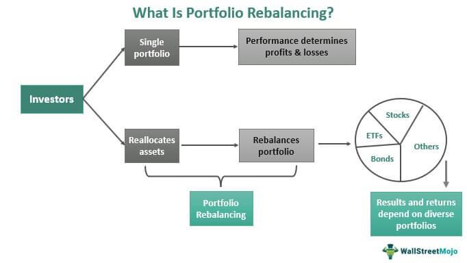

Investment strategies form the backbone of financial planning, enabling individuals and institutions to navigate the complex landscape of financial markets. These strategies are systematic approaches to managing investments that aim to achieve specific financial goals. The significance of investment strategies lies in their ability to guide decision-making, optimize asset allocation, and manage risk, all of which are essential for building and maintaining wealth over time.

Portfolio management is integral to implementing investment strategies effectively. It involves creating a balance between risk and return by diversifying assets across various classes such as equities, bonds, and cash. This practice helps investors meet their financial objectives, whether for growth, income generation, or wealth preservation. Portfolio management can be categorized into active management, where managers make specific investments to outperform the market, and passive management, which typically involves tracking a market index.



The advent of algorithmic trading has transformed the landscape of investment strategies. Algo trading uses pre-programmed algorithms to execute trades at speeds and frequencies far beyond human capacity. This approach leverages large volumes of financial data to make informed trading decisions, which can result in improved execution efficiency and reduced human error. The rise of algo trading reflects a broader trend towards the use of technology in financial markets to enhance investment efficiency and effectiveness.

Portfolio rebalancing is a critical component of maintaining portfolio health and optimizing returns. Over time, market fluctuations can cause a portfolio's asset allocation to drift from its target mix, potentially altering the risk profile. Rebalancing involves realigning the portfolio to its intended allocation, which is crucial for sustaining the desired risk level and capitalizing on growth opportunities. This practice ensures that investment strategies remain aligned with the investor's risk tolerance and financial goals.

The interplay between investment strategies, portfolio management, algorithmic trading, and portfolio rebalancing offers a comprehensive approach to enhancing investment outcomes. As these elements converge, they provide investors with tools to optimize performance, manage risk, and achieve long-term financial success. This exploration into the integration of these practices underscores their collective importance in modern financial planning. Key concepts like investment strategies, rebalance, portfolio management, and algo trading are at the forefront of this evolving landscape.

## Table of Contents

## Understanding Investment Strategies

Investment strategies are systematic plans or approaches employed by investors to allocate resources across various financial instruments with the aim of achieving specific financial objectives. These strategies are crucial in the financial markets as they guide decision-making, optimize portfolio performance, and manage risk exposure. The choice of investment strategy depends largely on individual goals, risk tolerance, and investment horizons, which makes understanding them vital for effective financial planning and portfolio management.

### Types of Investment Strategies

1. **Growth Investing**: Focuses on capital appreciation by investing in companies expected to grow at an above-average rate compared to their industry or the market. Growth investors typically look for companies with high potential for earnings growth, often in the technology or innovative sectors. For instance, investing in a burgeoning tech startup could potentially yield significant returns as the company scales and captures market share.

2. **Value Investing**: Involves looking for stocks that are undervalued relative to their intrinsic value. Value investors seek to purchase securities perceived as underestimated by the broader market and believe these stocks will realize their true value over time. This approach was famously championed by Warren Buffett, who has historically invested in companies he perceived as undervalued, eventually garnering substantial returns as the market corrected its valuation.

3. **Income Investing**: Aims to generate regular income by investing in securities that pay dividends or interest. This strategy is often favored by retirees or individuals seeking steady income streams. Common instruments include dividend-paying stocks, bonds, and real estate investment trusts (REITs). For example, an investor might opt for utility stocks, known for stable dividend payouts, to minimize risk and provide consistent returns.

4. **Index Investing**: Involves investing in market indices as a way to diversify and passive invest. This strategy tracks a specific index, such as the S&P 500, aiming to replicate its performance. Investors in index funds benefit from broad market exposure and typically incur lower fees than actively managed funds. This approach is popularized by the efficiency of markets theory, suggesting that beating the market consistently is hard, making index tracking a viable option.

### Selecting an Investment Strategy

Investors select strategies based on a combination of risk tolerance, investment horizon, and financial goals:

- **Risk Tolerance**: An investor's ability and willingness to endure market volatility. Aggressive investors with high risk tolerance may lean towards growth investing, while conservative investors might prefer income-focused strategies to minimize uncertainty.

- **Time Horizon**: The duration over which an investor plans to hold their investments. A long-term horizon allows more flexibility for weathering market fluctuations and waiting for investments to realize their potential. Conversely, shorter horizons may necessitate more conservative strategies to preserve capital.

- **Financial Goals**: Specific objectives like retirement savings, purchasing a home, or funding education, which dictate the necessary rate of return and acceptable risk level.

### Real-World Examples

Individual investors can learn from successful case studies and adapt strategies that have previously proven successful. For instance, Peter Lynch, a legendary fund manager, employed a hybrid growth-value strategy, resulting in Fidelity Magellan Fund's substantial return from 1977 to 1990. His approach focused on thorough research and investing in "underappreciated growth" companies – those having potential yet overlooked by the market.

Similarly, the success of passive index investing is evidenced by the robust performance of the SPDR S&P 500 [ETF](/wiki/etf-trading-strategies) Trust (SPY), one of the largest and most traded ETFs, which offers exposure to the S&P 500 index at a low cost.

### The Dynamic Nature of Investment Strategies

Investment strategies are inherently dynamic, shaped by evolving market conditions, economic outlooks, and changes in investor circumstances. Continuous evaluation and adjustment of strategies are paramount in responding to these changes. Investors must regularly review their portfolios to ensure alignment with their original financial objectives and risk tolerance, thereby maximizing potential returns while managing risks effectively. Whether through manual assessment or leveraging algo trading technologies, adjusting investment strategies remains a core component of successful financial planning.

## The Essentials of Portfolio Management

Portfolio management is a critical aspect of investment strategy, focused on building and maintaining a mix of investments that aligns with an investor's financial goals, risk tolerance, and time horizon. This process can be broadly categorized into two primary types: active and passive management.

Active portfolio management involves continuously monitoring and frequently adjusting a portfolio to outperform a specific benchmark index. Active managers employ various strategies, such as market forecasting, security selection, and timing trades based on market conditions, to achieve their objectives. They rely on robust research and analysis to identify undervalued or high-potential assets.

In contrast, passive portfolio management seeks to replicate the performance of a particular market index. This involves creating a portfolio that mirrors the components of the benchmark index, thereby minimizing transaction costs and human error. Index funds and exchange-traded funds (ETFs) are common vehicles for passive strategies, offering broad market exposure with lower management fees.

The primary goals of portfolio management include diversification and risk optimization. Diversification involves spreading investments across various asset classes, sectors, and geographical regions to minimize risk. By holding a diverse range of assets, investors can reduce the impact of any single asset's poor performance on the overall portfolio. Risk optimization involves balancing the portfolio's expected return against the investor's risk tolerance, ensuring that the portfolio's risk level is aligned with the investor's financial goals and comfort with market [volatility](/wiki/volatility-trading-strategies).

The portfolio management process generally comprises several key stages: planning, execution, monitoring, and adjustment. During the planning phase, investors define their financial objectives, risk preference, and investment time frame. Execution involves selecting appropriate assets and allocating funds according to the investor's strategy. Continuous monitoring is crucial to assess the portfolio's performance relative to benchmarks and market conditions. Finally, adjustment involves rebalancing or reallocating assets to maintain the desired risk-return profile.

Asset allocation is vital in determining a portfolio's performance. Research suggests that asset allocation decisions account for a significant portion of a portfolio's variance in returns over time. By carefully choosing the proportion of assets in categories such as stocks, bonds, and cash, investors can influence the portfolio's expected returns and risk level.

Effective portfolio management employs various tools and frameworks, including financial models, risk assessment tools, and performance measurement techniques. Metrics such as the Sharpe Ratio, which measures risk-adjusted returns, and the Efficient Frontier, a graphical representation of optimal portfolios at varying risk levels, are commonly used in evaluating portfolio performance.

In summary, portfolio management is an essential aspect of investing that requires careful planning and ongoing attention. By understanding the principles of asset allocation, diversification, and risk management, investors can optimize their portfolios to meet their financial objectives effectively.

## Algorithmic Trading: Revolutionizing Investment

Algorithmic trading, often referred to as "algo trading," is the utilization of computer programs and algorithms to execute financial securities trading at high speeds and volumes. This method relies on pre-defined instructions or strategies derived from complex mathematical models and statistical analysis to manage trading orders. Its significance in executing investment strategies lies in its ability to make decisions far faster than any human trader could, thus exploiting market inefficiencies and capturing profitable opportunities.

Algorithms are designed to process large volumes of market data in real-time, allowing for rapid analysis and execution of trades. They leverage vast datasets to identify patterns, evaluate trends, and generate forecasts that inform trading decisions. For instance, [machine learning](/wiki/machine-learning) models may be applied to predict stock price movements, taking into account historical data, current economic conditions, and other relevant indicators. The use of such data-driven insights enables traders to optimize strategies by making informed decisions at crucial moments.

The advantages of [algorithmic trading](/wiki/algorithmic-trading) are manifold, with speed and accuracy being among the most notable. Trades can be executed within milliseconds, a speed that outpaces traditional manual trading approaches. This swift execution can translate into significant financial gains, particularly in markets where prices can fluctuate rapidly. Moreover, algorithms reduce the likelihood of human error by performing trades automatically, adhering strictly to the programmed strategy without falling victim to emotional biases or fatigue.

However, along with its benefits, algorithmic trading presents certain challenges. Technical risks can arise from system failures or programming errors, potentially leading to substantial financial losses if trades are executed incorrectly. Regulatory risks are another concern; financial authorities have implemented strict regulations to oversee algorithmic trading activities and prevent market abuse. Traders must ensure compliance with these rules to avoid penalties or legal issues.

Numerous algorithmic trading strategies have been developed to capitalize on various market conditions. Market making involves continuously placing buy and sell orders to profit from the bid-ask spread. This strategy helps maintain [liquidity](/wiki/liquidity-risk-premium) in financial markets. Statistical [arbitrage](/wiki/arbitrage) is another prominent strategy, which involves identifying and exploiting price inefficiencies between related securities. These strategies require sophisticated algorithms capable of conducting precise calculations and swift trade executions.

In summary, algorithmic trading revolutionizes how investment strategies are executed by leveraging data processing, speed, and precision. While offering distinct advantages, it also requires careful management of associated technical and regulatory risks, ensuring that algorithms are both effective and compliant.

## The Importance of Rebalancing Your Portfolio

Portfolio rebalancing is a crucial practice in maintaining the desired risk level of an investment portfolio. At its core, portfolio rebalancing involves realigning the composition of a portfolio to match systematic investment goals, which may drift over time due to market dynamics. This process ensures that a portfolio's asset allocation remains consistent with an investor's risk tolerance, financial objectives, and investment horizon.

Market fluctuations are a primary cause of portfolio imbalances. As different assets within a portfolio grow at varying rates, the original asset allocation may shift, leading to an unintended risk profile. For example, if equities perform significantly better than bonds in a given period, a portfolio initially balanced at 60% equities and 40% bonds may become overweight in equities, heightening the portfolio's overall risk.

Several methods exist to rebalance a portfolio, each with its advantages and considerations:

1. **Calendar-based rebalancing**: This method involves rebalancing the portfolio at regular intervals, such as monthly, quarterly, or annually. While straightforward, it may overlook significant fluctuations occurring between the rebalancing periods.

2. **Threshold-based rebalancing**: Here, the portfolio is rebalanced when asset weights deviate from their targets by a predetermined percentage. This approach is more responsive to market movements but requires more frequent monitoring and potential trading.

Neglecting to rebalance a portfolio can lead to several detrimental consequences. Aside from shifting away from the intended risk profile, failing to rebalance can expose the portfolio to increased volatility, potentially eroding returns during market downturns. Over time, an unbalanced portfolio may inadvertently concentrate risks, reducing diversification benefits and threatening the achievement of long-term financial goals.

To effectively rebalance a portfolio while minimizing costs and taxes, investors should:

- **Set clear rebalancing criteria**: Define specific rules for when rebalancing should occur, whether by calendar or threshold methods.

- **Monitor transaction costs**: Be mindful of the fees associated with trading activities. Using low-cost brokerage services or targeting commission-free trades can help reduce these expenses.

- **Manage tax implications**: Consider the tax consequences of selling appreciated assets. Utilizing tax-advantaged accounts for rebalancing activities or applying tax-loss harvesting strategies can mitigate tax burdens.

- **Automate the process**: Many portfolio management platforms offer automated rebalancing options, ensuring adherence to rebalancing criteria without manual intervention.

In conclusion, portfolio rebalancing is an essential practice for maintaining an investor's intended risk level and optimizing portfolio performance. A disciplined approach to rebalancing can help mitigate risk, enhance diversification, and sustain alignment with long-term financial objectives.

## Integrating Algo Trading with Portfolio Management and Rebalancing

Algorithmic trading has significantly influenced portfolio management by enabling the automation and optimization of various processes, including rebalancing. This integration leverages sophisticated algorithms to make swift and accurate investment decisions, which can be particularly advantageous for maintaining the desired asset allocation in rapidly changing markets.

### Automation and Optimization of the Rebalancing Process

Algorithms play a crucial role in automating the rebalancing process. Traditionally, portfolio rebalancing is a manual process where assets are bought and sold to maintain a target allocation. This manual process can be time-consuming and prone to human error. However, algorithms can automate this by continuously analyzing the portfolio's holdings against the target allocation and executing trades when discrepancies arise. The following steps highlight how algorithms optimize this process:

1. **Data Analysis**: Algorithms can process an immense amount of data in real-time to assess the performance of each asset class within a portfolio.
2. **Threshold-based Rebalancing**: An algorithm triggers trades whenever a particular asset class deviates from its target allocation by a pre-specified threshold. This method ensures the portfolio remains aligned with the investor's risk tolerance without frequent unnecessary trades.
3. **Cost Optimization**: Algorithms can factor in transaction costs and taxes, optimizing rebalancing actions to minimize expenses. They can simulate various trade scenarios to choose the most cost-effective path.

Python Example:
```python
def rebalance_portfolio(portfolio, target_allocation, threshold):
    trades = []
    for asset, current_weight in portfolio.items():
        target_weight = target_allocation[asset]
        if abs(current_weight - target_weight) > threshold:
            trade_amount = current_weight - target_weight
            trades.append((asset, trade_amount))
    execute_trades(trades) # This function would handle the simulated execution of trades

portfolio = {'stocks': 0.6, 'bonds': 0.3, 'real_estate': 0.1}
target_allocation = {'stocks': 0.5, 'bonds': 0.4, 'real_estate': 0.1}
rebalance_portfolio(portfolio, target_allocation, 0.05)
```

### Case Studies on Enhanced Efficiency

Examples from financial institutions reveal significant efficiencies gained through algo trading. For instance, some large investment firms have reported enhanced portfolio performance by integrating algorithmic strategies that facilitate frequent rebalancing without manual oversight. In these case studies, the speed and accuracy of algorithm-driven decisions helped mitigate risk and capitalize on market opportunities that manual methods would miss.

### Potential Pitfalls and Precautions

Despite its advantages, algorithmic trading in portfolio management presents several challenges. Technical failures, such as glitches in code or connectivity issues, can lead to significant financial losses. There's also a risk of over-reliance on algorithms, which can inadvertently overlook market nuances humans might detect. Therefore, thorough testing, continuous monitoring, and having fail-safes in place are essential. Regulatory compliance is also a critical consideration, as financial regulations increasingly scrutinize automated trading practices.

### Emerging Trends and Future Outlook

The future of integrating algorithmic trading with portfolio management and rebalancing appears promising, with several trends gaining traction:

- **Machine Learning**: Machine learning enhances decision-making by identifying patterns in market data that were previously undetectable, thus leading to more efficient portfolio management.
- **High-frequency Rebalancing**: As computing power increases, high-frequency rebalancing becomes feasible, allowing for near-instantaneous adjustments to portfolio allocations.
- **Personalization Algorithms**: These tailor investment strategies based on individual investor profiles, preferences, and financial goals, providing more customized investment solutions.

In summary, integrating algorithmic trading within portfolio management and rebalancing offers significant potential benefits, including improved efficiency and cost-effectiveness. However, careful implementation and oversight are necessary to navigate the associated risks and maximize the benefits of this innovative approach.

## Conclusion

Investment strategies, portfolio management, algorithmic trading, and rebalancing are interconnected pillars that shape effective financial planning. Each serves a distinct role, yet their integration can substantially enhance overall investment performance. Investment strategies provide a framework to guide decisions by balancing risk tolerance, time horizons, and financial goals. Portfolio management ensures that these decisions translate into a diversified and risk-optimized collection of assets.

Algorithmic trading has emerged as a powerful tool, offering speed, precision, and data-driven decision-making capabilities. It simplifies the complexity of executing strategies and maintaining portfolio health through real-time adjustments, thus reducing human error and emotion-driven choices. The use of algos also streamlines rebalancing activities, ensuring that portfolios remain aligned with intended risk levels and returns objectives.

For investors, embracing these components can lead to optimized performance. However, it is crucial to ground these practices in thorough research and an understanding of one's financial landscape. Tailoring strategies to fit personal circumstances enhances the relevance and effectiveness of investment actions.

As the financial world becomes more nuanced, exploring educational resources or seeking professional advice can provide further insights. Whether it’s understanding the nuances of algos or the implications of different asset allocations, additional knowledge equips investors to make informed decisions. This continual learning process is vital for adapting to new financial realities and ensuring long-term success.

## References & Further Reading

[1]: Bergstra, J., Bardenet, R., Bengio, Y., & Kégl, B. (2011). ["Algorithms for Hyper-Parameter Optimization."](https://dl.acm.org/doi/10.5555/2986459.2986743) Advances in Neural Information Processing Systems 24.

[2]: ["Advances in Financial Machine Learning"](https://www.amazon.com/Advances-Financial-Machine-Learning-Marcos/dp/1119482089) by Marcos Lopez de Prado

[3]: ["Evidence-Based Technical Analysis: Applying the Scientific Method and Statistical Inference to Trading Signals"](https://www.amazon.com/Evidence-Based-Technical-Analysis-Scientific-Statistical/dp/0470008741) by David Aronson

[4]: ["Machine Learning for Algorithmic Trading"](https://github.com/stefan-jansen/machine-learning-for-trading) by Stefan Jansen

[5]: ["Quantitative Trading: How to Build Your Own Algorithmic Trading Business"](https://www.amazon.com/Quantitative-Trading-Build-Algorithmic-Business/dp/1119800064) by Ernest P. Chan