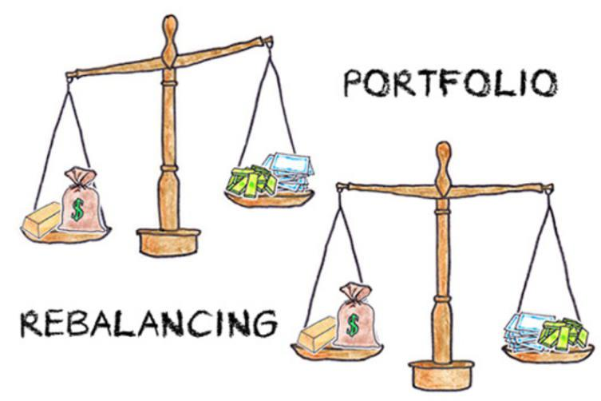

Portfolio rebalancing is a critical process in investment management, ensuring that an investor's asset allocation remains compatible with their financial objectives and risk tolerance. As market dynamics shift, the values of various assets within a portfolio can change, leading to a deviation from the initial allocation strategy. Rebalancing entails the strategic buying and selling of assets to restore the portfolio's target allocation, thereby mitigating risk and enhancing the potential for returns.

Algorithmic trading has introduced automation into portfolio rebalancing, promoting increased efficiency and precision. Automated systems can execute rebalancing operations based on pre-defined rules, reducing the likelihood of human error and enabling rapid adjustments in response to market movements. As such, algorithmic strategies in rebalancing can significantly enhance the management of investment portfolios.



This article examines the strategies employed in portfolio rebalancing, the benefits they offer, and the challenges faced by investors. It also considers future trends in the field, including technological advancements and the growing role of algorithmic approaches. As the landscape of investment management evolves, portfolio rebalancing remains a vital tool for optimizing financial outcomes.

## Table of Contents

## The Concept of Portfolio Rebalancing

Portfolio rebalancing is a fundamental strategy in investment management that primarily aims to manage risk while optimizing returns. This process involves adjusting the weights of a portfolio's assets to ensure they remain aligned with the investor's desired level of risk and their strategic investment plan. As market conditions change, the value of the various assets within a portfolio can shift, causing deviations from the intended allocation strategy. Rebalancing acts as a corrective measure to address these shifts. 

For example, if a portfolio initially allocated with 60% stocks and 40% bonds experiences a bull market that increases the stock portion to 70%, rebalancing would involve selling a portion of the stocks and purchasing bonds to restore the original 60/40 allocation. This not only maintains the investor's risk tolerance but also capitalizes on market movements by 'selling high and buying low', thus optimizing returns.

There are several methodologies to conduct portfolio rebalancing:

1. **Calendar Rebalancing**: This method involves adjusting the portfolio at predetermined intervals, such as monthly, quarterly, or annually. By setting specific timeframes for rebalancing, investors can systematically realign their portfolios without the influence of emotional decision-making tied to market volatility.

2. **Threshold Rebalancing**: This approach entails rebalancing when the asset allocation deviates from its target by a pre-specified threshold, for instance, a 5% deviation from the initial allocation. This method ensures that portfolios are adjusted promptly when there are significant market movements, offering a more dynamic response compared to calendar rebalancing.

3. **Combination of Calendar and Threshold Rebalancing**: In practice, investors often employ a hybrid strategy that combines both calendar and threshold rebalancing. For example, investors might set regular intervals for reviewing their portfolios while also acting when thresholds are breached, thus providing a balance between systematic intervention and agility in response to market changes.

Rebalancing is an ongoing process critical for maintaining the integrity of an investor's strategic asset allocation, adapting to evolving market conditions, and controlling risk exposure in pursuit of long-term financial objectives.

## Types of Rebalancing Strategies

Portfolio rebalancing strategies are critical components in maintaining the desired risk-return profile of an investment portfolio. They ensure that the proportions of different asset classes remain aligned with an investor's strategic goals. The primary types of rebalancing strategies include calendar rebalancing, threshold rebalancing, and dynamic rebalancing, each with its own methodology and benefits.

**Calendar Rebalancing:** 

Calendar rebalancing involves adjusting the portfolio at predetermined, regular intervals, such as monthly, quarterly, or annually. This strategy simplifies the rebalancing process by setting fixed times for review and adjustment, making it straightforward to implement. The regularity of calendar rebalancing helps in maintaining discipline and consistency in portfolio management. However, this approach might not respond quickly to sudden market changes as adjustments occur only at set times, potentially missing out on timely opportunities or risks.

For example, consider a portfolio with a target allocation of 60% stocks and 40% bonds. If this portfolio is rebalanced annually, each year, the asset proportions are checked and adjusted to return to the 60/40 split, regardless of intervening market movements.

**Threshold Rebalancing:**

Threshold rebalancing, also known as percentage-of-portfolio rebalancing, activates adjustments when an asset class deviates from its target allocation by a specified percentage threshold. This method is more responsive to market changes than calendar rebalancing as it triggers actions based on actual changes in asset values, not merely the passage of time. It ensures that the portfolio remains closely aligned with the investor’s risk tolerance.

Consider a portfolio designed with a 50% allocation to equities and 50% to fixed income. A threshold rebalancing strategy might specify a 5% deviation threshold. Therefore, if market movements cause the equity allocation to increase to 55% or decrease to 45%, rebalancing is triggered to restore the 50/50 balance.

**Dynamic Rebalancing:**

Dynamic rebalancing uses advanced algorithms to continually adjust the portfolio based on real-time market data, leveraging modern computing capabilities and data analytics. This approach offers a more precise and responsive strategy, ensuring that portfolios can swiftly react to market fluctuations. It is particularly beneficial in volatile market conditions, as it continuously evaluates asset allocations and makes adjustments as necessary to optimize the risk-return trade-off.

Dynamic rebalancing often employs sophisticated techniques such as [machine learning](/wiki/machine-learning) and [artificial intelligence](/wiki/ai-artificial-intelligence) to predict market trends and adjust portfolios accordingly. For instance, Python can be utilized for dynamic rebalancing through libraries such as `pandas` and `numpy` for data handling, and `pyportfolioopt` for optimization tasks:

```python
import pandas as pd
import numpy as np
from pypfopt import EfficientFrontier

# Example portfolio data
data = pd.read_csv('portfolio_data.csv')

# Calculate expected returns and sample variance
mu = data.mean()
S = data.cov()

# Optimize for maximal Sharpe ratio
ef = EfficientFrontier(mu, S)
weights = ef.max_sharpe()

# This function can be looped to rebalance dynamically:
def rebalance_portfolio():
    cleaned_weights = ef.clean_weights()
    return cleaned_weights

```

Overall, each rebalancing strategy offers distinct advantages and should be selected based on the investor's objectives, risk tolerance, and the resources available for portfolio management.

## Benefits of Portfolio Rebalancing

Portfolio rebalancing offers several key benefits that are essential for maintaining an optimal investment portfolio. One of the primary advantages is risk management. By regularly adjusting the portfolio to maintain the desired allocation, rebalancing prevents the portfolio from becoming overly concentrated in assets that may [carry](/wiki/carry-trading) higher risks. This is critical in aligning the portfolio with the investor's risk tolerance, ensuring that the potential for significant losses is minimized.

Another significant benefit is performance optimization. Portfolio rebalancing allows investors to capture gains by systematically selling assets that have performed well and have appreciated in value, and purchasing undervalued assets. This process can potentially lead to enhanced returns over time, as it ensures that the portfolio is continuously realigned to take advantage of market opportunities.

Moreover, portfolio rebalancing promotes behavioral discipline. Investors are prone to making emotional decisions during periods of market [volatility](/wiki/volatility-trading-strategies), such as panic selling during downturns or buying into market peaks driven by greed. A systematic rebalancing process mitigates these behavioral biases by adhering to a structured investment strategy, which enhances long-term financial outcomes.

Finally, tax efficiency is a considerable benefit of portfolio rebalancing. When executed thoughtfully, rebalancing can be done in a tax-efficient manner by considering capital gains taxes and utilizing tax-loss harvesting techniques. For instance, an investor can offset capital gains with losses from other investments, reducing the overall tax liability and preserving more wealth within the portfolio.

In conclusion, portfolio rebalancing is a fundamental practice that not only safeguards against undue risk but also optimizes performance, instills discipline, and promotes tax efficiency within investment strategies.

## Challenges and Considerations

Portfolio rebalancing, while essential for maintaining an optimal asset allocation, involves several challenges and considerations that need careful management. One of the primary concerns is the trading costs associated with frequent rebalancing. Each transaction incurs costs, including brokerage fees and taxes, which can cumulatively reduce the overall returns of the portfolio. Therefore, the frequency of rebalancing must be balanced against the costs to avoid unnecessary erosion of investment gains.

Another significant issue is market impact, particularly in less liquid markets. Large trades required for rebalancing can influence the market prices of securities, potentially leading to unfavorable execution prices. This effect is more pronounced in markets where trading volumes are low, making it crucial for investors to consider the [liquidity](/wiki/liquidity-risk-premium) of their investments before executing large-scale trades.

Additionally, the dynamic nature of asset correlations poses a challenge in rebalancing strategies. Correlations between assets can fluctuate due to economic events or changes in investor sentiment, affecting the portfolio’s risk profile. This is especially critical during financial crises, where previously uncorrelated assets may start moving in the same direction, thereby undermining the effectiveness of traditional diversification strategies. Investors need to incorporate adaptive methods that account for these correlation changes to maintain the desired risk-return balance.

Moreover, rebalancing strategies must align with individual investor preferences and constraints. These preferences may include risk tolerance, investment goals, tax considerations, and ethical or environmental guidelines. Customizing rebalancing approaches to fit these criteria requires a thorough understanding of the investor's unique situation and objectives. Thus, effective portfolio management should integrate a personalized approach that takes into account these diverse factors while maintaining operational flexibility and responsiveness to market conditions.

## Algorithmic Approach to Portfolio Rebalancing

The algorithmic approach to portfolio rebalancing involves using sophisticated quantitative models and advanced algorithms to adjust portfolios in accordance with market fluctuations and investor goals. This method allows for systematic and objective decision-making, reducing human error and increasing efficiency.

Model-based rebalancing employs quantitative models to adjust portfolios based on multiple market variables, such as asset prices, interest rates, and volatility indices. These models are designed to evaluate the current market conditions and predict potential movements, thus providing a basis for rebalancing decisions.

Optimization algorithms are central to the algorithmic rebalancing process. Techniques such as mean-variance optimization, initially developed by Harry Markowitz, are used to determine the ideal asset allocation that offers the maximum expected return for a given level of risk. This involves solving optimization problems where the expected return is maximized subject to constraints on the weights of the portfolio assets. The optimization problem can be represented mathematically as follows:

$$
\min_{\mathbf{w}} \quad \frac{1}{2} \mathbf{w}^T \Sigma \mathbf{w} - \mathbf{r}^T \mathbf{w}
$$

$$
\text{subject to} \quad \mathbf{1}^T \mathbf{w} = 1, \quad \mathbf{w} \geq 0
$$

where $\mathbf{w}$ is the vector of weights, $\Sigma$ is the covariance matrix of returns, and $\mathbf{r}$ is the vector of expected returns.

Genetic algorithms, inspired by the process of natural selection, offer another optimization method. These algorithms iteratively improve solutions by generating a population of possible portfolio allocations, evaluating their fitness based on a defined criteria, and using operations akin to biological processes such as mutation and crossover to produce new generations of solutions.

Automated execution platforms, which operate within [algorithmic trading](/wiki/algorithmic-trading) systems, enable trades to be conducted automatically based on predefined rules and algorithms. These platforms remove the need for manual intervention, thereby reducing human error and allowing for rapid response to market changes. For instance, a Python-based automated trading script might be structured as follows:

```python
def rebalance_portfolio(portfolio, target_allocation, market_data):
    for asset, target_weight in target_allocation.items():
        current_value = portfolio[asset]['quantity'] * market_data[asset]['price']
        desired_value = portfolio['total_value'] * target_weight
        trade_volume = (desired_value - current_value) / market_data[asset]['price']
        execute_trade(asset, trade_volume)

def execute_trade(asset, volume):
    # Implementation to execute trade based on the specific platform API
    pass
```

Backtesting and simulation are crucial components of the algorithmic approach. Backtesting involves applying a rebalancing strategy to historical data to evaluate its potential effectiveness before live implementation. This process allows for identification of potential issues and fine-tuning of the strategy to improve performance. By simulating different market scenarios, [backtesting](/wiki/backtesting) provides valuable insights into how strategies might perform under various conditions, enhancing the robustness and reliability of rebalancing strategies.

## Real-World Applications

Robo-advisors have revolutionized the landscape of investment management by leveraging algorithmic rebalancing to automatically manage client portfolios. Platforms such as Betterment and Wealthfront exemplify this approach, providing individuals with easy access to sophisticated asset management techniques traditionally reserved for institutional investors. These platforms use predefined algorithms to periodically rebalance portfolios, ensuring alignment with the investor's risk profile and target allocation.

Institutional investors, including large entities like BlackRock and Vanguard, implement advanced rebalancing strategies to optimize asset allocation across vast portfolios. These organizations utilize quantitative models to guide rebalancing decisions, taking into account market conditions, asset correlations, and investor preferences. Their approach combines both strategic and tactical elements to accommodate shifts in market dynamics while adhering to long-term investment objectives.

High-frequency trading firms such as Citadel Securities and Two Sigma represent another dimension of algorithmic rebalancing, characterized by rapid, frequent adjustments in response to real-time market fluctuations. These firms utilize complex algorithms and cutting-edge technology to execute trades with high speed and precision, allowing them to take advantage of transient market inefficiencies. Through such mechanisms, high-frequency trading firms maintain optimal asset distributions, ensuring swift adaptation to ever-changing financial landscapes.

## Future Trends in Portfolio Rebalancing

Advanced Analytics and AI present transformative possibilities for portfolio rebalancing, driven by data-intensive models capable of making real-time decisions. The increasing sophistication of artificial intelligence enables the analysis of large datasets, incorporating market trends, economic indicators, and investor behavior to optimize rebalancing strategies. Machine learning algorithms can identify patterns and predict asset performance, enhancing accuracy and speed in maintaining target asset allocations. Python libraries such as TensorFlow and PyTorch facilitate the development of these AI models, allowing financial institutions to implement state-of-the-art analytics in their rebalancing processes.

Customization and Personalization are becoming vital as investors demand strategies tailored to their specific financial goals and risk tolerance. Algorithms can incorporate individual preferences and constraints, creating personalized rebalancing methodologies. This personalized approach leverages AI to manage diverse factors, adjusting asset allocations based on unique investor profiles. Customization ensures that rebalancing is not only about market metrics but also aligns with personal investment philosophies, enhancing engagement and satisfaction.

Enhanced Risk Management will be significantly bolstered by blockchain technology. Blockchain's transparent and immutable ledger increases security and trust in portfolio management processes. By recording transactions on a distributed ledger, blockchain minimizes the risk of fraud and errors, offering a secure framework for executing rebalancing trades. Smart contracts can automate rebalancing procedures, ensuring that adjustments align with predefined criteria instantly and securely. This technology strengthens the integrity and reliability of rebalancing strategies, particularly during market volatility.

The Integration with Wealth Management Platforms marks a trend towards holistic financial planning. Rebalancing solutions are increasingly embedded within comprehensive wealth management systems, offering seamless integration of investment strategies with broader financial objectives. This integration allows for synchronized management of assets, liabilities, and cash flows, facilitating a cohesive strategy that supports long-term financial planning. By leveraging platforms that consolidate various financial services, investors gain a unified view of their portfolio, enabling more informed decision-making and comprehensive risk assessment.

In summary, future trends in portfolio rebalancing are characterized by the utilization of AI for data-driven precision, personalized investment strategies, blockchain-enhanced security, and the integration of rebalancing within broader wealth management frameworks. These advancements promise to deliver more efficient, customized, and secure portfolio management solutions, aligned with evolving investor needs and technological capabilities.

## Conclusion

Portfolio rebalancing is an essential practice for investors seeking to maintain a balanced risk-return profile and stay aligned with their financial objectives. Through the strategic adjustment of asset allocations, rebalancing helps manage risk and capitalize on market opportunities. Algorithmic approaches, characterized by their precision and efficiency, present significant advantages in executing these strategies. By utilizing sophisticated models and automation, investors can ensure systematic rebalancing, minimizing human errors and enhancing accuracy.

The evolution of technology promises further advancements in portfolio rebalancing, offering investors increasingly sophisticated and customized solutions. As algorithms become more adept at processing vast data sets in real-time, the ability to tailor strategies to individual preferences and risk tolerances will improve, optimizing financial outcomes. Additionally, emerging technologies, such as artificial intelligence and blockchain, will enhance transparency, security, and personalization in portfolio management. Consequently, investors will benefit from an integrated, holistic approach to wealth management, ensuring that their portfolios remain aligned with their evolving goals and market conditions.

## References & Further Reading

[1]: ["Algorithmic Trading and DMA: An introduction to direct access trading strategies"](https://www.amazon.com/Algorithmic-Trading-DMA-introduction-strategies/dp/0956399207) by Barry Johnson

[2]: Plessis, S. D., & Ward, M. (2009). ["Developing a Rebalancing Strategy for Hedge Funds."](https://www.scirp.org/reference/referencespapers?referenceid=1194496) Journal of Asset Management, 10(2), 87-99.

[3]: Treynor, J. L. (1990). ["Market Efficiency and the Bean Jar Experiment."](https://www.jstor.org/stable/4479031) Financial Analysts Journal, 46(1), 50-53.

[4]: ["The Intelligent Investor"](https://en.wikipedia.org/wiki/The_Intelligent_Investor) by Benjamin Graham

[5]: ["A Random Walk Down Wall Street: The Time-Tested Strategy for Successful Investing"](https://www.amazon.com/Random-Walk-Down-Wall-Street/dp/0393358380) by Burton G. Malkiel

[6]: Lopez de Prado, M. (2018). ["Advances in Financial Machine Learning."](https://www.amazon.com/Advances-Financial-Machine-Learning-Marcos/dp/1119482089) Wiley.

[7]: Markowitz, Harry (1952). ["Portfolio Selection."](https://onlinelibrary.wiley.com/doi/abs/10.1111/j.1540-6261.1952.tb01525.x) The Journal of Finance, 7(1), 77-91.