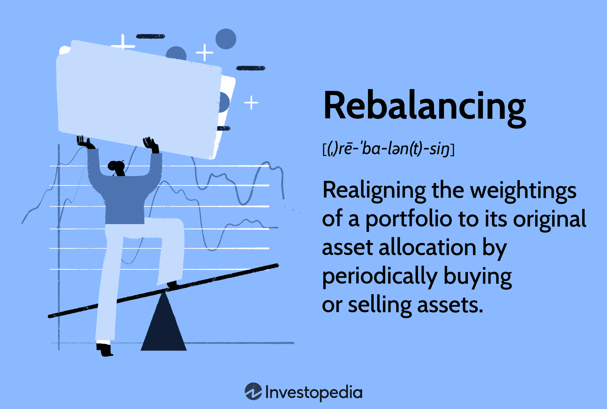

## Table of Contents

## What is portfolio rebalancing?

Portfolio rebalancing is when you adjust your investment mix to keep it in line with your original plan or goals. Over time, some of your investments might grow faster than others, which can change the balance of your portfolio. For example, if you started with half your money in stocks and half in bonds, but the stocks did really well, you might end up with more money in stocks than you wanted. Rebalancing helps you get back to your desired mix.

To rebalance, you sell some of the investments that have grown a lot and buy more of the ones that haven't grown as much. This can help you manage risk and stick to your investment strategy. It's like making sure your investment 'recipe' stays the same, even as the ingredients change over time. Rebalancing is important because it helps you stay on track with your financial goals and can prevent your portfolio from becoming too risky or too conservative.

## Why is portfolio rebalancing important?

Portfolio rebalancing is important because it helps you keep your investments in line with your goals. Imagine you decided to put your money into a mix of stocks and bonds. Over time, if the stock market does really well, you might find that you have more money in stocks than you planned. Rebalancing lets you sell some of those stocks and buy more bonds, so your mix stays the way you want it. This can help you manage risk and make sure your investments are still working towards what you want to achieve.

Another reason rebalancing is important is that it can help you buy low and sell high, which is a smart way to invest. When you rebalance, you're selling parts of your portfolio that have gone up in value and buying more of the parts that haven't done as well. This means you're taking profits from your winners and putting that money into investments that might be undervalued right now. Over time, this can lead to better returns and help you stay on track with your long-term financial plans.

## How often should you rebalance your portfolio?

There's no one-size-fits-all answer to how often you should rebalance your portfolio. A common rule is to do it once a year, like when you're looking over your taxes or planning for the next year. This helps you keep things in check without messing with your investments too much. But if your life changes, like you get a new job or have a baby, you might want to rebalance sooner to make sure your investments still match your new goals.

Another way to decide when to rebalance is to set a percentage limit. If any part of your portfolio grows or shrinks by more than, say, 5% or 10% from what you planned, that's a sign it's time to rebalance. This method means you might rebalance more often if the market is swinging a lot, or less often if things are pretty stable. The key is to find a balance that works for you and helps you stick to your investment plan.

## What are the common methods of portfolio rebalancing?

One common method of portfolio rebalancing is the calendar method. With this approach, you decide to rebalance your portfolio at set times, like once a year or every six months. This is simple because you don't have to keep checking your investments all the time. You just look at them on your chosen dates and make adjustments if needed. This method works well if you want a routine way to keep your investments on track without too much hassle.

Another method is the percentage-based approach. Here, you set a rule that if any part of your portfolio moves away from your target by a certain percentage, like 5% or 10%, you'll rebalance. This means you might rebalance more often if the market is going up and down a lot, or less often if things are pretty steady. This method can help you take advantage of market changes and keep your investments aligned with your goals.

Some people also use a combination of both methods. They might check their portfolio at set times but also keep an eye on it in case big changes happen. This way, they can rebalance if the market shifts a lot between their scheduled checks. Using a mix of methods can give you the best of both worlds, helping you stay on top of your investments while still having a routine.

## Can you explain the difference between calendar rebalancing and threshold rebalancing?

Calendar rebalancing is when you decide to check and adjust your investments at specific times, like once a year or every six months. It's like setting a reminder on your calendar to look at your portfolio and make changes if needed. This method is simple because you don't have to keep watching your investments all the time. You just do it on your chosen dates, which helps you keep your investments on track without too much hassle.

Threshold rebalancing, on the other hand, is when you set a rule that if any part of your portfolio moves away from your target by a certain percentage, like 5% or 10%, you'll rebalance. This means you might need to check your investments more often, especially if the market is going up and down a lot. This method can help you take advantage of market changes and keep your investments aligned with your goals more actively.

Both methods have their own benefits. Calendar rebalancing is easier to manage because it follows a set schedule, while threshold rebalancing can be more responsive to market changes. Some people even use a mix of both, checking their portfolio at set times but also keeping an eye on it in case big changes happen. This way, they can rebalance if the market shifts a lot between their scheduled checks.

## What are the potential risks of not rebalancing a portfolio?

If you don't rebalance your portfolio, you might end up with more risk than you want. Imagine you started with half your money in stocks and half in bonds. If the stock market does really well, you might end up with most of your money in stocks. This means your portfolio could be riskier than you planned because stocks can go up and down a lot more than bonds. If the market suddenly drops, you could lose more money than you expected.

Not rebalancing can also mean you miss out on chances to buy low and sell high. When some of your investments do really well, and you don't sell some to buy more of the ones that aren't doing as well, you might miss out on buying undervalued assets. Over time, this can make your portfolio perform worse than it could have. It's like not taking profits from your winners to invest in other opportunities that might grow in the future.

## How does portfolio rebalancing affect investment returns?

Portfolio rebalancing can help improve your investment returns by keeping your investments in line with your goals. If you started with a mix of stocks and bonds, but the stocks do really well, you might end up with more money in stocks than you planned. By rebalancing, you sell some of those stocks and buy more bonds, which can help you stick to your original plan. This way, you're not taking on more risk than you want, and you're making sure your portfolio is still working towards what you want to achieve.

Rebalancing also lets you take advantage of the "buy low, sell high" strategy. When you rebalance, you're selling parts of your portfolio that have gone up a lot and buying more of the parts that haven't done as well. This means you're taking profits from your winners and putting that money into investments that might be undervalued right now. Over time, this can lead to better returns because you're always adjusting to keep your investments balanced and in line with your goals.

## What are the tax implications of portfolio rebalancing?

When you rebalance your portfolio, you might have to pay taxes on any gains you make. If you sell investments that have gone up in value, you'll have to pay capital gains tax on the profit. This can be a short-term capital gain if you held the investment for less than a year, which is taxed at your regular income tax rate. Or it can be a long-term capital gain if you held it for more than a year, which usually has a lower tax rate. So, rebalancing can mean you have to pay more in taxes, especially if you're selling a lot of investments that have done well.

There are ways to rebalance that can help you lower your tax bill. One way is to do your rebalancing inside tax-advantaged accounts like an IRA or 401(k). In these accounts, you don't have to pay taxes on gains until you take the money out, so you can rebalance without worrying about immediate tax costs. Another way is to use new money to rebalance. Instead of selling investments, you can add new money to the parts of your portfolio that need more, which can help you avoid triggering taxes on gains. By thinking about taxes when you rebalance, you can keep more of your money working for you.

## How can rebalancing help in managing risk in a portfolio?

Rebalancing helps manage risk by making sure your investments stay in line with your goals. Imagine you started with half your money in stocks and half in bonds. If the stock market does really well, you might end up with more money in stocks than you planned. This can make your portfolio riskier because stocks can go up and down a lot more than bonds. By rebalancing, you sell some of the stocks that have grown a lot and buy more bonds, so your portfolio stays balanced and doesn't become too risky.

Rebalancing also helps you keep your risk level steady over time. If you don't rebalance, the parts of your portfolio that do well will keep growing, making your investments riskier than you want. By regularly checking and adjusting your investments, you can make sure they still match your comfort with risk. This way, you can sleep better at night knowing your money is working the way you want it to, without taking on too much risk.

## What role does asset allocation play in portfolio rebalancing?

Asset allocation is like the recipe for your investments. It's about deciding how much of your money goes into different types of investments, like stocks, bonds, and cash. When you start investing, you pick an asset allocation that matches your goals and how much risk you're okay with. Over time, though, some of your investments might grow faster than others. This can change your asset allocation, making it different from what you planned. Rebalancing helps you fix this by selling some of what's grown a lot and buying more of what hasn't, so your investments stay in line with your original plan.

Rebalancing keeps your asset allocation in check, which is important for managing risk. If you don't rebalance, the parts of your portfolio that do well will keep getting bigger, and that can make your investments riskier than you want. For example, if stocks do really well and grow a lot, you might end up with too much money in stocks. By rebalancing, you sell some stocks and buy more bonds or other less risky investments. This way, you keep your portfolio balanced and make sure it still matches your comfort with risk and your long-term goals.

## How do you calculate the need for rebalancing in a diversified portfolio?

To figure out if you need to rebalance your diversified portfolio, you start by looking at how your investments are doing compared to your original plan. Imagine you decided to put half your money in stocks and half in bonds. Over time, if the stock market does really well, you might find that you have more money in stocks than you wanted. To see if you need to rebalance, you check the current value of each part of your portfolio and see how it compares to your target percentages. If any part has moved away from your target by a certain amount, like 5% or 10%, it's time to rebalance.

Rebalancing means selling some of the investments that have grown a lot and buying more of the ones that haven't done as well. This helps you get back to your original asset allocation. For example, if your stocks grew so much that they now make up 60% of your portfolio instead of 50%, you would sell some stocks and use that money to buy more bonds. By doing this, you keep your investments in line with your goals and manage risk, making sure your portfolio doesn't become too risky or too conservative.

## What advanced strategies can be used for portfolio rebalancing in volatile markets?

In volatile markets, one advanced strategy for portfolio rebalancing is to use a more frequent threshold-based approach. Instead of waiting for a big shift, like a 10% change, you might set a smaller threshold, like 5% or even less. This means you'll rebalance more often, which can help you take advantage of quick market changes and keep your portfolio in line with your goals. By doing this, you're buying low and selling high more often, which can lead to better returns over time.

Another strategy is to use tax-efficient rebalancing. In volatile markets, you might have more chances to sell investments at a loss, which can help lower your tax bill. You can use these losses to offset any gains you have, a practice known as tax-loss harvesting. This means you're not just rebalancing to keep your asset allocation in check, but you're also thinking about how to save on taxes. By combining these strategies, you can manage risk better and keep more of your money working for you, even when the market is up and down a lot.

## What is an Algorithmic Approach to Portfolio Rebalancing?

The algorithmic approach to portfolio rebalancing involves using sophisticated quantitative models and advanced algorithms to adjust portfolios in accordance with market fluctuations and investor goals. This method allows for systematic and objective decision-making, reducing human error and increasing efficiency.

Model-based rebalancing employs quantitative models to adjust portfolios based on multiple market variables, such as asset prices, interest rates, and volatility indices. These models are designed to evaluate the current market conditions and predict potential movements, thus providing a basis for rebalancing decisions.

Optimization algorithms are central to the algorithmic rebalancing process. Techniques such as mean-variance optimization, initially developed by Harry Markowitz, are used to determine the ideal asset allocation that offers the maximum expected return for a given level of risk. This involves solving optimization problems where the expected return is maximized subject to constraints on the weights of the portfolio assets. The optimization problem can be represented mathematically as follows:

$$
\min_{\mathbf{w}} \quad \frac{1}{2} \mathbf{w}^T \Sigma \mathbf{w} - \mathbf{r}^T \mathbf{w}
$$

$$
\text{subject to} \quad \mathbf{1}^T \mathbf{w} = 1, \quad \mathbf{w} \geq 0
$$

where $\mathbf{w}$ is the vector of weights, $\Sigma$ is the covariance matrix of returns, and $\mathbf{r}$ is the vector of expected returns.

Genetic algorithms, inspired by the process of natural selection, offer another optimization method. These algorithms iteratively improve solutions by generating a population of possible portfolio allocations, evaluating their fitness based on a defined criteria, and using operations akin to biological processes such as mutation and crossover to produce new generations of solutions.

Automated execution platforms, which operate within [algorithmic trading](/wiki/algorithmic-trading) systems, enable trades to be conducted automatically based on predefined rules and algorithms. These platforms remove the need for manual intervention, thereby reducing human error and allowing for rapid response to market changes. For instance, a Python-based automated trading script might be structured as follows:

```python
def rebalance_portfolio(portfolio, target_allocation, market_data):
    for asset, target_weight in target_allocation.items():
        current_value = portfolio[asset]['quantity'] * market_data[asset]['price']
        desired_value = portfolio['total_value'] * target_weight
        trade_volume = (desired_value - current_value) / market_data[asset]['price']
        execute_trade(asset, trade_volume)

def execute_trade(asset, volume):
    # Implementation to execute trade based on the specific platform API
    pass
```

Backtesting and simulation are crucial components of the algorithmic approach. Backtesting involves applying a rebalancing strategy to historical data to evaluate its potential effectiveness before live implementation. This process allows for identification of potential issues and fine-tuning of the strategy to improve performance. By simulating different market scenarios, [backtesting](/wiki/backtesting) provides valuable insights into how strategies might perform under various conditions, enhancing the robustness and reliability of rebalancing strategies.

## References & Further Reading

[1]: ["Algorithmic Trading and DMA: An introduction to direct access trading strategies"](https://www.amazon.com/Algorithmic-Trading-DMA-introduction-strategies/dp/0956399207) by Barry Johnson

[2]: Plessis, S. D., & Ward, M. (2009). ["Developing a Rebalancing Strategy for Hedge Funds."](https://www.scirp.org/reference/referencespapers?referenceid=1194496) Journal of Asset Management, 10(2), 87-99.

[3]: Treynor, J. L. (1990). ["Market Efficiency and the Bean Jar Experiment."](https://www.jstor.org/stable/4479031) Financial Analysts Journal, 46(1), 50-53.

[4]: ["The Intelligent Investor"](https://en.wikipedia.org/wiki/The_Intelligent_Investor) by Benjamin Graham

[5]: ["A Random Walk Down Wall Street: The Time-Tested Strategy for Successful Investing"](https://www.amazon.com/Random-Walk-Down-Wall-Street/dp/0393358380) by Burton G. Malkiel

[6]: Lopez de Prado, M. (2018). ["Advances in Financial Machine Learning."](https://www.amazon.com/Advances-Financial-Machine-Learning-Marcos/dp/1119482089) Wiley.

[7]: Markowitz, Harry (1952). ["Portfolio Selection."](https://onlinelibrary.wiley.com/doi/abs/10.1111/j.1540-6261.1952.tb01525.x) The Journal of Finance, 7(1), 77-91.