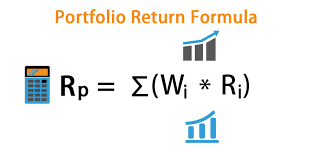

## Table of Contents

## What is a portfolio return?

A portfolio return is the total gain or loss you get from all the investments in your portfolio over a certain period of time. Your portfolio is like a basket that holds different types of investments, such as stocks, bonds, and mutual funds. The return is usually shown as a percentage, which tells you how much your investments have grown or shrunk. For example, if you started with $100 and your portfolio is now worth $110, your return would be 10%.

To calculate the portfolio return, you need to consider the performance of each investment in your portfolio. You add up the gains and losses from each investment, and then divide by the total value of your portfolio at the start. This gives you an overall picture of how well your entire portfolio is doing. It's important to look at the portfolio return because it helps you understand if your investment strategy is working and if you're meeting your financial goals.

## Why is calculating portfolio return important for investors?

Calculating portfolio return is important for investors because it shows them how well their investments are doing. It tells them if they are making money or losing money over time. By knowing the portfolio return, investors can see if their investment choices are good or if they need to make changes. This helps them make better decisions about where to put their money in the future.

Another reason it's important is that it helps investors compare their performance to other investment options or benchmarks. For example, they might want to see if their portfolio is doing better than a stock market index like the S&P 500. This comparison can show them if their strategy is working better or worse than the market as a whole. Understanding portfolio return also helps investors set realistic goals and track their progress towards those goals, making it a key part of managing their finances.

## How do you calculate the return of a single investment?

To calculate the return of a single investment, you need to know its starting value and its ending value. The return is the difference between these two values, usually shown as a percentage. For example, if you bought a stock for $50 and it's now worth $60, the return is $60 minus $50, which is $10. To turn this into a percentage, you divide the $10 gain by the original $50 investment, which gives you 0.20 or 20%. So, the return on your investment is 20%.

It's also important to consider the time period over which you're calculating the return. If you held the stock for one year, the 20% return is your annual return. But if you held it for five years, you might want to calculate the annualized return, which tells you the average return per year. To do this, you would use a formula that takes into account the total return and the number of years. This helps you compare returns over different time periods more fairly.

## What is the difference between simple and compound return?

Simple return is the basic way to figure out how much you've made or lost on an investment. It's just the difference between what you paid for the investment and what it's worth now, divided by what you paid. For example, if you bought something for $100 and it's now worth $110, your simple return is 10%. It's easy to calculate and understand, but it doesn't take into account the time your money is invested or any money you might have earned on your earnings.

Compound return, on the other hand, is a bit more complicated but gives you a fuller picture. It considers not just the initial investment but also the returns you earn over time. If you reinvest your earnings, you earn money on your money, and that can make your investment grow faster. For example, if you earn 10% on $100 the first year, you have $110. If you earn another 10% the next year, you earn it on the $110, not just the original $100, so you end up with $121. This is called compounding, and it's why compound return is important for understanding how investments grow over time.

## How do you calculate the total return of a portfolio?

To calculate the total return of a portfolio, you need to add up the returns from all the different investments in the portfolio. First, find out how much each investment has grown or shrunk since you bought it. You do this by looking at the starting value and the ending value of each investment. Then, you add up all those gains and losses. For example, if one stock went up by $10 and another went down by $5, the total change would be $5. After you have the total change, you divide it by the total amount you invested at the start. This gives you the total return as a percentage.

It's important to consider any money you added or took out of the portfolio while calculating the total return. If you added more money, you need to adjust the starting value to reflect that. If you took money out, you need to adjust the ending value. This makes sure your total return calculation is accurate. For example, if you started with $100 and added $50 halfway through, you might need to use a weighted average to figure out the right starting value. By taking all these things into account, you get a clear picture of how well your entire portfolio is doing.

## What is the role of weighting in portfolio return calculation?

Weighting is important in figuring out a portfolio's total return because it shows how much each investment affects the overall performance. Imagine your portfolio is a pie, and each slice of the pie is a different investment. Some slices are bigger than others, meaning you have more money in those investments. When you calculate the total return, you need to consider how much each slice contributes. If a big slice goes up a lot, it will pull the whole portfolio's return up. But if a small slice goes up a lot, it won't make as big a difference.

To calculate the weighted return, you find the return for each investment and then multiply it by the fraction of your total portfolio that investment represents. For example, if you have 60% of your money in Stock A and it goes up 10%, that adds 6% to your total portfolio return (60% of 10%). If the other 40% is in Stock B and it goes down 5%, that subtracts 2% from your total portfolio return (40% of -5%). Adding these together, your total portfolio return would be 4%. Weighting helps you see the real impact of each investment on your portfolio's performance.

## How does diversification affect portfolio return?

Diversification is like spreading your money across different types of investments. It can help make your portfolio return more stable. When you put all your money in one place, like just one stock, it's riskier because if that stock goes down, your whole portfolio goes down. But if you spread your money across different stocks, bonds, or other investments, some might go up while others go down. This can smooth out the ups and downs, making your overall return more steady over time.

While diversification can help reduce risk, it can also affect how much your portfolio grows. If you put all your money in a few high-risk, high-reward investments and they do well, you could see a big return. But if you spread your money across many different investments, some might not grow as fast. This means your total return might not be as high as it could be if you had bet everything on a few winners. So, diversification is a trade-off between having a more stable return and possibly missing out on bigger gains.

## What are the common benchmarks used to evaluate portfolio return?

When people want to see how well their investments are doing, they often compare their portfolio return to benchmarks. A common benchmark is the S&P 500, which is a group of 500 big companies in the United States. If your portfolio return is higher than the S&P 500, it means your investments are doing better than these big companies on average. Another common benchmark is the Dow Jones Industrial Average, which looks at 30 big companies. By comparing your portfolio to these benchmarks, you can see if you're beating the market or not.

There are also other benchmarks depending on what kind of investments you have. If you have a lot of bonds, you might compare your return to the Bloomberg Barclays U.S. Aggregate Bond Index, which tracks a bunch of bonds. For international stocks, the MSCI World Index is often used. These benchmarks help you understand if your investments are doing well compared to similar investments around the world. By using these common benchmarks, you can get a clear idea of how your portfolio is performing and make better decisions about your money.

## How can risk-adjusted returns be calculated and why are they important?

Risk-adjusted returns help you see how well your investments are doing after considering how risky they are. One common way to calculate them is by using the Sharpe Ratio. The Sharpe Ratio looks at the return of your investment and subtracts the return you could have gotten from a safe investment like a savings account. Then, it divides that number by the risk of your investment, which is often measured by how much the investment's value goes up and down. A higher Sharpe Ratio means you're getting more return for the risk you're taking, which is good.

These risk-adjusted returns are important because they give you a better idea of how smart your investment choices are. Just looking at the return without considering risk can be misleading. For example, if one investment gives you a high return but is very risky, it might not be as good as another investment with a lower return but less risk. By using risk-adjusted returns, you can compare different investments more fairly and make choices that fit your comfort with risk. This helps you build a portfolio that balances growth with safety, making your financial planning more effective.

## What are some advanced methods to forecast future portfolio returns?

One advanced method to forecast future portfolio returns is using Monte Carlo simulations. This method runs many different possible scenarios for your investments, kind of like playing out a bunch of different futures. It takes into account things like how much the market might go up or down, how your investments might perform compared to the market, and even how often you might add or take out money from your portfolio. By looking at all these different possibilities, Monte Carlo simulations can give you a range of what your future returns might be, helping you plan better for different situations.

Another method is using historical data and statistical models. This involves looking at how your investments have done in the past and using math to guess how they might do in the future. You might use things like regression analysis, which looks at how different factors affect your returns, or time-series analysis, which looks at patterns over time. By understanding these past patterns and relationships, you can make educated guesses about what might happen next. This method can be helpful, but remember that past performance doesn't always tell you what will happen in the future, so it's important to keep an eye on new information and changes in the market.

## How do taxes and inflation impact the real return of a portfolio?

Taxes and inflation can both reduce the real return of your portfolio, which is the actual growth of your money after accounting for these factors. When you make money from your investments, you often have to pay taxes on those gains. The more you earn, the more taxes you might have to pay, which means less money stays in your pocket. For example, if your investments go up by 10% in a year but you have to pay 20% in taxes on that gain, your real return after taxes would be less than 10%. So, taxes can eat into your investment earnings and lower your overall return.

Inflation is another factor that can chip away at your portfolio's real return. Inflation means that the prices of things you buy, like food and gas, go up over time. If your investments grow at 5% in a year but inflation is also 5%, your money isn't really growing because everything else is getting more expensive at the same rate. So, to keep up with inflation, your portfolio needs to grow faster than the rate of inflation. If it doesn't, the real value of your money goes down, even if the numbers in your account look the same or go up a little. Both taxes and inflation are important to consider when you're looking at how well your investments are really doing.

## What are the limitations and potential biases in portfolio return analysis?

One big problem with looking at portfolio returns is that past results don't always tell you what will happen next. Just because your investments did well last year doesn't mean they'll do well next year. Things like the economy, new laws, and world events can change how your investments perform. Also, if you only look at the returns and not how risky the investments are, you might think you're doing better than you really are. Risky investments can give you big returns one year but lose a lot the next, so it's important to think about risk too.

Another issue is that people can have biases when they look at their portfolio returns. Sometimes, investors only remember the good times and forget the bad ones, which makes them think their investments are doing better than they really are. This is called "confirmation bias." Also, if you only look at short periods of time, like a few months, you might not see the full picture. Investments can go up and down a lot in the short term, but over many years, they might grow more steadily. So, it's good to look at longer periods to get a better idea of how your portfolio is really doing.

## What is the key to understanding portfolio performance?

Portfolio performance is a critical element in the financial decision-making process as it directly reflects the success of an investment strategy in achieving returns relative to the risk taken. Evaluating portfolio performance involves multiple metrics, each contributing insights into different aspects of performance. 

The Total Return is a fundamental metric that quantifies the overall gain or loss of an investment, considering capital appreciation, dividends, and interest. Total Return can be expressed as:

$$
\text{Total Return} = \frac{\text{(Ending Value - Beginning Value) + Dividends}}{\text{Beginning Value}} \times 100\%
$$

Annualized Return standardizes the Total Return for comparison purposes by accounting for the investment period, allowing investors to evaluate how much an investment would grow over a year. The formula for Annualized Return is:

$$
\text{Annualized Return} = \left( \frac{\text{Ending Value}}{\text{Beginning Value}} \right)^{\frac{1}{n}} - 1
$$

where $n$ is the number of years.

Volatility is another essential metric that measures the degree of variation in returns over a period. It is usually expressed as the standard deviation of returns and indicates the risk involved with the portfolio. Higher [volatility](/wiki/volatility-trading-strategies) implies greater risk, with investments potentially experiencing larger swings in value.

Risk-adjusted returns such as the Sharpe Ratio and Sortino Ratio offer perspectives on returns in relation to risk. The Sharpe Ratio is calculated as:

$$
\text{Sharpe Ratio} = \frac{\text{Portfolio Return - Risk-Free Rate}}{\text{Standard Deviation of Portfolio Returns}}
$$

It evaluates returns after adjusting for risk, with higher values indicating more attractive risk-adjusted performance. The Sortino Ratio, in contrast, focuses specifically on downside risk by considering only negative deviations, providing clarity when measuring returns against potential losses.

Understanding these metrics is crucial for investors seeking to align their strategies with their financial goals and risk tolerance. By diversifying assets, periodically rebalancing the portfolio, and optimizing asset allocation, investors can effectively manage portfolio performance. 

Diversification involves spreading investments across various asset classes to mitigate risk, ensuring that the portfolio is not overly dependent on a single investment's performance. Rebalancing involves adjusting the portfolio to maintain a desired asset allocation, adapting to changes in market conditions and investment performance.

A regular assessment of these performance metrics is vital to ensure that the portfolio adapts appropriately to the dynamic market landscape and evolving investor needs. By regularly monitoring and evaluating these metrics, investors can fine-tune their strategies to optimize returns while adequately managing risk.

In summary, a comprehensive understanding of portfolio performance through metrics like total return, annualized return, volatility, and risk-adjusted ratios, empowers investors to strategically align their investments to meet financial aspirations. Regular revaluation based on these metrics ensures that portfolios remain resilient and responsive amidst market changes.

## What are the Key Portfolio Performance Metrics Explained?

Portfolio performance metrics are fundamental tools that help investors evaluate and interpret the effectiveness of their investment strategies. These metrics provide quantitative assessments of return potential, risk exposure, and overall investment efficiency.

### Total Return, Annualized Return, and Volatility
Total Return measures the comprehensive gain or loss of a portfolio over a particular period, including capital gains, dividends, and interest. It serves as a foundational metric reflecting the portfolio's performance without temporal considerations.

Annualized Return is crucial for comparing investment results over different time frames by standardizing total returns to a yearly rate, allowing investors to evaluate the consistency of returns over time. It is calculated using the formula:

$$
\text{Annualized Return} = \left( (1 + \text{Total Return})^{\frac{1}{n}} - 1 \right) \times 100
$$

where $n$ is the number of years.

Volatility signifies the degree of variation of portfolio returns, serving as a proxy for risk. High volatility suggests more uncertainty regarding returns, while low volatility indicates steadier performance.

### Sharpe Ratio and Sortino Ratio
The Sharpe Ratio evaluates returns adjusted for risk by comparing excess return (returns above the risk-free rate) per unit of portfolio volatility. It's calculated as:

$$
\text{Sharpe Ratio} = \frac{R_p - R_f}{\sigma_p}
$$

where $R_p$ is the portfolio return, $R_f$ is the risk-free rate, and $\sigma_p$ is the portfolio's standard deviation.

The Sortino Ratio is a variation of the Sharpe Ratio focused on downside risk, using negative asset return deviation rather than total volatility, thus offering a clearer perspective on returns considering only harmful deviations:

$$
\text{Sortino Ratio} = \frac{R_p - R_f}{\sigma_d}
$$

where $\sigma_d$ is the standard deviation of negative returns.

### Maximum Drawdown and Calmar Ratio
Maximum Drawdown represents the largest peak-to-trough decline in a portfolio, indicating potential loss scenarios investors might face. It highlights the severity of investment downturns over a specific period.

The Calmar Ratio assists in assessing risk-adjusted performance by comparing the annualized return to the maximum drawdown:

$$
\text{Calmar Ratio} = \frac{\text{Annualized Return}}{\text{Maximum Drawdown}}
$$

This ratio aids in understanding the reward relative to the risk of significant loss, promoting strategies that balance returns with drawdown management.

### Alpha and Beta
Alpha is a measure of a portfolio's performance on a risk-adjusted basis compared to a benchmark index. A positive alpha indicates that the portfolio has outperformed its benchmark, showcasing the skill of the portfolio manager.

Beta measures a portfolio's volatility relative to the market. A beta greater than 1 suggests higher volatility than the market, while a beta less than 1 indicates less volatility, allowing investors to assess how a portfolio is likely to react to market movements.

### Application of Metrics
A comprehensive understanding of these metrics allows investors to refine their portfolio strategies, tailoring investments to achieve superior returns while managing risk effectively. By applying these metrics consistently, investors can monitor portfolio dynamics and adjust their strategies to align with changing financial goals and market conditions.

## References & Further Reading

[1]: Berger, A., & Pukthuanthong, K. (2012). ["Market Timing and Portfolio Management: The Role of Algorithmic Trading."](https://www.kuntara.net/) Journal of Investment Management, 10, 5-17.

[2]: Jagged, P., & Subrahmanyam, M. (2018). ["The Impact of Algorithmic Trading on Market Liquidity in the Global Financial Markets."](https://www.sciencedirect.com/science/article/pii/S0957417422006479) Journal of Financial Markets, 39, 27-48.

[3]: Lopez de Prado, M. (2018). ["Advances in Financial Machine Learning,"](https://www.amazon.com/Advances-Financial-Machine-Learning-Marcos/dp/1119482089) Wiley.

[4]: Jansen, S. (2020). ["Machine Learning for Algorithmic Trading."](https://github.com/stefan-jansen/machine-learning-for-trading) Packt Publishing.

[5]: Aronson, D. R. (2006). ["Evidence-Based Technical Analysis: Applying the Scientific Method and Statistical Inference to Trading Signals."](https://www.amazon.com/Evidence-Based-Technical-Analysis-Scientific-Statistical/dp/0470008741) John Wiley & Sons.

[6]: Chan, E. P. (2009). ["Quantitative Trading: How to Build Your Own Algorithmic Trading Business."](https://github.com/ftvision/quant_trading_echan_book) Wiley Trading Series.