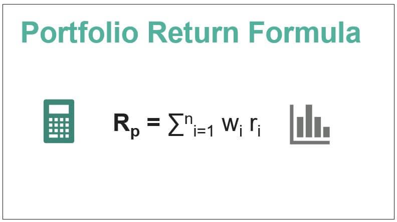

In finance, effective portfolio management and investment returns stand as key pillars for investors aiming to achieve their financial objectives. At the forefront of this transformation is algorithmic trading, often referred to as algo trading, which leverages sophisticated automated systems for making informed and rapid investment decisions. Algo trading has significantly changed how portfolios are managed by enhancing precision and execution speed, thereby enabling investors to strategically adjust their holdings according to real-time market conditions.

This article examines the critical interconnection among portfolio performance, investment returns, and algorithmic trading, highlighting their significance in the contemporary financial arena. Investors equipped with a thorough understanding of these concepts can develop smarter strategies that not only maximize returns but also manage risk effectively. By combining a systematic approach with cutting-edge technologies, investors can better navigate market volatilities and opportunities.



Furthermore, performance metrics and visualization tools play an essential role in evaluating portfolio dynamics. These tools facilitate the analysis and interpretation of complex financial data, empowering investors to make data-driven decisions. Performance metrics provide a quantitative assessment of an investment's success relative to risks undertaken, while visualization aids in simplifying intricate data patterns into accessible insights. As the financial markets evolve, harnessing these technologies and metrics becomes increasingly vital in optimizing portfolio strategies and achieving superior investment outcomes.

## Table of Contents

## Understanding Portfolio Performance

Portfolio performance is a critical element in the financial decision-making process as it directly reflects the success of an investment strategy in achieving returns relative to the risk taken. Evaluating portfolio performance involves multiple metrics, each contributing insights into different aspects of performance. 

The Total Return is a fundamental metric that quantifies the overall gain or loss of an investment, considering capital appreciation, dividends, and interest. Total Return can be expressed as:

$$
\text{Total Return} = \frac{\text{(Ending Value - Beginning Value) + Dividends}}{\text{Beginning Value}} \times 100\%
$$

Annualized Return standardizes the Total Return for comparison purposes by accounting for the investment period, allowing investors to evaluate how much an investment would grow over a year. The formula for Annualized Return is:

$$
\text{Annualized Return} = \left( \frac{\text{Ending Value}}{\text{Beginning Value}} \right)^{\frac{1}{n}} - 1
$$

where $n$ is the number of years.

Volatility is another essential metric that measures the degree of variation in returns over a period. It is usually expressed as the standard deviation of returns and indicates the risk involved with the portfolio. Higher [volatility](/wiki/volatility-trading-strategies) implies greater risk, with investments potentially experiencing larger swings in value.

Risk-adjusted returns such as the Sharpe Ratio and Sortino Ratio offer perspectives on returns in relation to risk. The Sharpe Ratio is calculated as:

$$
\text{Sharpe Ratio} = \frac{\text{Portfolio Return - Risk-Free Rate}}{\text{Standard Deviation of Portfolio Returns}}
$$

It evaluates returns after adjusting for risk, with higher values indicating more attractive risk-adjusted performance. The Sortino Ratio, in contrast, focuses specifically on downside risk by considering only negative deviations, providing clarity when measuring returns against potential losses.

Understanding these metrics is crucial for investors seeking to align their strategies with their financial goals and risk tolerance. By diversifying assets, periodically rebalancing the portfolio, and optimizing asset allocation, investors can effectively manage portfolio performance. 

Diversification involves spreading investments across various asset classes to mitigate risk, ensuring that the portfolio is not overly dependent on a single investment's performance. Rebalancing involves adjusting the portfolio to maintain a desired asset allocation, adapting to changes in market conditions and investment performance.

A regular assessment of these performance metrics is vital to ensure that the portfolio adapts appropriately to the dynamic market landscape and evolving investor needs. By regularly monitoring and evaluating these metrics, investors can fine-tune their strategies to optimize returns while adequately managing risk.

In summary, a comprehensive understanding of portfolio performance through metrics like total return, annualized return, volatility, and risk-adjusted ratios, empowers investors to strategically align their investments to meet financial aspirations. Regular revaluation based on these metrics ensures that portfolios remain resilient and responsive amidst market changes.

## Investment Returns and Their Impact

Investment returns reflect the gain or loss accrued by an investment portfolio over a defined period. These returns manifest as price appreciation, dividends, and interest, embodying both capital gains and income streams. For investors, examining returns is pivotal in forecasting future performance and evaluating the relative efficiency among disparate investment opportunities.

The evaluation of investment returns necessitates a methodological approach. Among the numerous metrics available, the time-weighted rate of return and the internal rate of return are frequently employed to gauge portfolio performance comprehensively. The time-weighted rate of return is particularly beneficial as it neutralizes the effects of external cash flows, providing a clear snapshot of the portfolio's performance over time, independent of investor-driven additions or withdrawals. Conversely, the internal rate of return offers insights into the portfolio's profitability, effectively representing the discount rate that makes the net present value of the cash flows from all investments equal zero.

When assessing investment returns, investors must be mindful of the erosive impacts of taxes, fees, and inflation, which can depreciate real investment returns. Taxes encompass capital gains tax and dividend tax, both of which reduce the actualized income from investments. Fees, including management and transaction fees, further chip away at gross returns. Inflation, too, diminishes purchasing power, indicating that nominal returns could be less impactful than initially perceived when analyzed in real terms. 

By meticulously evaluating these components, investors are better equipped to compare investment options holistically. Furthermore, understanding these factors assists in strategizing effectively to enhance portfolio efficiency and stability over the long term.

## The Role of Algorithmic Trading in Portfolio Management

Algorithmic trading employs sophisticated technologies and algorithms to automate trading decisions, significantly enhancing the precision and speed of executions in financial markets. This automation allows portfolios to be optimized by dynamically adjusting asset allocations in real-time according to predefined parameters and current market conditions. By leveraging these technological advancements, [algorithmic trading](/wiki/algorithmic-trading) provides crucial benefits in portfolio management.

One of the primary advantages of algorithmic trading is its ability to minimize human errors and biases. Traditional trading methods are susceptible to emotional and cognitive biases, which can lead to inconsistent decision-making. In contrast, algorithmic trading systems follow strict rules and predefined strategies, ensuring a more disciplined and systematic approach to trading. This results in an efficient way to achieve targeted investment objectives while maintaining strict adherence to the risk-return profiles chosen by investors.

Furthermore, algo trading facilitates effective portfolio management through several strategic methodologies. Investors can leverage algorithmic systems for rebalancing their portfolios. Rebalancing involves adjusting the proportions of assets in a portfolio to maintain a desired level of asset allocation, such as 60% stocks and 40% bonds. Algorithms monitor portfolio drift in real-time and [carry](/wiki/carry-trading) out necessary trades to revert to the target mix, optimizing returns while managing risk.

Risk management is another crucial domain where algorithmic trading is beneficial. Algorithms can analyze vast quantities of data swiftly to identify potential risks and implement risk mitigation strategies. This might include altering asset allocations to hedge against market volatility or managing exposure to specific market sectors or assets that have seen heightened risk levels. Additionally, algorithms exploit market inefficiencies—conditions where securities are mispriced—by identifying and acting on [arbitrage](/wiki/arbitrage) opportunities much faster than human traders can.

The integration of algorithmic trading with powerful portfolio visualizers augments the analysis of complex financial data. These tools provide concise and insightful graphical representations, enabling traders and portfolio managers to gain a deeper understanding of portfolio dynamics. Enhanced data visualization facilitates strategic decision-making by offering comprehensive real-time analytics, which supports sophisticated modeling of potential market scenarios and outcomes. It also aids in stress testing portfolios under various economic conditions, greatly improving strategic flexibility.

In summary, algorithmic trading revolutionizes portfolio management by automating decisions, minimizing errors, and enhancing strategic insights. The role of algorithms in optimizing asset allocations, managing risks, and exploiting market inefficiencies is indispensable for enhancing investment performance. As technology continues to evolve, the use of algorithmic trading combined with advanced visualization tools will remain a cornerstone in optimizing portfolio management.

## Key Portfolio Performance Metrics Explained

Portfolio performance metrics are fundamental tools that help investors evaluate and interpret the effectiveness of their investment strategies. These metrics provide quantitative assessments of return potential, risk exposure, and overall investment efficiency.

### Total Return, Annualized Return, and Volatility
Total Return measures the comprehensive gain or loss of a portfolio over a particular period, including capital gains, dividends, and interest. It serves as a foundational metric reflecting the portfolio's performance without temporal considerations.

Annualized Return is crucial for comparing investment results over different time frames by standardizing total returns to a yearly rate, allowing investors to evaluate the consistency of returns over time. It is calculated using the formula:

$$
\text{Annualized Return} = \left( (1 + \text{Total Return})^{\frac{1}{n}} - 1 \right) \times 100
$$

where $n$ is the number of years.

Volatility signifies the degree of variation of portfolio returns, serving as a proxy for risk. High volatility suggests more uncertainty regarding returns, while low volatility indicates steadier performance.

### Sharpe Ratio and Sortino Ratio
The Sharpe Ratio evaluates returns adjusted for risk by comparing excess return (returns above the risk-free rate) per unit of portfolio volatility. It's calculated as:

$$
\text{Sharpe Ratio} = \frac{R_p - R_f}{\sigma_p}
$$

where $R_p$ is the portfolio return, $R_f$ is the risk-free rate, and $\sigma_p$ is the portfolio's standard deviation.

The Sortino Ratio is a variation of the Sharpe Ratio focused on downside risk, using negative asset return deviation rather than total volatility, thus offering a clearer perspective on returns considering only harmful deviations:

$$
\text{Sortino Ratio} = \frac{R_p - R_f}{\sigma_d}
$$

where $\sigma_d$ is the standard deviation of negative returns.

### Maximum Drawdown and Calmar Ratio
Maximum Drawdown represents the largest peak-to-trough decline in a portfolio, indicating potential loss scenarios investors might face. It highlights the severity of investment downturns over a specific period.

The Calmar Ratio assists in assessing risk-adjusted performance by comparing the annualized return to the maximum drawdown:

$$
\text{Calmar Ratio} = \frac{\text{Annualized Return}}{\text{Maximum Drawdown}}
$$

This ratio aids in understanding the reward relative to the risk of significant loss, promoting strategies that balance returns with drawdown management.

### Alpha and Beta
Alpha is a measure of a portfolio's performance on a risk-adjusted basis compared to a benchmark index. A positive alpha indicates that the portfolio has outperformed its benchmark, showcasing the skill of the portfolio manager.

Beta measures a portfolio's volatility relative to the market. A beta greater than 1 suggests higher volatility than the market, while a beta less than 1 indicates less volatility, allowing investors to assess how a portfolio is likely to react to market movements.

### Application of Metrics
A comprehensive understanding of these metrics allows investors to refine their portfolio strategies, tailoring investments to achieve superior returns while managing risk effectively. By applying these metrics consistently, investors can monitor portfolio dynamics and adjust their strategies to align with changing financial goals and market conditions.

## Benefits of Portfolio Visualizers in Algo Trading

Portfolio visualizers play a pivotal role in algorithmic trading by converting complex datasets into easily comprehensible visual representations. This transformation is crucial as it aids traders in making informed decisions by simplifying otherwise intricate investment scenarios. At the core of their utility is the ability to enable traders to effectively assess risk, diversify their portfolios, and allocate assets optimally. By providing clear visual cues, portfolio visualizers enhance strategy optimization, ensuring that traders can align their practices with dynamic market conditions.

One of the standout features of portfolio visualizers is their provision for [backtesting](/wiki/backtesting) trading strategies. Backtesting involves simulating a trading strategy using historical data to evaluate its potential effectiveness. Visualizers facilitate this process by offering a platform where traders can refine algorithms and predict potential outcomes without financial risk. This enables the adjustment of strategies before applying them in live markets, thus improving the probability of achieving favorable returns.

Moreover, portfolio visualizers are equipped with real-time monitoring and reporting capabilities. These features are vital for making timely adjustments to trading strategies based on the latest market data. By providing instantaneous feedback, visualizers ensure that traders can respond quickly to market shifts, thereby protecting investments and exploiting opportunities as they arise.

The sophisticated analytics offered by portfolio visualizers further empower traders by providing deep insights into financial markets. These analytics support traders in navigating complex market dynamics, ultimately reducing risks and enhancing returns. For instance, traders can use advanced statistical models and [machine learning](/wiki/machine-learning) techniques that are part of modern visualizer tools to identify trends, correlations, and anomalies within dataset patterns.

To illustrate, consider the use of a simple Python script to visualize asset allocation in a portfolio:

```python
import matplotlib.pyplot as plt

# Sample asset allocation data
assets = ['Stocks', 'Bonds', 'Real Estate', 'Commodities']
allocation = [0.55, 0.25, 0.15, 0.05]

# Create a pie chart
plt.figure(figsize=(8, 8))
plt.pie(allocation, labels=assets, autopct='%1.1f%%', startangle=140)
plt.title('Portfolio Asset Allocation')
plt.show()
```

This example shows how data can be transformed into a visual format that is easy to interpret, allowing traders to see at a glance how their assets are allocated and determine whether adjustments might be necessary.

In summary, portfolio visualizers are indispensable tools in the arsenal of algorithmic traders. They facilitate the translation of complex data into actionable insights, streamline the backtesting process, offer real-time market analysis, and provide sophisticated analytics, all of which contribute to enhanced decision-making and improved trading outcomes.

## Challenges and Considerations in Implementing Algo Trading

Algorithmic trading, despite its myriad advantages, presents several challenges that traders and investors must navigate carefully. 

One of the primary concerns lies in ensuring data accuracy. Algorithmic trading systems heavily rely on vast amounts of data to make informed decisions. Inaccurate or incomplete data can result in substantial financial losses. Therefore, it is critical to have robust data validation mechanisms and checks in place to maintain data integrity. 

System compatibility is another challenge in implementing algorithmic trading. Trading platforms must seamlessly integrate with various external systems, including data providers, brokers, and portfolio visualizers. This requires careful consideration of platform compatibility and data handling capabilities. Developers must ensure that all components of the trading infrastructure can communicate efficiently to minimize latency and prevent execution errors.

Understanding complex algorithms is vital for both developers and end-users of trading systems. These algorithms can be intricate and require a deep understanding of both coding and financial markets. Continuous model refinement is necessary because financial markets are dynamic, and models that perform well in certain market conditions may falter in others. Traders must remain aware of these limitations and engage in regular testing and recalibration of their models to maintain effectiveness.

Security, transparency, and regulatory compliance are paramount in algorithmic trading. Systems must be fortified against cyber threats to protect sensitive financial data. Additionally, regulators increasingly demand transparency in trading algorithms to ensure fair market practices. Ensuring that algorithmic systems comply with all relevant laws and regulations is essential to avoid legal penalties and maintain trust within the financial industry.

Finally, technological advancements in algorithmic trading necessitate ongoing evaluation and adaptation. The rapid pace of change in both software and hardware technologies can render existing systems obsolete. Therefore, traders and developers must stay informed about the latest developments and be prepared to integrate new technologies that enhance efficiency and performance.

Successfully addressing these challenges requires a multidisciplinary approach that combines technical expertise, financial acumen, and a commitment to continuous improvement in both technologies and the strategies they empower.

## Conclusion

Integrating algorithmic trading with portfolio performance analysis provides notable benefits in today’s complex financial markets. The precision and efficiency offered by algorithmic systems enhance decision-making processes, allowing investors to optimize returns and effectively manage risk. Portfolio visualizers play a crucial role by translating complex data into accessible formats, empowering investors to make informed decisions. These tools improve the clarity of investment scenarios through intuitive graphics, enabling better assessment of risk, diversification, and asset allocation.

Adopting a strategic investment approach that includes regular performance reviews and the integration of advanced technology can significantly enhance portfolio outcomes. This involves continuous analysis of performance metrics such as Total Return, Annualized Return, and risk-adjusted measures like the Sharpe and Sortino ratios. These metrics assist in refining investment strategies, aligning them with financial goals, and managing market dynamics adeptly.

Traders and investors are encouraged to leverage technological advancements actively and remain adaptable to maintain a competitive edge. The rapid evolution of technology in finance necessitates a proactive stance toward integrating innovative solutions, ensuring that trading strategies remain relevant and effective.

As the financial landscape continues to change, a solid understanding of algorithmic trading and portfolio management concepts becomes increasingly important. This knowledge not only aids in optimizing investment strategies but also equips investors and traders to navigate the complexities of modern financial markets successfully. Maintaining a strategic focus on both technological and analytical advancements will be pivotal in achieving superior investment results.

## References & Further Reading

[1]: Berger, A., & Pukthuanthong, K. (2012). ["Market Timing and Portfolio Management: The Role of Algorithmic Trading."](https://www.kuntara.net/) Journal of Investment Management, 10, 5-17.

[2]: Jagged, P., & Subrahmanyam, M. (2018). ["The Impact of Algorithmic Trading on Market Liquidity in the Global Financial Markets."](https://www.sciencedirect.com/science/article/pii/S0957417422006479) Journal of Financial Markets, 39, 27-48.

[3]: Lopez de Prado, M. (2018). ["Advances in Financial Machine Learning,"](https://www.amazon.com/Advances-Financial-Machine-Learning-Marcos/dp/1119482089) Wiley.

[4]: Jansen, S. (2020). ["Machine Learning for Algorithmic Trading."](https://github.com/stefan-jansen/machine-learning-for-trading) Packt Publishing.

[5]: Aronson, D. R. (2006). ["Evidence-Based Technical Analysis: Applying the Scientific Method and Statistical Inference to Trading Signals."](https://www.amazon.com/Evidence-Based-Technical-Analysis-Scientific-Statistical/dp/0470008741) John Wiley & Sons.

[6]: Chan, E. P. (2009). ["Quantitative Trading: How to Build Your Own Algorithmic Trading Business."](https://github.com/ftvision/quant_trading_echan_book) Wiley Trading Series.