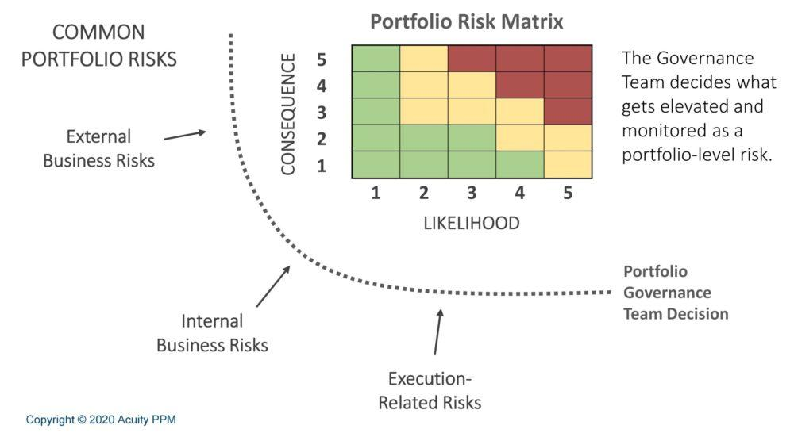

## Table of Contents

## What is portfolio risk assessment and why is it important?

Portfolio risk assessment is a way to figure out how risky your investments are. It looks at all the different things you have invested in, like stocks, bonds, and other assets, and tries to understand how likely it is that you might lose money. This process involves looking at things like how much the value of your investments might go up and down, how different investments affect each other, and what might happen in the future that could change your investments' value.

Understanding portfolio risk is important because it helps you make better decisions about your money. If you know how risky your investments are, you can choose to put your money in places that match how much risk you are willing to take. This can help you avoid big losses and feel more confident about your financial future. By doing a risk assessment, you can also see if your investments are spread out enough, which can protect you if one type of investment does badly.

## How can beginners start assessing the risk of their investment portfolio?

For beginners, starting to assess the risk of their investment portfolio can seem hard, but it's easier than you might think. The first thing to do is to look at all the different things you've invested in, like stocks, bonds, or mutual funds. You want to see how much of your money is in each one. This is called diversification. If you have your money spread out across different types of investments, it can help lower your risk because if one investment goes down, the others might still be okay.

Next, you should learn about something called [volatility](/wiki/volatility-trading-strategies). Volatility is how much the price of your investments goes up and down over time. You can find this information by looking at historical data or using tools on investment websites. If your investments go up and down a lot, they are more risky. You can also use a simple tool called a risk assessment questionnaire, which many investment websites offer. These questionnaires ask you questions about your investments and your feelings about risk, then give you a score that helps you understand how risky your portfolio is.

By doing these things, you can start to get a good idea of how risky your investments are. Remember, the goal isn't to avoid all risk, but to understand it so you can make smart choices about where to put your money. As you learn more, you can use more advanced tools and methods, but these simple steps are a great way to start.

## What are the different types of risks associated with a portfolio?

When you invest your money, there are different types of risks you need to know about. One type is market risk, which is when the whole market goes up or down and affects all your investments. Another type is [interest rate](/wiki/interest-rate-trading-strategies) risk, where changes in interest rates can make your investments worth more or less. There's also credit risk, which happens if the companies or governments you've invested in can't pay back their debts. And don't forget about inflation risk, where the value of your money goes down over time because prices are going up.

Another important risk is [liquidity](/wiki/liquidity-risk-premium) risk, which means you might not be able to sell your investments quickly without losing money. Then there's currency risk, which comes into play if you invest in things from other countries and the value of those currencies changes. Lastly, there's something called concentration risk, which is when you put too much of your money into just one type of investment or one company. If that investment does badly, it can hurt your whole portfolio.

Understanding these different types of risks can help you make better choices about where to put your money. By knowing what could go wrong, you can try to spread out your investments in a way that lowers your overall risk. This way, you can feel more confident about your financial future.

## How do market volatility and economic cycles affect portfolio risk?

Market volatility and economic cycles can really change the risk of your investment portfolio. Market volatility means how much the prices of stocks and other investments go up and down. When the market is very volatile, the value of your investments can change a lot in a short time. This can make your portfolio riskier because you might lose money quickly if the market goes down. On the other hand, if the market goes up, you might make more money, but it's still risky because it can change direction fast.

Economic cycles also play a big role in how risky your portfolio is. These cycles are the ups and downs that happen in the economy over time, like periods of growth and recession. During a recession, the value of many investments can go down because companies are not doing as well and people are not spending as much money. This can increase the risk in your portfolio because your investments might lose value. But during times of growth, your investments might do better, making your portfolio less risky. Understanding these cycles can help you plan your investments better and manage the risk in your portfolio.

## What role does diversification play in managing portfolio risk?

Diversification is like spreading your money around in different places to lower your risk. Imagine you have all your money in one company's stock. If that company does badly, you could lose a lot of money. But if you put your money in many different companies, or in different types of investments like stocks, bonds, and real estate, you're not putting all your eggs in one basket. If one investment goes down, the others might still be okay, which helps protect your money.

By diversifying, you can also balance out the ups and downs of the market. Some investments might go up when others go down, and vice versa. This can make your portfolio more stable over time. It's not about avoiding all risk, but about managing it so that you're not hit too hard by any one thing going wrong. Diversification is a key part of a smart investment strategy because it helps you feel more secure about your financial future.

## How can one use historical data to assess future portfolio risk?

Historical data is like looking at the past to guess what might happen in the future with your investments. By looking at how your investments have done over time, you can see how much they went up and down. This can help you understand how risky they might be in the future. For example, if a stock went up and down a lot in the past, it might do the same in the future. You can use this information to figure out how much risk you're okay with and make choices that fit your comfort level.

You can also use historical data to see how different investments worked together in the past. This is called correlation. If two investments usually go up and down at the same time, they might be risky to have together because if one goes down, the other might too. But if they move in different ways, they can help balance each other out. By looking at past patterns, you can pick a mix of investments that might lower your overall risk. It's not a perfect way to predict the future, but it gives you a good starting point to make smarter choices about your money.

## What are some common tools and metrics used for portfolio risk assessment?

One common tool for assessing portfolio risk is the standard deviation. This tool measures how much your investments go up and down over time. If the standard deviation is high, it means your investments are more likely to have big changes in value, which makes them riskier. Another useful metric is beta, which shows how much your investments move compared to the overall market. If your investment has a high beta, it means it might go up or down a lot when the market changes, making it riskier.

Another important tool is the Sharpe ratio, which helps you understand if the risk you're taking is worth it. It looks at how much extra return you're getting for the risk you're taking. A higher Sharpe ratio means you're getting more return for the risk, which is good. You can also use Value at Risk (VaR), which tries to predict the most you could lose in a bad situation. It gives you an idea of the worst-case scenario for your portfolio, helping you plan for big drops in value.

These tools and metrics can help you understand the risk in your portfolio better. By using them, you can see how much your investments might go up and down, how they compare to the market, and whether the risk you're taking is worth it. This way, you can make smarter choices about where to put your money and feel more confident about your financial future.

## How does asset allocation influence the overall risk of a portfolio?

Asset allocation is about deciding how to split your money between different types of investments, like stocks, bonds, and cash. This choice can really change how risky your portfolio is. If you put most of your money in stocks, your portfolio might be riskier because stocks can go up and down a lot. But if you put more money in bonds or cash, your portfolio might be less risky because these investments usually don't change as much in value. By choosing the right mix of investments, you can make your portfolio match how much risk you're okay with.

The way you spread your money across different investments can also help balance out the risk. For example, if the stock market goes down, having some money in bonds might help because bonds might not go down as much. This can make your portfolio more stable over time. By thinking about how different investments work together and how they might do in the future, you can pick an asset allocation that helps manage your risk and reach your financial goals.

## What advanced statistical models can be applied to enhance portfolio risk assessment?

Advanced statistical models can really help you understand the risk in your investment portfolio better. One model you might hear about is the Monte Carlo simulation. This model uses math to guess what might happen to your investments in the future by running many different scenarios. It's like playing out a lot of "what if" situations to see how your portfolio might do. This can help you see the possible ups and downs and make better choices about where to put your money. Another model is the Black-Litterman model, which helps you mix your own guesses about the market with what's already known. This can give you a more balanced view of how risky your investments might be.

Another useful model is the GARCH (Generalized Autoregressive Conditional Heteroskedasticity) model. This one is good for figuring out how much the value of your investments might go up and down over time. It looks at past data to predict future volatility, which is how much prices might change. Knowing this can help you plan for big swings in the market. Lastly, there's the [factor](/wiki/factor-investing)-based model, which looks at different things that can affect your investments, like how big a company is or how fast it's growing. By understanding these factors, you can see what might make your portfolio riskier and adjust your investments to manage that risk better.

## How can stress testing and scenario analysis be used to understand portfolio risk under extreme conditions?

Stress testing and scenario analysis are ways to see how your investments might do in really tough situations. Imagine something bad happens, like a big drop in the stock market or a sudden economic crisis. Stress testing tries to guess how much your portfolio might lose if these bad things happen. It's like a practice run for the worst-case scenarios. By doing this, you can see which parts of your portfolio might be too risky and make changes to protect your money better.

Scenario analysis takes this a step further by looking at different possible futures. Instead of just focusing on the worst that could happen, it looks at a bunch of different situations, like what might happen if interest rates go up a lot or if there's a big change in the economy. By running these different scenarios, you can get a better idea of how your investments might react to all sorts of changes. This helps you plan ahead and make your portfolio stronger, so you're ready for whatever might come your way.

## What are the latest trends in portfolio risk management and assessment?

The latest trends in portfolio risk management and assessment focus a lot on using technology and data to make smarter choices. One big trend is the use of [artificial intelligence](/wiki/ai-artificial-intelligence) (AI) and [machine learning](/wiki/machine-learning). These tools can look at a lot of data really quickly and find patterns that might be hard for people to see. They can help predict how the market might change and how risky your investments could be. Another trend is using big data, which means looking at huge amounts of information from all over the world to understand what might happen to your investments. By using these tools, you can get a better idea of the risks and make your portfolio safer.

Another important trend is the focus on environmental, social, and governance ([ESG](/wiki/esg-investing)) factors. More and more people are thinking about how their investments affect the world, not just how much money they can make. ESG risk assessment looks at things like how a company treats the environment, its workers, and how it's run. By considering these factors, you can choose investments that match your values and might also be less risky in the long run. Together, these trends show that portfolio risk management is becoming more advanced and more thoughtful about the bigger picture.

## How do regulatory requirements impact the approach to portfolio risk assessment?

Regulatory requirements can really change how people look at the risk in their investment portfolios. These rules are made by governments or other groups to make sure that people who invest money are doing it safely and fairly. For example, banks and other big investors have to follow rules that say they need to check their risks a lot and report them to the people in charge. This means they have to use special ways to look at their investments and make sure they're not taking too many chances. If they don't follow these rules, they could get in trouble or have to pay fines, so it's important for them to pay attention to what the rules say.

Because of these rules, people who manage portfolios often have to use more detailed and careful ways to check their risks. They might need to use special computer programs and models to make sure they're following all the rules. This can make their work harder, but it also helps them see risks they might not have noticed before. By following the rules, they can make their portfolios safer and more stable, which is good for everyone who has money invested with them.

## What are the Risk Management Techniques used in Algo Trading?

Stop-loss and take-profit orders are fundamental tools in [algorithmic trading](/wiki/algorithmic-trading), designed to automate the process of limiting losses and securing gains. A stop-loss order automatically sells a security once its price falls below a predetermined level, thus limiting potential losses. Conversely, a take-profit order automatically executes a sale when a security’s price reaches a set target, securing profits before market reversals can occur. These tools help traders maintain discipline and emotion-free trading by ensuring that trades are closed automatically when predefined conditions are met.

Dynamic position sizing is another crucial technique in algorithmic trading risk management. It refers to adjusting the size of a trade based on current market conditions and volatility. The rationale is to increase position sizes in favorable market conditions and reduce them when uncertainty is high. This strategy can enhance overall portfolio performance and safeguard against excessive losses. A simple model for dynamic position sizing could be based on the Kelly Criterion, which optimizes the proportion of capital to be allocated under given conditions: 

$$
f^* = \frac{bp - q}{b}
$$

where $f^*$ is the fraction of the portfolio to invest, $b$ is the odds received on the wager, $p$ is the probability of winning, and $q$ is the probability of losing $(1 - p)$.

Diversification and rebalancing are foundational strategies for aligning exposure levels with risk tolerance. Diversification involves spreading investments across various asset classes to mitigate unsystematic risk. Periodic rebalancing recalibrates the portfolio to its strategic asset allocation by buying or selling assets, thus maintaining a desired risk level. This practice ensures the portfolio remains aligned with the investor’s risk-return profile, reducing the impact of asset-specific volatility.

Quantitative risk techniques like Value at Risk (VaR) and stress testing offer advanced strategies for managing risk in algorithmic trading. Value at Risk provides an estimate of the maximum potential loss over a specific time frame with a given confidence level. For example, a VaR at a 95% confidence level might indicate that there is only a 5% chance of the portfolio losing more than a certain amount over the chosen period. 

Stress testing, on the other hand, involves simulating extreme market conditions to evaluate how the trading strategy and portfolio would perform. This approach helps identify vulnerabilities in the trading system and allows for the implementation of contingency plans to minimize potential losses.

By effectively integrating these risk management techniques, algo traders can better navigate the complexities of financial markets, safeguarding their portfolios against unforeseen market events and optimizing trading outcomes.

## References & Further Reading

[1]: Markowitz, H. (1952). ["Portfolio Selection."](https://onlinelibrary.wiley.com/doi/abs/10.1111/j.1540-6261.1952.tb01525.x) The Journal of Finance, 7(1), 77-91.

[2]: Kaminsky, G., & Reinhart, C. (1996). ["The twin crises: The causes of banking and balance-of-payments problems."](https://www.aeaweb.org/articles?id=10.1257/aer.89.3.473) American Economic Review, 89(3), 473-500.

[3]: Lopez de Prado, M. (2018). ["Advances in Financial Machine Learning."](https://www.amazon.com/Advances-Financial-Machine-Learning-Marcos/dp/1119482089) Wiley.

[4]: Aronson, D. (2007). ["Evidence-Based Technical Analysis: Applying the Scientific Method and Statistical Inference to Trading Signals."](https://www.amazon.com/Evidence-Based-Technical-Analysis-Scientific-Statistical/dp/0470008741) Wiley.

[5]: Chan, E. P. (2008). ["Quantitative Trading: How to Build Your Own Algorithmic Trading Business."](https://github.com/ftvision/quant_trading_echan_book) Wiley.