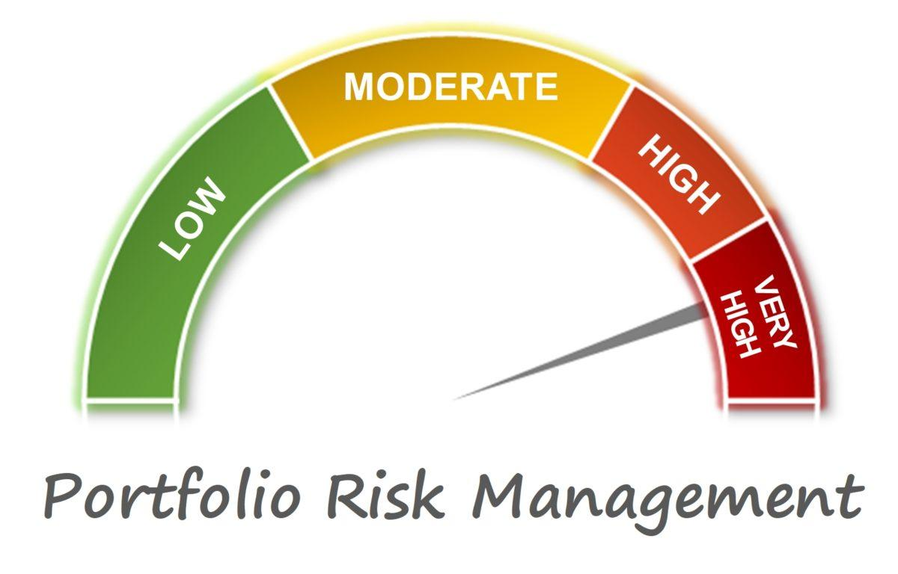

## Table of Contents

## What is portfolio risk?

Portfolio risk refers to the possibility that the overall value of your investments might go down. When you have a collection of different investments, like stocks, bonds, or mutual funds, the risk comes from how these investments might lose value over time. It's important to understand that all investments carry some level of risk, but the level of risk can vary depending on what you're investing in and how you've spread out your money.

One way to think about portfolio risk is to consider how your investments might react to changes in the market. For example, if the stock market goes down, stocks in your portfolio might lose value. However, if you also have bonds, they might not be affected as much, or they might even go up in value. By having a mix of different types of investments, you can manage and sometimes reduce the overall risk of your portfolio. This is called diversification, and it's a key strategy for managing portfolio risk.

## Why is it important to manage portfolio risk?

Managing portfolio risk is important because it helps protect your money. When you invest, there's always a chance that you might lose some or all of your money. By managing risk, you can try to keep those losses smaller and make sure your investments are safer. This is especially important if you're saving for something big, like buying a house or retiring, because you don't want to lose the money you need for those goals.

Another reason to manage portfolio risk is to help you sleep better at night. If your investments are too risky, you might worry a lot about losing money. By choosing a mix of investments that matches how much risk you're okay with, you can feel more calm and confident about your financial future. This way, you can focus on other important things in your life without constantly worrying about your investments.

## What are the different types of risks in a portfolio?

There are different types of risks that can affect your portfolio. One type is market risk, which is the risk that the whole market might go down and take your investments with it. This can happen because of things like economic downturns or big events in the world. Another type is credit risk, which is the chance that a company or government you've lent money to (by buying their bonds) might not be able to pay you back. This can happen if the company or government has money problems.

Another risk is [interest rate](/wiki/interest-rate-trading-strategies) risk, which is when the value of bonds in your portfolio goes down because interest rates go up. This happens because new bonds with higher interest rates become more attractive, making the older bonds you own less valuable. There's also inflation risk, which is the risk that the money you get back from your investments won't be worth as much because prices for things have gone up. This can eat away at the buying power of your money over time.

Lastly, there's [liquidity](/wiki/liquidity-risk-premium) risk, which is the risk that you might not be able to sell your investments quickly enough or at a good price when you need to. This can be a problem if you need money fast and your investments are hard to sell. Each of these risks can affect your portfolio in different ways, so it's important to understand them and try to manage them to keep your investments safe.

## How can diversification help in managing portfolio risk?

Diversification helps in managing portfolio risk by spreading your investments across different types of assets, like stocks, bonds, and real estate. When you diversify, you're not putting all your eggs in one basket. If one type of investment goes down in value, the other types might not be affected as much, or they might even go up. This way, the overall impact on your portfolio is less severe. For example, if the stock market drops, your bonds might hold their value or increase, helping to balance out the loss.

By diversifying, you also reduce the chance that a single event or problem will hurt your whole portfolio. Different investments react differently to things like economic changes, interest rate shifts, or company-specific issues. So, if you have a mix of investments, you're less likely to lose a lot of money all at once. This can make your portfolio more stable and help you feel more confident about your financial future.

## What is the difference between systematic and unsystematic risk?

Systematic risk is the kind of risk that affects the whole market or a big part of it. It's also called market risk. This type of risk can't be avoided just by spreading your investments around because it impacts everything. Things like a big economic downturn, changes in interest rates, or major world events can cause systematic risk. If the market goes down, all your investments might go down with it, no matter how well you've diversified.

Unsystematic risk, on the other hand, is the risk that comes from specific investments or companies. It's also called specific risk. This type of risk can be reduced by diversifying your portfolio. For example, if you own stock in one company and that company does poorly, it won't hurt your whole portfolio if you also own other stocks and investments. Unsystematic risk is about the unique problems that can happen to individual companies or investments, like bad management or a product failing.

In simple terms, systematic risk is the big, broad risk that you can't really escape, while unsystematic risk is the smaller, specific risk that you can manage by spreading your investments around. Both types of risk are important to understand when you're trying to keep your portfolio safe.

## How does the risk-return tradeoff affect portfolio management?

The risk-return tradeoff is a big idea in investing. It means that if you want to get more money from your investments, you usually have to take on more risk. If you pick safer investments, you might not lose as much money, but you also won't make as much. This tradeoff is really important when you're deciding how to put your money into different investments. You need to think about how much risk you're okay with and how much money you want to make.

When managing a portfolio, understanding the risk-return tradeoff helps you make better choices. If you're okay with taking more risk, you might put more money into stocks, which can go up and down a lot but might give you bigger returns over time. If you want to be safer, you might choose more bonds or other less risky investments. The key is to find a balance that fits your goals and how much risk you can handle. This way, you can try to get the best return for the amount of risk you're willing to take.

## What are common metrics used to measure portfolio risk?

One common way to measure portfolio risk is by using something called standard deviation. This tells you how much the value of your investments goes up and down over time. A higher standard deviation means your investments are more risky because they might change a lot in value. A lower standard deviation means your investments are more stable and less likely to change a lot.

Another metric is beta, which measures how much your portfolio moves with the market. If your portfolio has a beta of 1, it moves the same way as the market. A beta higher than 1 means your portfolio is more sensitive to market changes and is riskier. A beta lower than 1 means your portfolio is less sensitive and might be safer. Beta helps you understand how your investments might react if the market goes up or down.

Lastly, there's the Sharpe ratio, which looks at how much extra return you're getting for the risk you're taking. It compares the return of your portfolio to a risk-free investment, like a government bond, and then divides that by the standard deviation of your portfolio. A higher Sharpe ratio means you're getting more return for the risk you're taking, which is good. A lower Sharpe ratio means you might not be getting enough return for the risk you're taking.

## How can one use the Capital Asset Pricing Model (CAPM) to assess portfolio risk?

The Capital Asset Pricing Model, or CAPM, helps you figure out how much risk you're taking with your investments and what kind of return you might expect. CAPM looks at the overall market risk, which is called systematic risk, and how much your portfolio moves with the market. It does this using something called beta. If your portfolio has a beta of 1, it moves just like the market. If the beta is higher than 1, your portfolio is riskier because it moves more than the market. If the beta is lower than 1, your portfolio is less risky because it doesn't move as much as the market. By knowing the beta of your portfolio, you can get a better idea of how much risk you're taking on.

CAPM also helps you figure out what kind of return you should expect from your investments. It does this by comparing the expected return of your portfolio to the return you would get from a risk-free investment, like a government bond. The formula for CAPM is: Expected Return = Risk-Free Rate + Beta * (Market Return - Risk-Free Rate). This formula shows you how much extra return you should get for taking on more risk. If your portfolio's expected return is higher than what you could get from a risk-free investment, then you're being rewarded for the extra risk you're taking. By using CAPM, you can make smarter choices about your investments and manage your portfolio's risk better.

## What role do correlation and covariance play in portfolio risk management?

Correlation and covariance are important ideas in managing portfolio risk because they tell you how different investments move together. Correlation is a number between -1 and 1 that shows how closely two investments move in the same direction. If the correlation is close to 1, the investments tend to go up and down together. If it's close to -1, they move in opposite directions. If it's around 0, they don't really move together at all. By looking at the correlation between different investments in your portfolio, you can see how much they might affect each other. This helps you pick investments that balance each other out, making your portfolio less risky.

Covariance is a bit more complicated, but it's related to correlation. It measures how two investments change together, but it also takes into account how much they change. A positive covariance means that when one investment goes up, the other tends to go up too. A negative covariance means that when one goes up, the other tends to go down. By understanding the covariance between the investments in your portfolio, you can see how they might impact each other's risk. Using both correlation and covariance, you can build a portfolio where the ups and downs of different investments cancel each other out, helping to keep your overall risk lower.

## How can advanced statistical methods like Monte Carlo simulations be used in portfolio risk analysis?

Monte Carlo simulations are a powerful tool for analyzing portfolio risk because they let you see how your investments might do in the future under different conditions. Imagine you want to know how your portfolio might perform over the next 10 years. Instead of just guessing, you can use a computer to run thousands of different scenarios. Each scenario changes things like stock prices, interest rates, and economic conditions in different ways. By looking at all these scenarios, you get a good idea of the possible outcomes for your portfolio. This helps you understand not just the average return you might get, but also the range of possible returns and the risk of losing money.

Using Monte Carlo simulations, you can see how likely it is that your portfolio will reach your financial goals, like saving enough for retirement. For example, if you run the simulation and find out that there's a high chance your portfolio will grow enough to meet your needs, you might feel more confident about your investment choices. On the other hand, if the simulation shows a lot of scenarios where your portfolio doesn't grow enough, you might decide to change your investments to reduce risk or to aim for higher returns. This way, Monte Carlo simulations help you make smarter decisions by showing you a detailed picture of the risks and rewards of your portfolio.

## What are the implications of using derivatives for hedging portfolio risk?

Using derivatives for hedging can help you protect your portfolio from big losses. Derivatives are financial tools like options and futures that let you bet on how an investment will do without actually owning it. For example, if you own a stock and you're worried it might go down, you can use a derivative to make money if the stock does go down. This way, any losses from the stock might be offset by gains from the derivative. Hedging with derivatives can make your portfolio safer, but it's not perfect. You have to pay for the derivatives, and if the stock doesn't go down, you might lose the money you spent on the hedge.

There are also other things to think about when using derivatives for hedging. They can be complicated, and if you don't understand them well, you might make mistakes. Also, while hedging can reduce risk, it can also limit your gains. If the stock you own goes up a lot, the derivative you used to hedge might not let you keep all of those gains. So, you need to balance the protection that derivatives offer with the potential for missing out on big returns. It's a good idea to talk to a financial advisor to make sure you're using derivatives in a way that fits your goals and risk tolerance.

## How do global economic factors influence portfolio risk, and how can these be mitigated?

Global economic factors can have a big impact on your portfolio's risk. Things like changes in interest rates, inflation, and big world events can shake up the whole market. For example, if the economy in a big country like the U.S. or China slows down, it might make stock prices go down everywhere. Or, if there's a big event like a war or a global health crisis, it can make investors nervous and cause them to sell their investments, which can lower the value of your portfolio. These factors are hard to predict and can affect all your investments, no matter how well you've spread them out.

To help manage these risks, you can use a few different strategies. One way is to diversify your investments across different countries and types of assets. This way, if one country's economy is doing badly, you might still have investments in other countries that are doing well. Another way is to keep an eye on what's happening around the world and adjust your investments as needed. For example, if you see that interest rates are going up in a certain country, you might want to move some of your money into investments that do well when rates go up, like certain types of bonds. It's also a good idea to have some money in safe investments, like cash or government bonds, so you can weather any big storms in the market. By staying informed and being flexible, you can better protect your portfolio from global economic ups and downs.

## What is the Role of Value at Risk (VaR) in Managing Portfolio Risk?

Value at Risk (VaR) is a statistical measure used to assess the potential loss in value of a financial portfolio over a preset time frame at a given confidence interval. In [algorithmic trading](/wiki/algorithmic-trading), VaR serves as a critical tool for quantifying potential losses and enabling traders to evaluate the risks embedded within their trading strategies.

The core principle of VaR is to provide an estimate of the worst expected loss under normal market conditions over a specific time period, usually expressed as a percentage of the total value of the portfolio. For instance, a 1-day VaR of 5% at a 95% confidence level implies there is a 5% chance that the portfolio may lose more than this percentage in a single day.

Mathematically, VaR can be represented as:

$$
\text{VaR} = \text{P} \times \sigma \times \sqrt{t}
$$

where $\text{P}$ is the portfolio value, $\sigma$ is the standard deviation of the portfolio returns, and $t$ is the time period considered.

There are three main methods to calculate VaR: historical method, variance-covariance method, and the Monte Carlo simulation. Each approach has its own advantages and limitations:

1. **Historical Method**: This approach uses historical price data to simulate potential future losses. It assumes that past market behaviors are indicative of future risks. However, this method may not capture potential changes in market dynamics or rare events effectively.

2. **Variance-Covariance Method**: This method assumes that returns are normally distributed and calculates VaR based on the mean and standard deviation of the portfolio returns. While computationally efficient, it may not accurately account for non-linear risks or non-normal return distributions, potentially underestimating risk during turbulent market periods.

3. **Monte Carlo Simulation**: This method involves simulating a wide range of possible future price scenarios based on statistical models. Though it offers more flexibility in modeling complex portfolios, it is computationally intensive.

Despite its widespread adoption, VaR has notable limitations. It does not predict the actual loss beyond the VaR threshold and does not account for tail risks, meaning it may underestimate risks during extreme market events. Moreover, VaR assumes a static model whereas market conditions continually evolve.

Regardless of these limitations, VaR remains a central element of risk management in algorithmic trading, offering a framework for traders to assess potential losses and allocate capital more effectively. As algorithms become more sophisticated, the integration of VaR with other risk assessment tools becomes essential, providing a more comprehensive view of potential risks and enhancing decision-making processes.

## How can one achieve Portfolio Optimization by Balancing Risk and Return?

Portfolio optimization is a critical process that involves selecting the optimal mix of assets to achieve the maximum expected return for a given level of risk. This balance between risk and return is fundamental in algorithmic trading as it ensures that the capital is utilized effectively while minimizing the potential for losses. An essential component of portfolio optimization is diversification, which involves spreading investments across various financial instruments, industries, and other categories to reduce exposure to any single asset or risk. By diversifying, traders can lower the overall portfolio variance, particularly when assets within the portfolio have low or negative correlation with each other.

Mean-variance optimization is a standard technique used for portfolio optimization. This method involves finding a portfolio allocation that lies on the efficient frontier, the set of portfolios that offers the highest expected return for a defined level of risk. The key is to adjust the weights of different assets in the portfolio such that the overall expected return is maximized while the risk is kept at or below a certain threshold. Mathematically, this can be expressed by the optimization problem:

$$
\min_{\mathbf{w}} \left( \mathbf{w}^T \Sigma \mathbf{w} \right)
$$

subject to:

$$
\mathbf{w}^T \mathbf{\mu} = \mu_p
$$

$$
\mathbf{w}^T \mathbf{1} = 1
$$

where $\mathbf{w}$ is the vector of asset weights in the portfolio, $\Sigma$ is the covariance matrix of asset returns, $\mathbf{\mu}$ is the expected return vector of assets, $\mu_p$ is the desired portfolio return, and $\mathbf{1}$ is a vector of ones.

In practice, algorithmic trading platforms can automate this optimization process using advanced programming languages like Python. For example, using Python's libraries such as NumPy and SciPy, traders can efficiently solve the mean-variance optimization problem:

```python
import numpy as np
from scipy.optimize import minimize

# Example covariance matrix and expected returns
cov_matrix = np.array([[0.1, 0.02], [0.02, 0.08]])
expected_returns = np.array([0.12, 0.10])

# Define the optimization function
def portfolio_volatility(weights, cov_matrix):
    return np.sqrt(weights.T @ cov_matrix @ weights)

# Constraint functions
def return_constraint(weights):
    return np.dot(weights, expected_returns) - desired_return

def weight_constraint(weights):
    return np.sum(weights) - 1

# Desired portfolio return
desired_return = 0.11

# Initial guess for weights
initial_weights = np.array([0.5, 0.5])

# Optimize
result = minimize(portfolio_volatility, initial_weights, args=(cov_matrix,),
                  constraints=({'type': 'eq', 'fun': return_constraint},
                               {'type': 'eq', 'fun': weight_constraint}),
                  bounds=((0, 1), (0, 1)))

# Optimized weights for the portfolio
optimized_weights = result.x
```

In algorithmic trading, this optimization process needs to be dynamic to account for real-time data feeds and adjusting market conditions. By continually recalibrating the portfolio through quantitative techniques like mean-variance optimization, traders can better manage potential risks and capitalize on emerging opportunities in the market, thus ensuring a more resilient and profitable trading strategy.

## References & Further Reading

[1]: Hull, J. C. (2012). ["Risk Management and Financial Institutions"](https://books.google.com/books/about/Risk_Management_and_Financial_Institutio.html?id=1J1QDwAAQBAJ). Wiley.

[2]: Jorion, P. (2006). ["Value at Risk: The New Benchmark for Managing Financial Risk"](https://books.google.com/books/about/Value_at_Risk_3rd_Ed.html?id=nnblKhI7KP8C). McGraw-Hill.

[3]: Markowitz, H. (1952). "Portfolio Selection." Journal of Finance. [Research Paper](https://onlinelibrary.wiley.com/doi/abs/10.1111/j.1540-6261.1952.tb01525.x).

[4]: Lopez de Prado, M. (2018). ["Advances in Financial Machine Learning"](https://books.google.com/books/about/Advances_in_Financial_Machine_Learning.html?id=oU9KDwAAQBAJ). Wiley.

[5]: Chan, E. (2008). ["Quantitative Trading: How to Build Your Own Algorithmic Trading Business"](https://rickorford.com/quantitative-trading/). Wiley.

[6]: Pardo, R. (2011). ["Evaluation and Optimization of Trading Strategies"](https://onlinelibrary.wiley.com/doi/book/10.1002/9781119196969). Wiley.