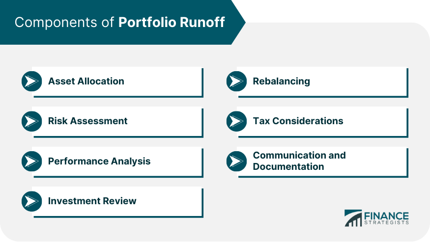

## Table of Contents

## What is portfolio runoff?

Portfolio runoff is when a company or a bank stops adding new loans or investments to a portfolio and just lets the existing ones decrease over time. Imagine you have a bucket of water with a hole at the bottom. If you stop adding water, the bucket will slowly empty out. That's similar to how portfolio runoff works with loans or investments.

As the loans or investments in the portfolio get paid back or mature, the total amount of money in the portfolio goes down. This can happen for different reasons, like when a bank wants to focus on other types of loans or when a company decides to reduce its risk. It's a way to slowly wind down a part of the business without suddenly stopping everything.

## Why is portfolio runoff important in financial management?

Portfolio runoff is important in financial management because it helps companies and banks manage their risks and focus their resources. When a bank or company decides to let a portfolio run off, it means they are choosing not to take on new loans or investments in that area. This can be useful if they want to reduce their exposure to certain types of risk. For example, if a bank thinks that a certain type of loan might become riskier in the future, they might choose to stop issuing those loans and let the existing ones run off.

Letting a portfolio run off can also help a company or bank to shift their focus to other areas that they think are more promising or profitable. Instead of spreading their resources thin across many different types of investments or loans, they can concentrate on the ones they believe will bring the best returns. This can be a smart way to adapt to changes in the market or the economy, making sure that their money is being used in the best way possible.

## How does portfolio runoff affect investment strategies?

Portfolio runoff can change how investors plan their strategies. When a company or bank lets a portfolio run off, it means they are not adding new investments or loans to that portfolio. This can make investors think about where they want to put their money. If they see that a certain type of investment is running off, they might decide to move their money to other areas that are growing or seem safer.

This can also affect how investors think about risk. If a bank is letting a portfolio run off because they think it's too risky, investors might feel the same way. They might choose to avoid similar investments and instead look for ones that are less likely to lose money. By watching which portfolios are running off, investors can get clues about where the market might be heading and adjust their strategies accordingly.

## What are the common causes of portfolio runoff?

Portfolio runoff often happens when a company or bank wants to reduce their risk. They might see that a certain type of loan or investment is becoming riskier, so they decide to stop adding new ones to the portfolio. Instead, they let the existing loans or investments slowly pay back or mature over time. This way, they can lower their chances of losing money on that type of investment.

Another common cause is when a company or bank wants to focus on different types of investments or loans. They might think that other areas will bring in more money or be a better fit for their business goals. By letting one portfolio run off, they can move their resources and attention to these new areas. This helps them to stay flexible and adapt to changes in the market or the economy.

## Can you explain the process of managing portfolio runoff?

Managing portfolio runoff means carefully watching and handling a group of loans or investments that are slowly getting smaller over time. When a bank or company decides to let a portfolio run off, they stop adding new loans or investments to it. They keep an eye on the ones that are already in the portfolio, making sure they are paid back or reach their end date. It's like being a good manager, making sure everything goes smoothly even though nothing new is being added.

The process also involves deciding what to do with the money that comes back from the loans or investments as they run off. The bank or company might choose to put this money into other types of investments or loans that they think are better or safer. They need to think carefully about where to put this money, so they can keep making good use of their resources. It's all about making smart choices to help the business grow and stay strong, even as one part of it gets smaller.

## What are the key metrics used to monitor portfolio runoff?

When a bank or company watches a portfolio runoff, they look at a few important numbers to make sure everything is going well. One key metric is the "runoff rate," which shows how fast the portfolio is getting smaller. This helps them see if the loans or investments are being paid back or maturing at the expected speed. Another important number is the "remaining balance," which tells them how much money is still left in the portfolio. By keeping an eye on this, they can plan what to do with the money as it comes back.

They also pay attention to the "default rate," which shows how many loans or investments are not being paid back on time. A high default rate could mean more risk, so it's important to watch this closely. Finally, they look at the "recovery rate," which tells them how much money they can get back from loans or investments that didn't go as planned. These metrics help the bank or company manage the portfolio runoff smoothly and make smart decisions about where to put their money next.

## How does portfolio runoff impact risk management?

Portfolio runoff helps banks and companies manage risk by letting them slowly reduce their exposure to certain types of loans or investments. When they see that a type of loan or investment is becoming riskier, they can choose to stop adding new ones to the portfolio. Instead, they let the existing ones pay back or mature over time. This way, they can lower the chance of losing money on that type of investment without suddenly stopping everything.

By managing portfolio runoff, banks and companies can also shift their focus to other areas that they think are safer or more profitable. They can move their resources and attention to new types of investments or loans that fit better with their business goals. This helps them stay flexible and adapt to changes in the market or the economy, making sure they are using their money in the best way possible to manage risk.

## What are some strategies to mitigate the effects of portfolio runoff?

One way to lessen the impact of portfolio runoff is to slowly move money from the old portfolio to new investments or loans. This can be done by carefully choosing where to put the money as it comes back from the old portfolio. By doing this, a bank or company can keep their money working and [earning](/wiki/earning-announcement), even as the old portfolio gets smaller. They can pick safer or more profitable investments, helping to balance out any risks from the runoff.

Another strategy is to keep a close watch on the portfolio's performance. By looking at key numbers like the runoff rate, remaining balance, default rate, and recovery rate, a bank or company can see if the runoff is going as planned. If they notice any problems, like loans not being paid back on time, they can take action quickly. This might mean setting aside more money for possible losses or finding ways to help borrowers pay back their loans, which can help reduce the negative effects of the runoff.

## Can you provide examples of portfolio runoff in different types of investments?

Imagine a bank that used to give out a lot of car loans. Over time, they start to think that car loans are getting riskier because more people are not paying them back. So, the bank decides to stop giving out new car loans and just let the old ones get paid back or reach their end date. This is an example of portfolio runoff in car loans. As the old loans slowly disappear, the bank can use the money that comes back to start giving out safer types of loans, like home loans.

Another example is a company that used to invest a lot in a certain type of stock, like tech stocks. But then, they start to think that tech stocks might not do as well in the future. So, they stop buying new tech stocks and just let the ones they already own either go up or down in value until they sell them. This is portfolio runoff in stock investments. As the tech stocks slowly leave their portfolio, the company can put the money into other types of stocks or investments that they think will do better.

## How do regulatory requirements influence portfolio runoff management?

Regulatory requirements can make banks and companies be very careful about how they handle portfolio runoff. These rules are made to keep the financial system safe and make sure that banks and companies are not taking too many risks. For example, if there are strict rules about how much risk a bank can take, they might decide to let a portfolio run off if they think it's getting too risky. This way, they can follow the rules and avoid getting into trouble with the regulators.

Regulators might also set rules about how banks and companies need to report their portfolios. This means that when a portfolio is running off, they have to keep good records and show that they are managing it well. If the regulators see that a bank or company is not handling the runoff properly, they might make them take extra steps to fix it. This can influence how banks and companies plan their portfolio runoff, making sure they do it in a way that meets all the rules and keeps everything under control.

## What advanced techniques can be used to predict and manage portfolio runoff?

One advanced technique to predict and manage portfolio runoff is using data analytics and [machine learning](/wiki/machine-learning). These tools can look at a lot of information from the past to guess how fast a portfolio might run off. They can find patterns and trends that are hard for people to see. By using this information, banks and companies can make better plans for how to handle the runoff. They can decide when to start letting a portfolio run off and how to use the money that comes back in the best way.

Another technique is stress testing, which means trying out different bad situations to see how a portfolio might do. This can help banks and companies see how much risk they are taking and plan for the worst. If they see that a portfolio might run off too fast or cause big losses in a bad situation, they can take steps to fix it. This might mean setting aside more money for possible losses or changing how they manage the portfolio. By doing these tests, they can be ready for anything and manage the runoff smoothly.

## How does portfolio runoff differ across various financial markets and asset classes?

Portfolio runoff can look different depending on the type of financial market or asset class. In the bond market, for example, portfolio runoff happens when bonds reach their maturity date and are paid back. If a bank or company decides to stop buying new bonds and just let the old ones mature, that's bond portfolio runoff. In the stock market, portfolio runoff might mean selling off stocks over time without buying new ones. This can happen if a company thinks the stocks they own are not going to do well in the future.

Different asset classes also have their own ways of handling portfolio runoff. For real estate, portfolio runoff could mean letting properties be sold or leases end without buying new ones. This might happen if a company thinks the real estate market is getting too risky. In the loan market, like with car loans or home loans, portfolio runoff happens when loans are paid back and no new loans are given out. Each type of market and asset class has its own rules and risks, so how portfolio runoff works can be different for each one.

## References & Further Reading

[1]: Bergstra, J., Bardenet, R., Bengio, Y., & Kégl, B. (2011). ["Algorithms for Hyper-Parameter Optimization"](https://dl.acm.org/doi/10.5555/2986459.2986743). Advances in Neural Information Processing Systems 24.

[2]: ["Advances in Financial Machine Learning"](https://www.amazon.com/Advances-Financial-Machine-Learning-Marcos/dp/1119482089) by Marcos Lopez de Prado

[3]: ["Evidence-Based Technical Analysis: Applying the Scientific Method and Statistical Inference to Trading Signals"](https://www.amazon.com/Evidence-Based-Technical-Analysis-Scientific-Statistical/dp/0470008741) by David Aronson

[4]: ["Machine Learning for Algorithmic Trading"](https://github.com/stefan-jansen/machine-learning-for-trading) by Stefan Jansen

[5]: ["Quantitative Trading: How to Build Your Own Algorithmic Trading Business"](https://www.amazon.com/Quantitative-Trading-Build-Algorithmic-Business/dp/1119800064) by Ernest P. Chan