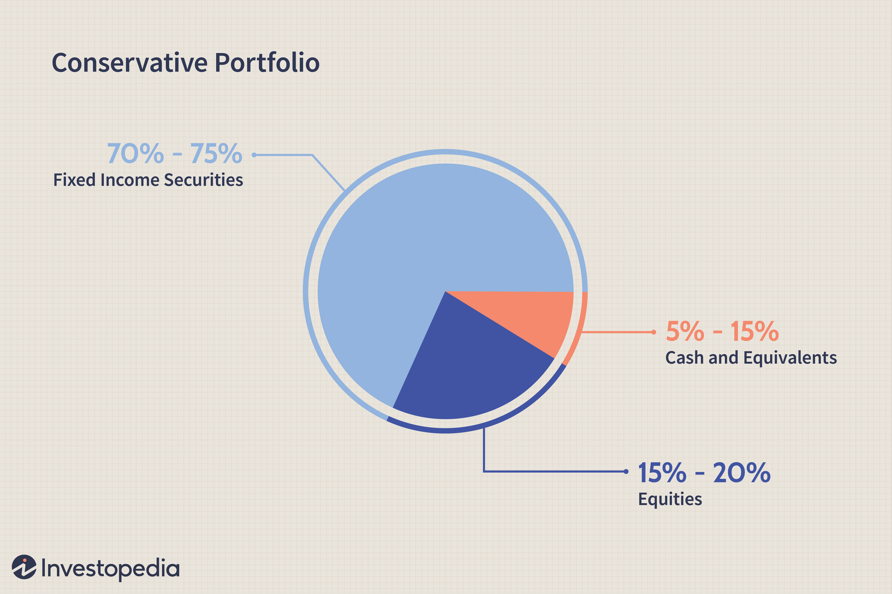

## Table of Contents

## What is portfolio stock allocation?

Portfolio stock allocation is how you decide to spread your money across different stocks or investments. It's like deciding how many pieces of candy to put in each flavor in a candy bag. You want to pick a mix that fits your goals, how much risk you're okay with, and how long you plan to keep the money invested. If you're young and can handle more risk, you might put more money into stocks that could grow a lot but are also more likely to go up and down a lot.

When you're setting up your portfolio, you might choose to put some money in big, stable companies and some in smaller, riskier ones. This mix helps balance the risk and reward. Over time, you'll need to check and adjust your allocation. If one stock does really well, it might take up too much of your portfolio, so you might sell some of it to buy other stocks. This keeps your portfolio aligned with your goals and risk level.

## Why is it important to allocate stocks in a portfolio?

Allocating stocks in a portfolio is important because it helps you manage risk and reach your financial goals. Imagine you're making a sandwich. If you put all your favorite ingredient on it, but it's something that can spoil easily, your sandwich might not last long. Similarly, if you put all your money into one stock, and that company does badly, you could lose a lot of money. By spreading your money across different stocks, you lower the chance that one bad stock will ruin your whole investment plan.

Another reason to allocate stocks is to match your investment goals and how much risk you're comfortable with. If you're saving for a long time, like for retirement, you might choose stocks that could grow a lot but are also riskier. But if you need the money soon, you might pick safer stocks that don't change as much in value. By choosing the right mix of stocks, you can feel more confident that your portfolio will help you achieve what you want without keeping you up at night worrying about losing money.

## What are the basic principles of stock allocation for beginners?

When you're new to investing, a good place to start is by understanding that stock allocation is about spreading your money across different types of stocks. Think of it like making a pizza. You don't want to put all your toppings in one slice because if that slice burns, you lose a lot. Instead, you spread them out so if one part isn't great, the rest can still be tasty. In investing, this means not putting all your money into one stock or one type of stock. You might choose some stocks from big, stable companies and some from smaller, growing ones. This way, if one type of stock goes down, the others might still do well, helping to balance out your losses.

Another important principle is to match your stock allocation to your goals and how much risk you're okay with. If you're young and saving for something far away, like retirement, you might be able to take more risk because you have time to recover if things go wrong. That could mean putting more money into stocks that might grow a lot but are also more likely to go up and down. But if you need the money soon, you'll want safer stocks that don't change as much. Over time, as your goals or how much risk you can handle changes, you'll need to check your portfolio and maybe move your money around to keep it in line with what you want.

Remember, stock allocation isn't a set-it-and-forget-it thing. You need to keep an eye on your investments and make changes when needed. If one stock does really well and now makes up a big part of your portfolio, you might want to sell some of it and buy other stocks to keep your mix balanced. This way, your portfolio stays in line with your goals and risk level, helping you feel more secure about your investments.

## How can diversification benefit a stock portfolio?

Diversification is like not putting all your eggs in one basket. When you spread your money across different stocks, you lower the risk that one bad stock can hurt your whole portfolio. Imagine if you only bought stocks from one company, and that company had a bad year. You could lose a lot of money. But if you have stocks from different companies in different industries, a problem in one place won't affect all your money. This way, you can sleep better at night knowing that your investments are safer.

Another way diversification helps is by giving you a chance to grow your money in different ways. Some stocks might be from big, stable companies that grow slowly but steadily. Others might be from smaller, newer companies that can grow a lot but are also riskier. By having a mix, you can benefit from both worlds. When the market is doing well, your riskier stocks might grow a lot, and when things are shaky, your safer stocks can help keep your portfolio stable. This balance can help you reach your financial goals without taking too much risk.

## What are common stock allocation strategies for intermediate investors?

Intermediate investors often use a strategy called asset allocation, which means they divide their money between different types of investments like stocks, bonds, and maybe even real estate. Within their stock portion, they might use a strategy called sector allocation, where they put their money into different industries like technology, health care, or energy. This way, they're not too dependent on one industry doing well. They might also choose to balance their portfolio between [growth stocks](/wiki/growth-stocks), which are companies expected to grow a lot, and value stocks, which are seen as undervalued and might be safer bets. This mix helps them manage risk while still aiming for good returns.

Another common strategy for intermediate investors is rebalancing. This means they regularly check their portfolio to make sure it still matches their goals and risk level. If one stock or sector has done really well and now makes up a big part of their portfolio, they might sell some of it and buy other stocks to keep their mix balanced. They might also use dollar-cost averaging, where they invest a fixed amount of money at regular intervals, like every month. This helps them buy more shares when prices are low and fewer when prices are high, which can lead to better long-term results. By using these strategies, intermediate investors can feel more confident about their investments and work towards their financial goals.

## How does risk tolerance affect stock allocation decisions?

Risk tolerance is how much risk you're okay with when you invest. It's really important because it guides how you spread your money in your stock portfolio. If you have a high risk tolerance, it means you're comfortable with the ups and downs of the stock market. You might choose to put more of your money into stocks that could grow a lot but are also more likely to lose value quickly. These are often called growth stocks. On the other hand, if you have a low risk tolerance, you'll want to be safer with your money. You might pick stocks from big, stable companies that don't change as much in value. These are often called value stocks.

Your risk tolerance also changes over time, and that affects how you should allocate your stocks. As you get older or if your financial goals get closer, you might want to take less risk. This means you might move some of your money from riskier stocks to safer ones. For example, if you're saving for retirement and you're getting close to that age, you might want to make sure your portfolio is more stable. By understanding your risk tolerance and adjusting your stock allocation to match it, you can feel more confident that your investments will help you reach your goals without causing too much stress.

## What role does asset allocation play in stock portfolio management?

Asset allocation is like deciding how to divide your money among different types of investments, like stocks, bonds, and maybe even real estate. It's a big part of managing your stock portfolio because it helps you balance risk and reward. By spreading your money across different kinds of investments, you lower the chance that one bad stock or one type of investment will hurt your whole portfolio. If you put all your money into just stocks and the stock market goes down, you could lose a lot. But if you have some money in bonds, which are usually safer, those might help balance out any losses from your stocks.

Asset allocation also helps you match your investments to your goals and how much risk you're okay with. If you're young and saving for something far away, like retirement, you might put more money into stocks because you have time to recover if the market goes down. But if you need the money soon, you might want to put more into bonds because they're usually less risky. Over time, as your goals change or as you get closer to needing the money, you'll need to check your portfolio and maybe move some money around to keep it in line with what you want. This way, your investments stay balanced and help you feel more secure about reaching your financial goals.

## How should one adjust stock allocations in response to market changes?

When the stock market goes up and down, you might need to change how you've spread your money in your portfolio. If some stocks have done really well and now take up a big part of your portfolio, you might want to sell some of them. This way, you can buy other stocks and keep your mix balanced. It's like if you're making a salad and one ingredient is taking over, you'd take some out and add more of the other stuff to keep it tasty.

Another reason to adjust your stock allocations is if your goals or how much risk you can handle changes. If you're getting closer to needing the money, you might want to move some of it from riskier stocks to safer ones like bonds. This helps protect your money if the market goes down. It's important to check your portfolio regularly and make changes when needed, so it keeps helping you reach your goals without too much risk.

## What advanced techniques can be used for optimizing stock allocation?

One advanced technique for optimizing stock allocation is using quantitative analysis. This means using math and computer programs to look at lots of data and find patterns. You might use things like historical stock prices, company earnings, or even news about the economy to help you decide which stocks to buy or sell. By doing this, you can make smarter choices about where to put your money, aiming to get better returns while still managing risk. It's like using a weather app to decide what to wear, but instead, you're using data to pick the best stocks for your portfolio.

Another technique is called [factor](/wiki/factor-investing) investing. This is where you pick stocks based on certain traits, like how big the company is, how much it's growing, or how much it pays in dividends. By focusing on these factors, you can build a portfolio that's more likely to do well in different market conditions. It's like choosing players for a sports team based on their skills, so your team can win no matter what the game throws at them. Both of these methods help you fine-tune your stock allocation to match your goals and risk level, making your investments work harder for you.

## How can rebalancing enhance portfolio performance?

Rebalancing helps keep your portfolio in line with your goals and how much risk you're okay with. Imagine you have a mix of stocks and bonds, and over time, your stocks do really well and now make up a bigger part of your portfolio than you planned. Rebalancing means selling some of those stocks and buying more bonds to get back to your original mix. This way, you're not taking more risk than you want, and you're sticking to your plan. It's like keeping a garden tidy by trimming the plants that grow too fast so everything stays balanced.

Rebalancing can also help you buy low and sell high, which is a good way to grow your money. When you sell stocks that have gone up a lot, you're selling high. Then, you use that money to buy other investments that might be cheaper right now, so you're buying low. Over time, this can lead to better returns because you're always adjusting your portfolio to take advantage of market changes. It's like shopping for groceries when things are on sale; you end up saving money and getting more value for what you spend.

## What are the tax implications of different stock allocation strategies?

When you change your stock allocations, you might have to pay taxes on any profits you make. If you sell a stock for more than you paid for it, you'll owe capital gains tax. How much you pay depends on how long you held the stock. If you held it for less than a year, it's a short-term capital gain, and you'll pay your regular income tax rate on it. If you held it for more than a year, it's a long-term capital gain, and the tax rate is usually lower. So, if you're always buying and selling stocks to adjust your portfolio, you might end up paying more in taxes than if you hold onto your stocks for a longer time.

Another thing to think about is how different types of investments are taxed. For example, if you get dividends from your stocks, those are usually taxed too. But the tax rate on qualified dividends is lower than your regular income tax rate. Also, if you invest in tax-advantaged accounts like an IRA or a 401(k), you can delay paying taxes on your gains until you take the money out. This can be a good way to manage your taxes while you're adjusting your stock allocations. So, when you're planning your stock allocation strategy, it's smart to think about how it might affect your taxes and try to keep more of your money working for you.

## How do institutional investors approach stock allocation differently from individual investors?

Institutional investors, like big funds or banks, approach stock allocation differently from individual investors because they have a lot more money to invest and can use more advanced tools. They often use complex computer models and data analysis to pick stocks. They might also invest in a wider range of stocks and other investments, like bonds or real estate, to spread their risk. Institutional investors usually have teams of experts who watch the market all the time and make decisions based on detailed research and long-term goals. They might also use strategies like hedging, where they buy and sell different investments to protect their money if the market goes down.

Individual investors, on the other hand, usually have less money to invest and might not have access to the same fancy tools and research. They often focus on a smaller number of stocks or funds that they know about or feel comfortable with. Individual investors might not check their portfolios as often and might make decisions based on simpler things, like news or advice from friends. They might also be more likely to hold onto their stocks for a long time without making many changes. Because of these differences, institutional investors can often take more risks and aim for bigger returns, while individual investors might focus more on keeping their money safe and growing it steadily over time.

## What are the applications of portfolio management strategies?

Advanced portfolio management strategies are increasingly instrumental in developing robust investment portfolios tailored to individual risk profiles and return targets. Among these strategies, mean-variance optimization, the Black-Litterman approach, and Hierarchical Risk Parity have gained significant [momentum](/wiki/momentum). 

Mean-variance optimization is a foundational concept introduced by Harry Markowitz, forming the basis of modern portfolio theory. This method involves constructing portfolios to maximize expected return for a given level of risk by selecting asset weights that optimize the trade-off between risk and return. The optimization can be expressed mathematically as:

$$
\text{Minimize } \frac{1}{2} \mathbf{w}^T \Sigma \mathbf{w} - \lambda \mathbf{w}^T \mathbf{\mu}
$$

where $\mathbf{w}$ represents the vector of asset weights, $\Sigma$ the covariance matrix of asset returns, $\lambda$ the risk aversion parameter, and $\mathbf{\mu}$ the vector of expected returns.

The Black-Litterman model addresses some limitations of traditional mean-variance optimization by incorporating investors' views into the expected returns, thereby providing a more adaptable framework. This model starts with a market equilibrium and adjusts it according to the investor's insights. It can be particularly effective in mitigating extreme asset allocations that might otherwise emerge from highly varying views.

Hierarchical Risk Parity (HRP) offers a novel approach by focusing on diversification across multiple levels of asset correlations. Unlike traditional methods that solely rely on covariance matrices, HRP uses hierarchical clustering to identify and structure correlations, ensuring a more intuitive and stable asset allocation. The HRP method has shown resilience against estimation errors and is particularly useful when dealing with a large number of assets.

To implement these advanced strategies, [algorithmic trading](/wiki/algorithmic-trading) platforms like QuantConnect and libraries such as PyAlgoTrade offer comprehensive tools for developing and testing investment algorithms. These platforms facilitate the execution of complex models by providing access to historical data, [backtesting](/wiki/backtesting) capabilities, and the ability to automate trading strategies. For example, a typical Python implementation using QuantConnect might involve setting up an algorithm that iteratively adjusts portfolio weights based on real-time market data and pre-defined criteria. This could look as follows:

```python
import numpy as np
from scipy.optimize import minimize

def mean_variance_optimization(expected_returns, cov_matrix, risk_aversion):
    num_assets = len(expected_returns)

    def objective(weights): 
        # Objective function for optimization
        return 0.5 * weights.T @ cov_matrix @ weights - risk_aversion * weights.T @ expected_returns

    constraints = ({'type': 'eq', 'fun': lambda weights: np.sum(weights) - 1})
    bounds = tuple((0, 1) for _ in range(num_assets))
    initial_weights = np.ones(num_assets) / num_assets

    optimized_result = minimize(objective, initial_weights, bounds=bounds, constraints=constraints)

    return optimized_result.x

# Example usage:
expected_returns = np.array([0.05, 0.07, 0.1])
cov_matrix = np.array([[0.01, 0.0018, 0.0011],
                       [0.0018, 0.02, 0.0016],
                       [0.0011, 0.0016, 0.03]])
risk_aversion = 3.0

optimal_weights = mean_variance_optimization(expected_returns, cov_matrix, risk_aversion)
```

This code snippet demonstrates a simplified mean-variance optimization process, which can then be paired with advanced portfolio management techniques to enhance investment outcomes. Through leveraging these models and tools, investors can design portfolios better aligned with evolving financial landscapes and personal investment objectives.

## References & Further Reading

[1]: Bogle, J. C. (2017). ["The Little Book of Common Sense Investing: The Only Way to Guarantee Your Fair Share of Stock Market Returns."](https://www.amazon.com/Little-Book-Common-Sense-Investing/dp/1119404509) John Wiley & Sons.

[2]: Markowitz, H. (1952). ["Portfolio Selection."](https://onlinelibrary.wiley.com/doi/abs/10.1111/j.1540-6261.1952.tb01525.x) The Journal of Finance, 7(1), 77-91.

[3]: Bodie, Z., Kane, A., & Marcus, A. J. (2019). ["Investments."](https://www.mheducation.com/highered/product/Investments-Bodie.html) McGraw-Hill Education.

[4]: Lopez de Prado, M. (2018). ["Advances in Financial Machine Learning."](https://www.amazon.com/Advances-Financial-Machine-Learning-Marcos/dp/1119482089) Wiley.

[5]: Chan, E. P. (2008). ["Quantitative Trading: How to Build Your Own Algorithmic Trading Business."](https://github.com/ftvision/quant_trading_echan_book) John Wiley & Sons.

[6]: Black, F., & Litterman, R. (1992). ["Global Portfolio Optimization."](https://people.duke.edu/~charvey/Teaching/BA453_2006/Black_Litterman_Global_Portfolio_Optimization_1992.pdf) Financial Analysts Journal, 48(5), 28-43.

[7]: World Health Organization. (2019). ["Global Health Observatory (GHO) data: Life expectancy."](https://www.who.int/data/gho/data/indicators/indicator-details/GHO/life-expectancy-at-birth-(years))

[8]: U.S. Department of the Treasury. (2020). ["Daily Treasury Yield Curve Rates."](https://home.treasury.gov/policy-issues/financing-the-government/interest-rate-statistics)