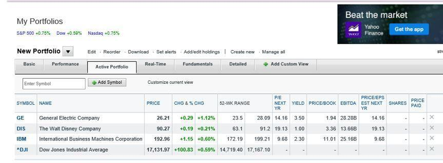

## Table of Contents

## What is portfolio tracking and why is it important?

Portfolio tracking is when you keep an eye on all your investments, like stocks, bonds, and funds, to see how they are doing. It's like checking the health of your money. You can use apps or websites to help you see everything in one place. This way, you know if your investments are growing or if they are losing value.

It's important to track your portfolio because it helps you make smart choices about your money. If you see that one investment is doing really badly, you might decide to sell it and buy something else that could do better. Also, tracking helps you see if you are reaching your financial goals. By keeping a close watch, you can adjust your plans and make sure your money is working hard for you.

## How do I set up a portfolio on Yahoo Finance?

To set up a portfolio on Yahoo Finance, first go to the Yahoo Finance website and sign in with your Yahoo account. If you don't have one, you'll need to create it. Once you're signed in, look for the "My Portfolio" or "Portfolios" section, usually found at the top of the page. Click on it, and then choose "Create New Portfolio." Give your portfolio a name that makes sense to you, like "My Investments" or "Retirement Fund."

After naming your portfolio, you can start adding your investments. Click on "Add Symbol" or a similar button, and type in the stock or fund symbol you want to track. For example, if you own Apple stock, you would type in "AAPL." You can add as many investments as you need. Once you've added all your investments, you'll be able to see how they are doing all in one place. You can also set up alerts to notify you of big changes in your portfolio's value.

## What types of investments can I track on Yahoo Finance?

You can track many different types of investments on Yahoo Finance. This includes stocks, which are shares in a company, and exchange-traded funds (ETFs), which are like baskets of stocks that you can buy and sell like a single stock. You can also track mutual funds, which are another type of investment that pools money from many investors to buy a variety of stocks, bonds, or other assets. If you have bonds, which are loans you give to companies or governments, you can track those too.

Besides these, Yahoo Finance lets you keep an eye on cryptocurrencies like Bitcoin and Ethereum. You can also track options, which are contracts that give you the right to buy or sell an asset at a certain price. If you have commodities like gold or oil, you can add those to your portfolio as well. With Yahoo Finance, you get a clear picture of all your investments in one place, making it easier to see how they are doing.

## How do I add or remove securities from my portfolio?

To add securities to your portfolio on Yahoo Finance, first, go to the "My Portfolio" section on the website. Click on the portfolio you want to update, and then look for a button or link that says "Add Symbol" or something similar. When you find it, click on it and type in the symbol of the stock, ETF, mutual fund, or other investment you want to track. For example, if you want to add Apple stock, you would type "AAPL." After you enter the symbol, the investment will be added to your portfolio, and you can see how it's doing along with your other investments.

To remove securities from your portfolio, go to the same "My Portfolio" section and find the portfolio you want to change. Look for the security you want to remove, and next to it, there should be an option to delete or remove it. This might look like a small "X" or a "Remove" button. Click on it, and the security will be taken out of your portfolio. This way, you can keep your portfolio up to date with just the investments you want to track.

## Can I track my portfolio's performance over time on Yahoo Finance?

Yes, you can track your portfolio's performance over time on Yahoo Finance. Once you set up your portfolio and add your investments, Yahoo Finance will show you how your portfolio is doing right now. But you can also see how it has done over different time periods, like the last day, week, month, or even years. This helps you see if your investments are growing or if they are losing value over time.

To do this, go to the "My Portfolio" section and choose the portfolio you want to look at. There will be options to change the time frame you are looking at. You can pick a short time like one day or a longer time like five years. Yahoo Finance will then show you a chart or a graph that makes it easy to see how your portfolio's value has changed over that time. This way, you can keep an eye on your investments and make smart choices about your money.

## What are the key metrics provided for portfolio analysis on Yahoo Finance?

When you look at your portfolio on Yahoo Finance, you'll see several important numbers that help you understand how your investments are doing. The main one is the total value of your portfolio, which shows how much all your investments are worth right now. You'll also see the change in value, which tells you if your portfolio has gone up or down since the last time you checked. This change can be shown as a dollar amount or as a percentage, so you can quickly see if your investments are growing or losing money.

Another key metric is the performance over time, which lets you see how your portfolio has done over different periods like a day, a week, a month, or even years. This helps you understand if your investments are doing well in the long run. Yahoo Finance also shows you the allocation of your investments, which means how much of your money is in stocks, bonds, or other types of investments. This helps you see if your money is spread out the way you want it to be. By looking at these numbers, you can make better decisions about your investments.

## How can I customize my portfolio view on Yahoo Finance?

To customize your portfolio view on Yahoo Finance, start by going to the "My Portfolio" section and choosing the portfolio you want to change. Once you're there, you can click on different options to change how your portfolio looks. For example, you can choose to see your investments in a list or as a chart. You can also pick which columns you want to see, like the current price, the change in value, or the percentage change. This way, you can make your portfolio page show you the information that matters most to you.

Another way to customize your portfolio is by setting up alerts. These alerts can notify you when your investments go up or down by a certain amount, or when they reach a price you set. To do this, go to your portfolio and find the "Alerts" section. You can then choose what kind of alerts you want and how you want to be notified, like by email or through the Yahoo Finance app. By customizing your view and setting up alerts, you can keep a close eye on your investments and make sure you don't miss important changes.

## Does Yahoo Finance offer any tools for comparing my portfolio to market benchmarks?

Yes, Yahoo Finance lets you compare your portfolio to market benchmarks like the S&P 500 or the Dow Jones. This helps you see if your investments are doing better or worse than the overall market. To do this, go to your portfolio and look for a section or button that says "Compare" or something similar. When you click on it, you can choose the benchmark you want to compare against. Yahoo Finance will then show you a chart or graph that makes it easy to see how your portfolio stacks up.

This feature is useful because it gives you a clear picture of how well your investments are doing compared to the market as a whole. If your portfolio is doing better than the benchmark, that's a good sign. If it's doing worse, you might want to think about changing your investments. By using this tool, you can make smarter choices and keep your money working hard for you.

## How do I use the transaction history feature on Yahoo Finance?

To use the transaction history feature on Yahoo Finance, first go to the "My Portfolio" section and choose the portfolio you want to look at. Once you're there, find the "Transactions" tab or a similar button. Click on it, and you'll see a list of all the times you bought or sold investments in that portfolio. You can see when you made each transaction, how many shares you bought or sold, the price at the time, and whether it was a buy or a sell. This helps you keep track of everything you've done with your investments.

Using the transaction history can be really helpful. It lets you see how your investments have changed over time and helps you understand why your portfolio looks the way it does today. If you want to, you can also add new transactions to the history by clicking on an "Add Transaction" button. This way, you can keep everything up to date, even if you made a trade outside of Yahoo Finance. By keeping a good record of your transactions, you can make better decisions about your money and see how your choices have paid off.

## Can I import transactions from my brokerage account into Yahoo Finance?

Yes, you can import transactions from your brokerage account into Yahoo Finance. To do this, go to the "My Portfolio" section and choose the portfolio you want to update. Look for an option that says "Import" or something similar. You might need to download a file from your brokerage account, like a CSV file, that lists all your transactions. Once you have this file, you can upload it to Yahoo Finance. The website will then add all those transactions to your portfolio, making it easier to keep everything in one place.

This feature is really helpful because it saves you time. Instead of adding each transaction one by one, you can do it all at once. It also makes sure your portfolio on Yahoo Finance is accurate and up to date. By importing your transactions, you can see exactly how your investments have changed over time and make better decisions about your money.

## What advanced features does Yahoo Finance offer for expert portfolio management?

Yahoo Finance offers several advanced features that can help with expert portfolio management. One of these is the ability to set up custom alerts. You can choose to get notified when your investments go up or down by a certain amount, or when they reach a specific price. This helps you keep a close eye on your investments without having to check them all the time. Another useful feature is the ability to compare your portfolio to market benchmarks like the S&P 500. This lets you see if your investments are doing better or worse than the overall market, which can help you make smarter decisions about your money.

In addition to these, Yahoo Finance allows you to import transactions from your brokerage account, making it easier to keep your portfolio up to date. You can download a file from your brokerage and upload it to Yahoo Finance, and all your transactions will be added automatically. This saves you time and ensures that your portfolio is accurate. Yahoo Finance also provides detailed charts and graphs that show your portfolio's performance over time. By using these advanced features, you can manage your investments more effectively and make well-informed choices to reach your financial goals.

## How can I use Yahoo Finance's portfolio tracking to make informed investment decisions?

Yahoo Finance's portfolio tracking can help you make smart investment choices by showing you how your investments are doing right now and over time. When you check your portfolio, you can see if your investments are growing or losing value. This helps you decide if you should keep them or sell them. You can also compare your portfolio to big market benchmarks like the S&P 500. If your portfolio is doing better than the market, that's a good sign. But if it's doing worse, you might want to change your investments to try to do better.

Another way Yahoo Finance helps is by letting you set up alerts. You can get notifications if your investments go up or down by a certain amount, or if they reach a price you set. This way, you don't have to check your portfolio all the time, but you'll still know if something important happens. You can also see a history of all your transactions, which helps you understand why your portfolio looks the way it does today. By using these features, you can keep a close eye on your investments and make better decisions about your money.

## What insights can we gain from algorithmic trading?

Algorithmic trading, often abbreviated as 'algo trading', is a method of executing orders that relies on pre-defined mathematical models and rules. By automating the decision-making and trade execution processes, algo trading enables high-speed and complex trades that exceed human capabilities. This methodology minimizes the need for constant human oversight and allows for rapid responses to market changes.

Though Yahoo Finance is not a trading platform, it serves as a valuable resource for algorithmic trading strategies with its vast array of data and analytical tools. Traders can access historical price data, financial news, and real-time stock quotes, which are critical for developing and testing algorithms. This access provides the foundational data needed to identify trends and inform trading models. 

One strategy often used in algorithmic trading is mean reversion, predicated on the assumption that asset prices will revert to their historical average over time. Using Yahoo Finance data, traders can calculate moving averages and compare them to current prices to identify potential buy or sell signals. In mathematical terms, a simple moving average (SMA) can be calculated using the formula:

$$
\text{SMA} = \frac{P_1 + P_2 + ... + P_n}{n}
$$

where $P$ represents the closing prices over $n$ periods. A deviation from this average may trigger a trading action in an algorithmic strategy.

Yahoo Finance also aids in refining algorithmic models by providing insights into market sentiment. For instance, news sentiment analysis can be integrated into algorithmic predictions to enhance model accuracy and responsiveness. Traders and developers can use Python libraries like BeautifulSoup or requests to scrape Yahoo Finance for relevant news articles and preprocess this data for sentiment analysis.

```python
import requests
from bs4 import BeautifulSoup
from textblob import TextBlob

def get_sentiment(article_url):
    page = requests.get(article_url)
    soup = BeautifulSoup(page.content, 'html.parser')
    paragraphs = soup.find_all('p')
    content = " ".join([p.get_text() for p in paragraphs])
    analysis = TextBlob(content)
    return analysis.sentiment.polarity

# Example of usage:
url = "https://finance.yahoo.com/news/sample-news-article"
sentiment_score = get_sentiment(url)
print(f"Sentiment Score: {sentiment_score}")
```

With Yahoo Finance's wealth of information, traders can effectively backtest their algorithms against historical data, thus minimizing risk before executing trades in real-time markets. Access to such data allows algorithmic models to be more robust and responsive to market dynamism, ultimately optimizing trading outcomes. By leveraging Yahoo Finance's tools, traders can refine their algorithmic strategies to be efficient and successful within the competitive landscape of financial markets.

## References & Further Reading

[1]: Investopedia. ["Key Investment Metrics to Monitor."](https://www.investopedia.com/articles/fundamental-analysis/09/five-must-have-metrics-value-investors.asp)

[2]: Yahoo Finance. ["Link Brokerage Accounts."](https://help.yahoo.com/kb/sln28346.html)

[3]: Jansen, Stefan. ["Machine Learning for Algorithmic Trading"](https://github.com/stefan-jansen/machine-learning-for-trading)

[4]: de Prado, Marcos Lopez. ["Advances in Financial Machine Learning"](https://www.amazon.com/Advances-Financial-Machine-Learning-Marcos/dp/1119482089)

[5]: Chan, Ernest P. ["Quantitative Trading: How to Build Your Own Algorithmic Trading Business"](https://github.com/ftvision/quant_trading_echan_book)

[6]: Aronson, David. ["Evidence-Based Technical Analysis: Applying the Scientific Method and Statistical Inference to Trading Signals"](https://www.amazon.com/Evidence-Based-Technical-Analysis-Scientific-Statistical/dp/0470008741)