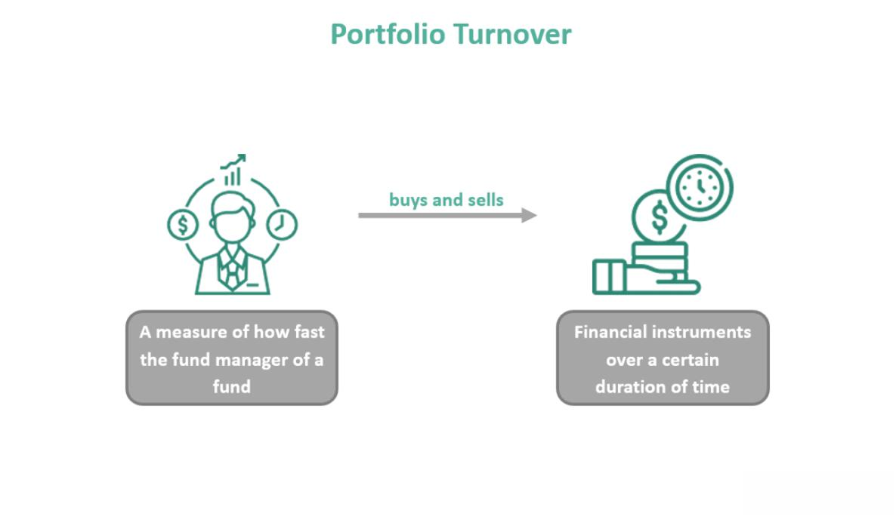

## Table of Contents

## What is portfolio turnover?

Portfolio turnover is a measure of how often the investments in a portfolio are bought and sold over a certain period, usually a year. It is calculated by taking the lesser of the total value of new securities purchased or the total value of securities sold during the period and dividing it by the average value of the portfolio. A high turnover rate means that the portfolio manager is actively trading, while a low turnover rate indicates a more passive, buy-and-hold approach.

Understanding portfolio turnover is important because it can affect the costs and performance of a portfolio. Higher turnover can lead to higher transaction costs, such as brokerage fees and taxes, which can reduce the overall returns. On the other hand, a lower turnover rate might mean fewer costs but could also mean missing out on potential gains from actively managing the portfolio. Investors should consider their investment goals and risk tolerance when evaluating the impact of portfolio turnover on their investments.

## Why is portfolio turnover important to investors?

Portfolio turnover is important to investors because it shows how often the investments in their portfolio are being bought and sold. A high turnover rate means the portfolio manager is actively trading, which can lead to higher costs like fees and taxes. These costs can eat into the returns that investors make on their investments. On the other hand, a low turnover rate means the portfolio is more stable, with fewer trades happening. This can save money on costs but might also mean missing out on chances to make more money by actively managing the portfolio.

Investors need to think about their own goals and how much risk they are willing to take when looking at portfolio turnover. If someone wants to grow their money quickly, they might be okay with a high turnover rate because they are looking for more chances to make money. But if someone wants a more steady and safe way to invest, they might prefer a lower turnover rate. Understanding portfolio turnover helps investors pick the right kind of investment strategy that matches what they want to achieve with their money.

## How is portfolio turnover calculated?

Portfolio turnover is calculated by looking at how much buying and selling happens in a portfolio over a certain time, usually a year. To find the turnover rate, you take the smaller number between the total value of new securities bought and the total value of securities sold during that time. Then, you divide that number by the average value of the portfolio during the same period. The result is a percentage that shows how much of the portfolio was turned over.

For example, if a portfolio bought new securities worth $100,000 and sold securities worth $80,000 in a year, and the average value of the portfolio was $500,000, you would use the smaller number, $80,000, for the calculation. So, the turnover rate would be $80,000 divided by $500,000, which equals 0.16 or 16%. This means 16% of the portfolio was turned over in that year.

## What are the direct costs associated with portfolio turnover?

Direct costs from portfolio turnover come from trading a lot. When a portfolio manager buys and sells investments often, they have to pay fees to brokers for each trade. These are called transaction costs. Also, when they sell investments, they might have to pay taxes on any profits they made. These taxes can be a big part of the costs, especially if the investments were held for less than a year.

These costs can add up and take away from the money the portfolio makes. If the portfolio turnover is high, the fees and taxes can be a lot, which means less money for the investor at the end of the day. It's important for investors to know about these costs because they can affect how much money they make from their investments.

## Can you explain the concept of bid-ask spread in relation to turnover costs?

The bid-ask spread is the difference between the highest price someone is willing to pay for a stock (the bid) and the lowest price someone is willing to sell it for (the ask). When a portfolio manager buys or sells a stock, they have to pay this spread. The bid-ask spread is another cost that comes with trading, and it can add up if the portfolio has a lot of turnover.

If a portfolio manager is trading a lot, they will have to pay the bid-ask spread more often. This means more money is spent just on the difference between buying and selling prices. For investors, this is important to know because it can eat into the returns of their investments, especially if the portfolio turnover is high.

## What are the tax implications of high portfolio turnover?

When a portfolio has a lot of buying and selling, it can lead to more taxes. This is because when you sell an investment for more than you paid for it, you have to pay capital gains tax on the profit. If you hold the investment for less than a year before selling, you pay a higher short-term capital gains tax, which is the same as your regular income tax rate. So, if a portfolio manager is trading a lot and selling investments quickly, the taxes can add up and take a bigger bite out of the money you make from your investments.

This is important for investors to think about because high turnover can mean less money in your pocket after taxes. If you're in a high tax bracket, these costs can be even more painful. It's a good idea to talk to a tax advisor to understand how much you might have to pay in taxes if your portfolio is turning over a lot. They can help you figure out ways to manage your investments to keep your tax bill down.

## How does portfolio turnover affect long-term investment returns?

Portfolio turnover can have a big impact on how much money you make over the long run. When a portfolio manager trades a lot, they have to pay fees for each trade. These fees, along with the costs of buying and selling like the bid-ask spread, can add up and take away from the money you make. Also, if the manager sells investments quickly, you might have to pay more in taxes because short-term capital gains taxes are higher than long-term ones. All these costs can eat into your returns, making it harder to grow your money over time.

On the other hand, if a portfolio has a low turnover rate, it means the manager is not trading as much. This can save you money on fees and taxes, which can help your investments grow more over the long term. But, a low turnover rate might also mean missing out on chances to make more money by actively managing the portfolio. So, it's important to find a balance that fits your goals and how much risk you're willing to take. Understanding how turnover affects your returns can help you make better choices about how to invest your money.

## What strategies can be used to minimize portfolio turnover costs?

One way to keep portfolio turnover costs low is to stick with a long-term investment plan. Instead of buying and selling a lot, you can hold onto your investments for a long time. This means you won't have to pay as many fees for trading, and you might also pay less in taxes because long-term capital gains taxes are lower than short-term ones. By not trading so much, you can save money and let your investments grow over time without the extra costs.

Another strategy is to choose investments that match your goals and don't need a lot of trading. For example, you can pick index funds or ETFs that follow a broad market or sector. These kinds of investments usually have lower turnover rates because they don't change their holdings as often. This can help keep your costs down and make it easier to stick with your long-term plan. It's also a good idea to talk to a financial advisor who can help you find the right balance between keeping costs low and making the most of your investments.

## How do different investment styles impact portfolio turnover rates?

Different investment styles can really change how often a portfolio gets traded. If someone follows an active investment style, they are always looking to buy and sell to beat the market. This means they will have a high portfolio turnover rate because they are always moving money around to try to make more. On the other hand, if someone uses a passive investment style, like investing in index funds, they don't trade as much. They just hold onto their investments for a long time, so their turnover rate is lower. This can save money on fees and taxes.

Another style is value investing, where people look for stocks that they think are underpriced. Value investors might not trade as much as active investors, but they still look for chances to buy and sell based on their research. Their turnover rate can be somewhere in the middle. Growth investors, who focus on companies that are growing fast, might trade a bit more because they want to get into new, exciting companies. Each style has its own way of trading, and understanding this can help you pick the right one for your goals and how much risk you want to take.

## What role does market volatility play in portfolio turnover and its costs?

Market volatility can make portfolio turnover go up. When the market is moving a lot, prices can change quickly. This might make a portfolio manager want to trade more to try to make money from these changes or to protect their investments from losing value. If they trade more, the costs like fees and taxes can go up too. So, when the market is really up and down, it can lead to more trading and higher costs for the portfolio.

But, not all investors will trade more just because the market is volatile. Some might stick to their long-term plan and not trade as much, even when prices are jumping around. This can help keep their costs down. It really depends on the investment style and how the portfolio manager reacts to the market's ups and downs. If they can stay calm and not trade too much, they might save money on costs even when the market is volatile.

## How can advanced analytics help in managing portfolio turnover?

Advanced analytics can help manage portfolio turnover by giving portfolio managers a lot of information to make smart choices. They can use data to see patterns and trends in the market, which can help them decide when to buy or sell. This means they can trade less often and still make good decisions. By using analytics, they can also see how much it costs to trade and try to keep those costs low. This can help them save money and make more for their investors.

Another way advanced analytics helps is by letting managers test different strategies before they use them for real. They can use computer models to see what might happen if they trade more or less. This can help them find the best way to manage the portfolio without spending too much on fees and taxes. By using these tools, they can keep the portfolio turnover at a good level and make sure the costs don't eat into the returns too much.

## What are the regulatory considerations regarding disclosure of portfolio turnover costs?

When it comes to telling people about portfolio turnover costs, there are rules that investment companies have to follow. These rules are set by groups like the Securities and Exchange Commission (SEC) in the U.S. They say that investment companies need to show how much their portfolio turns over in their reports. This helps investors know how much the company is trading and what it might cost them.

The rules also say that the reports should be easy for people to understand. This means the companies have to explain things clearly so investors can see how turnover costs might affect their money. By making sure this information is shared the right way, the rules help investors make better choices about where to put their money.

## References & Further Reading

[1]: Kissell, R. (2013). ["The Science of Algorithmic Trading and Portfolio Management."](https://www.sciencedirect.com/book/9780124016897/the-science-of-algorithmic-trading-and-portfolio-management) Academic Press.

[2]: Lopez de Prado, M. (2018). ["Advances in Financial Machine Learning."](https://www.amazon.com/Advances-Financial-Machine-Learning-Marcos/dp/1119482089) Wiley.

[3]: Chan, E. P. (2009). ["Quantitative Trading: How to Build Your Own Algorithmic Trading Business."](https://github.com/ftvision/quant_trading_echan_book) Wiley.

[4]: Aldridge, I. (2010). ["High-Frequency Trading: A Practical Guide to Algorithmic Strategies and Trading Systems."](https://www.wiley.com/en-us/High+Frequency+Trading%3A+A+Practical+Guide+to+Algorithmic+Strategies+and+Trading+Systems-p-9780470579770) Wiley.

[5]: Harris, L. (2003). ["Trading and Exchanges: Market Microstructure for Practitioners."](https://www.amazon.com/Trading-Exchanges-Market-Microstructure-Practitioners/dp/0195144708) Oxford University Press.

[6]: Jansen, S. (2020). ["Machine Learning for Algorithmic Trading."](https://github.com/stefan-jansen/machine-learning-for-trading) Packt Publishing.

[7]: Aronson, D. R. (2006). ["Evidence-Based Technical Analysis: Applying the Scientific Method and Statistical Inference to Trading Signals."](https://www.amazon.com/Evidence-Based-Technical-Analysis-Scientific-Statistical/dp/0470008741) Wiley.