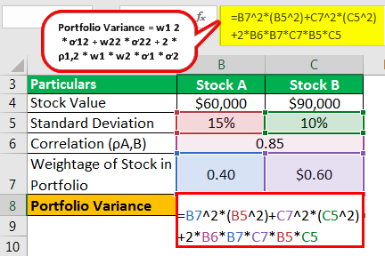

## Table of Contents

## What is portfolio variance and why is it important?

Portfolio variance is a measure of how the returns of different investments in a portfolio move together. It tells you how much the overall value of your portfolio might go up and down over time. Imagine you have different stocks or bonds in your portfolio. If all of them go up and down at the same time, your portfolio has high variance. But if some go up when others go down, the overall ups and downs might be smaller, which means lower variance.

Understanding portfolio variance is important because it helps you manage risk. If you know how much your portfolio might change in value, you can make better decisions about what to invest in. For example, if you don't like big swings in your investment value, you might choose investments that lower your portfolio's variance. This way, you can feel more secure about your investments and plan for the future with more confidence.

## What are the basic components needed to calculate portfolio variance?

To calculate portfolio variance, you need to know the weights of each investment in your portfolio and the expected returns and variances of those investments. The weight of an investment is just how much of your total money is in that specific investment. The expected return is a guess about how much that investment might grow in the future. The variance of an investment shows how much its returns might change over time.

You also need to know the covariances between the different investments. Covariance shows how the returns of two investments move together. If one goes up when the other goes down, the covariance is negative. If they move in the same direction, the covariance is positive. Once you have all this information, you can use a formula to calculate the overall variance of your portfolio. This formula takes into account the weights, variances, and covariances to give you a single number that represents the risk of your whole portfolio.

## How do you calculate the variance of a single asset?

To find out the variance of a single asset, you first need to know its expected return and the actual returns it has given over time. The expected return is like a guess about how much the asset might grow. You compare this guess to the real returns the asset has had in the past. You do this by finding the difference between each actual return and the expected return, then squaring those differences. Squaring makes sure all the differences are positive numbers.

After you have all these squared differences, you add them up and divide by the number of returns you used. This gives you the average of the squared differences, which is the variance. The variance tells you how much the returns of the asset might change over time. A higher variance means the returns can be very different from what you expect, which means the asset is riskier. A lower variance means the returns are usually closer to what you expect, so the asset is less risky.

## What is the formula for portfolio variance?

To calculate portfolio variance, you use a formula that takes into account the weights of each investment, their individual variances, and how their returns move together, which is called covariance. Imagine you have different investments in your portfolio, like stocks or bonds. Each investment has a weight, which is the percentage of your total money that's in that investment. You also need to know the variance of each investment, which shows how much its returns might change. Lastly, you need to know the covariance between each pair of investments, which shows if their returns move up and down together or in opposite directions.

The formula for portfolio variance adds up two parts. The first part is the sum of each investment's weight squared times its own variance. This part shows how much each investment contributes to the overall risk of your portfolio on its own. The second part is twice the sum of the weights of each pair of different investments times their covariance. This part shows how the movements of the investments together affect the overall risk. When you add these two parts together, you get the total variance of your portfolio, which tells you how much the value of your whole portfolio might go up and down.

## How do you calculate the covariance between two assets?

To calculate the covariance between two assets, you need to know their returns over the same period of time. Start by finding the average return for each asset. Then, for each time period, you find the difference between the actual return and the average return for both assets. Next, you multiply these differences together for each time period. After that, you add up all these products and divide by the number of time periods minus one. This gives you the covariance, which tells you how the returns of the two assets move together.

If the covariance is positive, it means that when one asset's return goes up, the other asset's return tends to go up too. If the covariance is negative, it means that when one asset's return goes up, the other's tends to go down. A covariance close to zero means the returns of the two assets don't move much together. Understanding covariance is important because it helps you see how adding different investments to your portfolio might affect its overall risk.

## Can you explain the role of weights in the portfolio variance formula?

The weights in the portfolio variance formula are really important because they show how much of your money is in each investment. Imagine you have a pie, and each slice of the pie is a different investment. The size of each slice, or the weight, tells you how much of your total money is in that investment. When you calculate portfolio variance, you use these weights to figure out how much each investment adds to the overall risk of your portfolio. If you have a lot of money in one investment, its ups and downs will affect your whole portfolio more than if you had less money in it.

The weights also help you see how the different investments work together to change your portfolio's risk. In the formula, you square the weights and multiply them by the variance of each investment. This part shows how much each investment's own risk affects the portfolio. But that's not all. You also multiply the weights of each pair of different investments by their covariance, which shows how their returns move together. This part of the formula helps you understand how the movements of all your investments together affect the overall risk of your portfolio. So, weights are key to understanding and managing the risk of your whole investment pie.

## What is the difference between portfolio variance and portfolio standard deviation?

Portfolio variance and portfolio standard deviation are both ways to measure the risk of your investments, but they do it a bit differently. Portfolio variance is the average of the squared differences between the actual returns of your investments and what you expected them to be. It tells you how much the value of your whole portfolio might go up and down over time. When you calculate portfolio variance, you take into account how much money you have in each investment, how much each investment might change, and how the investments move together.

Portfolio standard deviation is just the square root of the portfolio variance. It's a simpler way to understand the risk because it's in the same units as your returns, like percentages. If your portfolio's standard deviation is 5%, it means the value of your portfolio might go up or down by about 5% from what you expected. So, while variance gives you a detailed measure of risk, standard deviation makes it easier to see and understand how much your investments might change in value.

## How does diversification affect portfolio variance?

Diversification means spreading your money across different investments, like stocks, bonds, or real estate. When you diversify, you mix investments that might go up and down at different times. This can help lower the overall risk of your portfolio. Imagine you have two investments: one goes up when the other goes down. By having both, the ups and downs of your whole portfolio might be smaller because they balance each other out. This is why diversification can reduce portfolio variance, which is a measure of how much your portfolio's value might change.

The key to diversification is choosing investments that don't move in the same way. If all your investments go up and down together, diversification won't help much. But if some go up when others go down, it can make a big difference. When you calculate portfolio variance, you take into account how much each investment might change and how they move together. By adding investments that have low or negative covariance with each other, you can lower the overall variance of your portfolio. This means your investments might be less risky, and you might feel more secure about your money.

## Can you provide a step-by-step example of calculating portfolio variance for a two-asset portfolio?

Let's say you have a portfolio with two assets: Stock A and Stock B. You put 60% of your money in Stock A and 40% in Stock B. The expected return for Stock A is 10% and for Stock B is 8%. The variance of Stock A's returns is 0.04 and for Stock B is 0.03. The covariance between the returns of Stock A and Stock B is 0.005. To find the portfolio variance, you need to use a formula that takes into account the weights of each stock, their variances, and their covariance.

First, you calculate the part of the variance that comes from each stock on its own. For Stock A, you square its weight (0.60) and multiply it by its variance (0.04), which gives you 0.60^2 * 0.04 = 0.0144. For Stock B, you do the same thing: 0.40^2 * 0.03 = 0.0048. Then, you add these two numbers together: 0.0144 + 0.0048 = 0.0192. Next, you calculate the part of the variance that comes from how the stocks move together. You multiply the weight of Stock A (0.60) by the weight of Stock B (0.40) and then by their covariance (0.005): 2 * 0.60 * 0.40 * 0.005 = 0.0024. Finally, you add this to the first part: 0.0192 + 0.0024 = 0.0216. So, the portfolio variance is 0.0216.

## How do you extend the portfolio variance formula to more than two assets?

To calculate the portfolio variance for more than two assets, you need to consider the weights of each asset, their individual variances, and the covariances between all pairs of assets. Imagine you have three stocks in your portfolio: Stock A, Stock B, and Stock C. You put 40% of your money in Stock A, 30% in Stock B, and 30% in Stock C. You would first calculate the part of the variance that comes from each stock on its own. You do this by squaring the weight of each stock and multiplying it by its variance. Then, you add up these numbers. Next, you need to calculate the part of the variance that comes from how the stocks move together. You do this by multiplying the weights of each pair of different stocks by their covariance and then adding up all these numbers. Finally, you add the two parts together to get the total portfolio variance.

For example, let's say the variance of Stock A is 0.05, Stock B is 0.04, and Stock C is 0.03. The covariances are 0.006 between A and B, 0.004 between A and C, and 0.003 between B and C. You start by calculating the variance from each stock: (0.40^2 * 0.05) + (0.30^2 * 0.04) + (0.30^2 * 0.03) = 0.008 + 0.0036 + 0.0027 = 0.0143. Then, you calculate the variance from how the stocks move together: 2 * (0.40 * 0.30 * 0.006) + 2 * (0.40 * 0.30 * 0.004) + 2 * (0.30 * 0.30 * 0.003) = 0.00144 + 0.00096 + 0.00054 = 0.00294. Adding these two parts together gives you the total portfolio variance: 0.0143 + 0.00294 = 0.01724. This way, you can see how much the value of your whole portfolio might go up and down over time, even when you have more than two assets.

## What are common software tools or programming languages used for calculating portfolio variance?

People often use special computer programs and languages to figure out portfolio variance. Some popular choices are Microsoft Excel, Python, and R. Excel is easy to use and has built-in functions that can help you do the math needed for portfolio variance. You can enter the weights, returns, and covariances of your investments into a spreadsheet and use Excel's formulas to calculate the variance. Python is another good choice because it's free and has lots of tools, like the NumPy and Pandas libraries, that make it easy to work with numbers and do the calculations for portfolio variance. R is also free and is used a lot by people who study finance and [statistics](/wiki/bayesian-statistics). It has packages like quantmod and PerformanceAnalytics that help you calculate portfolio variance and other things about your investments.

When you use these tools, you can quickly see how much risk is in your portfolio. For example, in Excel, you can use the "=SUMPRODUCT" function to multiply the weights and variances and add them up. In Python, you can write a few lines of code using NumPy to do the same thing. R has functions like "cov" to find covariances and "var" to calculate variances, which you can use to figure out your portfolio's variance. These tools make it easier to manage your investments and understand how different choices might affect your portfolio's risk.

## How can advanced statistical techniques improve the accuracy of portfolio variance calculations?

Advanced statistical techniques can make portfolio variance calculations more accurate by taking into account more details about how investments move. For example, instead of just using simple averages and variances, you can use things like time-series analysis to look at how returns change over time. This can help you see patterns and make better guesses about how your investments might behave in the future. Another technique is Monte Carlo simulation, which lets you run many different scenarios to see how your portfolio might do under different conditions. By doing this, you can get a better idea of the possible risks and how likely they are to happen.

Using these advanced methods can also help you understand how different investments affect each other in more complex ways. For instance, you might use techniques like GARCH models to see how the risk of your investments changes over time. This can be important because the risk of an investment can go up or down depending on what's happening in the market. By understanding these changes, you can adjust your portfolio to keep the risk at a level you're comfortable with. Overall, these advanced statistical techniques give you a clearer picture of your portfolio's risk, helping you make smarter investment choices.

## What is Understanding Portfolio Variance?

Portfolio variance is a vital statistical measure for evaluating the risk associated with an investment portfolio. It quantifies the degree to which the returns from various securities within a portfolio deviate from their mean and how they correlate with each other. Understanding and calculating variance are crucial steps in strategically allocating assets to manage and minimize risk while aiming for optimal returns.

To understand portfolio variance, it is essential first to grasp how individual asset variances and covariances between pairs of assets interact. Variance, in this context, measures the [dispersion](/wiki/dispersion-trading) of returns of a single asset, while covariance accounts for how two asset returns move together. The overall portfolio variance is not just a simple sum of individual variances; it integrates these with the covariances of the asset pairs.

The formula for calculating the variance of a portfolio consisting of $n$ assets is as follows:

$$
\sigma_p^2 = \sum_{i=1}^{n} w_i^2 \sigma_i^2 + \sum_{i=1}^{n-1} \sum_{j=i+1}^{n} 2 w_i w_j \text{Cov}(r_i, r_j)
$$

where:
- $\sigma_p^2$ is the portfolio variance.
- $w_i$ and $w_j$ are the weights of assets $i$ and $j$ in the portfolio.
- $\sigma_i^2$ is the variance of asset $i$.
- $\text{Cov}(r_i, r_j)$ is the covariance between the returns of assets $i$ and $j$.

This equation highlights the contribution of both individual asset variances and the covariances between assets to the total variance of the portfolio. By adjusting the weights $w_i$ and $w_j$, investors can control the total risk associated with their portfolio.

Variance is a cornerstone of Modern Portfolio Theory (MPT), which aims to construct an "efficient frontier" of optimal portfolios offering the maximum possible expected return for a given level of risk. Investors use variance to identify combinations of assets that minimize risk for a specific return level or maximize returns for an acceptable level of risk. Reducing portfolio variance through diversification is a fundamental strategy; the less the returns of constituent assets are correlated, the more they help spread risk across the portfolio.

In the context of risk assessment, understanding variance allows investors to not only appreciate the range of potential outcomes but also actively manage their portfolios against undesirable [volatility](/wiki/volatility-trading-strategies). By thoroughly analyzing the variance and correlation of prospective investments, decision-makers can strategically pursue a mix of assets that aligns with their overall risk-return objectives.

In summary, portfolio variance is an integral measurement tool that investors leverage to navigate the complexities of risk management. By comprehensively evaluating how asset returns vary and interact, they can make informed decisions to structure portfolios that deliver on their investment goals while controlling risk exposure.

## What is Financial Analysis and How is Variance Calculated?

The calculation of portfolio variance is a core concept in finance that involves determining the risk associated with a portfolio's expected return. Portfolio variance quantifies the dispersion of returns, providing insights into the overall risk profile. The formula for portfolio variance considers the standard deviations of individual assets, their weights within the portfolio, and their pairwise correlations. Mathematically, the portfolio variance ($\sigma_p^2$) is expressed as:

$$
\sigma_p^2 = \sum_{i=1}^{n} \sum_{j=1}^{n} w_i w_j \sigma_i \sigma_j \rho_{ij}
$$

where:
- $w_i$ and $w_j$ represent the weights of assets $i$ and $j$ in the portfolio.
- $\sigma_i$ and $\sigma_j$ are the standard deviations of the individual asset returns.
- $\rho_{ij}$ is the correlation coefficient between the returns of assets $i$ and $j$.

Understanding these components helps investors to project potential losses by assessing how much the portfolio returns might deviate from their expected value. By analyzing these variables, investors can effectively shape their risk profiles and make informed decisions.

Modern Portfolio Theory (MPT), developed by Harry Markowitz, utilizes variance as a fundamental element to construct an 'efficient frontier'. This frontier represents the set of optimal portfolios that offer the highest expected return for a defined level of risk or, conversely, the lowest risk for a given level of expected return. The primary objective of MPT is to achieve a balance between risk and return, providing a more stable investment trajectory.

To illustrate how variance is calculated and interpreted in practice, consider the following Python example:

```python
import numpy as np

# Example data: weights, standard deviations, and correlation matrix
weights = np.array([0.4, 0.6])
std_devs = np.array([0.1, 0.15])
correlation_matrix = np.array([[1, 0.2], [0.2, 1]])

# Calculate covariance matrix
covariance_matrix = np.outer(std_devs, std_devs) * correlation_matrix

# Calculate portfolio variance
portfolio_variance = np.dot(weights, np.dot(covariance_matrix, weights))

print(f"Portfolio Variance: {portfolio_variance:.4f}")
```

This example calculates the variance of a two-asset portfolio using predefined weights, standard deviations, and a correlation matrix. The calculated portfolio variance aids in assessing the potential variability in returns, influencing strategic asset allocation and risk management decisions.

By embracing these analytical tools, investors can better navigate the complexities of financial markets, optimizing their investment strategies to achieve desired outcomes while managing inherent risks. Understanding how variance impacts a portfolio underpins successful financial decision-making, allowing for a more resilient approach in volatile markets.

## What is the role of algorithmic trading in risk management?

Algorithmic trading, or algo trading, uses sophisticated algorithms to automate trading strategies. These algorithms frequently employ portfolio variance as a critical metric to optimize trading decisions and effectively manage risks. By rapidly analyzing market conditions and asset variances, they help traders execute strategies with precision and speed that manual processes cannot match.

One of the primary methodologies in algorithmic risk management is the Value at Risk (VaR) model. VaR measures the potential loss in value of a portfolio over a defined period for a given confidence interval. It provides a statistical estimate of how much the portfolio could lose, aiding traders in understanding and controlling risk exposure. By embedding VaR into trading algorithms, firms can maintain continuous oversight over potential losses and adjust positions to mitigate those risks. 

Another significant model used in [algorithmic trading](/wiki/algorithmic-trading) is the Inverse-Variance Portfolio (IVP) strategy. IVP allocates more capital to assets with lower historical volatility, theoretically minimizing the portfolio variance. This method assumes that past volatility is an indicator of future risk, promoting greater investment in more stable assets relative to their riskier counterparts. The formula for IVP is:

$$
w_i = \frac{\frac{1}{\sigma_i^2}}{\sum_{j=1}^{N} \frac{1}{\sigma_j^2}}
$$

where $w_i$ is the weight allocated to each asset, and $\sigma_i^2$ is the variance of asset $i$.

Case studies demonstrate the efficacy of algorithmic trading coupled with these risk management tools. For instance, quantitative hedge funds have successfully integrated both VaR and IVP strategies, achieving performance metrics that exceed traditional trading methodologies. A notable example includes the use of [machine learning](/wiki/machine-learning) algorithms to dynamically adjust IVP allocations in response to real-time market data, thereby continually optimizing the risk-return profile of the portfolio.

In practice, algorithmic trading platforms integrate these methods with other advanced techniques such as machine learning and natural language processing to refine decision-making processes. By harnessing these technologies, traders can craft complex strategies that not only react to current market events but also anticipate future trends, thus enhancing overall trading performance while managing risks efficiently. 

As technology advances, the role of algorithms in trading becomes increasingly prominent, offering traders robust tools to maintain a competitive edge in volatile markets.

## References & Further Reading

[1]: Markowitz, Harry. "Portfolio Selection." The Journal of Finance, 1952. [https://doi.org/10.2307/2975974](https://onlinelibrary.wiley.com/doi/abs/10.1111/j.1540-6261.1952.tb01525.x).

[2]: Narang, Rishi K. "Inside the Black Box: The Simple Truth About Quantitative Trading." Wiley Finance, 2013.

[3]: Fabozzi, Frank J., Gupta, Francis, and Markowitz, Harry M. "The Legacy of Modern Portfolio Theory." Journal of Investing, 2002.

[4]: Hasbrouck, Joel. "Empirical Market Microstructure: The Institutions, Economics, and Econometrics of Securities Trading." Oxford University Press, 2007.

[5]: Investopedia. "Portfolio Variance." [https://www.investopedia.com/terms/p/portfoliovariance.asp](https://www.investopedia.com/terms/p/portfolio-variance.asp).

[6]: Investopedia. "Risk Management." [https://www.investopedia.com/terms/r/riskmanagement.asp](https://www.investopedia.com/terms/r/riskmanagement.asp).