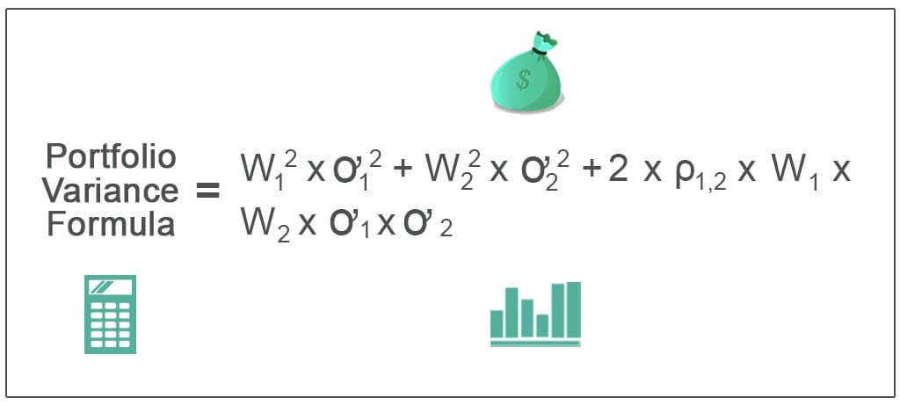

In today's rapidly changing financial markets, understanding and managing investment risk is more crucial than ever. Investors are faced with an array of choices and challenges, making it essential to quantify and manage the risk associated with their portfolio choices effectively. One of the primary methods for assessing this risk is through portfolio variance, a statistical measure that plays a significant role in financial analysis.

Portfolio variance is vital for investors as it allows them to gauge the total risk associated with their asset selections. It provides a quantitative measure of how the returns on different assets within a portfolio fluctuate in relation to each other. This variance arises not only from the individual volatility of the assets but also from the correlations between them. Understanding how these factors interplay can guide investors in choosing an optimal mix of assets that aligns with their risk tolerance and return objectives.



Managing investment risk through portfolio variance involves precise calculations using the standard deviations and correlations of asset returns. The variance of a portfolio $\sigma^2_p$ can be calculated using the formula:

$$
\sigma^2_p = \sum_{i=1}^{n} \sum_{j=1}^{n} w_i w_j \sigma_i \sigma_j \rho_{ij}
$$

where $w_i$ and $w_j$ are the weights of assets $i$ and $j$, $\sigma_i$ and $\sigma_j$ are their standard deviations, and $\rho_{ij}$ is the correlation coefficient between the returns of asset $i$ and asset $j$.

In the digital era, the significance of algorithmic trading in modern investment strategies cannot be overstated. Algorithmic trading employs sophisticated algorithms to automate trading decisions, often incorporating portfolio variance calculations to optimize strategies. These algorithms can rapidly evaluate market conditions, adjusting trading decisions to manage risk more effectively.

This article explores the foundational elements of investment risk through portfolio variance, examining calculation techniques and their implications. It also emphasizes the integration of technology in trading, offering insights into how investors can leverage these advancements to make informed decisions in an unpredictable market environment. By embracing tools such as algorithmic trading and applying careful statistical analysis, investors can better navigate the complexities and uncertainties of today's financial markets.

## Table of Contents

## Understanding Portfolio Variance

Portfolio variance is a vital statistical measure for evaluating the risk associated with an investment portfolio. It quantifies the degree to which the returns from various securities within a portfolio deviate from their mean and how they correlate with each other. Understanding and calculating variance are crucial steps in strategically allocating assets to manage and minimize risk while aiming for optimal returns.

To understand portfolio variance, it is essential first to grasp how individual asset variances and covariances between pairs of assets interact. Variance, in this context, measures the [dispersion](/wiki/dispersion-trading) of returns of a single asset, while covariance accounts for how two asset returns move together. The overall portfolio variance is not just a simple sum of individual variances; it integrates these with the covariances of the asset pairs.

The formula for calculating the variance of a portfolio consisting of $n$ assets is as follows:

$$
\sigma_p^2 = \sum_{i=1}^{n} w_i^2 \sigma_i^2 + \sum_{i=1}^{n-1} \sum_{j=i+1}^{n} 2 w_i w_j \text{Cov}(r_i, r_j)
$$

where:
- $\sigma_p^2$ is the portfolio variance.
- $w_i$ and $w_j$ are the weights of assets $i$ and $j$ in the portfolio.
- $\sigma_i^2$ is the variance of asset $i$.
- $\text{Cov}(r_i, r_j)$ is the covariance between the returns of assets $i$ and $j$.

This equation highlights the contribution of both individual asset variances and the covariances between assets to the total variance of the portfolio. By adjusting the weights $w_i$ and $w_j$, investors can control the total risk associated with their portfolio.

Variance is a cornerstone of Modern Portfolio Theory (MPT), which aims to construct an "efficient frontier" of optimal portfolios offering the maximum possible expected return for a given level of risk. Investors use variance to identify combinations of assets that minimize risk for a specific return level or maximize returns for an acceptable level of risk. Reducing portfolio variance through diversification is a fundamental strategy; the less the returns of constituent assets are correlated, the more they help spread risk across the portfolio.

In the context of risk assessment, understanding variance allows investors to not only appreciate the range of potential outcomes but also actively manage their portfolios against undesirable [volatility](/wiki/volatility-trading-strategies). By thoroughly analyzing the variance and correlation of prospective investments, decision-makers can strategically pursue a mix of assets that aligns with their overall risk-return objectives.

In summary, portfolio variance is an integral measurement tool that investors leverage to navigate the complexities of risk management. By comprehensively evaluating how asset returns vary and interact, they can make informed decisions to structure portfolios that deliver on their investment goals while controlling risk exposure.

## Financial Analysis and Calculation of Variance

The calculation of portfolio variance is a core concept in finance that involves determining the risk associated with a portfolio's expected return. Portfolio variance quantifies the dispersion of returns, providing insights into the overall risk profile. The formula for portfolio variance considers the standard deviations of individual assets, their weights within the portfolio, and their pairwise correlations. Mathematically, the portfolio variance ($\sigma_p^2$) is expressed as:

$$
\sigma_p^2 = \sum_{i=1}^{n} \sum_{j=1}^{n} w_i w_j \sigma_i \sigma_j \rho_{ij}
$$

where:
- $w_i$ and $w_j$ represent the weights of assets $i$ and $j$ in the portfolio.
- $\sigma_i$ and $\sigma_j$ are the standard deviations of the individual asset returns.
- $\rho_{ij}$ is the correlation coefficient between the returns of assets $i$ and $j$.

Understanding these components helps investors to project potential losses by assessing how much the portfolio returns might deviate from their expected value. By analyzing these variables, investors can effectively shape their risk profiles and make informed decisions.

Modern Portfolio Theory (MPT), developed by Harry Markowitz, utilizes variance as a fundamental element to construct an 'efficient frontier'. This frontier represents the set of optimal portfolios that offer the highest expected return for a defined level of risk or, conversely, the lowest risk for a given level of expected return. The primary objective of MPT is to achieve a balance between risk and return, providing a more stable investment trajectory.

To illustrate how variance is calculated and interpreted in practice, consider the following Python example:

```python
import numpy as np

# Example data: weights, standard deviations, and correlation matrix
weights = np.array([0.4, 0.6])
std_devs = np.array([0.1, 0.15])
correlation_matrix = np.array([[1, 0.2], [0.2, 1]])

# Calculate covariance matrix
covariance_matrix = np.outer(std_devs, std_devs) * correlation_matrix

# Calculate portfolio variance
portfolio_variance = np.dot(weights, np.dot(covariance_matrix, weights))

print(f"Portfolio Variance: {portfolio_variance:.4f}")
```

This example calculates the variance of a two-asset portfolio using predefined weights, standard deviations, and a correlation matrix. The calculated portfolio variance aids in assessing the potential variability in returns, influencing strategic asset allocation and risk management decisions.

By embracing these analytical tools, investors can better navigate the complexities of financial markets, optimizing their investment strategies to achieve desired outcomes while managing inherent risks. Understanding how variance impacts a portfolio underpins successful financial decision-making, allowing for a more resilient approach in volatile markets.

## Role of Algorithmic Trading in Risk Management

Algorithmic trading, or algo trading, uses sophisticated algorithms to automate trading strategies. These algorithms frequently employ portfolio variance as a critical metric to optimize trading decisions and effectively manage risks. By rapidly analyzing market conditions and asset variances, they help traders execute strategies with precision and speed that manual processes cannot match.

One of the primary methodologies in algorithmic risk management is the Value at Risk (VaR) model. VaR measures the potential loss in value of a portfolio over a defined period for a given confidence interval. It provides a statistical estimate of how much the portfolio could lose, aiding traders in understanding and controlling risk exposure. By embedding VaR into trading algorithms, firms can maintain continuous oversight over potential losses and adjust positions to mitigate those risks. 

Another significant model used in [algorithmic trading](/wiki/algorithmic-trading) is the Inverse-Variance Portfolio (IVP) strategy. IVP allocates more capital to assets with lower historical volatility, theoretically minimizing the portfolio variance. This method assumes that past volatility is an indicator of future risk, promoting greater investment in more stable assets relative to their riskier counterparts. The formula for IVP is:

$$
w_i = \frac{\frac{1}{\sigma_i^2}}{\sum_{j=1}^{N} \frac{1}{\sigma_j^2}}
$$

where $w_i$ is the weight allocated to each asset, and $\sigma_i^2$ is the variance of asset $i$.

Case studies demonstrate the efficacy of algorithmic trading coupled with these risk management tools. For instance, quantitative hedge funds have successfully integrated both VaR and IVP strategies, achieving performance metrics that exceed traditional trading methodologies. A notable example includes the use of [machine learning](/wiki/machine-learning) algorithms to dynamically adjust IVP allocations in response to real-time market data, thereby continually optimizing the risk-return profile of the portfolio.

In practice, algorithmic trading platforms integrate these methods with other advanced techniques such as machine learning and natural language processing to refine decision-making processes. By harnessing these technologies, traders can craft complex strategies that not only react to current market events but also anticipate future trends, thus enhancing overall trading performance while managing risks efficiently. 

As technology advances, the role of algorithms in trading becomes increasingly prominent, offering traders robust tools to maintain a competitive edge in volatile markets.

## Comparative Analysis of Risk Management Strategies

Investment risk management strategies are crucial for optimizing returns while minimizing potential losses. Among the various approaches, Hierarchical Risk Parity (HRP) and Markowitz Portfolio Optimization stand out for their unique methodologies in asset allocation and risk control. These strategies, along with Inverse-Variance Portfolio (IVP) and traditional variance-based methods, offer distinct advantages and challenges.

Hierarchical Risk Parity (HRP) introduces a sophisticated approach that leverages hierarchical clustering algorithms to optimize portfolio allocation. By organizing assets into a tree-structured hierarchy, HRP aims to reduce the impact of estimation errors and promote stability in asset allocation. This method is particularly effective in handling large portfolios with diverse assets, where traditional covariance matrix estimation might be unreliable due to high dimensionality. The strength of HRP lies in its robustness against the pitfalls of numerical instabilities and its ability to manage complex portfolios without relying heavily on precise estimation of correlations. However, its complexity might be seen as a limitation for smaller, simpler portfolios where traditional methods suffice.

Markowitz Portfolio Optimization, based on Modern Portfolio Theory, focuses on constructing an 'efficient frontier' that represents the optimal blend of assets achieving the maximum expected return for a given level of risk. The primary advantage of this method is its solid theoretical foundation and straightforward implementation via quadratic programming. It leverages mean-variance optimization to allocate resources efficiently, making it effective in relatively stable market environments. Nonetheless, its reliance on precise estimates of expected returns and covariances can lead to suboptimal performance in volatile or unpredictable markets.

In contrast, the Inverse-Variance Portfolio (IVP) method simplifies the optimization process by allocating capital inversely proportional to the variance of each asset. This approach minimizes risk concentration by favoring assets with lower individual risk. IVP's simplicity and intuitive design make it attractive for investors seeking a straightforward, variance-based risk management strategy. However, it overlooks potential gains from asset correlations, potentially missing out on more optimal risk-adjusted returns that HRP and Markowitz methods might capture.

Traditional variance-based methods, while foundational, often assume a Gaussian distribution of returns, which does not account for tail risks and other anomalies present in real-world markets. These methods might perform adequately in stable conditions but can falter under extreme market stress where skewness and kurtosis play significant roles.

Choosing the appropriate risk management strategy depends on several factors, including market conditions, asset characteristics, and an investor's risk tolerance. In stable or predictable markets, Markowitz's approach might offer the best balance between risk and return. In contrast, HRP can excel in volatile environments with large, diverse asset classes where estimation errors are a concern. IVP offers a pragmatic alternative for those prioritizing ease of use and lower computational complexity, particularly in markets where individual asset volatilities significantly outweigh their correlations.

In conclusion, each risk management strategy has its domain of effectiveness. Investors must consider their specific investment goals, the nature of their portfolios, and market behavior when selecting a strategy that aligns with their overall investment philosophy. By leveraging the strengths and mitigating the weaknesses of these strategies, investors can better position themselves to navigate the complexities and uncertainties of financial markets.

## Real-World Applications and Future Outlook

The implementation of portfolio variance in real-world investment strategies is evident through various case studies and practical scenarios. For instance, financial institutions and asset managers often employ modern portfolio theory (MPT) to construct efficient portfolios that balance risk against expected returns. An example of this is the use of portfolio variance to optimize the asset mix in pension funds, where minimizing risk while ensuring steady growth is critical for future payouts. Asset managers rely on the calculation of variance and covariance matrices to guide asset allocation decisions, ensuring that the portfolio achieves the desired level of diversification and risk mitigation.

Advances in financial technology and machine learning have significantly enhanced the methods used for calculating and managing investment risk. Machine learning algorithms can process vast amounts of financial data to discern patterns and correlations that may not be readily apparent through traditional analysis techniques. For instance, machine learning models can predict market trends and volatilities, thereby refining variance estimations and enhancing the accuracy of risk assessments. Reinforcement learning, a subset of machine learning, has proven particularly effective in algorithmic trading, where adaptive and dynamic trading strategies are critical for success.

Python, a widely-used programming language in the finance industry, provides robust tools for implementing these advanced strategies. For instance, libraries such as NumPy and Pandas are instrumental in calculating portfolio variance and covariance matrices. A sample Python code snippet for calculating portfolio variance is as follows:

```python
import numpy as np

# Expected returns and covariance matrix
returns = np.array([0.10, 0.12, 0.15])
cov_matrix = np.array([[0.005, -0.010, 0.004], 
                       [-0.010, 0.040, -0.002], 
                       [0.004, -0.002, 0.023]])

# Portfolio weights
weights = np.array([0.4, 0.4, 0.2])

# Calculate portfolio variance
portfolio_variance = np.dot(weights.T, np.dot(cov_matrix, weights))
print("Portfolio Variance:", portfolio_variance)
```

The future outlook for investment risk management is promising, with emerging technologies like blockchain and decentralized finance (DeFi) presenting new opportunities and challenges. Blockchain technology offers enhanced transparency and security, which can strengthen trust in financial systems and improve the accuracy of data used in risk assessments. Meanwhile, DeFi platforms could democratize access to advanced financial instruments, making sophisticated risk management strategies more accessible to individual investors.

Investors must align their investment philosophies with modern technology. This involves integrating machine learning models into risk assessment frameworks, embracing automated and algorithmic trading platforms, and utilizing real-time data analytics for market monitoring. By doing so, they can navigate the complexities of contemporary financial markets and exploit emerging opportunities to achieve sustainable growth. The key for investors lies in maintaining a balance between embracing technological advancements and adhering to foundational investment principles, ensuring that they are well-positioned to adapt to future market dynamics.

## Conclusion

By understanding portfolio variance and utilizing algorithmic trading, investors can better assess and manage risk, achieving a crucial balance between optimizing returns and safeguarding against market volatility. Portfolio variance serves as a statistical cornerstone in investment risk evaluation, providing insights into the overall risk profile of an asset collection by capturing the dispersion of returns and the correlations among different securities. This mathematical framework equips investors with the means to strategically allocate assets in a way that minimizes risk without sacrificing desired returns, allowing for a more calculated approach to portfolio management.

Algorithmic trading further enhances this risk management capability. By leveraging advanced algorithms, investors can automate trading strategies, rapidly assess market dynamics, and fine-tune their asset selections in response to real-time conditions. These algorithms employ metrics like portfolio variance to optimize decision-making, ensuring that both macroeconomic trends and micro-level asset performance are considered in the pursuit of enhanced returns.

Embracing these tools ensures that investors are not only prepared to confront market uncertainties but also positioned to capitalize on opportunities for sustainable growth. As financial markets continue to evolve, the combination of a robust understanding of portfolio variance and the strategic implementation of algorithmic trading paves the way for more informed investment decisions. This integration of technology and finance is essential for navigating the complexities of modern investing, providing a foundation upon which investors can build resilient, high-performing portfolios.

## References

1. Investopedia. "Portfolio Variance." Investopedia. https://www.investopedia.com/terms/p/portfoliovariance.asp.
2. Investopedia. "Risk Management." Investopedia. https://www.investopedia.com/terms/r/riskmanagement.asp.
3. Lo, Andrew W. and Hasanhodzic, Jasmina. "The Evolution of Technical Analysis: Financial Prediction from Babylonian Tablets to Bloomberg Terminals." Journal of Portfolio Management, 2009.
4. Narang, Rishi K. "Inside the Black Box: The Simple Truth About Quantitative Trading." Wiley Finance, 2013.
5. Markowitz, Harry. "Portfolio Selection." The Journal of Finance, 1952. https://doi.org/10.2307/2975974.
6. Taleb, Nassim Nicholas. "Antifragile: Things That Gain From Disorder." Random House, 2012.
7. Murphy, John J. "Technical Analysis of the Financial Markets: A Comprehensive Guide to Trading Methods and Applications." New York Institute of Finance, 1999.
8. Harris, Larry. "Trading & Exchanges: Market Microstructure for Practitioners." Oxford University Press, 2003.
9. Fabozzi, Frank J., Gupta, Francis, and Markowitz, Harry M. "The Legacy of Modern Portfolio Theory." Journal of Investing, 2002.
10. Hasbrouck, Joel. "Empirical Market Microstructure: The Institutions, Economics, and Econometrics of Securities Trading." Oxford University Press, 2007.

## References & Further Reading

[1]: Markowitz, Harry. "Portfolio Selection." The Journal of Finance, 1952. [https://doi.org/10.2307/2975974](https://onlinelibrary.wiley.com/doi/abs/10.1111/j.1540-6261.1952.tb01525.x).

[2]: Narang, Rishi K. "Inside the Black Box: The Simple Truth About Quantitative Trading." Wiley Finance, 2013.

[3]: Fabozzi, Frank J., Gupta, Francis, and Markowitz, Harry M. "The Legacy of Modern Portfolio Theory." Journal of Investing, 2002.

[4]: Hasbrouck, Joel. "Empirical Market Microstructure: The Institutions, Economics, and Econometrics of Securities Trading." Oxford University Press, 2007.

[5]: Investopedia. "Portfolio Variance." [https://www.investopedia.com/terms/p/portfoliovariance.asp](https://www.investopedia.com/terms/p/portfolio-variance.asp).

[6]: Investopedia. "Risk Management." [https://www.investopedia.com/terms/r/riskmanagement.asp](https://www.investopedia.com/terms/r/riskmanagement.asp).