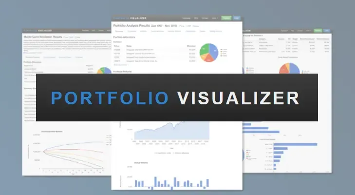

## Table of Contents

## What is Portfolio Visualizer and what is its primary purpose?

Portfolio Visualizer is a free online tool that helps people who invest money to understand and manage their investments better. It allows users to enter information about their investments, like stocks, bonds, and funds, and then it shows them different ways to look at their portfolio. This can include charts, graphs, and reports that make it easier to see how well the investments are doing and how they are spread out.

The main purpose of Portfolio Visualizer is to help investors make smarter decisions about their money. By using the tool, people can see how their investments might perform in the future, compare different investment strategies, and figure out the best way to balance risk and reward. It's especially useful for people who want to plan their investments carefully and see the potential outcomes before making changes.

## How can beginners start using Portfolio Visualizer to analyze their investments?

To start using Portfolio Visualizer, beginners should first go to the website and create a free account. Once logged in, they can begin by entering their current investments into the tool. This means adding details like the types of investments they have, such as stocks or funds, and how much money is in each one. Portfolio Visualizer makes this easy with simple forms where users can input their data. After entering their investments, beginners can then choose from different analysis tools on the site, like the Portfolio Analysis or the Backtest Portfolio options, to start looking at their investments in more detail.

Once the investments are entered, beginners can use Portfolio Visualizer to see how their portfolio is doing. They can look at charts and graphs that show how their investments have grown over time and how they might grow in the future. The tool also lets them compare different investment strategies to see which one might work best for them. By playing around with the different options and seeing what the results look like, beginners can learn a lot about their investments and make better decisions about where to put their money. It's a great way to start understanding and managing investments without needing a lot of experience.

## What are the key features of Portfolio Visualizer that can help in portfolio management?

Portfolio Visualizer has many useful features that can help people manage their investments. One important feature is the ability to see how your investments are spread out. This means you can check if you have too much money in one type of investment or if you need to balance things out more. Another key feature is the [backtesting](/wiki/backtesting) tool, which lets you see how your investments would have done in the past. This can help you understand if your investment strategy is good or if you need to make changes.

Another helpful feature is the ability to compare different investment strategies. You can set up different portfolios and see which one might work best for you. This can be really useful if you're trying to decide between different ways to invest your money. Portfolio Visualizer also has tools that show you how much risk you're taking with your investments. This can help you decide if you're comfortable with the level of risk or if you need to adjust your investments to feel safer.

Overall, Portfolio Visualizer makes it easy to see how your investments are doing and to plan for the future. It gives you clear charts and graphs that show your portfolio's performance over time. By using these features, you can make smarter choices about where to put your money and how to manage your investments better.

## How does Portfolio Visualizer help in comparing different investment strategies?

Portfolio Visualizer makes it easy for people to compare different ways of investing their money. You can set up different portfolios with different investments and see how they would have done in the past. This is called backtesting. By looking at past performance, you can see which strategy might have made more money or been less risky. This helps you understand if one way of investing is better than another for your goals.

The tool also lets you see how these strategies might work in the future. You can use different charts and graphs to see how each portfolio might grow over time. This can show you how much money you might make and how much risk you might be taking with each strategy. By comparing these different possibilities, you can pick the investment plan that feels right for you and matches what you want to achieve with your money.

## What types of charts and visualizations are available in Portfolio Visualizer?

Portfolio Visualizer offers a variety of charts and visualizations that help you understand your investments better. You can see line charts that show how your investments have grown over time. These charts make it easy to see if your investments are going up or down. There are also pie charts that show how your money is spread out among different types of investments. This helps you see if you have too much money in one place or if you need to balance things out.

Another type of chart you can use is the bar chart, which can show how different parts of your portfolio are doing compared to each other. For example, you can see how stocks are doing compared to bonds. Portfolio Visualizer also has scatter plots that can help you see the relationship between risk and reward in your investments. These charts and graphs make it simple to understand your portfolio and make smart choices about your money.

Overall, the charts and visualizations in Portfolio Visualizer are designed to be clear and easy to use. Whether you're looking at line charts, pie charts, bar charts, or scatter plots, you can quickly get a good picture of your investments. This helps you plan better and make decisions that match your goals.

## How can users customize their analysis settings in Portfolio Visualizer?

Users can customize their analysis settings in Portfolio Visualizer to fit their needs. They can start by choosing the time period they want to look at. This could be a few months or many years. They can also decide which investments to include in their analysis. For example, they might want to focus on just their stocks or include all their investments. Users can also set different goals for their investments, like aiming for more growth or less risk. This helps them see how their portfolio might do based on what they want to achieve.

Another way to customize is by using different tools and options within Portfolio Visualizer. Users can pick different ways to measure how well their investments are doing, like looking at total returns or comparing to a benchmark. They can also change how often they want to see updates, like daily, monthly, or yearly. By adjusting these settings, users can get a better understanding of their investments and see how different choices might affect their portfolio's performance. This makes it easier to make smart decisions about their money.

## What advanced tools does Portfolio Visualizer offer for experienced investors?

Portfolio Visualizer has some advanced tools that can help experienced investors make better decisions about their money. One of these tools is the Monte Carlo simulation, which lets you see many different ways your investments might do in the future. This can help you understand the risks and rewards better. Another tool is the [factor](/wiki/factor-investing)-based analysis, which looks at what makes your investments go up or down. This can help you see why your portfolio is doing well or not so well and make changes based on that information.

Another advanced feature is the ability to do a detailed backtest of your investment strategies. You can set up different portfolios and see how they would have done in the past with different market conditions. This can help you test out new ideas without risking real money. Portfolio Visualizer also offers tools for optimizing your portfolio, which means it can help you find the best way to balance your investments to get the most growth with the least risk. These tools are great for experienced investors who want to dive deep into their investments and make smart choices.

## How can Portfolio Visualizer be used to backtest investment strategies?

Portfolio Visualizer lets you backtest your investment strategies by letting you see how they would have done in the past. You can put in details about the investments you want to test, like stocks or funds, and choose a time period to look at. The tool then shows you how your strategy would have worked during that time. This helps you see if your ideas are good or if you need to change them. It's like trying out your plan in the past to see how it would have turned out.

By using backtesting, you can compare different ways of investing. You can set up different portfolios with different mixes of investments and see which one did better in the past. This can help you pick the best strategy for your goals. Portfolio Visualizer makes it easy to see all this information with charts and graphs, so you can understand your results quickly. Backtesting is a great way to learn from the past and make smarter choices about where to put your money in the future.

## What are the limitations of using Portfolio Visualizer for investment analysis?

Portfolio Visualizer is a great tool for looking at your investments, but it has some limits. One big limit is that it uses past data to guess how your investments might do in the future. This means it can't predict things like big economic changes or new laws that might affect your money. Also, the tool might not have all the latest information, so your results might not be completely up-to-date.

Another thing to keep in mind is that Portfolio Visualizer can be hard to use if you don't know much about investing. It has a lot of options and settings that might be confusing for beginners. Plus, it doesn't give you advice on what to do with your money. You have to figure that out yourself based on what the tool shows you. So, while it's helpful for understanding your investments, it's not a complete guide on how to invest.

## How does Portfolio Visualizer integrate with other financial tools and data sources?

Portfolio Visualizer can work with other financial tools and data sources to help you get a better picture of your investments. You can add data from places like Yahoo Finance or Morningstar to see how your investments are doing. This means you can use information from different places all in one spot, which makes it easier to keep track of everything.

Even though Portfolio Visualizer can connect with other tools, it might not work with every single one out there. You might need to put in some data by hand if the tool you use isn't supported. But overall, it does a good job of bringing together different pieces of information to help you understand your money better.

## What are some expert tips for maximizing the effectiveness of Portfolio Visualizer?

To get the most out of Portfolio Visualizer, start by making sure your data is correct and up-to-date. This means you should regularly check and update the information about your investments. Use the backtesting feature a lot to see how different strategies would have worked in the past. This can help you understand what might work well for you in the future. Also, try out the Monte Carlo simulation to see many different ways your investments could go. This can give you a better idea of the risks and rewards.

Another good tip is to use the factor-based analysis to see what's driving your portfolio's performance. This can help you make smarter choices about where to put your money. Don't forget to compare different investment strategies using the tool's features. This can show you which one might be best for your goals. Lastly, take some time to learn how to use all the different settings and options in Portfolio Visualizer. The more you know about the tool, the better you can use it to manage your investments.

## How can users stay updated with the latest features and updates in Portfolio Visualizer?

To stay updated with the latest features and updates in Portfolio Visualizer, users should regularly check the website's blog or news section. The blog often has posts about new tools, updates, and tips on how to use the platform better. It's a good idea to sign up for their newsletter if they have one. This way, you'll get emails about new things added to Portfolio Visualizer without having to check the website all the time.

Another way to stay in the loop is by joining the Portfolio Visualizer community. This could be through forums or social media groups where users share tips and talk about new features. By being part of these groups, you can learn from other people and get quick updates on what's new. Keeping an eye on these places will help you make the most out of Portfolio Visualizer as it grows and changes.

## References & Further Reading

[1]: Bergstra, J., Bardenet, R., Bengio, Y., & Kégl, B. (2011). ["Algorithms for Hyper-Parameter Optimization."](https://papers.nips.cc/paper/4443-algorithms-for-hyper-parameter-optimization) Advances in Neural Information Processing Systems 24.

[2]: Lopez de Prado, M. (2018). ["Advances in Financial Machine Learning."](https://www.amazon.com/Advances-Financial-Machine-Learning-Marcos/dp/1119482089) Wiley.

[3]: Aronson, D. (2006). ["Evidence-Based Technical Analysis: Applying the Scientific Method and Statistical Inference to Trading Signals."](https://www.wiley.com/en-us/Evidence+Based+Technical+Analysis%3A+Applying+the+Scientific+Method+and+Statistical+Inference+to+Trading+Signals-p-9780470008744) Wiley.

[4]: Jansen, S. (2020). ["Machine Learning for Algorithmic Trading."](https://github.com/stefan-jansen/machine-learning-for-trading) Packt Publishing.

[5]: Chan, E. P. (2009). ["Quantitative Trading: How to Build Your Own Algorithmic Trading Business."](https://github.com/ftvision/quant_trading_echan_book) Wiley.