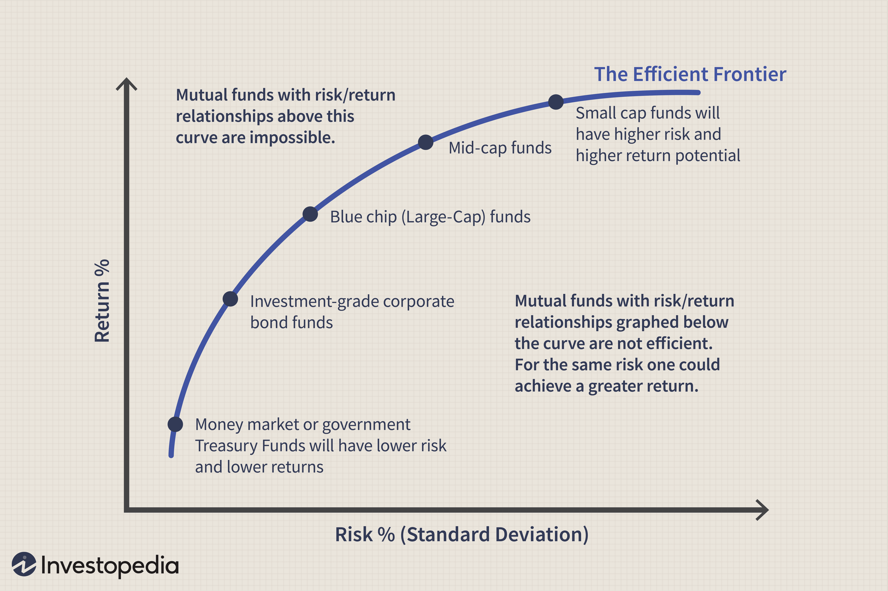

Investment volatility is a key concern for investors navigating the complex financial markets. It represents the degree of variation in the price of a financial instrument over time and is often seen as a proxy for risk. Managing volatility risk is essential in ensuring the achievement of long-term investment goals. If not properly managed, high volatility can lead to unpredictable and significant losses, potentially derailing even the most well-structured investment plans. 

One powerful approach to managing volatility is through algorithmic trading. Algorithmic trading involves the use of computer algorithms to execute trades, taking into account various market conditions and financial data to optimize investment strategies. By using these advanced systems, investors can systematically manage portfolio volatility by rapidly responding to market fluctuations, minimizing emotional decisions, and efficiently executing trades. 



This article explores how various strategies and tools can reduce volatility risk through effective portfolio management, with a particular focus on algorithmic trading. By utilizing algorithmic frameworks, investors can better position themselves to handle market turbulence. Such technology aids in stabilizing market fluctuations, offering robust solutions for maintaining portfolio stability while pursuing consistent growth over time.

## Table of Contents

## Understanding Investment Volatility

Volatility quantifies the extent of variation in the returns of an investment over time and is a significant concern for investors as it directly impacts the uncertainty of investment outcomes. Mathematically, it is often represented as the standard deviation of the returns on an asset. High volatility signals large fluctuations in an asset's price, creating the potential for substantial gains or losses, which are seen as risks by investors.

The Volatility Index (VIX), developed by the Chicago Board Options Exchange, is a popular metric for assessing market sentiment. Often referred to as the "fear index," the VIX measures the market's expectation of volatility over the coming 30 days. It is derived from the prices of options on the S&P 500 index and provides investors with a quantitative measure of market uncertainty. A rising VIX indicates increasing uncertainty and anticipated market volatility, which can lead to swift price movements in the markets.

Understanding volatility is essential for investors because it informs the development of strategies designed to mitigate risk and stabilize returns. Methods to counteract volatility's impact on portfolios include diversification across different asset classes and sectors, as well as implementing hedging strategies. These approaches aim to balance risk and reward, helping to shield the portfolio from the detrimental effects of sharp market fluctuations. By grasping how volatility functions and its potential effects on investments, investors can better prepare to endure and exploit varying market conditions.

## Strategies for Reducing Volatility Risk

Reducing [volatility](/wiki/volatility-trading-strategies) risk is a critical aspect of investment portfolio management. One of the primary strategies employed by investors is diversification. By holding a mix of asset classes such as stocks, bonds, and commodities, investors can achieve a balance that mitigates risk. This diversification means that when one asset class experiences a downturn, another may perform well, thereby stabilizing the overall portfolio performance. The logic behind this approach is rooted in the principle that different asset classes often react differently to the same economic event, providing a natural hedge against market volatility.

A more mathematical approach to diversification involves the calculation of correlations between asset classes. Ideally, a well-diversified portfolio contains assets that have low or negative correlation with each other, thereby reducing the overall portfolio standard deviation, a common measure of volatility. The formula for portfolio variance, $\sigma_p^2$, can be expressed as:

$$
\sigma_p^2 = \sum (w_i^2 \sigma_i^2) + \sum \sum (w_i w_j \sigma_i \sigma_j \rho_{ij})
$$

where $w_i$ and $w_j$ are the weights of assets $i$ and $j$ in the portfolio, $\sigma_i$ and $\sigma_j$ are the individual volatilities of assets $i$ and $j$, and $\rho_{ij}$ is the correlation coefficient between them.

Beta management is another approach to reduce sensitivity to market fluctuations. Beta measures an investment's volatility relative to the overall market. By selecting stocks with a lower beta, investors can reduce their exposure to market swings. A beta less than one indicates that the stock is less volatile than the market, suggesting that price movements are less extreme in reaction to market changes.

Cash allocation is a traditional strategy that involves maintaining a portion of the portfolio in cash or cash equivalents. This strategy aims to preserve capital during periods of high market volatility, providing [liquidity](/wiki/liquidity-risk-premium) to capitalize on future investment opportunities. A higher cash allocation can act as a temporary safe haven, absorbing shocks from volatile market movements while reducing the need to sell riskier assets at a loss during downturns.

These strategies—diversification, beta management, and cash allocation—work collectively to construct a resilient portfolio that can withstand market turbulence and maintain steady growth. By balancing the risk across different asset categories and managing market exposure, investors are better equipped to achieve their long-term investment goals amidst fluctuating market conditions.

## Role of Algorithmic Trading in Volatility Management

Algorithmic trading has become an integral part of contemporary financial markets, offering significant advantages in managing volatility. At its core, [algorithmic trading](/wiki/algorithmic-trading) involves the use of pre-defined rules and advanced data analysis to automate decision-making processes. This form of trading provides investors with the capability to swiftly adapt to market changes, thereby significantly reducing the potential for human errors and emotional biases that frequently affect trading outcomes.

One of the primary benefits of algorithmic trading lies in its speed and efficiency. Algorithms can analyze vast amounts of market data and execute trades within milliseconds, far outperforming traditional manual trading approaches. This capability is particularly critical during periods of high volatility, where market conditions can shift rapidly. By leveraging automation, investors can ensure that their trading strategies are executed consistently and without the delays and errors associated with human intervention.

Advanced algorithms equipped with predictive analytics capabilities further enhance the ability to manage volatility. These algorithms utilize [machine learning](/wiki/machine-learning) techniques and statistical models to anticipate market movements and identify trends. For instance, predictive analytics can identify patterns that precede market downturns, enabling traders to proactively adjust their positions to mitigate risk. This anticipatory approach allows for more informed decision-making, providing a significant edge in volatile market environments.

Moreover, algorithmic trading facilitates the consistent application of risk management strategies across a wide array of assets. Through automation, investors can implement complex strategies such as dynamic stop-loss orders, which automatically adjust to market conditions to protect capital. This consistency ensures that risk management tactics are applied uniformly, reducing the impact of market fluctuations on portfolio performance.

In summary, algorithmic trading plays a crucial role in volatility management by automating decision-making processes and enhancing the precision and speed of trade execution. By integrating predictive analytics and ensuring consistent application of risk management strategies, algorithmic trading provides investors with the tools necessary to navigate volatile markets effectively.

## Implementing Algorithmic Trading for Risk Reduction

Implementing algorithmic trading effectively requires a judicious selection of trading platforms that provide robust infrastructure and real-time monitoring capabilities. These algorithms must be capable of executing orders swiftly and adjusting to market conditions instantaneously, reducing the latency that can lead to missed opportunities or increased risk exposure.

Customizability is a key attribute of these platforms, allowing investors to tailor algorithmic strategies to align with specific investment goals. By configuring variables such as risk tolerance, asset allocation, and market conditions, traders can deploy algorithms that are finely tuned to their strategic objectives. For instance, a Python-based algorithm might include parameters to adjust the asset mix dynamically based on volatility thresholds, as follows:

```python
def allocate_assets(volatility, threshold=0.2):
    if volatility < threshold:
        return {'stocks': 0.6, 'bonds': 0.3, 'commodities': 0.1}
    else:
        return {'stocks': 0.3, 'bonds': 0.5, 'commodities': 0.2}

current_volatility = 0.15
allocation = allocate_assets(current_volatility)
```

Security features are critical in algorithmic trading systems to protect against unauthorized access and cyber threats. Platforms should adhere to stringent financial regulations, ensuring that all trades comply with current laws and ethical standards. This involves incorporating robust authentication protocols and encryption techniques to safeguard sensitive data and maintain the integrity of the trading process.

Training and ongoing support are essential components in maximizing the potential of algorithmic trading systems. Investors and traders must be proficient in the platform’s operations, understanding both the technical aspects and the strategic implementation of algorithms. This includes regular updates on system enhancements and regulatory changes, as well as access to expert advice and troubleshooting assistance.

In investment management, the integration of these elements can significantly enhance the performance and reliability of algorithmic trading strategies, thereby enabling more effective risk reduction and improved portfolio outcomes.

## Benefits of Automated Trading in High-Volatility Markets

Automated trading systems provide several advantages in high-volatility markets, driven by their ability to operate continuously without human intervention. These systems leverage computational power to monitor and execute trades around the clock, thereby capturing fleeting opportunities that may arise in volatile conditions. Continuous operation ensures that market openings and closings, as well as announcements or global events that may influence market conditions, are promptly addressed.

A primary benefit of automated trading systems in such environments is their capability to optimize trade execution speed. In fast-moving markets, delays of even seconds can significantly impact the profitability of a trade. Automated systems are designed to execute trades with minimal latency, thereby maximizing the potential for favorable execution. This is achieved through alogrithms that are fine-tuned to react to market data instantly, without the delays inherent in manual decision-making processes.

Moreover, these systems enhance risk management practices by utilizing dynamic stop-loss orders, which adjust automatically to market conditions. This flexibility allows traders to define a stop-loss strategy that adapts to increased volatility, thus protecting portfolios from substantial losses while still allowing for potential gains. Automated diversification strategies can also be seamlessly integrated, spreading risk across multiple assets quickly and efficiently, which is crucial in managing the unpredictability of high-volatility markets.

Reducing emotional biases is another significant advantage of automated trading. Human traders are often subject to cognitive biases and emotional reactions, such as panic selling or overconfidence during turbulent times. Automated systems mitigate these biases by adhering strictly to pre-defined rules and strategies, ensuring that decisions are based solely on data and analysis rather than emotional impulses. This systematic approach provides a more disciplined trading environment, which can lead to more consistent returns even in the face of market turmoil.

In summary, automated trading systems enhance market responsiveness, execution speed, and risk management in high-volatility markets. By minimizing human bias and sustaining continuous operations, these systems offer a robust platform for capturing opportunities and mitigating risks associated with market fluctuations.

## Conclusion

Reducing investment volatility risk is essential for maintaining portfolio stability and fostering long-term growth. Algorithmic trading presents a sophisticated approach to mitigating the impacts of volatility. By leveraging advanced algorithms and data analytics, investors can enhance the precision and timing of their trading activities. This technological approach allows for rapid responses to market fluctuations, thereby promoting more stable returns even amid turbulent conditions.

Automated trading systems, which operate on pre-set criteria, provide the consistency and efficiency required to manage risks associated with market volatility. These systems can execute trades at optimal times without the delays or emotional biases inherent in manual trading. By doing so, they help investors achieve a balance between risk exposure and return prospects. For instance, the use of dynamic stop-loss orders can automatically adjust positions to limit losses, thereby protecting portfolios from sudden adverse movements in asset prices.

The integration of technology in investment strategies paves the way for adapting to future market dynamics. As financial markets continue to evolve, the ability to process large volumes of data and execute trades at high speeds becomes increasingly crucial. Algorithmic trading serves as a key innovation, empowering investors to keep pace with this evolution while maintaining a focus on strategic risk management.

Overall, the adoption of algorithmic trading systems not only helps in maintaining the integrity and performance of investment portfolios but also aligns them with the shifting paradigms of modern financial markets. Embracing these advancements will be pivotal for investors seeking to achieve consistent returns despite market volatility.

## References & Further Reading

[1]: Bergstra, J., Bardenet, R., Bengio, Y., & Kégl, B. (2011). ["Algorithms for Hyper-Parameter Optimization."](https://dl.acm.org/doi/10.5555/2986459.2986743) Advances in Neural Information Processing Systems 24.

[2]: ["Advances in Financial Machine Learning"](https://www.amazon.com/Advances-Financial-Machine-Learning-Marcos/dp/1119482089) by Marcos Lopez de Prado

[3]: ["Evidence-Based Technical Analysis: Applying the Scientific Method and Statistical Inference to Trading Signals"](https://www.amazon.com/Evidence-Based-Technical-Analysis-Scientific-Statistical/dp/0470008741) by David Aronson

[4]: ["Machine Learning for Algorithmic Trading"](https://github.com/stefan-jansen/machine-learning-for-trading) by Stefan Jansen

[5]: ["Quantitative Trading: How to Build Your Own Algorithmic Trading Business"](https://www.amazon.com/Quantitative-Trading-Build-Algorithmic-Business/dp/1119800064) by Ernest P. Chan