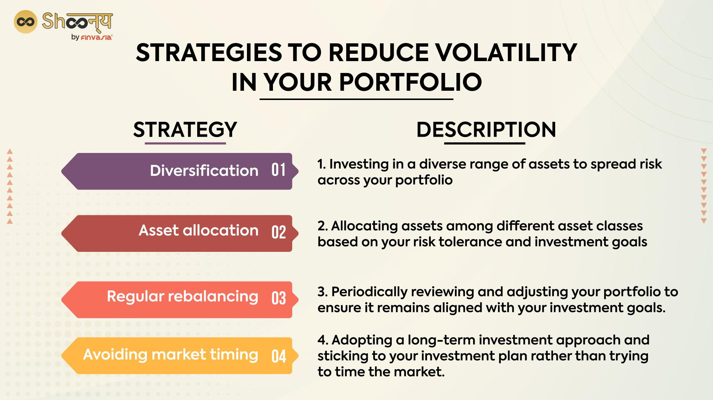

## Table of Contents

## What is portfolio volatility and why is it important to manage?

Portfolio volatility refers to how much the value of an investment portfolio can go up and down over time. It is a measure of risk, showing how stable or unstable the returns on the portfolio might be. If a portfolio has high volatility, it means the value can change a lot in a short period, which can be stressful for investors. On the other hand, a portfolio with low volatility means the value doesn't change as much, which can feel safer.

It's important to manage portfolio volatility because it helps investors feel more comfortable with their investments. When the value of a portfolio swings wildly, it can be scary and might lead investors to make hasty decisions, like selling their investments at the wrong time. By managing volatility, investors can aim for a smoother ride, which can help them stick to their long-term investment plans. This can lead to better overall returns and less stress about their financial future.

## What are the basic principles of diversification?

Diversification is a key idea in investing that means spreading your money across different types of investments. The main goal is to reduce risk. If you put all your money into one thing and it does badly, you could lose a lot. But if you spread your money around, even if one investment does poorly, the others might do well and balance things out.

To diversify well, you should invest in different kinds of assets, like stocks, bonds, and real estate. You can also diversify within each type of asset. For example, with stocks, you can invest in different industries and companies of different sizes. This way, if one industry or type of company has a tough time, your whole portfolio won't be affected as much.

Another important part of diversification is thinking about where your investments are located. Investing in different countries can help because economic problems in one country might not affect another. By spreading your investments around the world, you can lower the risk that comes from focusing too much on one place.

## How can asset allocation help in reducing portfolio volatility?

Asset allocation is about deciding how to split your money among different types of investments, like stocks, bonds, and cash. By choosing the right mix, you can make your portfolio less risky. Stocks can go up and down a lot, which makes them more volatile. Bonds usually don't change as much, so they can help calm things down. If you put some money in stocks and some in bonds, the ups and downs of the stocks might be balanced out by the steadiness of the bonds.

This balance can help keep your portfolio's value more stable. For example, if the stock market has a bad day, your bonds might not lose as much value, or might even go up a little. This means your whole portfolio won't drop as much as it would if you only had stocks. By carefully choosing how much to put in each type of investment, you can make your portfolio less likely to have big swings in value, which can make investing feel safer and help you stick to your long-term plan.

## What role do different asset classes play in managing risk?

Different asset classes help manage risk by each acting differently when the economy changes. Stocks can go up a lot when things are going well, but they can also drop a lot when things go badly. Bonds, on the other hand, usually don't move as much. They can give you a steady income and help keep your money safe when the stock market is having a rough time. By putting some money in stocks and some in bonds, you can balance out the ups and downs. This way, if the stock market falls, the bonds might not fall as much, or might even go up a little, which can help protect your money.

Cash and cash equivalents, like savings accounts or money market funds, are very safe but don't grow much. They're good for keeping your money safe and ready to use when you need it. Real estate can also help manage risk because it often doesn't move in the same way as stocks and bonds. It can give you another way to make money and spread out your risk. By having a mix of these different types of investments, you can make your portfolio less risky and more likely to do well over time, no matter what the economy is doing.

## What are some common strategies for reducing portfolio volatility?

One common strategy for reducing portfolio volatility is diversification. This means spreading your money across different types of investments, like stocks, bonds, and real estate. By not putting all your eggs in one basket, you can lower the risk that comes from focusing too much on one thing. If one investment goes down, others might go up or stay the same, which can help keep your portfolio's value more stable. Diversifying within each type of investment is also important. For example, with stocks, you can invest in different industries and companies of different sizes. This way, if one industry has a tough time, your whole portfolio won't be affected as much.

Another strategy is asset allocation, which is about deciding how much money to put in different types of investments. By choosing the right mix, you can make your portfolio less risky. Stocks can go up and down a lot, which makes them more volatile. Bonds usually don't change as much, so they can help calm things down. If you put some money in stocks and some in bonds, the ups and downs of the stocks might be balanced out by the steadiness of the bonds. This balance can help keep your portfolio's value more stable. By carefully choosing how much to put in each type of investment, you can make your portfolio less likely to have big swings in value, which can make investing feel safer.

A third strategy is rebalancing, which means checking your portfolio regularly and making changes to keep your asset allocation the same. Over time, some investments might do better than others, which can change the balance of your portfolio. If you started with 60% in stocks and 40% in bonds, but the stocks did really well, you might end up with 70% in stocks and 30% in bonds. By selling some stocks and buying more bonds, you can get back to your original 60/40 split. This helps keep your risk level the same and can make your portfolio less volatile.

## How does rebalancing a portfolio affect its volatility?

Rebalancing a portfolio helps keep its volatility in check by making sure your investments stay in the mix you want. Imagine you decide to have 60% of your money in stocks and 40% in bonds. Over time, if stocks do really well, you might end up with more money in stocks than you planned. This could make your portfolio riskier because stocks can go up and down a lot. By selling some stocks and buying more bonds, you can get back to your original 60/40 split. This way, you keep your portfolio's risk level the same, which can help it be less bumpy.

Rebalancing also makes you follow a plan, which can stop you from making quick, emotional decisions. When the market goes up and down a lot, it's easy to get scared and sell everything or get too excited and buy too much of one thing. But if you rebalance regularly, you stick to your plan no matter what the market is doing. This can make your portfolio's value more stable over time because you're not chasing after the latest hot investment or running away from a bad one. In the end, rebalancing helps you manage the ups and downs of your investments better.

## What are the benefits and limitations of using derivatives for volatility reduction?

Using derivatives like options and futures can help reduce the ups and downs of your portfolio. Derivatives let you protect your investments from big drops in value. For example, you can buy a put option, which gives you the right to sell a stock at a certain price. If the stock price falls a lot, the put option can help you limit your losses. This way, you can feel safer about your investments because you have a plan to handle big drops in the market. Another benefit is that derivatives can be used to make money when the market goes down. By using strategies like selling call options or buying put options, you can make money even when the market is falling, which can help balance out the losses in your portfolio.

However, using derivatives also has its downsides. They can be very complicated and hard to understand. If you don't know what you're doing, you might end up losing more money than you planned. Derivatives can also be expensive. You have to pay for them, and the costs can add up over time. Plus, they can make your portfolio more risky if you use them the wrong way. For example, if you use a lot of leverage (borrowing money to invest), you could end up losing a lot if things go wrong. So, while derivatives can help manage volatility, they need to be used carefully and with a good understanding of how they work.

## How can correlation between assets be used to optimize a portfolio's risk profile?

Understanding how different investments move together, or their correlation, can help you make your portfolio less risky. If two investments always go up and down at the same time, they have a high correlation. If one goes up when the other goes down, they have a low or negative correlation. By choosing investments that don't move in the same way, you can balance out the ups and downs in your portfolio. For example, if you own stocks and they go down, but you also own bonds that go up when stocks go down, the bonds can help make up for the losses in your stocks. This can make your whole portfolio more stable.

Using correlation to pick your investments means looking at how different types of assets move together over time. Stocks in the same industry often move together, so it's good to spread your money across different industries. You can also look at how stocks and bonds move together. Usually, they don't move in the same way, so having both can help lower your risk. By keeping an eye on these relationships and adjusting your portfolio, you can make it less likely to have big swings in value. This can help you feel more comfortable with your investments and stick to your long-term plan.

## What advanced quantitative methods are used to model and predict portfolio volatility?

Advanced quantitative methods to model and predict portfolio volatility often use something called the GARCH model, which stands for Generalized Autoregressive Conditional Heteroskedasticity. This model looks at past data to guess how much the value of an investment might go up and down in the future. It's good at spotting times when the market might be more jumpy than usual. Another method is the use of Monte Carlo simulations, which is like playing out thousands of different scenarios to see what might happen to your portfolio. By running these simulations, you can get a good idea of how much risk you're facing and how your investments might behave under different conditions.

Another tool is Value at Risk (VaR), which helps you figure out the worst loss you might face over a certain time with a certain level of confidence. For example, a VaR of $1 million at 95% confidence means there's a 5% chance you could lose more than $1 million in a given time period. VaR is useful for understanding the risk in your portfolio but it doesn't tell you everything. It's good to use it along with other methods to get a full picture of your risk. These advanced methods help investors make smarter choices by giving them a clearer view of how their portfolio might act in the future.

## How do global economic factors influence portfolio volatility, and how can investors adapt?

Global economic factors can make your portfolio go up and down a lot. Things like interest rates, inflation, and how different countries' economies are doing can affect the value of your investments. For example, if the U.S. raises interest rates, it might make stocks less attractive because people can get better returns from safer investments like bonds. Also, if there's a big problem in one country, like a financial crisis, it can spread to other countries and make the whole world's markets more jumpy. By keeping an eye on these global factors, you can get a better idea of what might happen to your investments.

To deal with these ups and downs, investors can do a few things. First, they can spread their money around in different types of investments and in different countries. This way, if one country or type of investment is having a tough time, others might do better and help balance things out. Second, they can keep checking their portfolio and make changes when needed. If the global economy is acting differently than expected, you might want to change how much money you have in stocks, bonds, or other investments. By staying flexible and ready to adjust, you can help keep your portfolio more stable even when the world's economy is changing a lot.

## What are the latest trends in volatility reduction strategies among institutional investors?

Institutional investors are always looking for new ways to make their portfolios less risky. One big trend they're using more is something called "risk parity." This means they try to spread the risk evenly across different types of investments, instead of just focusing on how much money is in each one. For example, they might put less money in stocks and more in bonds, because stocks can be riskier. By doing this, they hope to keep their portfolio's value more steady, even when the market goes up and down a lot.

Another trend is using more advanced computer models and data to predict how much their portfolio might go up or down. These models can look at a lot of information from around the world to guess what might happen next. Institutional investors use these models to make smarter choices about what to invest in and how much risk to take. By using these tools, they can try to keep their portfolio's value more stable and avoid big surprises.

## How can machine learning and AI be utilized to enhance volatility reduction strategies?

Machine learning and AI can help make a portfolio less risky by looking at a lot of data and finding patterns that people might miss. These smart computers can go through tons of information from around the world, like news, economic reports, and past market data, to guess how much a portfolio might go up or down. By using this information, investors can make better choices about what to invest in and how to spread their money around. For example, AI can help figure out which investments move together and which ones don't, so investors can pick a mix that balances out the ups and downs.

Another way AI helps is by making it easier to keep a portfolio in check. It can watch the portfolio all the time and suggest when to buy or sell things to keep the right balance. This is called rebalancing, and it helps keep the risk level the same even when the market changes a lot. By using AI to do this work, investors can save time and make sure their portfolio stays on track without having to check it all the time themselves. In the end, using [machine learning](/wiki/machine-learning) and AI can make investing feel safer and help investors stick to their long-term plans.

## What are strategies for reducing volatility risk?

Reducing [volatility](/wiki/volatility-trading-strategies) risk is a critical aspect of investment portfolio management. One of the primary strategies employed by investors is diversification. By holding a mix of asset classes such as stocks, bonds, and commodities, investors can achieve a balance that mitigates risk. This diversification means that when one asset class experiences a downturn, another may perform well, thereby stabilizing the overall portfolio performance. The logic behind this approach is rooted in the principle that different asset classes often react differently to the same economic event, providing a natural hedge against market volatility.

A more mathematical approach to diversification involves the calculation of correlations between asset classes. Ideally, a well-diversified portfolio contains assets that have low or negative correlation with each other, thereby reducing the overall portfolio standard deviation, a common measure of volatility. The formula for portfolio variance, $\sigma_p^2$, can be expressed as:

$$
\sigma_p^2 = \sum (w_i^2 \sigma_i^2) + \sum \sum (w_i w_j \sigma_i \sigma_j \rho_{ij})
$$

where $w_i$ and $w_j$ are the weights of assets $i$ and $j$ in the portfolio, $\sigma_i$ and $\sigma_j$ are the individual volatilities of assets $i$ and $j$, and $\rho_{ij}$ is the correlation coefficient between them.

Beta management is another approach to reduce sensitivity to market fluctuations. Beta measures an investment's volatility relative to the overall market. By selecting stocks with a lower beta, investors can reduce their exposure to market swings. A beta less than one indicates that the stock is less volatile than the market, suggesting that price movements are less extreme in reaction to market changes.

Cash allocation is a traditional strategy that involves maintaining a portion of the portfolio in cash or cash equivalents. This strategy aims to preserve capital during periods of high market volatility, providing [liquidity](/wiki/liquidity-risk-premium) to capitalize on future investment opportunities. A higher cash allocation can act as a temporary safe haven, absorbing shocks from volatile market movements while reducing the need to sell riskier assets at a loss during downturns.

These strategies—diversification, beta management, and cash allocation—work collectively to construct a resilient portfolio that can withstand market turbulence and maintain steady growth. By balancing the risk across different asset categories and managing market exposure, investors are better equipped to achieve their long-term investment goals amidst fluctuating market conditions.

## References & Further Reading

[1]: Bergstra, J., Bardenet, R., Bengio, Y., & Kégl, B. (2011). ["Algorithms for Hyper-Parameter Optimization."](https://dl.acm.org/doi/10.5555/2986459.2986743) Advances in Neural Information Processing Systems 24.

[2]: ["Advances in Financial Machine Learning"](https://www.amazon.com/Advances-Financial-Machine-Learning-Marcos/dp/1119482089) by Marcos Lopez de Prado

[3]: ["Evidence-Based Technical Analysis: Applying the Scientific Method and Statistical Inference to Trading Signals"](https://www.amazon.com/Evidence-Based-Technical-Analysis-Scientific-Statistical/dp/0470008741) by David Aronson

[4]: ["Machine Learning for Algorithmic Trading"](https://github.com/stefan-jansen/machine-learning-for-trading) by Stefan Jansen

[5]: ["Quantitative Trading: How to Build Your Own Algorithmic Trading Business"](https://www.amazon.com/Quantitative-Trading-Build-Algorithmic-Business/dp/1119800064) by Ernest P. Chan