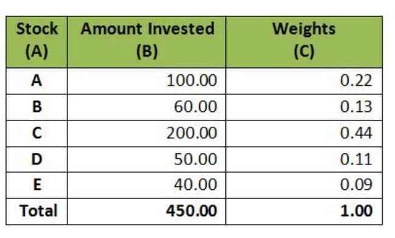

Investment strategies have undergone a profound transformation with the advent of modern technology. At the forefront of this evolution are concepts like portfolio weight, investment allocation, and algorithmic trading, which collectively shape the landscape of contemporary finance.

Portfolio weight refers to the proportion of an asset's value relative to the total value of the portfolio. It serves as a foundational element in assessing how different assets contribute to the overall portfolio. Properly calculating portfolio weight is crucial for making informed decisions about adjustments and rebalancing strategies. The basic formula for calculating portfolio weight is:



$$
\text{Portfolio Weight} = \frac{\text{Value of Individual Asset}}{\text{Total Portfolio Value}}
$$

Investment allocation is equally pivotal, involving the distribution of assets according to specific parameters, such as risk tolerance and investment objectives. With traditional methods, investors would often rely on strategies like equal weighting or risk parity to achieve their goals. However, the integration of advanced technologies, including machine learning and data analytics, has revolutionized these strategies, allowing for more sophisticated and dynamic asset distribution.

Algorithmic trading represents a paradigm shift in trading practices. By leveraging computer algorithms to execute trades based on predefined criteria, investors can enhance the speed, efficiency, and accuracy of their transactions. This reduces human error and provides a strategic advantage in fast-paced markets. Strategies within algorithmic trading, such as mean-reversion and momentum trading, contribute to portfolio optimization, aligning risk and return.

In this article, we will examine the definition of portfolio weight, explore methods of calculating it, and discuss algorithmic trading strategies. Understanding these critical concepts is essential for enhancing investment decisions and improving risk management. As technology continues to redefine the boundaries of finance, mastering these elements can lead to more robust investment strategies and optimized portfolio management.

## Table of Contents

## Understanding Portfolio Weight and Its Calculation

Portfolio weight is a crucial concept in investment management, representing the relative proportion of an individual asset within a total portfolio. Calculating portfolio weight is fundamental for both monitoring and optimizing investment performance. The formula for determining the weight of an asset in a portfolio is straightforward:

$$
\text{Portfolio Weight of an Asset} = \frac{\text{Value of the Asset}}{\text{Total Portfolio Value}}
$$

This calculation provides the percentage of the total portfolio value that is attributed to a specific asset, facilitating insight into how an asset’s performance impacts the overall portfolio.

As asset prices fluctuate, the calculated weights change, making it essential for investors to conduct regular reviews and adjustments. For instance, if the value of a particular asset increases significantly, its proportion of the total portfolio will rise. This change might lead to an imbalance concerning the investor’s target allocation and risk tolerance, prompting the need for rebalancing.

There are multiple methods to calculate portfolio weights, which can vary based on investment strategy. The two common approaches are:

1. **By Asset Count (Equal Weighting):** Here, the portfolio assigns equal value percentages to all assets, regardless of asset size or market value. For example, if a portfolio contains five stocks, each stock might initially be given a weight of 20%. This method is simple but may not necessarily reflect market realities or risk profiles.

2. **By Market Value (Value Weighting):** In this method, the portfolio weight of each asset is determined by its market value. Assets with higher market values have greater influence over portfolio performance, aligning more closely with market movements.

Effective portfolio management involves strategic rebalancing to maintain consistency with investment objectives. As the weight of assets shifts due to market changes, rebalancing allows an investor to realign the portfolio according to the desired risk-return profile. The process may involve selling over-weighted assets and purchasing under-weighted ones to bring the portfolio back to its target allocation. 

Strategic rebalancing helps ensure that the portfolio remains in line with specific investment goals and risk tolerances. It is a dynamic process, reflecting changes in market conditions and asset values, ultimately aiming to optimize portfolio performance over time.

## Investment Allocation Strategies

Investment allocation involves distributing assets across a portfolio to achieve specific investment objectives. This process requires careful consideration of several parameters, including risk tolerance, expected returns, and market conditions.

### Traditional Strategies

1. **Equal Weighting**: This strategy involves allocating the same proportion of the total investment to each asset within the portfolio. By maintaining an equal weight, the strategy reduces the risk of overexposure to any single asset. While simple and easy to implement, equal weighting may not always align with an investor's risk-return profile, particularly in diverse market environments.

2. **Risk Parity**: Risk parity focuses on allocating investments such that each asset contributes equally to the overall risk of the portfolio. The aim is to balance the risk-weighted exposure rather than purely capital-weighted. This often involves leveraging low-risk assets to match the risk levels of higher-risk investments. Mathematically, the risk contribution $RC_i$ of an asset $i$ in a portfolio can be calculated as:
$$
   RC_i = \frac{w_i \cdot \sigma_i \cdot \rho_{i,p}}{\sigma_p}

$$

   where $w_i$ is the weight of asset $i$, $\sigma_i$ is its standard deviation, $\rho_{i,p}$ is the correlation with the portfolio, and $\sigma_p$ is the portfolio's standard deviation.

3. **Mean-Variance Optimization**: Introduced by Harry Markowitz, this strategy aims to construct a portfolio that optimizes returns for a given level of risk by balancing the variance and expected returns of investments. The mean-variance optimization model involves calculating the expected return and variance for each asset, solving for the asset weights $w$ using the equation:
$$
   \min_w \, \frac{1}{2} w^T \Sigma w - \lambda \mu^T w

$$

   where $\Sigma$ is the covariance matrix of asset returns, $\lambda$ is a risk aversion parameter, and $\mu$ is the vector of expected returns.

### Modern Strategies

Advancements in technology have led to more sophisticated methods of investment allocation, utilizing [machine learning](/wiki/machine-learning) and data analytics.

- **Machine Learning** and **Data Analytics**: These technologies allow investors to model complex patterns and relationships within financial data. Algorithms can assess vast amounts of market data to make more nuanced allocation decisions, optimizing portfolio performance based on predictive analytics.

### Strategy Considerations

The choice of allocation strategy should be aligned with an investor's goals, risk tolerance, and external market factors. Market [volatility](/wiki/volatility-trading-strategies), economic conditions, and investment horizons can all influence the strategy adopted.

- **Diversification**: Diversification involves spreading investments across various asset classes or sectors to reduce risk. It is a core principle in both traditional and modern strategies, helping to buffer portfolios against market volatility.

- **Dynamic Rebalancing**: This approach involves continually adjusting the portfolio to maintain desired asset proportions in response to market changes or shifts in investment objectives. Through dynamic rebalancing, investors can ensure their portfolios remain aligned with their risk-return profiles.

Investment allocation is an evolving discipline, shaped by both traditional methodologies and modern technological advancements. Understanding and selecting appropriate strategies can significantly impact portfolio performance and risk management.

## Algorithmic Trading: Enhancing Investment Efficiency

Algorithmic trading leverages the computational power of computers to execute pre-defined trading instructions at speeds and efficiencies beyond human capability. At its core, [algorithmic trading](/wiki/algorithmic-trading) enhances the decision-making process by minimizing human error and allowing for faster and more accurate transactions in financial markets. 

One of the foundational aspects of algorithmic trading is its ability to execute trades based on pre-set strategies. These strategies can include mean-reversion and [momentum](/wiki/momentum) trading. Mean-reversion strategies are built on the principle that asset prices tend to revert to a mean or average level over time. Traders using this strategy look for price anomalies and seek to capitalize on the eventual price correction. Momentum trading, on the other hand, capitalizes on the continued movement of asset prices in a given direction, assuming that the current trend will persist.

Portfolio optimization is an integral part of algorithmic trading aimed at maximizing returns for a given level of risk. The fundamental concept is to use mathematical models to balance the trade-off between risk and return, which is often represented by the formula:

$$

\text{Maximize: } \frac{R_p - R_f}{\sigma_p} 
$$

Where $R_p$ is the expected portfolio return, $R_f$ is the risk-free rate, and $\sigma_p$ is the portfolio's standard deviation (or volatility). This formula is central to the Capital Market Line in Modern Portfolio Theory and is often implemented in algorithms to maintain optimal asset allocation dynamically.

Successful algorithmic trading hinges on robust [backtesting](/wiki/backtesting) and risk management protocols. Backtesting involves running algorithms on historical data to evaluate their effectiveness before deploying them in live trading. This process not only helps in refining strategies but also in understanding potential pitfalls in various market conditions. Furthermore, comprehensive risk management is vital to shield the portfolio from unexpected market turbulence. Techniques such as stop-loss orders and diversification are often encoded within trading algorithms to manage risk actively.

In conclusion, algorithmic trading fundamentally transforms how investment strategies are executed. By integrating advanced computational techniques and data-driven strategies, it allows investors to manage portfolios more efficiently and effectively in today's fast-paced financial markets.

## Integrating Portfolio Weight and Algo Trading

The integration of algorithmic trading with portfolio weight management marks a significant advancement in investment technology, allowing for real-time adjustments and a more adaptive approach to portfolio management. Algorithmic trading leverages computer programs to execute complex trading strategies based on pre-defined criteria, enabling the immediate recalibration of portfolio weights in response to market conditions. This dynamic capability enhances the overall performance of portfolios by ensuring they remain aligned with the investor's strategic goals.

At the core of this integration is the ability to use algorithms to evaluate vast amounts of market data, identifying trends and patterns that inform optimal asset allocation. These algorithms can continuously adjust portfolio weights according to various parameters, such as asset performance, market volatility, and changing economic indicators. For instance, an algorithm might increase the portfolio weight of an asset that is exhibiting strong momentum or decrease the weight of an asset that is showing signs of mean reversion.

The technological advancements in algorithmic trading also enable the development of sophisticated trading strategies. These strategies can incorporate elements of [artificial intelligence](/wiki/ai-artificial-intelligence) and machine learning, further enhancing the ability to predict and respond to market movements. For example, [reinforcement learning](/wiki/reinforcement-learning)—a type of machine learning—can be used to optimize trading strategies through trial and error, allowing the algorithm to learn from past performances and improve future decisions.

Investors can harness these advanced techniques to achieve more informed and strategic asset management. By integrating algorithmic trading with portfolio weight management, investors can realize a more nuanced control over their investment strategies, allowing for more effective risk management and the potential for higher returns. This integration facilitates a proactive approach, as opposed to the traditional reactive methods of portfolio management.

The continuous evolution of these technologies necessitates ongoing education and adaptation from investors and financial professionals. As the field of algorithmic trading expands, staying abreast of the latest advancements is crucial for leveraging the full potential of these powerful tools. Consequently, modern investors must not only understand the theoretical aspects of these technologies but also be proficient in practical applications, including the utilization of software and programming languages like Python for implementing algorithmic strategies.

In conclusion, the integration of portfolio weight and algorithmic trading represents a paradigm shift in how investment portfolios are managed. By utilizing real-time data analysis and adjustment capabilities, investors can significantly enhance their ability to manage risk and achieve their financial goals in an increasingly complex market environment.

## Conclusion

Portfolio weight, investment allocation, and algorithmic trading represent fundamental elements in the field of modern finance. By effectively integrating these elements, investors can significantly enhance the quality of their investment decisions and optimize their outcomes. The intertwining of these concepts allows for a more structured and scientific approach to capital management, facilitating not only improved returns but also more efficient risk management.

As technology evolves, so too does the sophistication with which investments are handled. Algorithmic trading, powered by increasingly advanced computing and analytics capabilities, allows for rapid and accurate decision-making, substantially reducing human-induced errors. These trading systems, often based on complex mathematical models and data analysis, provide insights that were previously inaccessible or too time-consuming to compute manually. A basic example of a Python snippet to calculate portfolio weight is as follows:

```python
def calculate_portfolio_weight(asset_value, total_portfolio_value):
    return asset_value / total_portfolio_value
```

This evolving landscape signals the necessity for continuous learning and adaptation by investors. Mastering these financial innovations requires not only a foundational understanding but also a commitment to ongoing education. Strategies such as dynamic rebalancing and diversification, underpinned by robust algorithms, are essential for managing risks and maximizing returns over time.

This article lays the groundwork for comprehending the intricacies and potential avenues in algorithmic portfolio management. By adopting these modern techniques, investors stand to unlock new opportunities and achieve more strategic and informed asset management decisions. As financial markets continue to adapt alongside technological advancements, staying informed and adaptive is not just advantageous but imperative for sustainable investment success.

## References & Further Reading

[1]: Markowitz, H. (1952). ["Portfolio Selection."](https://onlinelibrary.wiley.com/doi/abs/10.1111/j.1540-6261.1952.tb01525.x) The Journal of Finance, 7(1), 77-91.

[2]: Malkiel, B. G. (2019). ["A Random Walk Down Wall Street: The Time-tested Strategy for Successful Investing."](https://yourknowledgedigest.org/wp-content/uploads/2020/04/a-random-walk-down-wall-street.pdf) W. W. Norton & Company.

[3]: Aaron Brown, N. (2015). ["The Complete Guide to Option Pricing Formulas"](https://www.amazon.com/Complete-Guide-Option-Pricing-Formulas/dp/0071389970) (Vol. 1). McGraw-Hill.

[4]: Lopez de Prado, M. (2018). ["Advances in Financial Machine Learning."](https://www.amazon.com/Advances-Financial-Machine-Learning-Marcos/dp/1119482089) Wiley.

[5]: Chan, E. P. (2008). ["Quantitative Trading: How to Build Your Own Algorithmic Trading Business."](https://github.com/ftvision/quant_trading_echan_book) Wiley Trading.